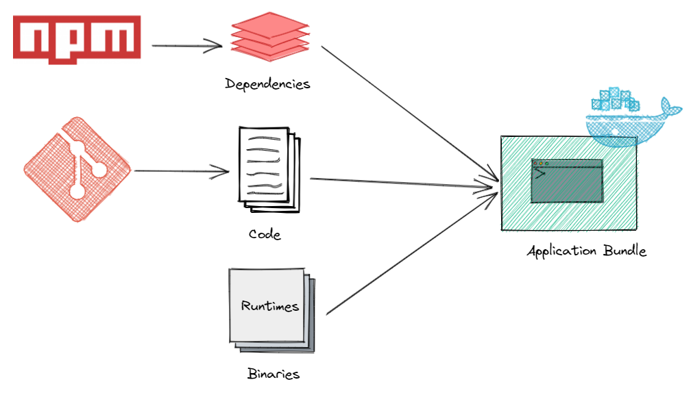
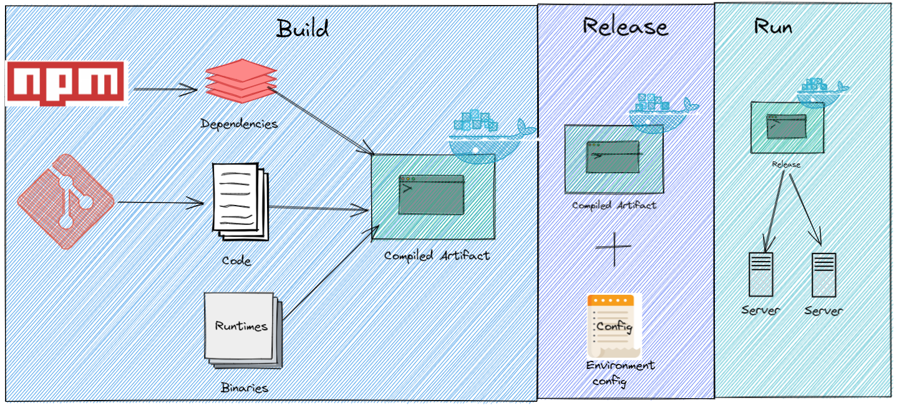

## Introduction

Building applications for the cloud requires a fundamentally different approach than traditional development. Applications must be resilient, scalable, and easy to deploy across diverse environments. The 12 Factor App methodology provides the blueprint for achieving this.

**What you'll learn in this guide:**
- Complete breakdown of all 12 factors with practical examples
- Real-world implementation using Docker, Kubernetes, and modern CI/CD
- Common mistakes developers make and how to avoid them
- Ready-to-use checklist for validating your cloud-native apps
- Modern tools and platforms for each factor

**Who this guide is for:**
- Developers building microservices and cloud-native applications
- DevOps engineers implementing CI/CD pipelines
- Architects designing scalable systems
- Teams migrating from monoliths to cloud-native architectures

**Why the 12 Factor App matters in 2025:**

Organizations worldwide are modernizing their applications to be more responsive, scalable, and resilient. Whether you're refactoring a monolith, building new microservices, or optimizing existing cloud apps, the 12 Factor methodology provides proven patterns for success.

Traditional architectures optimized for fixed infrastructure and infrequent deployments. Modern cloud-native architectures leverage the elasticity and automation of cloud platforms.

Cloud-native applications are:
- **Scalable**: Handle varying loads through horizontal scaling
- **Resilient**: Recover automatically from failures
- **Portable**: Run consistently across environments
- **Observable**: Provide visibility into behavior and performance
- **Automated**: Deploy and operate with minimal manual intervention

The [Cloud Native Computing Foundation (CNCF)](https://www.cncf.io/) defines cloud native as:

> "_Cloud native technologies empower organizations to build and run scalable applications in modern, dynamic environments such as public, private, and hybrid clouds. Containers, service meshes, microservices, immutable infrastructure, and declarative APIs exemplify this approach._"

The 12 Factor App methodology, created by Heroku co-founder Adam Wiggins in 2011, remains the gold standard for building cloud-native applications. It's programming language and platform agnostic, making it applicable whether you're using Java, .NET, Node.js, Python, or Go.

## Cloud Native Architecture Evolution

Traditional monolithic architectures were designed for a different era:
- Fixed, expensive infrastructure
- Slow deployment cycles (weeks to months)
- Manual scaling and recovery
- Environment-specific configurations

Cloud-native architectures embrace:
- Elastic, disposable infrastructure
- Continuous deployment (multiple times per day)
- Automatic scaling and self-healing
- Environment-agnostic applications

This shift enables organizations to:
- **Deliver faster**: Deploy features in hours instead of weeks
- **Scale efficiently**: Handle traffic spikes without over-provisioning
- **Reduce costs**: Pay only for resources actually used
- **Improve reliability**: Automatic recovery from failures
- **Increase agility**: Experiment and iterate rapidly

## The Twelve Factors

The twelve-factor app principles are a collection of best practices for building microservices-based cloud-native applications. These principles are programming language and platform agnostic, making them universally applicable whether you're building with Java, .NET, Python, Node.js, or Go.

Originally published in 2011 by Heroku co-founder Adam Wiggins, the methodology has stood the test of time. While technology has evolved (containers, Kubernetes, serverless), the core principles remain relevant. This guide updates the original concepts with modern tooling and practices for 2025.

The 12 Factor methodology is complementary to other approaches like the [Reactive Manifesto]( "Reactive Manifesto"), Domain-Driven Design, and microservices patterns.

### The 12 Factors: Quick Reference

| Factor | Principle | Modern Implementation | Impact |
|--------|-----------|----------------------|--------|
| **1. Codebase** | One codebase tracked in revision control, many deploys | Git/GitHub + GitOps | Traceability, versioning |
| **2. Dependencies** | Explicitly declare and isolate dependencies | Docker, package managers, SBOMs | Reproducibility, security |
| **3. Config** | Store config in the environment | Kubernetes ConfigMaps/Secrets, Vault | Portability, security |
| **4. Backing Services** | Treat backing services as attached resources | Service discovery, cloud services | Flexibility, loose coupling |
| **5. Build, Release, Run** | Strictly separate build and run stages | CI/CD pipelines (GitHub Actions, GitLab) | Reproducibility, rollback |
| **6. Processes** | Execute as stateless processes | Containers, serverless functions | Scalability, resilience |
| **7. Port Binding** | Export services via port binding | Container networking, service mesh | Independence, portability |
| **8. Concurrency** | Scale out via the process model | Kubernetes HPA, auto-scaling groups | Elasticity, cost efficiency |
| **9. Disposability** | Fast startup and graceful shutdown | Container orchestration | Agility, resilience |
| **10. Dev/Prod Parity** | Keep environments similar | Infrastructure as Code, containers | Reduced deployment risk |
| **11. Logs** | Treat logs as event streams | ELK stack, Datadog, CloudWatch | Observability, debugging |
| **12. Admin Processes** | Run admin tasks as one-off processes | Kubernetes Jobs, scheduled tasks | Consistency, automation |

Now let's dive deep into each factor with practical examples and modern tooling.

### Factor 1: Codebase

> "_A twelve-factor app is always tracked in a version control system. One codebase per app, many deploys._"


**Core Principle:** Each application or microservice has exactly one codebase tracked in version control, but multiple deployments (dev, staging, production) from that single source.

**Why It Matters:**
- **Single source of truth**: Eliminates confusion about which code is deployed where
- **Traceability**: Every change is tracked and can be audited
- **Reproducibility**: Any deployment can be recreated from version control
- **Collaboration**: Team members work from the same codebase

**Modern Implementation:**

**Monorepo vs. Polyrepo:**

```plaintext
Monorepo (Single Repository):
/company-services/
  ├── .github/workflows/          # Shared CI/CD
  ├── packages/
  │   ├── auth-service/
  │   ├── payment-service/
  │   └── shared-libraries/
  └── package.json

Polyrepo (Multiple Repositories):
- repo: auth-service
- repo: payment-service
- repo: shared-libraries
```

| Approach | Best For | Tools |
|----------|----------|-------|
| **Monorepo** | Related services, shared code, coordinated releases | Nx, Turborepo, Lerna, Bazel |
| **Polyrepo** | Independent services, different tech stacks, team autonomy | GitHub/GitLab per service |

**GitOps Pattern (Modern Best Practice):**

```yaml
# Example: ArgoCD application definition
apiVersion: argoproj.io/v1alpha1
kind: Application
metadata:
  name: payment-service
spec:
  source:
    repoURL: https://github.com/company/payment-service
    targetRevision: main  # Git branch/tag
    path: k8s/
  destination:
    server: https://kubernetes.default.svc
    namespace: production
```

**Best Practices:**
- ✅ Use semantic versioning (v1.2.3) for releases
- ✅ Tag production deployments: `git tag v1.0.0`
- ✅ Use [branching strategies]() like GitFlow or trunk-based development
- ✅ Automate deployments from specific branches/tags
- ❌ Don't share code by copying between repos
- ❌ Don't maintain multiple "master" versions

### Factor 2: Dependencies

> _"A twelve-factor app never relies on implicit existence of system-wide packages. Explicitly declare and isolate all dependencies."_



**Core Principle:** All dependencies must be explicitly declared in a manifest file and isolated from the system. Never assume libraries, tools, or system packages will be available.

**Why It Matters:**
- **Reproducibility**: Same code produces same results everywhere
- **Security**: Know exactly what's running in production
- **Version conflicts**: Avoid "works on my machine" problems
- **Supply chain security**: Track and audit all dependencies

**Modern Implementation with Containers:**

**Dockerfile Example (Explicit Dependencies):**

```dockerfile
# Specify exact base image version
FROM node:18.19.0-alpine3.19

# Set working directory
WORKDIR /app

# Copy dependency manifests first (layer caching)
COPY package.json package-lock.json ./

# Install exact versions from lock file
RUN npm ci --only=production

# Copy application code
COPY . .

# Document the port (Factor 7)
EXPOSE 3000

# Run as non-root user (security)
USER node

CMD ["node", "server.js"]
```

**Dependency Declaration by Language:**

**.NET (csproj):**
```xml
<Project Sdk="Microsoft.NET.Sdk.Web">
  <PropertyGroup>
    <TargetFramework>net8.0</TargetFramework>
  </PropertyGroup>

  <ItemGroup>
    <PackageReference Include="Microsoft.EntityFrameworkCore" Version="8.0.0" />
    <PackageReference Include="Serilog.AspNetCore" Version="8.0.0" />
    <PackageReference Include="RabbitMQ.Client" Version="6.8.1" />
  </ItemGroup>
</Project>
```

**Node.js (package.json + package-lock.json):**
```json
{
  "name": "payment-service",
  "version": "1.0.0",
  "dependencies": {
    "express": "4.18.2",
    "pg": "8.11.3",
    "redis": "4.6.10"
  }
}
```

**Python (requirements.txt or Poetry):**
```txt
# requirements.txt with exact versions
fastapi==0.104.1
uvicorn[standard]==0.24.0
sqlalchemy==2.0.23
redis==5.0.1
```

**Java (Maven pom.xml):**
```xml
<dependencies>
    <dependency>
      <groupId>org.springframework.boot</groupId>
      <artifactId>spring-boot-starter-web</artifactId>
      <version>3.2.0</version>
    </dependency>
    <dependency>
      <groupId>org.postgresql</groupId>
      <artifactId>postgresql</artifactId>
      <version>42.7.0</version>
    </dependency>
</dependencies>
```

**Modern Best Practices:**

**1. Use Lock Files:**
- npm: `package-lock.json`
- Python: `Pipfile.lock` or `poetry.lock`
- Go: `go.sum`
- .NET: Implicit in restore

**2. Software Bill of Materials (SBOM):**
```bash
# Generate SBOM for security audits
syft packages dir:. -o spdx-json > sbom.json

# Scan for vulnerabilities
grype sbom:sbom.json
```

**3. Dependabot/Renovate:**
```yaml
# .github/dependabot.yml
version: 2
updates:
  - package-ecosystem: "npm"
    directory: "/"
    schedule:
      interval: "weekly"
    open-pull-requests-limit: 10
```

**Common Mistakes:**
- ❌ Using `latest` tags in Dockerfiles
- ❌ Not pinning dependency versions
- ❌ Installing global packages in containers
- ❌ Copying node_modules into containers (use multi-stage builds)

### Factor 3: Configuration

> _"Apps sometimes store config as constants in the code. This is a violation of twelve-factor, which requires strict separation of config from code. Config varies substantially across deploys, code does not."_


**Core Principle:** Store configuration in environment variables, not in code. Configuration includes anything that varies between deployments (dev, staging, production) - database URLs, credentials, feature flags, API keys.

**Why It Matters:**
- **Security**: Keeps secrets out of source control
- **Portability**: Same code runs in any environment
- **Flexibility**: Change config without rebuilding
- **Compliance**: Secrets management auditing

**What is Configuration?**
- ✅ Database connection strings
- ✅ API keys and credentials
- ✅ External service URLs
- ✅ Feature flags
- ✅ Resource limits
- ❌ Internal application settings (these belong in code)
- ❌ Business logic (never externalize this)

**Modern Implementation:**

**1. Environment Variables (Basic):**
```bash
# Development
export DATABASE_URL="postgres://localhost:5432/dev_db"
export API_KEY="dev_key_12345"
export LOG_LEVEL="debug"

# Application reads these
const dbUrl = process.env.DATABASE_URL;
```

**2. Kubernetes ConfigMaps (Non-Sensitive):**
```yaml
apiVersion: v1
kind: ConfigMap
metadata:
  name: app-config
data:
  DATABASE_HOST: "postgres.production.svc.cluster.local"
  DATABASE_PORT: "5432"
  LOG_LEVEL: "info"
  FEATURE_NEW_UI: "true"
---
apiVersion: apps/v1
kind: Deployment
spec:
  template:
    spec:
      containers:
      - name: app
        envFrom:
        - configMapRef:
            name: app-config
```

**3. Kubernetes Secrets (Sensitive Data):**
```yaml
apiVersion: v1
kind: Secret
metadata:
  name: app-secrets
type: Opaque
stringData:
  DATABASE_PASSWORD: "super-secret-password"
  API_KEY: "prod-api-key-xyz"
---
apiVersion: apps/v1
kind: Deployment
spec:
  template:
    spec:
      containers:
      - name: app
        env:
        - name: DATABASE_PASSWORD
          valueFrom:
            secretKeyRef:
              name: app-secrets
              key: DATABASE_PASSWORD
```

**4. HashiCorp Vault (Enterprise Secrets Management):**
```bash
# Store secret in Vault
vault kv put secret/myapp/prod \
  database_url="postgres://prod-db:5432/app" \
  api_key="prod-key-abc123"

# Application retrieves at runtime
vault kv get -field=database_url secret/myapp/prod
```

**5. Cloud Provider Secrets (AWS, Azure, GCP):**
```yaml
# AWS Secrets Manager (via External Secrets Operator)
apiVersion: external-secrets.io/v1beta1
kind: ExternalSecret
metadata:
  name: app-secrets
spec:
  secretStoreRef:
    name: aws-secrets-manager
  target:
    name: app-secrets
  data:
  - secretKey: DATABASE_PASSWORD
    remoteRef:
      key: prod/app/database
      property: password
```

**Application Code Example (.NET):**

See my detailed guide on [externalizing configuration in .NET Core]().

```csharp
// appsettings.json (defaults only, no secrets!)
{
  "Logging": {
    "LogLevel": {
      "Default": "Information"
    }
  }
}

// Program.cs - environment variables override appsettings
var builder = WebApplication.CreateBuilder(args);

// Configuration hierarchy: appsettings < env vars < command line
var dbConnection = builder.Configuration["DATABASE_URL"];
var apiKey = builder.Configuration["API_KEY"];
```

**Best Practices:**
- ✅ Use environment variables as the contract
- ✅ Provide sensible defaults for non-sensitive config
- ✅ Fail fast if required config is missing
- ✅ Use tools like dotenv for local development
- ✅ Rotate secrets regularly (automate with Vault)
- ❌ Never commit secrets to Git (.env files in .gitignore)
- ❌ Don't use different config formats per environment
- ❌ Avoid complex nested configuration structures

### Backing Services

> _“The code for a twelve-factor app makes no distinction between local and third-party services…Each distinct backing service is a resource.”_

Databases, API's and other external systems that are accessed from the application are called resources. The application should be abstracted away from its external resources. These resources should be attached to the application in a loosely coupled manner. Backing services should be abstracted into individual components with clean interfaces. They should be replaceable by different instances without any impact on the application using the application configuration principle above. The generic implementation should allow backing services to be attached and detached at will. Administrators should be able to attach or detach these backing services to quickly replace failing services without the need for code changes or deployments.Other patterns such as [circuit breaker]( "Circuit breaker pattern"), [retries]( "Retry pattern") and fallback are also recommended when using these backing services.

### Build, Release, Run



> _“The twelve-factor app uses strict separation between the build, release, and run stages.”_

This principle is closely tied in with the previous principles. A single codebase is taken through the build process to produce a compiled artifact. The output of the build stage is combined with environment specific configuration information to produce another immutable artifact, a release. Each release is labelled uniquely. This immutable release is then delivered to an environment (development, staging , production, etc.) and run. If there are issues this gives us the ability to audit a specific release and roll back to a previously working release. All of these steps should be ideally performed by the CI/CD tools provided by the platform. This ensures that the build, release and run stages are performed in a consistent manner across all environments.

### Processes

> _“Twelve-factor processes are stateless and share-nothing.”_

All processes and components of the application must be stateless and share-nothing. An application can create and consume transient state while handling a request or processing a transaction, but that state should all be gone once the client has been given a response. All long-lasting state must be external to the application and provided by backing services. Processes come and go, scale horizontally and vertically, and are highly disposable. This means that anything shared among processes could also vanish, potentially causing a cascading failure. This principle is key to characteristics such as fault-tolerance, resilience, scalability, and availability.

### Port Binding

> _“The twelve-factor app is completely self-contained and does not rely on runtime injection of a webserver into the execution environment to create a web-facing service.”_


A twelve-factor app is fully self-contained and does not depend on any runtime such as application servers, web servers etc to be available as a service. It is self-contained and exposes its functionality via a protocol that best fits it such as HTTP, MQTT, AMQP etc. A twelve-factor app must export the service by port-binding, meaning that the application also interfaces with the world via an endpoint.The port binding can be exported and configurable using the configuration principle above. An application using HTTP as the protocol might run as <http://localhost:5001> on a developer’s workstation, and in QA it might run as <http://164.132.1.10:5000>, and in production as <http://service.company.com>. An application developed with exported port binding in mind supports this environment-specific port binding without having to change any code.

### Concurrency

> _“In the twelve-factor app, processes are a first class citizen…The process model truly shines when it comes time to scale out.”_


Applications should scale out using the process model. Elastic scalability can be achieved by scaling out horizontally. Rules can be setup to dynamically scale the number of instances of the application/service based on load or other runtime telemetry. Stateless, share-nothing processes are well positioned to take full advantage of horizontal scaling and running multiple, concurrent instances.

### Disposability

> _“The twelve-factor app’s processes are disposable, meaning they can be started or stopped at a moment’s notice.”_


Processes are constantly created and killed on demand. An application’s processes should be  disposable, and allow it to be started or stopped rapidly. An application cannot scale, deploy, release, or recover rapidly if it cannot start rapidly and shut down gracefully. Shutting down gracefully implies saving the state if necessary, and releasing the allocated computing resources. This is a key requirement due to the ephemeral nature of cloud native applications.

### Dev/Prod Parity

> _“The twelve-factor app is designed for continuous deployment by keeping the gap between development and production small.”_

All environments should be maintained to be as similar as possible. This ensures that any environment specific issues are identified as early as possible.

### Logs

> " _A twelve-factor app never concerns itself with routing or storage of its output stream.”_


Logs should be treated as event streams. Logs are a sequence of events emitted from an application in time-ordered sequence. A cloud-native application writes all of its log entries to stdout and stderr.You can use tools like the ELK stack (ElasticSearch, Logstash, and Kibana), Splunk etc to capture and analyze your log emissions. Applications should be decoupled from the knowledge of log storage, processing, and analysis. Logs can be directed anywhere. For example, they could be directed to a database in NoSQL, to another service, to a file in a repository, to a log-indexing-and-analysis system, or to a data-warehousing system.

### Admin Processes

> _“Run admin/management tasks as one-off processes.”_

Maintenance tasks, such as script execution for data migration, initial data seeding and cache warming should be automated and performed on time. These are executed in the run time environment and should be shipped with the release for the specific code base and configuration. This ensures that the maintenance tasks are performed on the same environment that the application is running on. This principle is key to the ability to ship the application with the maintenance tasks.

## Common Mistakes When Implementing 12 Factor Apps

Even with the best intentions, teams often stumble on these common pitfalls:

### 1. Storing Secrets in Environment Variables (Wrong Way)

❌ **Wrong:**
```bash
# Committing .env file to Git
DATABASE_PASSWORD=super_secret_123
API_KEY=prod_key_xyz
```

✅ **Right:**
- Use Kubernetes Secrets, Vault, or cloud provider secret managers
- Environment variables for non-sensitive config only
- Never commit secrets to version control

### 2. Stateful Processes

❌ **Wrong:**
```javascript
// Storing session in memory
const sessions = {};
app.post('/login', (req, res) => {
  sessions[req.body.userId] = { loggedIn: true };
});
```

✅ **Right:**
```javascript
// Use Redis or database for session storage
const redis = require('redis').createClient();
app.post('/login', async (req, res) => {
  await redis.set(`session:${req.body.userId}`, JSON.stringify({ loggedIn: true }));
});
```

### 3. Not Separating Build from Runtime

❌ **Wrong:**
```dockerfile
# Compiling code at runtime
CMD npm install && npm run build && npm start
```

✅ **Right:**
```dockerfile
# Multi-stage build
FROM node:18 AS builder
COPY package*.json ./
RUN npm ci
COPY . .
RUN npm run build

FROM node:18-slim
COPY --from=builder /app/dist ./dist
CMD ["node", "dist/server.js"]
```

### 4. Hardcoding Backing Service URLs

❌ **Wrong:**
```python
# Hardcoded database connection
db = connect("postgres://prod-db.company.com:5432/mydb")
```

✅ **Right:**
```python
# Configuration from environment
db_url = os.environ.get("DATABASE_URL")
db = connect(db_url)
```

### 5. Writing Logs to Files

❌ **Wrong:**
```java
// Writing to /var/log/app.log
FileHandler fh = new FileHandler("/var/log/app.log");
logger.addHandler(fh);
```

✅ **Right:**
```java
// Write to stdout, let platform handle routing
ConsoleHandler ch = new ConsoleHandler();
logger.addHandler(ch);
logger.info("Application started");
```

### 6. Slow Startup Times

❌ **Problem**: Application takes 2+ minutes to start
- Blocks rapid scaling
- Prevents quick deployments
- Reduces fault tolerance

✅ **Solutions:**
- Lazy load heavy resources
- Use readiness/liveness probes correctly
- Optimize initialization code
- Pre-warm caches asynchronously

## 12 Factor App Compliance Checklist

Use this checklist to validate your application against the 12 factors:

### Factor 1: Codebase
- [ ] Each microservice has its own Git repository (or clear separation in monorepo)
- [ ] Using semantic versioning for releases
- [ ] No code is shared by copying between repositories
- [ ] CI/CD pulls from single source of truth

### Factor 2: Dependencies
- [ ] All dependencies explicitly declared in manifest (package.json, pom.xml, etc.)
- [ ] Using lock files (package-lock.json, Pipfile.lock, go.sum)
- [ ] No system-wide package dependencies
- [ ] Dockerfile specifies exact base image versions (no `latest` tags)
- [ ] SBOM generated for supply chain security

### Factor 3: Config
- [ ] No hardcoded credentials or API keys in code
- [ ] Configuration stored in environment variables
- [ ] Using Kubernetes ConfigMaps/Secrets or secret management tool
- [ ] .env files excluded from version control (.gitignore)
- [ ] Application fails fast if required config is missing

### Factor 4: Backing Services
- [ ] Database connections use environment variables
- [ ] Can swap databases without code changes
- [ ] Circuit breakers implemented for external services
- [ ] Retry logic with exponential backoff
- [ ] Health checks for all backing services

### Factor 5: Build, Release, Run
- [ ] CI/CD pipeline automates build → release → deploy
- [ ] Each release has unique identifier (Git SHA, version number)
- [ ] Can rollback to previous release quickly
- [ ] No compilation or builds happen in production
- [ ] Immutable artifacts (Docker images)

### Factor 6: Processes
- [ ] Application is stateless
- [ ] No in-memory sessions (using Redis/database instead)
- [ ] No local filesystem writes (except temp)
- [ ] Multiple instances can run concurrently

### Factor 7: Port Binding
- [ ] Application is self-contained (no external web server needed)
- [ ] Exposes service via port binding
- [ ] Port configured via environment variable
- [ ] Works standalone and behind reverse proxy

### Factor 8: Concurrency
- [ ] Can scale horizontally (run multiple instances)
- [ ] Process model supports different workload types
- [ ] No single points of failure
- [ ] Kubernetes HPA or auto-scaling configured

### Factor 9: Disposability
- [ ] Startup time < 30 seconds (ideally < 10s)
- [ ] Graceful shutdown on SIGTERM
- [ ] In-flight requests completed before shutdown
- [ ] Robust against sudden death (SIGKILL)

### Factor 10: Dev/Prod Parity
- [ ] Same container images in all environments
- [ ] Infrastructure as Code (Terraform, Pulumi)
- [ ] Developers can run production-like environment locally
- [ ] Time gap < 1 day (continuous deployment)
- [ ] Same backing services (PostgreSQL in dev and prod, not SQLite vs PostgreSQL)

### Factor 11: Logs
- [ ] Logs written to stdout/stderr
- [ ] Structured logging (JSON format)
- [ ] No log files created by application
- [ ] Centralized logging (ELK, Datadog, CloudWatch)
- [ ] Log levels configurable via environment

### Factor 12: Admin Processes
- [ ] Database migrations run as jobs (not on app startup)
- [ ] Admin tasks use same codebase/environment
- [ ] One-off tasks automated (Kubernetes Jobs)
- [ ] No manual production database access

## Modern Tools and Platforms for 12 Factor Apps

| Category | Tools | Purpose |
|----------|-------|---------|
| **Containers** | Docker, Podman | Package dependencies, ensure consistency |
| **Orchestration** | Kubernetes, Docker Swarm, Nomad | Manage processes, scaling, disposability |
| **CI/CD** | GitHub Actions, GitLab CI, Jenkins, ArgoCD | Automate build/release/run |
| **Config Management** | Kubernetes ConfigMaps/Secrets, Vault, AWS Secrets Manager | Externalize configuration |
| **Logging** | ELK Stack, Datadog, Splunk, CloudWatch | Centralize log streams |
| **Monitoring** | Prometheus, Grafana, New Relic | Observe application behavior |
| **Service Mesh** | Istio, Linkerd, Consul | Manage backing service communication |
| **GitOps** | ArgoCD, Flux | Declarative deployments from Git |
| **Package Managers** | npm, pip, Maven, NuGet | Manage dependencies |
| **IaC** | Terraform, Pulumi, CloudFormation | Dev/prod parity |

## Frequently Asked Questions

### What is the 12 Factor App methodology?

The 12 Factor App is a methodology for building software-as-a-service applications that are portable, scalable, and maintainable. Created by Heroku co-founder Adam Wiggins in 2011, it defines 12 best practices covering codebase management, dependencies, configuration, backing services, build/release/run stages, processes, port binding, concurrency, disposability, dev/prod parity, logs, and admin processes.

### Is 12 Factor still relevant in 2025?

Yes, the 12 Factor methodology remains highly relevant. While technology has evolved (containers, Kubernetes, serverless), the core principles still apply. Modern platforms like Kubernetes actually embody 12 Factor principles through features like ConfigMaps (Factor 3), Deployments (Factor 5), StatefulSets vs Deployments (Factor 6), Services (Factor 7), HPA (Factor 8), and Jobs (Factor 12).

### Do I need Kubernetes to implement 12 Factor?

No, 12 Factor principles are platform-agnostic. You can implement them using:
- Docker Compose for local development
- AWS ECS, Azure Container Instances, or Google Cloud Run
- Traditional VMs with systemd
- Platform-as-a-Service like Heroku, Railway, or Fly.io
- Serverless platforms (AWS Lambda, Azure Functions)

Kubernetes makes it easier, but it's not required.

### What's the difference between 12 Factor and microservices?

12 Factor App is a set of development practices for building cloud-native applications. Microservices is an architectural pattern for structuring applications as loosely coupled services. They're complementary:
- Each microservice should follow 12 Factor principles
- 12 Factor apps can be monoliths or microservices
- Together, they enable scalable, resilient cloud-native systems

### How do I migrate a legacy app to 12 Factor?

Start with the easiest factors and work progressively:

1. **Week 1-2**: Factor 3 (Config) - Externalize configuration
2. **Week 3-4**: Factor 2 (Dependencies) - Containerize application
3. **Week 5-6**: Factor 11 (Logs) - Centralize logging
4. **Week 7-8**: Factor 5 (Build/Release/Run) - Set up CI/CD
5. **Month 3+**: Tackle statelessness, scaling, admin processes

Don't try to do everything at once. Incremental improvements deliver value faster.

### Can serverless functions follow 12 Factor?

Yes! Serverless naturally aligns with many factors:
- ✅ Factor 6 (Processes): Lambda functions are stateless by design
- ✅ Factor 8 (Concurrency): Automatic scaling
- ✅ Factor 9 (Disposability): Fast startup, automatic lifecycle
- ⚠️ Factor 3 (Config): Use environment variables or Secrets Manager
- ⚠️ Factor 11 (Logs): CloudWatch handles log aggregation

Serverless may actually be the purest implementation of 12 Factor principles.

### How does 12 Factor relate to DevOps and SRE?

12 Factor apps enable DevOps and SRE practices:
- **Continuous Deployment**: Factors 5, 9, 10 enable rapid releases
- **Observability**: Factors 11 provides log insights
- **Reliability**: Factors 6, 8, 9 enable resilience
- **Automation**: Factor 12 enables infrastructure automation
- **Incident Response**: Stateless processes (Factor 6) simplify recovery

SREs love 12 Factor apps because they're easier to operate, monitor, and scale.

## Key Takeaways

- **12 Factor App** methodology provides timeless principles for building cloud-native applications
- **Language agnostic**: Apply these practices whether using Java, .NET, Python, Node.js, or Go
- **Modern implementation**: Containers, Kubernetes, and CI/CD platforms embody these principles
- **Incremental adoption**: Don't need to implement all factors at once - start with config and dependencies
- **Business value**: Faster deployments, better reliability, lower operational costs

**The 12 Factors Summary:**
1. **Codebase**: One codebase in version control, many deploys
2. **Dependencies**: Explicitly declare and isolate dependencies
3. **Config**: Store config in environment variables
4. **Backing Services**: Treat as attached resources
5. **Build, Release, Run**: Strictly separate stages
6. **Processes**: Execute as stateless processes
7. **Port Binding**: Export via port binding
8. **Concurrency**: Scale out via process model
9. **Disposability**: Fast startup, graceful shutdown
10. **Dev/Prod Parity**: Keep environments similar
11. **Logs**: Treat as event streams
12. **Admin Processes**: Run as one-off processes

## What's Next?

Ready to build or refactor your cloud-native application? Here's your roadmap:

**For New Applications:**
1. Start with the checklist above - design with 12 Factor from day one
2. Choose a platform (Kubernetes, Cloud Run, ECS)
3. Set up CI/CD pipeline early
4. Use Infrastructure as Code

**For Existing Applications:**
1. Run through the compliance checklist
2. Prioritize: Config → Dependencies → Logs → Build/Release/Run
3. Refactor incrementally, one factor at a time
4. Measure impact: deployment frequency, lead time, MTTR

**Continue Learning:**
- [Reactive Manifesto]() - Complementary principles for responsive systems
- [Git Branching Strategies]() - Version control best practices
- [Circuit Breaker Pattern]() - Resilient backing service integration
- **CNCF Landscape**: Explore cloud-native tools at [landscape.cncf.io](https://landscape.cncf.io/)

## Conclusion

The 12 Factor App methodology has stood the test of time because it addresses fundamental challenges in building scalable, maintainable software. Whether you're building microservices in Kubernetes, deploying serverless functions, or modernizing legacy applications, these principles provide a proven framework for success.

The shift to cloud-native development isn't just about technology - it's about delivering value faster, operating more reliably, and empowering teams to innovate. By following the 12 Factor principles, you build applications that are:

- **Portable**: Run anywhere, from laptop to cloud
- **Scalable**: Handle growth without architectural changes
- **Resilient**: Recover automatically from failures
- **Maintainable**: Easy to understand and modify
- **Observable**: Provide visibility into behavior and issues

**Start small**: Pick one or two factors to implement this week. Externalize your configuration. Containerize your application. Set up centralized logging. Each step brings you closer to cloud-native excellence.

The best time to adopt 12 Factor was when building your application. The second best time is today.

---

**Found this guide helpful?** Share it with your team and help them build better cloud-native applications!

**Have questions or experiences with 12 Factor apps?** Drop a comment below - I'd love to hear about your journey to cloud-native development.

**Want more cloud-native content?** Check out the [architecture]() and [cloud]() categories for more in-depth guides.
