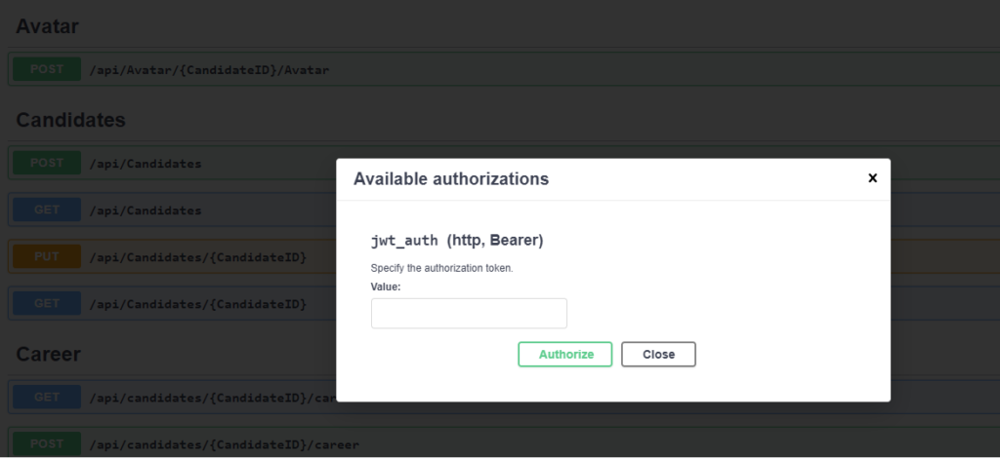

## OpenAPI Security Schemes

As part of documenting API's, OpenAPI 3.0 lets you describe how your APIs are protected using various security schemes and their security requirements. Defining the security requirements for an API is key to enable developers to use the API. The OAS 3 definitions for security is described in a [previous blog post here](https://pradeeploganathan.com/api/openapi-specification-swagger/#Security). It can be used to specify the below security schemes for an API

1. HTTP authentication schemes that use the Authorization header
    1. Basic
    2. Bearer
2. API keys in headers, query string or cookies
    1. Cookie authentication
3. OAuth 2
4. OpenID Connect Discovery

Swashbuckle and NSwag are examples of nuget packages that provide functionality to generate swagger documents for API's.

Let us look at using swashbuckle to generate the swagger definition and to also define the bearer, API key and oAuth2 Security schemes below. We can install swashbuckle using

Dotnet install Swashbuckle.AspNetCore -Version 5.3.3

Installing swashbuckle gives you access to below 3 namespaces which are key to generate the OAS document and the corresponding Swagger UI.

- Swashbuckle.AspNetCore.SwaggerUI
- Swashbuckle.AspNetCore.Swagger
- Swashbuckle.AspNetCore.SwaggerGen

Swashbuckle uses the OpenAPISecurityScheme object to specify the security schemes and the OpenApiSecurityRequirement object to specify the Security requirements needed by the API. The Security scheme and the security requirements can be added to the generated OAS json using the AddSecurityDefinition & the AddSecurityRequirement methods, respectively. The sections below detail adding a bearer, api key and oAuth2 security requirements to the OAS json by calling the AddSwaggerGen method in ConfigureServices metod of the startup class.

### Bearer Security Scheme

The code below specifies a bearer security scheme and the associated parameters for this security scheme. We are specifying the name of the http authorization scheme as defined in RFC7235 to be bearer, we are specifying that the bearer token is in the header with the scheme type of http.

```csharp
services.AddSwaggerGen(options =>
{
    var apiinfo = new OpenApiInfo
    {
        Title = "theta-CandidateAPI",
        Version = "v1",
        Description = "Candidate API for thetalentbot",
        Contact = new OpenApiContact
        { Name = "thetalentbot", Url = new Uri("https://thetalentbot.com/developers/contact") },
            License = new OpenApiLicense()
            {
                Name = "Commercial",
                Url = new Uri("https://thetalentbot.com/developers/license")
             }
        };

        OpenApiSecurityScheme securityDefinition = new OpenApiSecurityScheme()
        {
            Name = "Bearer",
            BearerFormat = "JWT",
            Scheme = "bearer",
            Description = "Specify the authorization token.",
            In = ParameterLocation.Header,
            Type = SecuritySchemeType.Http,
        };

        OpenApiSecurityRequirement securityRequirements = new OpenApiSecurityRequirement()
        {
            {securityScheme, new string[] { }},
        };

        options.SwaggerDoc("v1", apiinfo);
        options.AddSecurityDefinition("jwt_auth", securityDefinition);
        // Make sure swagger UI requires a Bearer token to be specified
        options.AddSecurityRequirement(securityRequirements);               
});
```

The above code results in the swagger UI requiring a [JWT bearer token](https://pradeeploganathan.com/security/jwt/) to authorize requests to the API as below



Bearer token - Swagger UI

### API Key Security Scheme

The code below specifies an API key security scheme. This code can be used when we use an API key to authenticate requests to the API.

```csharp
services.AddSwaggerGen(c =>
{
    var apiinfo = new OpenApiInfo
    {
        Title = "theta-CandidateAPI",
        Version = "v1",
        Description = "Candidate API for thetalentbot",
        Contact = new OpenApiContact
        { Name = "thetalentbot", Url = new Uri("https://thetalentbot.com/developers/contact") },
            License = new OpenApiLicense()
            {
                Name = "Commercial",
                Url = new Uri("https://thetalentbot.com/developers/license")
             }
    };

    c.AddSecurityDefinition(ApiKeyConstants.HeaderName, new OpenApiSecurityScheme
    {
        Description = "Api key needed to access the endpoints. X-Api-Key: My_API_Key",
        In = ParameterLocation.Header,
        Name = ApiKeyConstants.HeaderName,
        Type = SecuritySchemeType.ApiKey
    });

    c.AddSecurityRequirement(new OpenApiSecurityRequirement
    {
        { 
            new OpenApiSecurityScheme 
            {
                Name = ApiKeyConstants.HeaderName,
                Type = SecuritySchemeType.ApiKey,
                In = ParameterLocation.Header,
                Reference = new OpenApiReference
                { 
                    Type = ReferenceType.SecurityScheme,
                    Id = ApiKeyConstants.HeaderName
                },
             },
             new string[] {}
         }
    });
});
```

### OAuth2 Security Scheme

We can also add an implicit flow grant as a security scheme using the code below.

```csharp
OpenApiSecurityScheme securityScheme = new OpenApiSecurityScheme()
{
  Type = SecuritySchemeType.OAuth2,
  Flows = new OpenApiOAuthFlows
  {
    AuthorizationCode = new OpenApiOAuthFlow
    {
      AuthorizationUrl = new Uri("/auth-server/connect/authorize", UriKind.Relative),
      TokenUrl = new Uri("/auth-server/connect/token", UriKind.Relative),
      Scopes = new Dictionary<string, string>
      {
        {"readAccess", "Access read operations"},
        {"writeAccess", "Access write operations"}
      }
    }
  }
};

options.AddSecurityDefinition("oauth2", securityScheme);
```

The above gists can be used to add different security specifications to the OAS document. This will result in the swagger UI using the defined security requirements as part of not only documenting the API but also in the Swagger UI.
