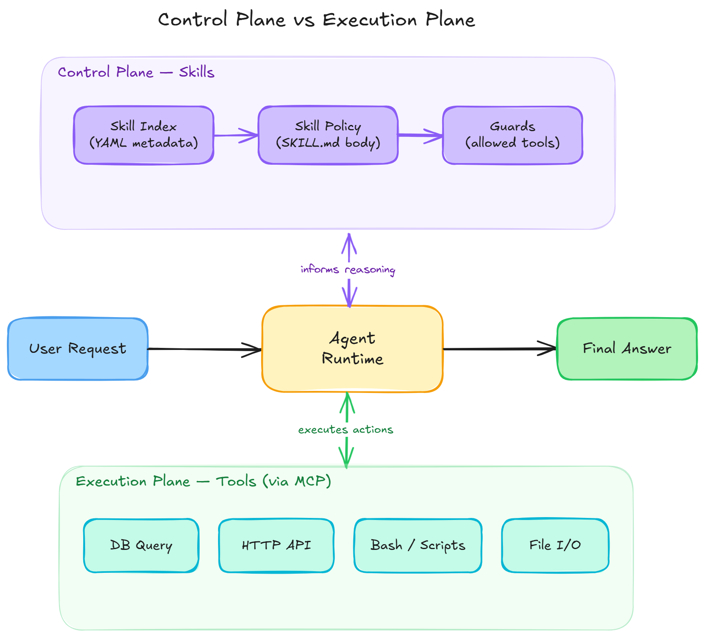
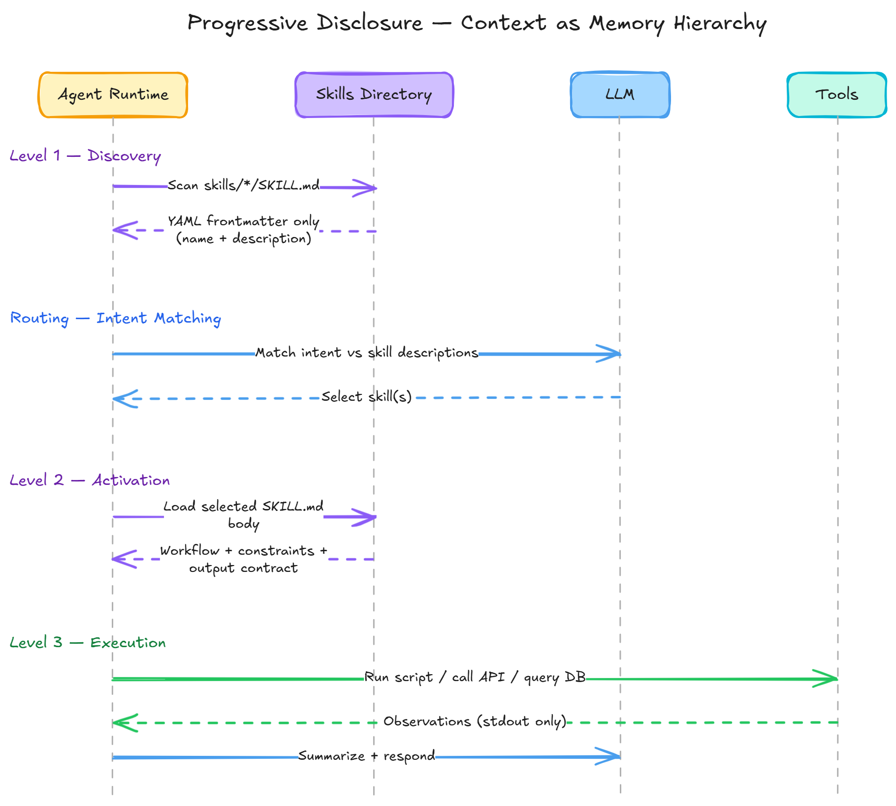

A team ships their first AI agent. It works. They add database rules to the system prompt. Then JSON schemas. Then brand guidelines, security policies, compliance constraints, and a five-page workflow playbook. The agent still works, until it doesn't.

One morning, the agent starts hallucinating column names. Not because the model degraded, but because the system prompt now burns 12,000 tokens before the agent reads a single user message. Instructions interfere. Steps get skipped. The model "creatively" reinterprets constraints it can no longer hold in focus.

This failure mode has a name: **context bloat**. And it produces three predictable outcomes:

- **Latency** climbs — more tokens in, more time out
- **Cost** climbs — you pay for every token you keep repeating
- **Reliability** drops — instruction interference, forgetting, and "creative compliance"

What looks like model weirdness is often architecture debt.

The fix is not a better prompt. It is a better separation of concerns. It is one that treats the model's context window as scarce compute and loads expertise only when needed.

That separation is what **Agent Skills** provide.

---

## Tools give agents hands. Skills give agents training.

In my [MCP series](/blog/model-context-protocol/introduction-to-model-context-protocol/), we explored a standardized way to connect models to external capabilities. We used tools, resources, and prompts established by the [Model Context Protocol](/blog/model-context-protocol/mcp-protocol-mechanics-and-architecture/). MCP solves the execution side cleanly. It solves for how an agent calls a database, hits an API, or runs a shell command.

But connecting an agent to a tool is not the same as teaching it *when to use that tool*, *how to use it safely*, and *what to do with the result*.

That specific distinction between **execution** and **cognition** is where most agent architectures break down.

### Tools = the execution plane

A **tool** is an executable function with defined inputs and outputs. It calls a database, hits an API, runs a shell command, writes a file, or sends a message. Tools are deterministic capabilities *outside* the model's reasoning. They are the **act** part of the [agentic loop](/blog/agentic-ai/agentic-ai-from-copilots-to-agents/).

### Skills = the control plane

A **skill** is packaged expertise that operates *inside* the model's reasoning loop. It contains:

- the heuristics that decide *when* to act
- the workflow that decides *how* to act
- the constraints that decide *what not to do*
- the output contract that standardizes results

A tool lets you query a database. A skill teaches the agent whether it should query at all, what query pattern to use, how to validate the output, and how to present the result safely.

Skills are not prompts in folders. They are **cognitive scaffolding**, a control policy which is loaded only when needed.




---

## The Agent Skills Standard

In December 2024, the [Agent Skills specification](https://agentskills.io/specification) formalized a pattern that teams had been converging on independently. It formalized a filesystem-based standard for packaging cognitive policies.

A skill is a **directory**, anchored by a required **`SKILL.md`** file, with optional scripts, references, and assets:

```text
my-skill/
├── SKILL.md        # required: metadata + instructions
├── scripts/        # optional: executable code (python/bash/js)
├── references/     # optional: docs, schemas, API examples
└── assets/         # optional: templates, images, static files
```

`SKILL.md` has two logical layers:

1. **YAML frontmatter** — metadata, trigger conditions, and tool scoping
2. **Markdown body** — the workflow, constraints, and output contract

No service. No runtime. No new infrastructure. A portable cognitive module that any agent runtime can discover, activate, and enforce.

### Who has adopted this?

This pattern in various forms is already in production across the major AI coding tools:

| Tool | Format | Activation Model |
|------|--------|-----------------|
| **Claude Code** | `SKILL.md` in `.claude/skills/` | Metadata at startup, body on demand, `/slash` invocation |
| **Cursor** | `.cursorrules` or `.cursor/rules/*.mdc` | Auto-loaded on save, project or global scope |
| **GitHub Copilot** | `.github/copilot-instructions.md` | Auto-appended to every request, `applyTo` glob scoping |
| **Windsurf** | `.windsurf/rules/*.md` | Four modes: always-on, manual @mention, model-decision, glob-pattern |
| **JetBrains AI** | `.aiassistant/rules/*.md` | Per-rule scope: always, manual, by-model-decision, file-pattern |
| **Replit** | `replit.md` in project root | Auto-detected on every request |

The implementations differ, but the architectural insight is shared: **separate the "what to know" from the "when to load it"**, and let the agent manage its own cognitive workspace.

---

## Progressive Disclosure: Paging the cognitive workspace

The real contribution of skills is not the folder structure. It is **how they load**.

Skills implement a three-tier strategy that mirrors a memory hierarchy. It ensures that the model's working context is lean while making deep expertise available on demand.

### Level 1 — Discovery (metadata only)

At startup, the agent scans the skills directory and loads only names and descriptions. This is intentionally tiny, a few tokens per skill. The agent becomes aware of hundreds of capabilities without carrying the full instruction payload.

Claude Code budgets roughly 2% of the context window for skill descriptions. That is enough to index a large skill library while preserving working space for the actual task.

### Level 2 — Activation (instructions on demand)

The agent activates a skill when a user request matches its description. It then loads the `SKILL.md` file, which defines the skill's operational context: its workflow, constraints, permitted tools, and required output structure.

### Level 3 — Execution (resources only when needed)

If the workflow requires reference documents or scripts, the agent reads files or runs scripts on demand. The script code never enters the context window. Only its outout, the stdout does.

This three-tier model maps directly to how operating systems manage memory: registers (L1) → cache (L2) → main memory (L3). The most expensive resource which is the model's attention always stays focused on the current task.



---

## The skills-aware agent loop

Skill-aware agents generally converge to a minimal runtime loop — a Plan-Act-Observe-Compress cycle with skill routing at the front:

```text
startup():
  skills_index = scan_skills(load_frontmatter_only=true)

on_message(user_msg):
  candidates = semantic_match(skills_index.descriptions, user_msg)
  decision = LLM("Should I activate a skill?", user_msg, candidates)

  if decision.skill_selected:
      skill = load_skill(decision.skill_id)   # Level 2: body enters context
      enforce(skill.allowed_tools)             # capability-based scoping

      while not done:
        step = LLM(user_msg + state + skill.instructions)
        if step.calls_tool:
          result = tool(step.tool, step.args)  # Level 3: stdout only
          state = summarize(result)
        else:
          return step.final_answer
  else:
      return LLM(user_msg)                     # no skill needed
```

Two things worth noting. First, `enforce(skill.allowed_tools)` is capability-based security. The skill declares which tools it needs, and the runtime restricts access to exactly those tools. This sharply reduces the blast radius of a misbehaving workflow. Second, `summarize(result)` compresses tool output before the next reasoning step, preventing observation bloat from consuming the context budget.

---

## Walkthrough: Building a "CSV Data Analyzer" skill

Theory is essential, but code is concrete. We will build a skill that analyzes CSVs with pandas, applies a cleaning policy, and outputs a standardized report.

### Step 1 — Create the skill directory

```bash
mkdir -p .claude/skills/csv-data-analyzer/{scripts,references,assets}
touch .claude/skills/csv-data-analyzer/SKILL.md
```

### Step 2 — Write the YAML frontmatter

The description is effectively a routing classifier. If it is vague, the agent will not activate the skill reliably. Be specific about triggers, inputs, and expected outputs.

```yaml
---
name: csv-data-analyzer
description: |
  Analyze CSV files using pandas. Use when the user asks to:
  - summarize a CSV or tabular dataset
  - calculate metrics from columnar data
  - clean missing values or normalize columns
  Do NOT use for: Excel files, JSON, or database queries.
  Inputs: CSV file path or uploaded CSV.
  Output: a structured Markdown report with executive summary + key metrics.
version: 1.0.0
allowed-tools: [Bash, Read, Write]
---
```

The `allowed-tools` field restricts the agent to only three tools while this skill is active. No HTTP calls, no file deletion, no arbitrary code execution beyond what the scripts provide. This is capability-based security applied to cognition.

### Step 3 — Write the instructions

Keep instructions imperative, not educational. The agent needs a workflow to follow, not a lesson to internalize.

````markdown
# CSV Data Analysis Workflow

You are an expert data analyst. Follow this workflow exactly.

## Step 1 — Diagnostics (always run first)
```bash
python {baseDir}/scripts/diagnose.py --input <csv_path>
```
Parse the JSON output before proceeding.

## Step 2 — Cleaning Policy
- Drop any column with >50% missing values.
- Fill missing numeric values with the column median.
- Standardize all column names to snake_case.

## Step 3 — Analysis
Perform the user's requested analysis on the cleaned data.

## Step 4 — Output Contract
Return results in exactly this format:

### Executive Summary
(1-2 sentences summarizing the key finding)

### Data Quality Notes
- Columns dropped: [list]
- Missing values filled: [count by column]

### Key Metrics
| Metric | Value |
|--------|-------|
| ... | ... |

### Appendix
- Total rows: N
- Total columns: N
- Cleaning applied: [yes/no]
````

### Step 4 — Add a deterministic diagnostic script

```python
# .claude/skills/csv-data-analyzer/scripts/diagnose.py
import pandas as pd
import argparse, json

def diagnose(file_path: str):
    df = pd.read_csv(file_path)
    report = {
        "rows": int(len(df)),
        "columns": int(len(df.columns)),
        "column_types": df.dtypes.astype(str).to_dict(),
        "missing_pct": ((df.isnull().sum() / len(df)) * 100).round(2).to_dict()
    }
    print(json.dumps(report, indent=2))

if __name__ == "__main__":
    parser = argparse.ArgumentParser()
    parser.add_argument("--input", required=True)
    args = parser.parse_args()
    diagnose(args.input)
```

This is where the architecture pays off. The LLM does not improvise diagnostics. It runs known, tested code and consumes the structured output as an observation. The script's source code never enters the context window. Only its JSON stdout does.

---

## Failure modes and how to handle them

Skills solve context bloat, but they introduce their own failure classes. Understanding these matters more than getting the folder structure right.

### Routing errors

The wrong skill fires, no skill fires, or the right skill fires too late. This is the most common failure mode and the hardest to debug because it happens *before* the skill's instructions take effect.

**How to handle it:** Write descriptions that include concrete trigger phrases users will actually say. Add explicit "when NOT to use this" clauses. Test with a fresh session that has no prior context.

### Skill collisions

Two skills match the same request and their instructions conflict. The agent follows one, ignores the other, or worse — interleaves both.

**How to handle it:** Add `priority` or explicit disambiguation in metadata. Design router skills that choose between sub-skills. Audit for overlapping descriptions.

### Instruction drift

The agent loads the skill and then ignores Step 1. LLMs are not compilers. They treat instructions as strong suggestions, not executable code.

**How to handle it:** Reduce degrees of freedom on fragile steps. Use deterministic scripts (like the diagnostic step above) instead of trusting the model to get parsing right. Assert invariants explicitly: "Always run diagnostics before analysis. Do not skip this step."

### Prompt injection

User input attempts to override skill constraints. This risk grows when skills process untrusted data.

**How to handle it:** Keep critical safety constraints in the system layer, not the skill. Scope tools tightly in the metadata. Treat all user-provided content as data, never as instructions.

---

## How to ship a skill

These guidelines compress the lessons from the failure modes above into a practical checklist.

**Match instruction rigidity to task fragility.** Fragile tasks — parsing, extraction, data validation — need explicit step-by-step commands with minimal variation. Creative tasks — writing, analysis, exploration — benefit from heuristics and broader latitude. Most skills contain both: a rigid diagnostic phase followed by a flexible analysis phase.

**Keep reference chains to one hop.** If `SKILL.md` references `references/api.md`, which references `schemas/v2.json`, which references `examples/`, the agent will preview partial content and miss critical details. One hop: `SKILL.md → references/api.md`. That is it.

**Test like a system, not like a prompt.** Use the two-agent method: Agent A authors and refines the skill. Agent B — a fresh session with no shared context — runs real tasks against it. Log everything: activation, tool calls, skipped steps, token cost. If Agent B cannot reliably trigger and complete the skill, it is not ready.

**Before you ship, verify:**

- [ ] Description contains trigger phrases users will actually say
- [ ] `allowed-tools` is scoped to the minimum required
- [ ] Fragile work uses deterministic scripts, not model improvisation
- [ ] Output contract is strict and consistent
- [ ] 5-10 "golden prompts" exist as a regression suite
- [ ] A fresh session can trigger and complete the skill reliably

---

## The future: composable cognition

MCP standardized how agents connect to the outside world — a universal protocol for [tools, resources, and prompts](/blog/model-context-protocol/introduction-to-model-context-protocol/).

Agent Skills standardize how agents **think and behave** — portably, modularly, and with progressive disclosure.

Together, they form a complete agent architecture:

- **MCP** = how the agent acts (execution plane)
- **Skills** = how the agent reasons about acting (control plane)
- **The [actor model](/blog/agentic-ai/akka-actor-model-agentic-ai/)** = how the agent maintains state across interactions (runtime plane)

We are moving from prompt engineering to cognitive architecture. You do not scale agents by writing bigger prompts. You scale them by building a library of reusable cognitive policies — versioned, testable, auditable — and loading them only when needed.

If skills become the unit of reuse, then the most valuable internal asset is not your prompts or your models. It is your organization's operational knowledge — encoded as executable cognitive modules.

So here is the question worth sitting with:

> If every high-performing team had to publish its playbooks as skills — and every agent in the organization could load them on demand — what would that change about how your company learns?
