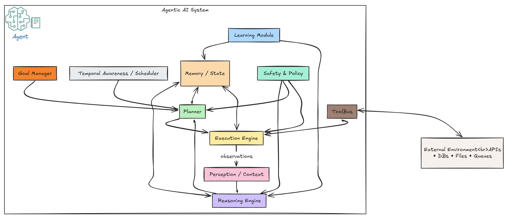

The artificial intelligence landscape has undergone a remarkable transformation over the past few years, and our exploration of this field has mirrored that evolution. We started with first principles , designed and implemented data architectures, built models, inferred them, and then wired those models into real systems. This post is the natural next step moving onto Agentic AI, where models mature into goal-seeking workers that can plan, use tools, act, and learn inside your environment.

We began by laying data foundations for real-world AI by understanding [Lambda]( "What is Artificial Intelligence") and [Kappa architectures]() for batch/stream processing, and then focussing on [Data Mesh]() as a means of scaling data ownership and discovery. As our understanding deepened, we looked under the hood at some of the infrastructure that powers modern AI. We investigated specialized databases optimized for [AI workloads with Greenplum]() and learned how to harness GPU acceleration for [TensorFlow on WSL2](), understanding that the hardware and data architecture beneath our models are just as crucial as the algorithms themselves.
From those early concepts, we firmed up the conceptual base in the blog post on [Demystifying AI ]( "What is Artificial Intelligence"), defining AI and Data Science and surveying core subfields. We then examined how AI models process information and generate responses through [Model Inference](), discovering the critical bridge between trained models and real-world applications. This wasn't just theoretical, We built something tangible, a [fraud-detection model]( "Fraud detection model") demonstrating how machine learning algorithms can solve tangible business problems through careful data preparation, model training, and deployment.

Most recently, we've witnessed the emergence of a new protocol for AI integration. Through our exploration of the [Model Context Protocol (MCP)]( "MCP Server Series") we discovered how modern AI systems are breaking free from isolation, connecting to real-world tools, APIs, and data sources. We even [built our own MCP server]( "MCP server"), experiencing firsthand how AI can interact with external systems in standardized, secure ways.

This progression, from understanding AI's core concepts, to implementing practical models, to exploring the infrastructure that supports them, to finally connecting AI systems with the broader digital ecosystem has brought us to an inflection point. We're now ready to explore Agentic AI: the next evolutionary leap where AI systems don't just respond to queries or process data, but actively plan, reason, and execute complex multi-step tasks with minimal human intervention.

This post marks the beginning of a new chapter in our AI exploration series, where we'll discover how the foundational knowledge we've built together naturally evolves into systems capable of independent action and decision-making. Welcome to the era of Agentic AI—where artificial intelligence finally becomes truly autonomous.

## What Makes AI "Agentic"?

The AI systems we've explored so far in our journey, from the [fraud detection models]( "Fraud detection model") we built to the [inference servers]() that deploy them, represent what we might call "reactive intelligence." These systems excel at responding to inputs: give them a transaction, and they'll classify it as fraudulent or legitimate; provide them with an image, and they'll identify what's in it; feed them text, and they'll generate a response. But they fundamentally wait for us to provide the input, define the task, and interpret the results.

Agentic AI represents a fundamental shift from this reactive design to proactive, goal-directed systems that can initiate actions, plan sequences of activities, and adapt their approach based on changing circumstances. Where traditional AI systems are like sophisticated calculators waiting for problems to solve, agentic AI systems are more like autonomous colleagues capable of understanding objectives and figuring out how to achieve them.

### Core Characteristics of Agentic AI

Agentic AI systems are distinguished by several key characteristics that set them apart

**1. Autonomy and Proactivity** : Unlike reactive systems that simply wait for and respond to inputs, agentic AI takes the initiative. These systems are designed to identify opportunities and take iniative. They are designed to act without explicit, step-by-step instructions from a human. They demonstrate a clear goal-directed behavior, striving to achieve defined objectives with minimal human oversight, effectively taking the reins in complex scenarios.
Think about the [fraud detection model]() we built. We had to feed it specific transaction data to get a score back. An agentic fraud detection system, on the other hand, would be given a broader goal like: "Proactively monitor our systems and reduce fraudulent transactions by 5% this quarter." It would then act on its own: monitoring data streams, identifying new suspicious patterns, and even suggesting or implementing new security rules without being asked. It owns the objective.

**2. Multi-step Reasoning and Planning** : An agent is a strategist. It can break down a complex objective into a sequence of smaller, manageable steps. It then executes this multi-step plan to achieve objectives. It can also adapt & change plans when circumstances change.
If you gave an agent the goal, "Prepare a market analysis report on our top competitor," it wouldn't just search for one document. It would create a plan:

- Step 1: Search the web for their latest financial reports and news articles.
- Step 2: Access our internal sales database to compare customer overlap.
- Step 3: Analyze social media sentiment using a sentiment analysis tool.
- Step 4: Synthesize all this information into a structured report.

This ability to decompose a problem and create a multi-step plan is what separates it from simple, single-shot generative models.

**3. Tool Use and Integration** : Agents aren't limited to their own knowledge; they can interact with the outside world using tools. This is precisely why our exploration of the [Model Context Protocol (MCP)]() is so relevant. An agent's "toolbox" can include:

- Calling APIs (like a weather API or a stock market database).
- Searching the internet.
- Accessing a private database.
- Sending emails or Slack messages.
- Writing and executing its own code.

Agentic AI takes this concept further by not just using tools individually, but by intelligently combining them. It understands which tools are available (building on MCP's capability discovery), can select the right tool for each subtask, and can chain tools together in sophisticated ways.

**4. Context Awareness** : Unlike the stateless nature of many inference systems we've discussed, agentic AI maintains awareness of context across interactions. It remembers previous decisions, learns from outcomes, and adapts its strategies accordingly. This allows it to handle complex, multi-step tasks that require understanding of both the current situation and past actions.

**5. Continuous Learning and Adaptation** :Unlike traditional stateless inference systems, agentic AI is designed to maintain contextual awareness across interactions. It doesn't just respond, it evolves. By remembering past decisions, analyzing outcomes, and integrating feedback, agentic AI continuously refines its behavior and decision-making strategies. 
- Learns from experiences and outcomes : Tracks decisions and their consequences to build a richer understanding over time
- Improves performance over time : Uses accumulated knowledge to enhance accuracy, efficiency, and effectiveness.
- Adapts strategies based on feedback and results : Modifies its approach based on feedback, changing goals, or evolving environments.

## The Agentic AI Architecture

The key components of an Agentic AI system are 

### 1. Reasoning Engine

The reasoning engine is the "brain" of an agentic AI system, responsible for:

- **Problem Analysis**: Understanding the nature and scope of problems
- **Solution Generation**: Creating potential approaches to solve problems
- **Decision Making**: Evaluating options and selecting the best course of action
- **Constraint Handling**: Working within limitations and requirements

### 2. Planning Module

The planning module creates and manages execution strategies:

- **Task Decomposition**: Breaking complex goals into actionable steps
- **Resource Planning**: Allocating time, tools, and capabilities
- **Timeline Management**: Scheduling and coordinating activities
- **Contingency Planning**: Preparing for potential obstacles

### 3. Execution Engine

The execution engine carries out planned actions:

- **Tool Integration**: Using APIs, databases, and external services
- **Action Monitoring**: Tracking progress and outcomes
- **Error Handling**: Managing failures and exceptions
- **State Management**: Maintaining awareness of current situation

### 4. Learning Module

The learning module enables continuous improvement:

- **Outcome Analysis**: Evaluating the success of actions
- **Pattern Recognition**: Identifying what works and what doesn't
- **Strategy Refinement**: Updating approaches based on experience
- **Knowledge Accumulation**: Building expertise over time

We will go into the details of this architecture in a future blog post.

## Real-World Applications of Agentic AI

### 1. Autonomous Software Development

Agentic AI can revolutionize software development by:

- **Code Generation**: Creating complete applications from specifications
- **Bug Detection**: Identifying and fixing issues automatically
- **Testing**: Generating and running comprehensive test suites
- **Deployment**: Managing the entire software lifecycle

### 2. Intelligent Business Process Automation

Agentic AI excels at automating complex business processes:

- **Workflow Orchestration**: Managing multi-step business processes
- **Decision Support**: Providing recommendations based on data analysis
- **Customer Service**: Handling complex customer inquiries autonomously
- **Resource Optimization**: Allocating resources efficiently

### 3. Research and Analysis

Agentic AI can accelerate research and analysis tasks:

- **Data Collection**: Gathering information from multiple sources
- **Pattern Analysis**: Identifying trends and insights in data
- **Report Generation**: Creating comprehensive analysis reports
- **Hypothesis Testing**: Exploring different research directions

### 4. Personal Productivity Assistants

Agentic AI can serve as intelligent personal assistants:

- **Task Management**: Planning and organizing daily activities
- **Information Synthesis**: Summarizing and organizing information
- **Communication**: Drafting emails and messages
- **Learning Support**: Creating personalized learning plans

## Challenges and Considerations

### Technical Challenges

**1. Reliability and Safety**
- Ensuring consistent and predictable behavior
- Preventing harmful or unintended actions
- Managing edge cases and unexpected situations

**2. Scalability**
- Handling complex, multi-agent environments
- Managing resource constraints and performance
- Coordinating multiple agentic systems

**3. Integration Complexity**
- Connecting with diverse tools and systems
- Managing authentication and security
- Handling API limitations and rate limits

### Ethical and Social Considerations

**1. Accountability and Transparency**
- Understanding how decisions are made
- Attributing responsibility for actions
- Providing explanations for behavior

**2. Bias and Fairness**
- Ensuring equitable treatment across different groups
- Identifying and mitigating algorithmic bias
- Promoting inclusive and accessible systems

**3. Privacy and Security**
- Protecting sensitive information
- Managing data access and usage
- Preventing unauthorized actions

**4. Human-AI Collaboration**
- Defining appropriate roles and responsibilities
- Maintaining human oversight and control
- Ensuring beneficial human-AI partnerships

## The Future of Agentic AI

### Emerging Trends

**1. Multi-Agent Systems**
- Coordination between multiple agentic AI systems
- Emergent behaviors and collective intelligence
- Specialized agents for different domains

**2. Enhanced Reasoning Capabilities**
- More sophisticated problem-solving approaches
- Better handling of uncertainty and ambiguity
- Improved causal reasoning and explanation

**3. Improved Learning and Adaptation**
- Faster learning from limited data
- Better transfer learning across domains
- More efficient knowledge accumulation

**4. Human-AI Partnership Models**
- Collaborative problem-solving approaches
- Augmented human capabilities
- Seamless human-AI interaction

### Potential Impact

Agentic AI has the potential to transform numerous industries and aspects of society:

- **Productivity**: Automating complex, knowledge-intensive tasks
- **Innovation**: Accelerating research and development processes
- **Accessibility**: Making advanced capabilities available to more people
- **Problem Solving**: Addressing complex societal challenges

## Getting Started with Agentic AI

### For Developers

**1. Understanding the Fundamentals**
- Study agentic AI concepts and architectures
- Learn about reasoning, planning, and execution
- Explore existing frameworks and tools

**2. Building Simple Agents**
- Start with basic autonomous systems
- Implement core agentic capabilities
- Practice with well-defined problems

**3. Integration and Deployment**
- Connect agents with external tools and APIs
- Implement monitoring and safety measures
- Deploy and iterate on agentic systems

### For Organizations

**1. Identifying Opportunities**
- Assess current processes for automation potential
- Identify areas where agentic AI could add value
- Evaluate readiness for agentic AI adoption

**2. Building Capabilities**
- Develop internal expertise in agentic AI
- Establish partnerships with AI providers
- Create pilot programs and proof of concepts

**3. Managing Implementation**
- Establish governance and oversight frameworks
- Implement safety and security measures
- Plan for human-AI collaboration

## Conclusion

Agentic AI represents a significant evolution in artificial intelligence, moving beyond reactive content generation to proactive, goal-driven autonomous systems. These systems combine reasoning, planning, execution, and learning capabilities to tackle complex problems with minimal human intervention.

As agentic AI continues to develop, it will create new opportunities for automation, innovation, and human-AI collaboration. However, realizing this potential requires careful attention to technical challenges, ethical considerations, and responsible implementation practices.

The future of AI is not just about generating better content - it's about creating intelligent agents that can understand, plan, act, and learn autonomously. Agentic AI is the next step in this evolution, bringing us closer to truly intelligent systems that can work alongside humans to solve complex problems and create value.

## Further Reading

### Foundational AI Series
- [Introduction to Artificial Intelligence](/blog/introduction-to-artificial-intelligence/) - Core AI concepts and fundamentals
- [Machine Learning Fundamentals](/blog/suportvectormachines/) - Understanding ML algorithms and techniques
- [AI Model Inference Explained](/blog/ai-model-inference-explained/) - How AI models process and generate responses
- [Building AI Systems with Modern Architectures](/blog/ai-model-inference-with-triton-inference-server/) - Deploying AI models at scale

### Practical AI Applications
- [Building a Fraud Detection Model](/blog/building-a-fraud-detection-model/) - Real-world AI implementation
- [Model Context Protocol: Introduction](/blog/model-context-protocol/introduction-to-model-context-protocol/) - Modern AI architecture patterns

### Upcoming in the Agentic AI Series
- *Agentic AI Implementation Patterns* - Practical frameworks and architectures
- *Building Autonomous AI Agents* - Step-by-step development guide
- *Agentic AI in Production* - Deployment and monitoring strategies
- *Multi-Agent Systems* - Coordination and collaboration between AI agents

---

*This post serves as the cornerstone of our Agentic AI series, building upon our foundational AI knowledge and practical implementation experience. Stay tuned for detailed explorations of agentic AI implementation patterns, real-world applications, and advanced autonomous system architectures.* 