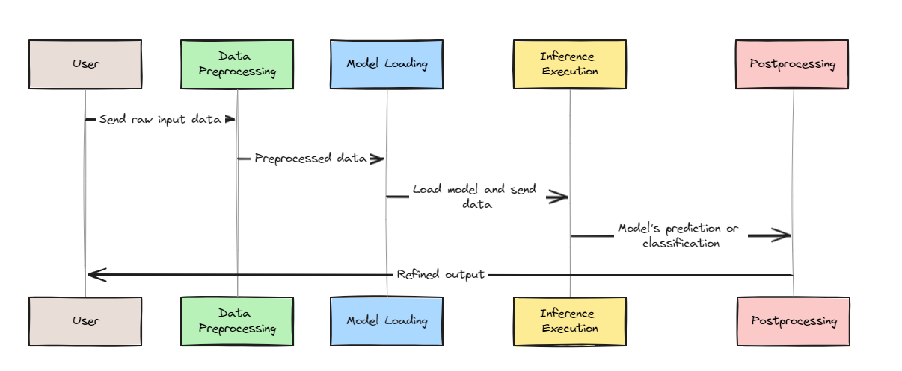
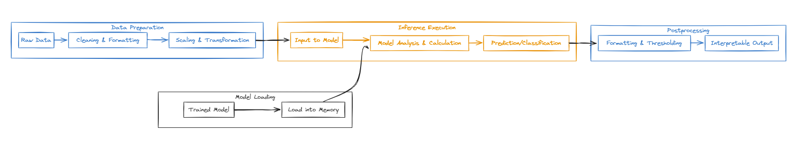

Machine learning has revolutionized the way we approach complex problems in various industries, from image and speech recognition to natural language processing and recommendation systems. But the journey from training a model to deploying it in real-world applications hinges on a critical step: model inference, the process of using a trained model to make predictions or take actions on new, unseen data.

Imagine an autonomous car navigating busy city streets, making split-second decisions to avoid accidents and ensure passenger safety, or a voice assistant effortlessly understanding your commands and responding with relevant information. These remarkable capabilities are fueled by machine learning models performing inference – the process of applying learned patterns to new, unseen data. Inference directly impacts the performance, scalability, and reliability of applications, making it a crucial aspect of machine learning in real-world scenarios. An autonomous vehicle making decision slowly is dangerous and a voice assistant understanding commands erroneously can be frustrating.  As AI becomes more embedded in our daily lives, from personalized recommendations on streaming platforms to voice-activated assistants, the importance of model inference continues to grow.  In this post, we'll explore the power of model inference, discuss its importance in machine learning, and provide best practices for getting the most out of your models.

## What is Model Inference?

In the world of machine learning, models are the lifeblood of many organizations. Whether it's predicting customer behavior,detecting anomalies in financial transactions, or classifying images, models have become an integral part of many industries.
However, simply having a model is not enough – you also need to be able to use it effectively to drive business value.

This is where model inference comes in. Model inference is the process of taking a trained machine learning model and using it to make predictions on new, unseen data. It's a crucial step that enables organizations to unlock the full potential of their
models and turn them into actionable insights. In essence, model inference is the bridge that connects theoretical models to real-world impact. It's the process of using a trained machine learning model to make predictions, classify data, or generate content. Here's how it works:

1. **Input**: New, unseen data (e.g., a video feed, an image, a sentence, sensor readings) is fed into the trained model.
2. **Processing**: The model applies the patterns and relationships it learned during training to analyze the input.
3. **Output**: The model generates a prediction, classification, or other form of output based on its analysis.

### Training vs. Inference

Machine learning models go through two primary phases: training and inference.

1. **Training**: The model's learning phase, where it identifies patterns and relationships from vast amounts of data.
2. **Inference**: The application phase, where the model makes predictions or decisions based on new data.

## Real-World Applications of Model Inference

Model inference isn't just theoretical; it's actively transforming how industries operate. Here are a few compelling examples of inference in action:

### Healthcare

* **Disease Diagnosis:** Machine learning models trained on medical images like X-rays and MRIs can analyze new patient scans. This aids in the identification of tumors or anomalies, potentially leading to faster and more accurate diagnoses than relying solely on human interpretation.
* **Personalized Treatment Plans:** By processing a patient's medical history, genetic information, and other relevant data, models can recommend personalized treatment plans. This approach can improve patient outcomes by tailoring treatments to individual needs and reducing potential side effects.

### Finance

* **Fraud Detection:** Real-time model inference on financial transaction data can instantly detect suspicious activity. This rapid identification helps prevent fraudulent transactions, safeguarding both consumers and businesses from financial losses.
* **Algorithmic Trading:** Models can analyze market trends and execute trades at high speeds. This algorithmic trading approach allows for capitalizing on market opportunities and potentially maximizing profits through data-driven decision-making.

### Autonomous Vehicles

* **Object Recognition:**  Models continuously analyze data from cameras and sensors to identify pedestrians, vehicles, and other objects on the road. This real-time object recognition is crucial for safe navigation and decision-making in autonomous driving scenarios.
* **Traffic Prediction:** By analyzing historical traffic data and real-time information, models can predict traffic patterns and suggest the most efficient routes to drivers. This helps reduce traffic congestion and travel times, benefiting both individual drivers and overall traffic flow.

### Other Industries

* **Manufacturing:** Machine learning models can predict equipment failures by analyzing sensor data, helping prevent costly downtime and optimize maintenance schedules.
* **Retail:** Recommendation engines powered by model inference personalize product suggestions for customers based on their browsing and purchase history, enhancing the shopping experience and potentially increasing sales.
* **Agriculture:** Models can analyze crop data to determine optimal irrigation and fertilizer use, leading to increased yields and resource conservation.

### Why Efficient Inference Matters

Efficient model inference is the key to unlocking the full potential of AI applications. It is a key differentiator for organizations that want to stay ahead of the curve. With the increasing complexity and scale of data, traditional methods of manual analysis are no longer sufficient. Models need to be able to process large amounts of data quickly and accurately, and model inference enables this. It's especially crucial for scenarios demanding real-time or near-real-time responses. In healthcare, rapid analysis of medical scans can aid in swift diagnosis. In finance, instantaneous fraud detection can prevent significant losses and in autonomous vehicles, real-time object recognition is paramount for safe navigation.

Moreover, model inference is not just about making predictions – it's also about gaining a deeper understanding of your data and identifying patterns that might not be immediately apparent. By using models to analyze complex datasets, organizations can
uncover new insights, identify areas for improvement, and make data-driven decisions. The speed and accuracy of model inference directly impacts user experiences, business outcomes, and even life-saving decisions. As AI continues to permeate various aspects of our lives, the importance of optimizing model inference cannot be overstated.

## Types of Model Inference

Model inference is not a one-size-fits-all solution. Depending on your specific use case, data distribution, and performance requirements, you may need to choose from different types of model inference. There are several types of model inference, including:

* **Batch Inference:** Batch inference, also known as offline inference, involves processing large datasets all at once. This approach is commonly used for:
  * Image classification
  * Natural language processing
  * Recommendation systems
  Batch inference typically requires less computational resources than online inference but can be slower and more memory-intensive due to the need to process entire datasets.

* **Online Inference**: Online inference refers to the process of making predictions in real-time as new data arrives. This is particularly useful for applications that require immediate feedback, such as:
  * Personalized product recommendations in e-commerce
  * Sentiment analysis for customer feedback
  * Real-time fraud detection
Online inference typically involves streaming data into a model and generating predictions on-the-fly. This approach can be challenging due to the need for high-throughput processing and handling varying data distributions.
* **Streaming Inference**: Processing continuous streams of data, often used for applications like video analytics and natural language processing

## Overcoming the Hurdles: Challenges in Model Inference

While model inference empowers AI applications, it's not without its hurdles. As models grow in complexity and the demand for real-time insights surges, developers and organizations face a range of critical challenges:

* **The Need for Speed:**

  * Scalability and Throughput: Handling a flood of inference requests without sacrificing performance is a constant balancing act. Scaling up infrastructure to meet demand while maintaining low latency is essential.
  * Latency and Response Time: In time-sensitive applications like fraud detection or autonomous vehicles, split-second decision-making requires lightning-fast inference. Meeting strict latency requirements is non-negotiable.

* **Taming Model Complexity:**

  * Model Size and Resources: Large, intricate models often demand significant computational power and memory, straining resources and potentially leading to bottlenecks.
  * Optimization Trade-offs: Striking the right balance between model accuracy and computational efficiency is a delicate dance. Techniques like model compression can help, but require careful consideration.

* **Navigating Hardware and Software:**

  * Hardware Diversity: Optimizing inference for diverse hardware platforms (CPUs, GPUs, TPUs, etc.) necessitates careful tailoring and expertise.
  * Software Selection: Choosing the right inference framework and tools can significantly impact performance. Compatibility and ease of use are also key factors.

* **Model Management Maze:**

  * Deployment and Updates: Seamlessly deploying, updating, and maintaining a multitude of models across various frameworks and environments can be a logistical nightmare.
  * Consistency and Accuracy: Ensuring models perform consistently and accurately across different deployments and over time is a critical concern.

* **Safeguarding Sensitive Data:**

  * Security and Privacy: Protecting data used for inference is paramount, especially in industries handling sensitive information like healthcare or finance. Robust security measures are essential to prevent unauthorized access and potential breaches.

These challenges underscore the need for robust, scalable, and efficient model inference solutions. Fortunately, powerful tools like Triton Inference Server have emerged to address these complexities, paving the way for a smoother and more effective deployment of AI models in the real world. Triton offers a robust, scalable, and efficient platform for deploying and managing diverse AI models in various environments. You can learn more about it here.

## Understanding Model Inference: From Training to Action

Now that we've established what is model inference and its significance, let's dive deeper into the mechanics behind it. Think of the inference pipeline as a well-orchestrated sequence of steps that transform raw input data into insightful predictions or classifications.

Here's a breakdown of this journey:

1. **Data Preprocessing:**
   * **Preparing the Input:** Before your model can work its magic, the incoming data needs to be prepared. This involves tasks such as cleaning, formatting, scaling, or converting the data into a suitable format for your model's consumption. Proper preprocessing ensures that the data is in the right shape and quality for accurate predictions.

2. **Model Loading:**
   * **Loading the Trained Model:** Once your data is prepped, the trained model is loaded into memory. This step is crucial for efficient inference, as the model must be readily available to process incoming data. Platforms like Triton Inference Server excel at this stage, seamlessly managing models from various frameworks and ensuring they are optimally loaded for performance.

3. **Inference Execution:**
   * **Generating Predictions:** This is where the core action happens. The loaded model takes the preprocessed data and performs the necessary computations, applying the patterns and relationships it learned during training. The outcome is the model's prediction or classification. This step involves the heavy lifting of the inference process, where the model's intelligence is applied to new data.

4. **Postprocessing:**
   * **Refining the Output:** In some cases, the model's output might require further refinement or interpretation. Postprocessing steps can include formatting the results, applying thresholds, or translating numerical values into meaningful labels. This final step ensures that the output is in a usable form for decision-making or further analysis.

By understanding these steps, we gain insight into how raw data is transformed into actionable intelligence through model inference. Each step is critical in ensuring that the inference process is efficient, accurate, and scalable, allowing machine learning models to make a tangible impact in real-world applications.

## Where Does Inference Reside? Deployment Options Unveiled

The location where you deploy your model for inference plays a crucial role in its performance and accessibility. Let's explore some common deployment strategies

* **On-Premises and Hybrid Inference:** Inference can be performed on-premises or in a hybrid manner, combining both on-premises and cloud resources. Solutions such as [VMware Private AI](https://core.vmware.com/resource/deploying-enterprise-ready-generative-ai-vmware-vmware-cloud-foundation) offer these capabilities. The benefits include:

  * Control and Security: Maintain full control over your data and infrastructure, ensuring compliance with security policies.
  * Customization: Tailor the infrastructure to meet specific performance and operational requirements.
  * Hybrid Flexibility: Combine the benefits of on-premises and cloud-based deployments to optimize performance, cost, and resource utilization.

* **Cloud-Based Inference:** In this scenario, your model resides in the cloud, accessible via APIs. Cloud platforms like AWS, Azure, or Google Cloud provide the infrastructure and scalability needed to handle high volumes of inference requests. The advantages are

  * Scalability: Effortlessly scale your inference capacity to match demand.
  * Managed Infrastructure: Focus on your ML tasks while the cloud provider handles server management.
  * Global Accessibility: Serve predictions to users worldwide.

* **Edge Inference:** Sometimes, it's advantageous to run inference directly on devices closer to where data is generated (e.g., smartphones, IoT devices). This approach is known as edge inference. The benefits are

  * Low Latency: Reduced response time due to proximity to data.
  * Offline Capability: Inference can continue even without internet connectivity.
  * Privacy: Sensitive data can be processed locally without leaving the device.

Choosing the right deployment strategy depends on your specific use case and requirements. Consider factors such as privacy, confidentiality, scalability, latency, security, and infrastructure management when deciding where to deploy your model for inference.

## Inference Servers

To efficiently manage and optimize model inference across these deployment options, specialized platforms known as inference servers can be employed. Inference servers are specialized platforms designed to handle the complexities of model inference, providing optimized performance, scalability, and manageability. A Inference Server handles incoming inference requests, processes these requests using pre-trained models, and returns predictions. Inference servers optimize resource utilization, support scalability, and ensure reliable model deployment in production environments.

## Benefits of Using an Inference Server

* **Optimized Performance**:
  * Inference servers often include features like dynamic batching, which combines multiple inference requests to maximize GPU or CPU utilization and improve throughput.
  * Integration with hardware acceleration tools, such as NVIDIA TensorRT, to enhance performance.

* **Scalability**:
  * Easily scalable by adding more instances to handle increased inference loads.
  * Load balancing capabilities to distribute the inference workload evenly across multiple server instances.

* **Multi-Framework Support**:
  * Supports a variety of machine learning frameworks (e.g., TensorFlow, PyTorch, ONNX), providing flexibility in deploying models from different environments.

* **Model Management**:
  * Advanced model management features, including model versioning, dynamic loading, and configuration management, to streamline the deployment and updating of models.

* **Monitoring and Logging**:
  * Provides detailed metrics and logging for monitoring the performance and health of deployed models.
  * Enables setting up alerts and tracking system performance to proactively address potential issues.

While cloud platforms offer managed services that abstract away many complexities, inference servers are particularly valuable in environments where control over infrastructure and customization are paramount. They allow organizations to deploy AI solutions effectively, ensuring high performance and reliability. There are several leading inference servers in the market, each with its strengths and specific use cases. Here's an overview of the most prominent ones:

1. NVIDIA Triton Inference Server
2. TensorFlow Serving
3. TorchServe
4. ONNX Runtime
5. AWS SageMaker Inference

## Leading Inference Servers: A Closer Look

Let's delve into a few of the most popular inference servers on the market:

* **NVIDIA Triton Inference Server**: NVIDIA Triton Inference Server is developed by NVIDIA and designed to maximize the performance and efficiency of deploying AI models at scale, leveraging NVIDIA GPUs.It provides exceptional hardware acceleration for NVIDIA GPUs, an extensive model repository, broad framework support, and a focus on high-performance inference. It is ideal for applications requiring top-tier GPU performance, real-time inference, and the ability to serve a diverse array of models.

* **KServe**: KServe, formerly known as KFServing, is an open-source model inference platform designed to provide serverless inference capabilities on Kubernetes. It is developed as part of the Kubeflow project and aims to simplify the deployment and management of machine learning models in production. It provides seamless integration with Kubernetes, support for multiple frameworks (e.g., TensorFlow, PyTorch, XGBoost, SKLearn), autoscaling, and canary rollouts for model updates. It is ideal for organizations using Kubernetes for their infrastructure, those seeking a serverless approach to model deployment, and environments that require flexible and scalable inference solutions.

* **TensorFlow Serving**: TensorFlow Serving is developed by Google and is a flexible, high-performance serving system for machine learning models, designed for production environments.It provides seamless integration with the TensorFlow ecosystem, strong community support, and mature model management capabilities.It is ideal for organizations that are heavily invested in TensorFlow, particularly those seeking a reliable and well-supported inference solution.

* **TorchServe**: TorchServe is an open-source model serving framework for PyTorch, developed by AWS and Facebook, offering easy-to-use APIs and scalable serving capabilities. It is designed specifically for PyTorch models, has a user-friendly interface, and a growing community. It is ideal for PyTorch users seeking a straightforward and efficient way to deploy their models.

* **ONNX Runtime**: ONNX Runtime is a cross-platform, high-performance scoring engine for Open Neural Network Exchange (ONNX) models, developed by Microsoft and optimized for various hardware. It provides extensive framework support (including TensorFlow, PyTorch, Scikit-learn), portable across various platforms, and is optimized for diverse hardware (CPUs, GPUs, etc.). It is ideal for applications that require flexibility in terms of model frameworks and deployment environments.

* **AWS SageMaker Inference**: AWS SageMaker Inference is developed by Amazon Web Services (AWS) and is a fully managed service that makes it easy to deploy machine learning models for inference at scale. It provides deep integration with the AWS ecosystem, easy scalability, and serverless options for cost optimization. It is ideal for organizations that are already using AWS services, those seeking managed infrastructure, or those needing the flexibility of serverless architectures.

## Choosing the Right Inference Server

Selecting the best inference server depends on your specific requirements:

* Framework(s): Ensure the server supports the frameworks you use for model development.
* Hardware: Consider the hardware you have available (CPUs, GPUs, TPUs) and the server's optimization capabilities for those platforms.
* Scalability Needs: Estimate your inference load and choose a server that can scale accordingly.
* Ease of Use: Evaluate the server's interface, documentation, and community support to determine how easy it is to learn and use.

## The Future of Model Inference: Where We're Heading

Model inference is not a static field; it's constantly evolving to meet the growing demands of AI applications. Here's a glimpse into some of the most exciting trends shaping the future of model inference:

### Inference at the Edge: Empowering Devices

Inference at the edge allows for near-instantaneous predictions and responses, crucial for applications like autonomous vehicles, robotics, and real-time analytics. Less data is transmitted to the cloud, leading to cost savings and improved reliability in areas with limited connectivity. Sensitive data can be processed locally, minimizing the risk of exposure during transmission.

* **Decentralized Inference:** As devices become more powerful, there is a shift towards performing inference directly on edge devices such as smartphones, IoT devices, and autonomous vehicles. This reduces latency and bandwidth usage while enhancing privacy by keeping data local.

* **Enhanced Hardware Capabilities:** Innovations in edge hardware, like AI accelerators and specialized inference chips, are making it possible to run complex models efficiently on edge devices.Edge inference brings the power of AI directly to devices like smartphones, wearables, and industrial sensors.

* **Reduced Latency:**  By processing data locally, edge inference minimizes the delay in receiving predictions, making it ideal for real-time applications like autonomous vehicles and robotics.

* **Enhanced Privacy:** Sensitive data can be analyzed on the device itself, reducing the need to transmit it to the cloud and minimizing potential privacy risks.

### AI Accelerators

Specialized chips (e.g., TPUs, ASICs) are being developed to accelerate inference tasks, boosting performance and efficiency.

* **Specialized Hardware:** AI accelerators, such as NVIDIA’s TensorRT, Google’s Coral TPU, and custom AI chips, are designed to accelerate inference workloads. These accelerators optimize performance and energy efficiency, making it feasible to deploy high-complexity models in real-time applications.
* **Integration with Inference Servers:** Inference servers are increasingly integrating with AI accelerators to leverage their capabilities, providing seamless and optimized inference experiences.

AI accelerators are finding applications in diverse fields, from speeding up natural language processing in chatbots to accelerating image recognition in surveillance systems.

### Model Compression and Optimization

Techniques like quantization and pruning are shrinking model sizes, enabling faster inference on resource-constrained devices.

* **Efficient Models:** Techniques such as model pruning, quantization, and knowledge distillation are being used to reduce model size and computational requirements, enabling faster and more efficient inference.
* **AutoML for Inference:** Automated Machine Learning (AutoML) tools are evolving to include model optimization for inference, allowing developers to automatically generate and deploy highly efficient models.

These optimization techniques are crucial for running AI models on mobile devices, embedded systems, and other resource-constrained environments.

### Serverless Inference Architectures: Scaling on Demand

Serverless inference leverages cloud-based functions to execute model inference tasks on a per-request basis. This eliminates the need to manage infrastructure, allowing for

* **Automatic Scaling:** Effortlessly handles fluctuating inference workloads without manual intervention.
* **Cost Efficiency:** Pay only for the actual compute time used, reducing operational costs.
* **Simplified Deployment:** Streamlines the process of deploying and updating models without complex infrastructure management.

Serverless inference is becoming popular for applications with unpredictable workloads, such as chatbots or e-commerce recommendation engines, where demand can fluctuate significantly.

### Explainable AI (XAI): Building Trust and Transparency

As AI models become more integrated into decision-making processes, the need for transparency and understanding grows. Explainable AI (XAI) techniques aim to shed light on how models arrive at their predictions, enabling users to:

* **Understand Reasoning:** XAI methods can provide insights into the factors that influence a model's decision, helping build trust and identify potential biases.
* **Improve Debugging:** By understanding why a model made a particular prediction, developers can more effectively debug and refine their models.

## The Road Ahead

The future of model inference is bright, with ongoing research and development aimed at making AI more accessible, efficient, and powerful. As these trends mature, we can expect even faster, more efficient, and privacy-conscious AI applications that seamlessly integrate into our daily lives.
