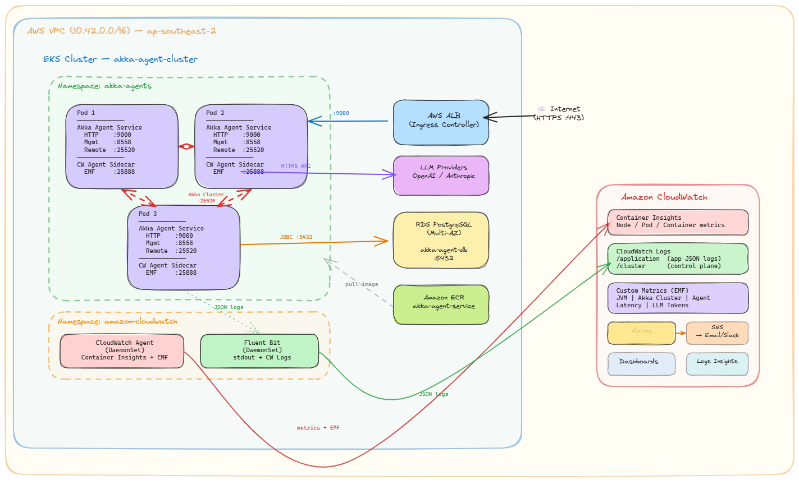

# Akka SDK Agentic AI - Self-Managed Deployment on EKS

The [Akka SDK](https://akka.io/) is a powerful toolkit for building distributed, resilient, and elastic applications on the JVM. Its actor model, cluster sharding, and event sourcing capabilities make it an excellent foundation for building and running autonomous agentic AI workloads. Autonomous agents maintain durable state, coordinate with peers, and interact with LLMs to make decisions. Running these workloads in production requires infrastructure that matches Akka's distributed nature. This includes a Kubernetes cluster spanning multiple availability zones, a persistent database for event journals and projections, a container registry, load balancing, and an observability stack to monitor cluster health.

This guide walks you through building that entire infrastructure on AWS from scratch, using EKS as the Kubernetes platform. By the end, you'll have a production-ready environment capable of running Akka based agentic AI services with automatic cluster formation, horizontal autoscaling, and fault tolerance across availability zones.

## What We'll Build

Here is the path we'll follow, from bare AWS account to a running Akka cluster:

1. **Container Registry (ECR)** - Create a private Docker registry to store your Akka service images, with vulnerability scanning and lifecycle policies.
2. **Kubernetes Cluster (EKS)** - Provision a multi-AZ EKS cluster with managed node groups sized for JVM workloads, VPC networking, and essential add-ons (CNI, CoreDNS, EBS CSI).
3. **IAM Roles and Policies (Optional)** - Set up fine-grained AWS permissions using IRSA (IAM Roles for Service Accounts) for optional cluster add-ons like Velero (backups) and cert-manager (TLS certificates). Skip this step if you don't need cluster backups or automated certificate management.
4. **PostgreSQL Database (RDS)** - Provision a Multi-AZ RDS PostgreSQL instance for Akka Persistence. Akka persistence provides event journal, snapshot store, durable state, and projection offset tracking.
5. **Build and Push** - Package your Akka service as a standalone container image and push it to ECR.
6. **Kubernetes Manifests** - Define the namespace, RBAC, secrets, deployment, service, and ingress resources that make up the Akka application on Kubernetes.
7. **Akka Cluster Bootstrap** - Configure Akka's cluster formation to use Kubernetes API discovery, wire up R2DBC persistence to RDS, and set up Split Brain Resolver for partition tolerance.
8. **Deploy and Verify** - Install the Cluster Autoscaler and metrics server, apply all manifests, and verify that the Akka cluster forms correctly.
9. **Observability** - Set up Prometheus + Grafana or CloudWatch Container Insights for metrics, logs, and alerting.
10. **Production Hardening** - Configure Horizontal Pod Autoscaling (with Akka-aware scale-down policies), Pod Disruption Budgets (for safe node maintenance), and Network Policies (to isolate Akka remoting traffic).

Each section is self-contained with the commands and YAML needed for that step, so you can also use individual sections as a reference for your own infrastructure setup.

---

## Architecture Overview

This is the visual representation of what we are building at a very high level.



**High-level architecture:**
- **EKS Cluster** - Kubernetes control plane and worker nodes running Akka pods across 3 Availability Zones
- **ECR** - Private container registry for Akka service Docker images
- **RDS PostgreSQL** - Multi-AZ database for Akka Persistence (Event Sourcing, Key Value Entities, Projections)
- **ALB** - Application Load Balancer for external HTTP/gRPC traffic
- **CloudWatch / Prometheus** - Observability stack for logs, metrics, and alerts

The key insight behind this architecture is that Akka clusters are stateful distributed systems. Unlike stateless web services that can be scaled and replaced freely, Akka Cluster members form a protocol-level membership group, distribute sharded entities across members, and coordinate through gossip protocols and remoting. This means the underlying infrastructure must provide stable networking between pods, consistent DNS resolution, topology-aware scheduling across availability zones, and graceful lifecycle management. This guide enables you to do this exactly.

---

## Prerequisites

### Required IAM Permissions

The AWS IAM user or role running these commands needs the following permissions at minimum:
- **EKS:** `eks:*`, `ec2:*`, `iam:*`, `cloudformation:*` (eksctl uses CloudFormation)
- **ECR:** `ecr:*`
- **RDS:** `rds:*`
- **Route53:** `route53:*` (if using cert-manager with DNS-01 challenges)
- **S3:** `s3:*` (if using Velero for backups)

For a non-production or learning setup, the `AdministratorAccess` managed policy can be used, but this is not recommended for production.

### Required Tools

Install the following tools on your workstation:

```bash
# AWS CLI v2 - Need to execute AWS commands
curl "https://awscli.amazonaws.com/awscli-exe-linux-x86_64.zip" -o "awscliv2.zip"
unzip awscliv2.zip && sudo ./aws/install

# eksctl - CLI for creating and managing EKS clusters
curl -sLO "https://github.com/eksctl-io/eksctl/releases/latest/download/eksctl_$(uname -s)_amd64.tar.gz"
tar xz -C /tmp -f eksctl_$(uname -s)_amd64.tar.gz
sudo mv /tmp/eksctl /usr/local/bin

# kubectl - Kubernetes CLI
curl -LO "https://dl.k8s.io/release/$(curl -Ls https://dl.k8s.io/release/stable.txt)/bin/linux/amd64/kubectl"
chmod +x kubectl && sudo mv kubectl /usr/local/bin

# Helm (for Prometheus, ALB Controller, and other add-ons)
curl https://raw.githubusercontent.com/helm/helm/main/scripts/get-helm-3 | bash

# Docker - required for building and pushing container images
# Install via: https://docs.docker.com/engine/install/

# Verify all tools
aws --version
eksctl version
kubectl version --client
helm version
docker --version
```

Sometimes I really wish we standardized on using -- or nothing for the version command.

### Configure AWS Credentials

```bash
aws configure
# Enter your Access Key, Secret Key, default region (e.g., ap-south-1 for Mumbai)

# Verify your identity
aws sts get-caller-identity
```

---

## Part 1: Create the ECR Repository

Amazon Elastic Container Registry (ECR) is a fully managed Docker container registry. You need an ECR repository to store your Akka service container images before deploying them to EKS. ECR integrates natively with EKS. EKS worker nodes authenticate to ECR automatically via their IAM role, so no image pull secrets are needed.
When you push an image, ECR (backed by S3) automatically encrypts your data at rest using the AES-256 encryption algorithm. When you pull the image, AWS transparently decrypts it for you. This uses Server-Side Encryption with Amazon S3-Managed Keys (SSE-S3). No action is required from your side to rotate, manage, or secure these keys; AWS handles the complexity.
If you have enabled "Enhanced Scanning" in your private registry settings, AWS uses Amazon Inspector. This is a more advanced engine that scans both OS packages and programming language packages (like Python, Java, Node.js libraries) for vulnerabilities. If you configure basic scanning it uses AWS's native scanning engine (historically based on the Clair open-source project). It checks your container images against a database of known vulnerabilities (CVEs) from sources like NVD.

```bash
# Set your variables so that they are used when needed as part of your AWS cli commands
export AWS_REGION=ap-south-1
export AWS_ACCOUNT_ID=$(aws sts get-caller-identity --query Account --output text)
export ECR_IMAGE_REPO_NAME="akka-agent-service"

# Create ECR repository for your Akka service
# scanOnPush: automatically scans images for known CVEs on push
# AES256 encryption: encrypts images at rest using AWS-managed keys
aws ecr create-repository \
  --repository-name ${ECR_IMAGE_REPO_NAME} \
  --region $AWS_REGION \
  --image-scanning-configuration scanOnPush=true \
  --encryption-configuration encryptionType=AES256

# Set lifecycle policy to keep only last 30 images (cost control)
# This prevents unbounded storage growth as you push new image versions.
aws ecr put-lifecycle-policy \
  --repository-name ${ECR_IMAGE_REPO_NAME} \
  --region $AWS_REGION \
  --lifecycle-policy-text '{
    "rules": [
      {
        "rulePriority": 1,
        "description": "Keep last 30 images",
        "selection": {
          "tagStatus": "any",
          "countType": "imageCountMoreThan",
          "countNumber": 30
        },
        "action": {
          "type": "expire"
        }
      }
    ]
  }'

# Authenticate Docker to ECR
# This token expires after 12 hours - you'll need to re-authenticate for subsequent pushes.
aws ecr get-login-password --region $AWS_REGION | \
  docker login --username AWS --password-stdin \
  ${AWS_ACCOUNT_ID}.dkr.ecr.${AWS_REGION}.amazonaws.com
```

---

## Part 2: Create the EKS Cluster

This section provisions an EKS cluster with settings optimized for Akka workloads. Akka clusters require stable networking between pods (for remoting), access to the Kubernetes API (for cluster bootstrap discovery), and sufficient compute resources for JVM-based services.

I am building this cluster in the Asia Pacific(Mumbai) region. Please ensure that you update the region and the availability zones to reflect your needs. 

```bash
# Set your variables for the EKS cluster
export AWS_REGION="ap-south-1"
export CLUSTER_NAME=akka-agent-cluster
export K8S_VERSION="1.31"
export NODEGROUP_NAME=akka-workers
export INSTANCE_TYPE=m5.xlarge    # 4 vCPU, 16 GiB - good balance for Akka JVM workloads
export MIN_SIZE=2
export MAX_SIZE=6
export DESIRED_CAPACITY=3

# For a production Akka cluster, use On-Demand instances for stability.
# Akka Cluster members form a protocol-level cluster using Akka Remoting, and sudden
# Spot interruptions can cause unnecessary shard rebalancing and potential data unavailability.
# Spot instances can be used for stateless HTTP-only services or development environments.
export CAPACITY_TYPE=ON_DEMAND

# HighlyAvailable creates a NAT Gateway in each AZ.
# This ensures private subnet internet access survives an AZ failure.
# Use "Single" for development/cost savings (single NAT GW in one AZ).
export NAT_GATEWAY_TYPE=HighlyAvailable

# Spread across 3 AZs for resilience. Akka Cluster shards will be distributed
# across these zones, so losing one AZ still leaves 2/3 of the cluster healthy.
export AVAILABILITY_ZONES="ap-south-1a,ap-south-1b,ap-south-1c"
```

### Cluster Config File

To provision the cluster, we will use a declarative ClusterConfig file. This approach is superior to using CLI flags because it serves as documentation for your infrastructure and allows for version control. The configuration below sets up a dedicated VPC, enables the necessary OIDC providers for service accounts, and configures the worker nodes. It is configured for a production-grade Akka architecture from day one. It includes Private Networking for security, OIDC/IRSA integration for fine-grained IAM permissions, and CloudWatch logging for deep observability. Note that I am using environment variables (e.g.,```${CLUSTER_NAME}```) to make this file dynamic, eksctl will automatically substitute these values from your shell environment when the command runs.
Save this yaml definition as eks-cluster.yaml so that it can be used in the subsequent commands.

```yaml
# eks-cluster.yaml
apiVersion: eksctl.io/v1alpha5
kind: ClusterConfig

metadata:
  name: ${CLUSTER_NAME}
  region: ${AWS_REGION}
  version: "${K8S_VERSION}"

# VPC configuration
# eksctl creates a new VPC with public and private subnets across all specified AZs.
# The CIDR block determines the IP address range for the entire VPC.
vpc:
  cidr: 10.42.0.0/16
  nat:
    gateway: ${NAT_GATEWAY_TYPE}
  clusterEndpoints:
    publicAccess: true       # Allows kubectl access from outside the VPC
    privateAccess: true      # Allows worker nodes to communicate with the API server privately

# IAM configuration - enables IRSA (IAM Roles for Service Accounts)
# IRSA allows individual Kubernetes service accounts to assume specific IAM roles,
# providing fine-grained AWS permissions without sharing node-level credentials.
# This is required for the AWS Load Balancer Controller, Velero, and cert-manager.
iam:
  withOIDC: true

# Managed Node Groups define the EC2 instances that run your Akka pods.
# eksctl creates an Auto Scaling Group behind the scenes.
managedNodeGroups:
  - name: ${NODEGROUP_NAME}
    instanceType: ${INSTANCE_TYPE}
    capacityType: ${CAPACITY_TYPE}
    minSize: ${MIN_SIZE}
    maxSize: ${MAX_SIZE}
    desiredCapacity: ${DESIRED_CAPACITY}
    volumeSize: 50                # GP3 root volume for worker nodes
    volumeType: gp3
    privateNetworking: true       # Nodes deployed in private subnets - no public IPs
    labels:
      role: akka-worker
      workload-type: jvm
    tags:
      Environment: production
      ManagedBy: eksctl
    iam:
      withAddonPolicies:
        autoScaler: true          # Required for Kubernetes Cluster Autoscaler
        cloudWatch: true          # Enables CloudWatch Container Insights
        ebs: true                 # Required for EBS CSI driver (persistent volumes)
    availabilityZones:
      - ap-south-1a
      - ap-south-1b
      - ap-south-1c

# EKS add-ons provide core cluster functionality.
# These are AWS-managed and automatically updated.
addons:
  - name: vpc-cni               # Pod networking - assigns VPC IPs directly to pods
    version: latest
  - name: coredns               # Cluster DNS resolution
    version: latest
  - name: kube-proxy            # Kubernetes service networking (iptables/IPVS rules)
    version: latest
  - name: aws-ebs-csi-driver    # Enables PersistentVolumeClaims backed by EBS
    version: latest
    wellKnownPolicies:
      ebsCSIController: true

# Control plane logging - sends EKS API server logs to CloudWatch.
# Useful for auditing API access and debugging cluster-level issues.
cloudWatch:
  clusterLogging:
    enableTypes:
      - api
      - audit
      - authenticator
      - controllerManager
      - scheduler
```

### Create the Cluster

We will use the eks-cluster.yaml created above to create the cluster.

```bash
# Create the EKS cluster using the config file
# eksctl uses CloudFormation under the hood to provision all resources.
eksctl create cluster -f eks-cluster.yaml

# This takes ~15-20 minutes. eksctl automatically configures your kubeconfig.
# Verify the cluster is ready:
kubectl get nodes
kubectl cluster-info
```

---

## Part 3: IAM Roles and Policies (Optional)

> **This entire section is optional.** Velero and cert-manager are not required for the Akka cluster to function. You can safely skip to [Part 4: Set Up RDS PostgreSQL](#part-4-set-up-rds-postgresql) if:
> - **You don't need Velero:** Cluster backups are a production best practice but not a prerequisite. You can add Velero later.
> - **You don't need cert-manager:** The ALB Ingress in Part 6 uses an [AWS Certificate Manager (ACM)](https://aws.amazon.com/certificate-manager/) certificate directly via the `certificate-arn` annotation, which handles TLS termination at the load balancer without cert-manager. cert-manager is only needed if you want automated Let's Encrypt certificates managed inside the cluster (e.g., for internal mTLS or non-ALB ingress controllers like Nginx).

This section creates IAM roles for optional cluster add-ons using IRSA (IAM Roles for Service Accounts). This enables a mechanism where Kubernetes service accounts are mapped to IAM roles via the OIDC provider created with the EKS cluster. This avoids giving broad AWS permissions to all pods on a node.

The script below configures the security bridge between Kubernetes and AWS. Unlike standard IAM roles which are attached to a whole Node (giving every pod on that node the same permissions), this script creates a role that is cryptographically bound to the specific velero ServiceAccount. This ensures that only the backup tool can access your S3 backup bucket, adhering to the Principle of Least Privilege. In simple terms, it creates a secure "ID Badge" (IAM Role) that grants permission to manage backups, and then strictly configures the lock (Trust Policy) so that only the Velero application running inside your cluster can pick up that badge.

```bash
# Get OIDC Issuer URL and construct the provider ARN
# The OIDC provider was created by eksctl when we set `iam.withOIDC: true`.
export AWS_REGION=ap-south-1
export AWS_ACCOUNT_ID=$(aws sts get-caller-identity --query Account --output text)
export CLUSTER_NAME=akka-agent-cluster

export OIDC_PROVIDER_URL=$(aws eks describe-cluster \
  --name ${CLUSTER_NAME} \
  --region $AWS_REGION \
  --query "cluster.identity.oidc.issuer" \
  --output text)
export OIDC_PROVIDER_ARN="arn:aws:iam::${AWS_ACCOUNT_ID}:oidc-provider/${OIDC_PROVIDER_URL#https://}"

echo "OIDC Provider URL: $OIDC_PROVIDER_URL"
echo "OIDC Provider ARN: $OIDC_PROVIDER_ARN"
```

### Velero IAM Role for Backups (Optional)

[Velero](https://velero.io/) is a backup and disaster recovery tool for Kubernetes. It backs up cluster resources and persistent volumes to S3 and can restore them in case of failure. This IAM role grants Velero the minimum permissions needed for S3 operations and EBS snapshot management.

```bash
# Create IAM policy for Velero
VELERO_POLICY_NAME="${CLUSTER_NAME}-velero-policy"
cat > velero-iam-policy.json <<EOF
{
  "Version": "2012-10-17",
  "Statement": [
    {
      "Action": [
        "ec2:DescribeVolumes",
        "ec2:DescribeSnapshots",
        "ec2:CreateTags",
        "ec2:CreateVolume",
        "ec2:CreateSnapshot",
        "ec2:DeleteSnapshot"
      ],
      "Effect": "Allow",
      "Resource": "*"
    },
    {
      "Action": [
        "s3:GetObject",
        "s3:DeleteObject",
        "s3:PutObject",
        "s3:AbortMultipartUpload",
        "s3:ListMultipartUploadParts"
      ],
      "Effect": "Allow",
      "Resource": "arn:aws:s3:::*/*"
    },
    {
      "Action": [
        "s3:ListBucket"
      ],
      "Effect": "Allow",
      "Resource": "arn:aws:s3:::*"
    },
    {
      "Action": [
        "kms:GenerateDataKey",
        "kms:Decrypt"
      ],
      "Effect": "Allow",
      "Resource": "*"
    }
  ]
}
EOF

aws iam create-policy \
  --policy-name ${VELERO_POLICY_NAME} \
  --policy-document file://velero-iam-policy.json

# Create IAM role with IRSA trust policy
# The "Condition" block restricts this role to only the "velero" service account
# in the "velero" namespace - no other pod can assume this role.
VELERO_ROLE_NAME="${CLUSTER_NAME}-velero-role"
cat > velero-assume-role-policy.json <<EOF
{
  "Version": "2012-10-17",
  "Statement": [
    {
      "Effect": "Allow",
      "Principal": {
        "Federated": "${OIDC_PROVIDER_ARN}"
      },
      "Action": "sts:AssumeRoleWithWebIdentity",
      "Condition": {
        "StringEquals": {
          "${OIDC_PROVIDER_URL#https://}:aud": "sts.amazonaws.com",
          "${OIDC_PROVIDER_URL#https://}:sub": "system:serviceaccount:velero:velero"
        }
      }
    }
  ]
}
EOF

aws iam create-role \
  --role-name ${VELERO_ROLE_NAME} \
  --assume-role-policy-document file://velero-assume-role-policy.json

aws iam attach-role-policy \
  --role-name ${VELERO_ROLE_NAME} \
  --policy-arn "arn:aws:iam::${AWS_ACCOUNT_ID}:policy/${VELERO_POLICY_NAME}"

export VELERO_ROLE_ARN=$(aws iam get-role --role-name ${VELERO_ROLE_NAME} --query "Role.Arn" --output text)
echo "Velero Role ARN: $VELERO_ROLE_ARN"

# Clean up temporary policy files
rm velero-iam-policy.json velero-assume-role-policy.json
```

### Cert-Manager IAM Role for Route53 (Optional)

[cert-manager](https://cert-manager.io/) automates TLS certificate management in Kubernetes. When configured with a DNS-01 solver, it creates temporary DNS TXT records in Route53 to prove domain ownership for Let's Encrypt certificate issuance. This IAM role grants cert-manager the permissions to manage those DNS records.

While standard Let's Encrypt validation works by checking a file on your web server (HTTP-01), that method fails if your services are internal (private VPC) or if you need a wildcard certificate (e.g., *.example.com). In those cases, we must use the DNS-01 challenge. The below script authorizes cert-manager to perform that challenge. It grants the pod a temporary identity that allows it to talk to AWS Route53, create a temporary TXT record to prove you own the domain, and then clean it up—all automatically.

> **Note:** If you're using the AWS ALB Ingress Controller with an ACM certificate (as configured in Part 6.6), TLS is terminated at the ALB and you do **not** need cert-manager. This role is only required if you want cert-manager to manage certificates inside the cluster (e.g., for Nginx ingress or internal service-to-service mTLS). This script assumes you still have the OIDC_PROVIDER_ARN and AWS_ACCOUNT_ID environment variables exported from the previous step. If you have opened a new terminal session since running the Velero setup, you will need to re-export those variables before running this.

```bash
# Create IAM policy for Cert-Manager
CERT_MANAGER_POLICY_NAME="${CLUSTER_NAME}-cert-manager-policy"
cat > cert-manager-iam-policy.json <<EOF
{
  "Version": "2012-10-17",
  "Statement": [
    {
      "Effect": "Allow",
      "Action": "route53:ListHostedZonesByName",
      "Resource": "*"
    },
    {
      "Effect": "Allow",
      "Action": [
        "route53:ChangeResourceRecordSets",
        "route53:ListResourceRecordSets"
      ],
      "Resource": "arn:aws:route53:::hostedzone/*"
    },
    {
      "Effect": "Allow",
      "Action": "route53:GetChange",
      "Resource": "arn:aws:route53:::change/*"
    }
  ]
}
EOF

aws iam create-policy \
  --policy-name ${CERT_MANAGER_POLICY_NAME} \
  --policy-document file://cert-manager-iam-policy.json

# Create IAM role for Cert-Manager with IRSA trust policy
CERT_MANAGER_ROLE_NAME="${CLUSTER_NAME}-cert-manager-role"
cat > cert-manager-assume-role-policy.json <<EOF
{
  "Version": "2012-10-17",
  "Statement": [
    {
      "Effect": "Allow",
      "Principal": {
        "Federated": "${OIDC_PROVIDER_ARN}"
      },
      "Action": "sts:AssumeRoleWithWebIdentity",
      "Condition": {
        "StringEquals": {
          "${OIDC_PROVIDER_URL#https://}:aud": "sts.amazonaws.com",
          "${OIDC_PROVIDER_URL#https://}:sub": "system:serviceaccount:cert-manager:cert-manager"
        }
      }
    }
  ]
}
EOF

aws iam create-role \
  --role-name ${CERT_MANAGER_ROLE_NAME} \
  --assume-role-policy-document file://cert-manager-assume-role-policy.json

aws iam attach-role-policy \
  --role-name ${CERT_MANAGER_ROLE_NAME} \
  --policy-arn "arn:aws:iam::${AWS_ACCOUNT_ID}:policy/${CERT_MANAGER_POLICY_NAME}"

export CERT_MANAGER_ROLE_ARN=$(aws iam get-role --role-name ${CERT_MANAGER_ROLE_NAME} --query "Role.Arn" --output text)
echo "Cert-Manager Role ARN: $CERT_MANAGER_ROLE_ARN"

# Clean up temporary policy files
rm cert-manager-iam-policy.json cert-manager-assume-role-policy.json
```

---

## Part 4: Set Up RDS PostgreSQL

Akka SDK services using Event Sourced Entities, Key Value Entities, Views, or Projections require a PostgreSQL database for durable state persistence. Akka stores its event journal, snapshots, durable state, and projection offsets in PostgreSQL. This section provisions an Amazon RDS PostgreSQL instance configured for production use with Multi-AZ replication, encryption at rest, and automated backups.

```bash
# Set your variables
export AWS_REGION=ap-south-1
export CLUSTER_NAME=akka-agent-cluster

# RDS Configuration
export DB_INSTANCE_IDENTIFIER="akka-agent-db"
export DB_INSTANCE_CLASS="db.r6g.large"     # 2 vCPU, 16 GiB RAM - memory-optimized for database workloads
export DB_ENGINE="postgres"
export DB_ENGINE_VERSION="16.4"
export DB_MASTER_USERNAME="akkaadmin"
export DB_MASTER_PASSWORD="CHANGE_ME_strong_password_123!"  # See warning below
export DB_ALLOCATED_STORAGE=50               # GiB - adjust based on expected event journal size
export DB_STORAGE_TYPE="gp3"                 # gp3 provides consistent baseline IOPS without additional cost
export DB_NAME="akkadb"
export DB_BACKUP_RETENTION_PERIOD=7          # Days to retain automated backups
```

> **Security warning:** Never hardcode database passwords in scripts or version control. In production, use [AWS Secrets Manager](https://docs.aws.amazon.com/secretsmanager/latest/userguide/intro.html) to generate and rotate credentials automatically, and reference them via the `--manage-master-user-password` flag on `create-db-instance`.

### Get VPC and Subnet Info

The RDS instance must be placed in the same VPC as the EKS cluster so that pods can reach the database over the private network. We retrieve the VPC, private subnets, and cluster security group from the EKS cluster that `eksctl` created.

```bash
# Get the VPC ID created by eksctl
export VPC_ID=$(aws eks describe-cluster \
  --name ${CLUSTER_NAME} \
  --region $AWS_REGION \
  --query "cluster.resourcesVpcConfig.vpcId" \
  --output text)

echo "VPC ID: $VPC_ID"

# Get private subnet IDs (for the DB subnet group)
# RDS requires subnets in at least 2 AZs for Multi-AZ deployments.
export PRIVATE_SUBNETS=$(aws ec2 describe-subnets \
  --filters "Name=vpc-id,Values=$VPC_ID" \
            "Name=tag:Name,Values=*Private*" \
  --query "Subnets[*].SubnetId" \
  --output text)

echo "Private Subnets: $PRIVATE_SUBNETS"

# Get the EKS cluster security group - we'll allow inbound PostgreSQL traffic from this SG
export CLUSTER_SG=$(aws eks describe-cluster \
  --name ${CLUSTER_NAME} \
  --region $AWS_REGION \
  --query "cluster.resourcesVpcConfig.clusterSecurityGroupId" \
  --output text)

echo "Cluster SG: $CLUSTER_SG"
```

### Create the Database

```bash
# Create a DB subnet group - tells RDS which subnets to use
# The --subnet-ids flag takes space-separated subnet IDs.
aws rds create-db-subnet-group \
  --db-subnet-group-name akka-db-subnet-group \
  --db-subnet-group-description "Private subnets for Akka RDS instance" \
  --subnet-ids $PRIVATE_SUBNETS \
  --region $AWS_REGION

# Create a security group for RDS
# This SG will only allow inbound PostgreSQL (port 5432) from EKS worker nodes.
export RDS_SG=$(aws ec2 create-security-group \
  --group-name akka-rds-sg \
  --description "Allow PostgreSQL from EKS cluster" \
  --vpc-id $VPC_ID \
  --region $AWS_REGION \
  --query "GroupId" --output text)

# Allow inbound PostgreSQL (5432) from the EKS cluster security group only
aws ec2 authorize-security-group-ingress \
  --group-id $RDS_SG \
  --protocol tcp \
  --port 5432 \
  --source-group $CLUSTER_SG \
  --region $AWS_REGION

# Create the RDS PostgreSQL instance
# --multi-az: creates a synchronous standby replica in a different AZ for automatic failover
# --storage-encrypted: encrypts data at rest using AWS-managed KMS keys
# --no-publicly-accessible: instance has no public IP, reachable only from within the VPC
aws rds create-db-instance \
  --db-instance-identifier ${DB_INSTANCE_IDENTIFIER} \
  --db-instance-class ${DB_INSTANCE_CLASS} \
  --engine ${DB_ENGINE} \
  --engine-version ${DB_ENGINE_VERSION} \
  --master-username ${DB_MASTER_USERNAME} \
  --master-user-password "${DB_MASTER_PASSWORD}" \
  --allocated-storage ${DB_ALLOCATED_STORAGE} \
  --storage-type ${DB_STORAGE_TYPE} \
  --vpc-security-group-ids ${RDS_SG} \
  --db-subnet-group-name akka-db-subnet-group \
  --db-name ${DB_NAME} \
  --backup-retention-period ${DB_BACKUP_RETENTION_PERIOD} \
  --multi-az \
  --storage-encrypted \
  --no-publicly-accessible \
  --region $AWS_REGION

echo "Waiting for RDS instance to become available (this can take 10-15 minutes)..."
aws rds wait db-instance-available \
  --db-instance-identifier ${DB_INSTANCE_IDENTIFIER} \
  --region $AWS_REGION

# Get the RDS endpoint - you'll need this for the Kubernetes secrets
export RDS_ENDPOINT=$(aws rds describe-db-instances \
  --db-instance-identifier ${DB_INSTANCE_IDENTIFIER} \
  --region $AWS_REGION \
  --query "DBInstances[0].Endpoint.Address" \
  --output text)

echo "RDS Endpoint: $RDS_ENDPOINT"
```

### Create Akka Projection Tables

Akka Projections require specific database tables for tracking projection offsets and management state. These tables must exist before your Akka service starts. Connect to the RDS instance using a temporary pod running inside the cluster (since RDS is not publicly accessible).

```bash
# Launch a temporary PostgreSQL client pod inside the EKS cluster
kubectl run psql-client --rm -it \
  --image=postgres:16 \
  --restart=Never \
  --env="PGPASSWORD=${DB_MASTER_PASSWORD}" \
  -- psql -h ${RDS_ENDPOINT} -U ${DB_MASTER_USERNAME} -d ${DB_NAME}
```

Run these SQL statements inside the `psql` session (required by Akka Projections):

```sql
-- Akka Projection offset store
-- Tracks the last processed event offset for each projection, enabling exactly-once processing.
CREATE TABLE IF NOT EXISTS akka_projection_timestamp_offset_store (
    projection_name VARCHAR(255) NOT NULL,
    projection_key VARCHAR(255) NOT NULL,
    slice INT NOT NULL,
    persistence_id VARCHAR(255) NOT NULL,
    seq_nr BIGINT NOT NULL,
    timestamp_offset TIMESTAMP WITH TIME ZONE NOT NULL,
    timestamp_consumed TIMESTAMP WITH TIME ZONE NOT NULL,
    PRIMARY KEY(slice, projection_name, timestamp_offset, persistence_id, seq_nr)
);

-- Akka Projection management
-- Allows pausing and resuming individual projections at runtime.
CREATE TABLE IF NOT EXISTS akka_projection_management (
    projection_name VARCHAR(255) NOT NULL,
    projection_key VARCHAR(255) NOT NULL,
    paused BOOLEAN NOT NULL,
    last_updated BIGINT NOT NULL,
    PRIMARY KEY(projection_name, projection_key)
);
```

> **Note:** The Akka SDK may auto-create additional tables (e.g., for the event journal and snapshots) on first startup if configured with `createTables.enabled = true`. Check the [Akka Persistence R2DBC documentation](https://doc.akka.io/docs/akka-persistence-r2dbc/current/) for the complete schema.

---

## Part 5: Build and Push the Akka Service Image

### Build the Standalone Image

The Akka SDK provides a `standalone` Maven profile that packages your service as a self-contained container image without requiring the Akka Platform operator. This is the correct profile for self-managed deployments.

In your Akka SDK project directory:

```bash
# Build with the standalone Maven profile
# -DskipTests skips unit tests to speed up the build (run tests separately in CI)
mvn package -Pstandalone -DskipTests

# The image name/tag will be in your Maven output, e.g.:
# akka-agent-service:1.0-SNAPSHOT-20260211123456
```

### Tag and Push to ECR

```bash
# Authenticate to ECR (token expires after 12 hours)
aws ecr get-login-password --region $AWS_REGION | \
  docker login --username AWS --password-stdin \
  ${AWS_ACCOUNT_ID}.dkr.ecr.${AWS_REGION}.amazonaws.com

# Tag the image for ECR
export IMAGE_TAG="1.0.0"  # Use semantic versioning or git SHA for traceability
export ECR_IMAGE="${AWS_ACCOUNT_ID}.dkr.ecr.${AWS_REGION}.amazonaws.com/${ECR_IMAGE_REPO_NAME}:${IMAGE_TAG}"

docker tag your-service:local-tag $ECR_IMAGE

# Push to ECR
docker push $ECR_IMAGE

echo "Image pushed: $ECR_IMAGE"
```

---

## Part 6: Kubernetes Manifests for the Akka Service

With the EKS cluster and supporting AWS infrastructure in place, you can now deploy your Akka service. This section provides the Kubernetes YAML manifests for the application deployment, RBAC, secrets, services, and ingress.

> **Important - Variable substitution:** Unlike `eksctl`, `kubectl apply` does **not** expand `${VAR}` expressions in YAML files. You must preprocess manifests with `envsubst` before applying them:
> ```bash
> # Example: substitute environment variables and apply
> envsubst < k8s/deployment.yml | kubectl apply -f -
> ```
> Alternatively, use a templating tool like Helm or Kustomize for production deployments. In a GitOps setup with Flux CD, you would use [variable substitution](https://fluxcd.io/flux/components/kustomize/kustomizations/#post-build-variable-substitution) in Kustomizations.

Create all manifests in a `k8s/` directory.

### 6.1 - Namespace

```yaml
# k8s/namespace.yml
apiVersion: v1
kind: Namespace
metadata:
  name: akka-agents
  labels:
    name: akka-agents
    app.kubernetes.io/part-of: akka-agent-platform
```

### 6.2 - RBAC (Required for Akka Cluster Bootstrap)

Akka Cluster Bootstrap uses the Kubernetes API to discover peer pods and form an Akka cluster. The service account running your Akka pods needs permission to list and watch pods in its namespace. Without this, Akka nodes cannot discover each other and the cluster will not form.

```yaml
# k8s/rbac.yml
kind: Role
apiVersion: rbac.authorization.k8s.io/v1
metadata:
  name: pod-reader
  namespace: akka-agents
rules:
  - apiGroups: [""]
    resources: ["pods"]
    verbs: ["get", "watch", "list"]
---
kind: RoleBinding
apiVersion: rbac.authorization.k8s.io/v1
metadata:
  name: read-pods
  namespace: akka-agents
subjects:
  - kind: ServiceAccount
    name: default
    namespace: akka-agents
roleRef:
  kind: Role
  name: pod-reader
  apiGroup: rbac.authorization.k8s.io
```

### 6.3 - Secrets

> **Important:** These YAML files contain `${VAR}` placeholders that must be substituted before applying. Use `envsubst < k8s/secrets.yml | kubectl apply -f -` or replace the values manually.

```yaml
# k8s/secrets.yml
apiVersion: v1
kind: Secret
metadata:
  name: akka-db-credentials
  namespace: akka-agents
type: Opaque
stringData:
  DB_HOST: "${RDS_ENDPOINT}"
  DB_PORT: "5432"
  DB_USER: "akkaadmin"
  DB_PASSWORD: "${DB_MASTER_PASSWORD}"
  DB_NAME: "akkadb"
---
# If your agents call LLM APIs, store the keys here
apiVersion: v1
kind: Secret
metadata:
  name: llm-api-keys
  namespace: akka-agents
type: Opaque
stringData:
  OPENAI_API_KEY: "<your-openai-key>"
  # ANTHROPIC_API_KEY: "<your-anthropic-key>"
```

> **Production tip:** For robust secret management in EKS, use the [AWS Secrets Manager CSI Secrets Store driver](https://docs.aws.amazon.com/secretsmanager/latest/userguide/integrating_csi_driver.html). This syncs secrets from AWS Secrets Manager directly into Kubernetes, supports automatic rotation, and avoids storing secrets in YAML files or Git.

### 6.4 - Deployment

```yaml
# k8s/deployment.yml
apiVersion: apps/v1
kind: Deployment
metadata:
  name: akka-agent-service
  namespace: akka-agents
  labels:
    app: akka-agent-service
spec:
  replicas: 3
  selector:
    matchLabels:
      app: akka-agent-service
  strategy:
    type: RollingUpdate
    rollingUpdate:
      maxSurge: 25%
      maxUnavailable: 25%
  template:
    metadata:
      labels:
        app: akka-agent-service
    spec:
      terminationGracePeriodSeconds: 60   # Give Akka time for coordinated shutdown and shard handoff
      # Spread pods across AZs for resilience.
      # This ensures an AZ failure doesn't take down all Akka cluster members.
      topologySpreadConstraints:
        - maxSkew: 1
          topologyKey: topology.kubernetes.io/zone
          whenUnsatisfiable: ScheduleAnyway
          labelSelector:
            matchLabels:
              app: akka-agent-service
      containers:
        - name: akka-agent-service
          # Replace with your actual ECR image URI
          image: "${ECR_IMAGE}"
          imagePullPolicy: Always
          resources:
            requests:
              memory: "2Gi"
              cpu: "1000m"        # 1 vCPU
            limits:
              memory: "2Gi"
              # Do NOT set CPU limits for JVM workloads - Linux CFS throttling
              # causes unpredictable latency spikes. The JVM expects consistent
              # CPU access for GC pauses and Akka scheduler ticks.
          # ---- Health Probes ----
          # Akka Management exposes /ready and /alive on port 8558.
          # - /ready: returns 200 when the Akka Cluster member is Up and ready to accept traffic
          # - /alive: returns 200 when the JVM is running (liveness)
          readinessProbe:
            httpGet:
              path: /ready
              port: 8558
            initialDelaySeconds: 15
            periodSeconds: 10
            failureThreshold: 5
          livenessProbe:
            httpGet:
              path: /alive
              port: 8558
            initialDelaySeconds: 20
            periodSeconds: 10
            failureThreshold: 5
          # ---- Ports ----
          ports:
            - name: http
              containerPort: 9000       # HTTP / gRPC endpoints for your application API
              protocol: TCP
            - name: management
              containerPort: 8558       # Akka Management - health checks, cluster info, bootstrap
              protocol: TCP
            - name: remoting
              containerPort: 25520      # Akka Cluster peer-to-peer communication (Artery)
              protocol: TCP
          # ---- Environment Variables ----
          env:
            # Namespace - required by Akka Cluster Bootstrap for Kubernetes API discovery
            - name: NAMESPACE
              valueFrom:
                fieldRef:
                  fieldPath: metadata.namespace
            # Pod name - useful for structured logging and debugging
            - name: POD_NAME
              valueFrom:
                fieldRef:
                  fieldPath: metadata.name
            # Database configuration from the secret
            - name: DB_HOST
              valueFrom:
                secretKeyRef:
                  name: akka-db-credentials
                  key: DB_HOST
            - name: DB_PORT
              valueFrom:
                secretKeyRef:
                  name: akka-db-credentials
                  key: DB_PORT
            - name: DB_USER
              valueFrom:
                secretKeyRef:
                  name: akka-db-credentials
                  key: DB_USER
            - name: DB_PASSWORD
              valueFrom:
                secretKeyRef:
                  name: akka-db-credentials
                  key: DB_PASSWORD
            # LLM API Keys (optional - for agentic AI workloads)
            - name: OPENAI_API_KEY
              valueFrom:
                secretKeyRef:
                  name: llm-api-keys
                  key: OPENAI_API_KEY
                  optional: true
            # JVM tuning flags
            - name: JAVA_TOOL_OPTIONS
              value: >-
                -XX:InitialRAMPercentage=70
                -XX:MaxRAMPercentage=70
                -XX:+UseG1GC
                -XX:MaxGCPauseMillis=200
                -Dakka.coordinated-shutdown.exit-jvm=on
```

> **JVM tuning notes:**
> - `InitialRAMPercentage=70` / `MaxRAMPercentage=70` - uses 70% of the container memory limit for heap, leaving 30% for JVM metaspace, thread stacks, NIO buffers, and OS overhead.
> - `UseG1GC` with `MaxGCPauseMillis=200` - G1 garbage collector with a 200ms pause target, suitable for Akka's latency-sensitive message processing.
> - `akka.coordinated-shutdown.exit-jvm=on` - ensures the JVM process exits after Akka coordinated shutdown completes, so Kubernetes detects the pod as terminated.

### 6.5 - Service (ClusterIP)

The ClusterIP service provides a stable internal DNS name (`akka-agent-service-svc.akka-agents.svc.cluster.local`) for other services in the cluster. It also exposes the management port for health checks used by the Ingress.

```yaml
# k8s/service.yml
apiVersion: v1
kind: Service
metadata:
  name: akka-agent-service-svc
  namespace: akka-agents
  labels:
    app: akka-agent-service
spec:
  type: ClusterIP
  selector:
    app: akka-agent-service
  ports:
    - name: http
      port: 9000
      targetPort: 9000
      protocol: TCP
    - name: management
      port: 8558
      targetPort: 8558
      protocol: TCP
```

### 6.6 - Ingress (AWS ALB)

The AWS Application Load Balancer (ALB) provides external access to your Akka service. The AWS Load Balancer Controller watches for Kubernetes Ingress resources and provisions ALBs automatically.

**Install the AWS Load Balancer Controller first:**

```bash
helm repo add eks https://aws.github.io/eks-charts
helm repo update

# Create IAM policy for the controller
curl -o iam_policy.json https://raw.githubusercontent.com/kubernetes-sigs/aws-load-balancer-controller/v2.9.0/docs/install/iam_policy.json

aws iam create-policy \
  --policy-name AWSLoadBalancerControllerIAMPolicy \
  --policy-document file://iam_policy.json

# Create IRSA for the controller
eksctl create iamserviceaccount \
  --cluster=${CLUSTER_NAME} \
  --namespace=kube-system \
  --name=aws-load-balancer-controller \
  --attach-policy-arn=arn:aws:iam::${AWS_ACCOUNT_ID}:policy/AWSLoadBalancerControllerIAMPolicy \
  --approve

# Install the controller
helm install aws-load-balancer-controller eks/aws-load-balancer-controller \
  -n kube-system \
  --set clusterName=${CLUSTER_NAME} \
  --set serviceAccount.create=false \
  --set serviceAccount.name=aws-load-balancer-controller

# Verify the controller is running
kubectl get deployment -n kube-system aws-load-balancer-controller
```

**Then create the Ingress resource:**

```yaml
# k8s/ingress.yml
apiVersion: networking.k8s.io/v1
kind: Ingress
metadata:
  name: akka-agent-ingress
  namespace: akka-agents
  annotations:
    kubernetes.io/ingress.class: alb
    alb.ingress.kubernetes.io/scheme: internet-facing    # "internal" for private access only
    alb.ingress.kubernetes.io/target-type: ip             # Routes directly to pod IPs (requires VPC CNI)
    alb.ingress.kubernetes.io/listen-ports: '[{"HTTPS":443}]'
    alb.ingress.kubernetes.io/certificate-arn: arn:aws:acm:<region>:<account>:certificate/<cert-id>  # REPLACE
    alb.ingress.kubernetes.io/healthcheck-path: /ready
    alb.ingress.kubernetes.io/healthcheck-port: "8558"
spec:
  rules:
    - host: agents.yourdomain.com    # REPLACE with your actual domain
      http:
        paths:
          - path: /
            pathType: Prefix
            backend:
              service:
                name: akka-agent-service-svc
                port:
                  number: 9000
```

---

## Part 7: Akka Cluster Bootstrap Configuration

Akka Cluster Bootstrap enables automatic cluster formation using the Kubernetes API as a discovery mechanism. When an Akka pod starts, it queries the Kubernetes API for other pods with matching labels, contacts them via Akka Management, and joins or forms a cluster. This section shows the required Akka configuration.

### application.conf

Add this to your Akka service's `src/main/resources/application.conf`:

```hocon
akka {
  # Use Artery (TCP) for Akka Cluster remoting
  actor.provider = cluster
  remote.artery {
    canonical {
      # The hostname is automatically resolved by the pod's own IP.
      # Port 25520 matches the "remoting" container port in the Deployment.
      port = 25520
    }
  }

  # Cluster Bootstrap configuration
  management {
    http {
      # Binds the Akka Management HTTP server to all interfaces.
      # Port 8558 matches the "management" container port in the Deployment.
      hostname = "0.0.0.0"
      port = 8558
    }
    cluster.bootstrap {
      contact-point-discovery {
        discovery-method = kubernetes-api
        # The label selector used to find peer pods.
        # Must match the pod labels in your Deployment.
        pod-label-selector = "app=akka-agent-service"
        # Required number of contact points before forming a new cluster.
        # Set to the same as your initial replica count.
        required-contact-point-nr = 3
      }
    }
  }

  # Kubernetes API discovery configuration
  discovery {
    method = kubernetes-api
    kubernetes-api {
      # The namespace is read from the NAMESPACE environment variable
      # set in the Deployment manifest.
      pod-namespace = ${?NAMESPACE}
      pod-label-selector = "app=akka-agent-service"
    }
  }

  # R2DBC persistence configuration for PostgreSQL
  persistence {
    journal.plugin = "akka.persistence.r2dbc.journal"
    snapshot-store.plugin = "akka.persistence.r2dbc.snapshot"
    state.plugin = "akka.persistence.r2dbc.state"
    r2dbc {
      connection-factory {
        driver = "postgres"
        host = ${?DB_HOST}
        port = ${?DB_PORT}
        database = ${?DB_NAME}
        user = ${?DB_USER}
        password = ${?DB_PASSWORD}
      }
    }
  }

  # Coordinated shutdown settings for graceful Kubernetes pod termination
  coordinated-shutdown {
    exit-jvm = on           # Exit JVM when shutdown completes
    default-phase-timeout = 20s
  }

  cluster {
    shutdown-after-unsuccessful-join-seed-nodes = 60s
    downing-provider-class = "akka.cluster.sbr.SplitBrainResolverProvider"
    split-brain-resolver {
      active-strategy = keep-majority
    }
  }
}
```

> **Key configuration details:**
> - **Split Brain Resolver (SBR):** The `keep-majority` strategy ensures that during a network partition, the partition with the majority of nodes survives and the minority side downs itself. This prevents split-brain scenarios where two sub-clusters operate independently.
> - **`required-contact-point-nr = 3`:** Prevents a single node from forming a cluster by itself. Set this to your initial replica count.
> - **Environment variables** (`${?DB_HOST}`, etc.): The `?` prefix makes these optional at parse time - Akka will fail at runtime if they're missing, but the config file can be parsed without them.

### Required Maven Dependencies

Ensure your `pom.xml` includes these dependencies:

```xml
<!-- Akka Cluster Bootstrap -->
<dependency>
  <groupId>com.lightbend.akka.management</groupId>
  <artifactId>akka-management-cluster-bootstrap_2.13</artifactId>
</dependency>
<dependency>
  <groupId>com.lightbend.akka.discovery</groupId>
  <artifactId>akka-discovery-kubernetes-api_2.13</artifactId>
</dependency>
<dependency>
  <groupId>com.lightbend.akka.management</groupId>
  <artifactId>akka-management-cluster-http_2.13</artifactId>
</dependency>

<!-- Akka Persistence R2DBC (PostgreSQL) -->
<dependency>
  <groupId>com.lightbend.akka</groupId>
  <artifactId>akka-persistence-r2dbc_2.13</artifactId>
</dependency>
```

---

## Part 8: Deploy Everything

### Install Cluster Autoscaler

The node group has `minSize`/`maxSize` configured, but the Kubernetes Cluster Autoscaler must be installed to actually trigger node scaling. It monitors pending pods that can't be scheduled due to insufficient resources and scales up the node group accordingly.

```bash
helm repo add autoscaler https://kubernetes.github.io/autoscaler
helm repo update

helm install cluster-autoscaler autoscaler/cluster-autoscaler \
  --namespace kube-system \
  --set autoDiscovery.clusterName=${CLUSTER_NAME} \
  --set awsRegion=${AWS_REGION} \
  --set rbac.serviceAccount.name=cluster-autoscaler \
  --set rbac.serviceAccount.annotations."eks\.amazonaws\.com/role-arn"="" \
  --set extraArgs.balance-similar-node-groups=true \
  --set extraArgs.skip-nodes-with-system-pods=false
```

### Install metrics-server

The Horizontal Pod Autoscaler (Part 9) requires metrics-server to provide CPU and memory utilization data. Without it, HPA cannot make scaling decisions.

```bash
kubectl apply -f https://github.com/kubernetes-sigs/metrics-server/releases/latest/download/components.yaml

# Verify it's running
kubectl get deployment metrics-server -n kube-system
```

### Apply Application Manifests

```bash
# Apply manifests with envsubst for variable substitution
kubectl apply -f k8s/namespace.yml
kubectl config set-context --current --namespace=akka-agents

kubectl apply -f k8s/rbac.yml
envsubst < k8s/secrets.yml | kubectl apply -f -
envsubst < k8s/deployment.yml | kubectl apply -f -
kubectl apply -f k8s/service.yml
kubectl apply -f k8s/ingress.yml    # if using ALB Ingress

# ---- Verify ----

# Check pods are running and ready (all containers should show READY 1/1)
kubectl get pods -w

# Check Akka cluster formation
# Look for log lines like:
#   "Cluster Node [akka://...] - Welcome from [akka://...]"
#   "Cluster is ready"
kubectl logs -l app=akka-agent-service --tail=100 -f

# Check Akka cluster membership via the management endpoint
kubectl port-forward svc/akka-agent-service-svc 8558:8558 &
curl http://localhost:8558/cluster/members | jq .

# Test the application endpoint
kubectl port-forward svc/akka-agent-service-svc 9000:9000
curl http://localhost:9000/
```

---

## Part 9: Observability Stack (Recommended)

Production Akka clusters require robust observability to monitor cluster health, detect split-brain scenarios, track shard distribution, and debug latency issues. This section covers two approaches: Prometheus + Grafana (recommended for detailed Akka metrics) and CloudWatch Container Insights (simpler, AWS-native).

### Install Prometheus + Grafana via Helm

```bash
# Add Prometheus community Helm repo
helm repo add prometheus-community https://prometheus-community.github.io/helm-charts
helm repo update

# Install kube-prometheus-stack (includes Prometheus, Grafana, Alertmanager, and node-exporter)
kubectl create namespace monitoring

helm install kube-prometheus prometheus-community/kube-prometheus-stack \
  --namespace monitoring \
  --set grafana.adminPassword=admin \
  --set prometheus.prometheusSpec.serviceMonitorSelectorNilUsesHelmValues=false
```

> **Note:** Change the Grafana admin password from `admin` in production. You can also configure Grafana with an Ingress for external access.

### ServiceMonitor for Akka Metrics

If your Akka service exposes Prometheus metrics (via the `akka-management` `/metrics` endpoint or [Cinnamon](https://developer.lightbend.com/docs/telemetry/current/home.html)):

```yaml
# k8s/servicemonitor.yml
apiVersion: monitoring.coreos.com/v1
kind: ServiceMonitor
metadata:
  name: akka-agent-metrics
  namespace: akka-agents
  labels:
    # This label must match the serviceMonitorSelector of your Prometheus instance.
    # The kube-prometheus-stack release name is used by default.
    release: kube-prometheus
spec:
  selector:
    matchLabels:
      app: akka-agent-service
  endpoints:
    - port: management
      path: /metrics
      interval: 15s
```

### CloudWatch Container Insights (Alternative)

For a simpler, AWS-native observability solution without managing Prometheus infrastructure:

```bash
# Enable Container Insights via the CloudWatch observability EKS add-on
# This installs the CloudWatch agent and Fluent Bit for log collection.
aws eks create-addon \
  --cluster-name ${CLUSTER_NAME} \
  --addon-name amazon-cloudwatch-observability \
  --region $AWS_REGION
```

---

## Part 10: Horizontal Pod Autoscaler

HPAs automatically adjust the number of pod replicas based on observed metrics. For Akka clusters, autoscaling must be configured carefully - Akka Cluster shards are distributed across members, and rapid scaling can trigger expensive shard rebalancing.

> **Prerequisite:** metrics-server must be installed (see Part 8).

```yaml
# k8s/hpa.yml
apiVersion: autoscaling/v2
kind: HorizontalPodAutoscaler
metadata:
  name: akka-agent-hpa
  namespace: akka-agents
spec:
  scaleTargetRef:
    apiVersion: apps/v1
    kind: Deployment
    name: akka-agent-service
  minReplicas: 3         # Never go below 3 for Akka Cluster quorum
  maxReplicas: 10
  metrics:
    - type: Resource
      resource:
        name: cpu
        target:
          type: Utilization
          averageUtilization: 70
    - type: Resource
      resource:
        name: memory
        target:
          type: Utilization
          averageUtilization: 80
  behavior:
    scaleDown:
      stabilizationWindowSeconds: 300    # Wait 5 minutes before scaling down
      policies:
        - type: Pods
          value: 1
          periodSeconds: 60             # Remove at most 1 pod per minute
    scaleUp:
      stabilizationWindowSeconds: 30
      policies:
        - type: Pods
          value: 2
          periodSeconds: 60
```

> **Important:** Scale-down must be gradual with Akka Cluster. Removing pods too quickly causes multiple rounds of shard rebalancing, which temporarily increases latency and can cause brief unavailability for affected entity shards. The `stabilizationWindowSeconds: 300` and `value: 1` settings above ensure at most 1 pod is removed per minute, giving Akka time to gracefully hand off shards.

---

## Part 11: Pod Disruption Budget

PDBs protect your Akka cluster during voluntary disruptions like node drains (during EKS upgrades), spot instance terminations, or manual maintenance. Without a PDB, Kubernetes could drain all Akka pods simultaneously, causing complete cluster loss.

```yaml
# k8s/pdb.yml
apiVersion: policy/v1
kind: PodDisruptionBudget
metadata:
  name: akka-agent-pdb
  namespace: akka-agents
spec:
  minAvailable: 2        # Always keep at least 2 pods running for cluster quorum
  selector:
    matchLabels:
      app: akka-agent-service
```

> **Why `minAvailable: 2`?** With Akka Cluster's Split Brain Resolver using `keep-majority`, you need at least a majority of nodes to survive a partition. For a 3-node cluster, `minAvailable: 2` ensures Kubernetes never voluntarily disrupts more than 1 pod at a time, preserving the majority quorum.

---

## Part 12: Network Policy (Optional, Recommended)

Network Policies restrict pod-to-pod traffic at the network level. For an Akka cluster, this ensures that only Akka pods can communicate on the remoting port (25520), preventing unauthorized cluster membership.

> **Prerequisite:** Amazon VPC CNI supports NetworkPolicy enforcement starting with EKS 1.25+, but you must enable the Network Policy Agent:
> ```bash
> aws eks create-addon \
>   --cluster-name ${CLUSTER_NAME} \
>   --addon-name vpc-cni \
>   --addon-version v1.18.0-eksbuild.1 \
>   --configuration-values '{"enableNetworkPolicy": "true"}' \
>   --region $AWS_REGION
> ```
> Alternatively, install [Calico](https://www.tigera.io/project-calico/) as a NetworkPolicy engine.

```yaml
# k8s/networkpolicy.yml
apiVersion: networking.k8s.io/v1
kind: NetworkPolicy
metadata:
  name: akka-agent-netpol
  namespace: akka-agents
spec:
  podSelector:
    matchLabels:
      app: akka-agent-service
  policyTypes:
    - Ingress
  ingress:
    # Allow Akka remoting (cluster peer-to-peer) from same app pods only
    - from:
        - podSelector:
            matchLabels:
              app: akka-agent-service
      ports:
        - protocol: TCP
          port: 25520
    # Allow management port (health checks) from anywhere in cluster
    # Needed by kubelet probes and Prometheus scraping.
    - ports:
        - protocol: TCP
          port: 8558
    # Allow HTTP/gRPC traffic (from ingress controller or other services)
    - ports:
        - protocol: TCP
          port: 9000
```

---

## Quick Reference - Key Commands

| Task | Command |
|------|---------|
| Build standalone image | `mvn package -Pstandalone` |
| Push to ECR | `docker push <account>.dkr.ecr.<region>.amazonaws.com/akka-agent-service:<tag>` |
| Deploy all manifests | `kubectl apply -f k8s/` |
| Deploy with variable substitution | `envsubst < k8s/deployment.yml \| kubectl apply -f -` |
| Check pods | `kubectl get pods -n akka-agents` |
| View logs | `kubectl logs -l app=akka-agent-service -n akka-agents -f` |
| Check Akka cluster members | `kubectl exec -it deploy/akka-agent-service -- curl localhost:8558/cluster/members` |
| Port forward | `kubectl port-forward svc/akka-agent-service-svc 9000:9000 -n akka-agents` |
| Scale manually | `kubectl scale deployment akka-agent-service --replicas=5 -n akka-agents` |
| Rolling restart | `kubectl rollout restart deployment/akka-agent-service -n akka-agents` |
| Check rollout | `kubectl rollout status deployment/akka-agent-service -n akka-agents` |
| EKS cluster status | `eksctl get cluster --region $AWS_REGION` |
| Node group status | `eksctl get nodegroup --cluster akka-agent-cluster` |
| HPA status | `kubectl get hpa -n akka-agents` |

---

## Cleanup

This section tears down all AWS and Kubernetes resources created in this guide. **Resources must be deleted in the correct order** to avoid dependency errors (e.g., the VPC cannot be deleted while RDS or EKS resources still reference it).

```bash
# Set variables
export AWS_REGION=ap-south-1
export AWS_ACCOUNT_ID=$(aws sts get-caller-identity --query Account --output text)
export CLUSTER_NAME=akka-agent-cluster
export DB_INSTANCE_IDENTIFIER="akka-agent-db"
export ECR_IMAGE_REPO_NAME="akka-agent-service"
export VELERO_POLICY_NAME="${CLUSTER_NAME}-velero-policy"
export VELERO_ROLE_NAME="${CLUSTER_NAME}-velero-role"
export CERT_MANAGER_POLICY_NAME="${CLUSTER_NAME}-cert-manager-policy"
export CERT_MANAGER_ROLE_NAME="${CLUSTER_NAME}-cert-manager-role"
```

```bash
# ---- Step 1: Delete Kubernetes resources ----
kubectl delete namespace akka-agents
kubectl delete namespace monitoring    # If you installed Prometheus/Grafana

# ---- Step 2: Delete Helm releases and their IAM resources ----
helm uninstall aws-load-balancer-controller -n kube-system 2>/dev/null || true
helm uninstall cluster-autoscaler -n kube-system 2>/dev/null || true

eksctl delete iamserviceaccount \
  --cluster=${CLUSTER_NAME} \
  --namespace=kube-system \
  --name=aws-load-balancer-controller

aws iam delete-policy \
  --policy-arn "arn:aws:iam::${AWS_ACCOUNT_ID}:policy/AWSLoadBalancerControllerIAMPolicy" 2>/dev/null || true

# ---- Step 3: Delete IAM resources for Velero (only if you created them in Part 3) ----
aws iam detach-role-policy \
  --role-name ${VELERO_ROLE_NAME} \
  --policy-arn "arn:aws:iam::${AWS_ACCOUNT_ID}:policy/${VELERO_POLICY_NAME}" 2>/dev/null || true

aws iam delete-role --role-name ${VELERO_ROLE_NAME} 2>/dev/null || true
aws iam delete-policy --policy-arn "arn:aws:iam::${AWS_ACCOUNT_ID}:policy/${VELERO_POLICY_NAME}" 2>/dev/null || true

# ---- Step 4: Delete IAM resources for Cert-Manager (only if you created them in Part 3) ----
aws iam detach-role-policy \
  --role-name ${CERT_MANAGER_ROLE_NAME} \
  --policy-arn "arn:aws:iam::${AWS_ACCOUNT_ID}:policy/${CERT_MANAGER_POLICY_NAME}" 2>/dev/null || true

aws iam delete-role --role-name ${CERT_MANAGER_ROLE_NAME} 2>/dev/null || true
aws iam delete-policy --policy-arn "arn:aws:iam::${AWS_ACCOUNT_ID}:policy/${CERT_MANAGER_POLICY_NAME}" 2>/dev/null || true

# ---- Step 5: Delete RDS (must complete before deleting VPC/subnets) ----
aws rds delete-db-instance \
  --db-instance-identifier ${DB_INSTANCE_IDENTIFIER} \
  --skip-final-snapshot \
  --region $AWS_REGION

echo "Waiting for RDS instance to be deleted (this can take several minutes)..."
aws rds wait db-instance-deleted \
  --db-instance-identifier ${DB_INSTANCE_IDENTIFIER} \
  --region $AWS_REGION

# Now safe to delete the subnet group and security group
aws rds delete-db-subnet-group \
  --db-subnet-group-name akka-db-subnet-group \
  --region $AWS_REGION

# Retrieve and delete the RDS security group
export VPC_ID=$(aws eks describe-cluster \
  --name ${CLUSTER_NAME} \
  --region $AWS_REGION \
  --query "cluster.resourcesVpcConfig.vpcId" \
  --output text)

export RDS_SG_TO_DELETE=$(aws ec2 describe-security-groups \
  --filters "Name=group-name,Values=akka-rds-sg" "Name=vpc-id,Values=${VPC_ID}" \
  --region $AWS_REGION \
  --query "SecurityGroups[0].GroupId" --output text)

if [ -n "$RDS_SG_TO_DELETE" ] && [ "$RDS_SG_TO_DELETE" != "None" ]; then
  aws ec2 delete-security-group \
    --group-id $RDS_SG_TO_DELETE \
    --region $AWS_REGION
else
  echo "RDS Security Group 'akka-rds-sg' not found or already deleted."
fi

# ---- Step 6: Delete ECR repository ----
aws ecr delete-repository \
  --repository-name ${ECR_IMAGE_REPO_NAME} \
  --force \
  --region $AWS_REGION

# ---- Step 7: Delete the EKS cluster (last - deletes VPC, subnets, NAT GWs, etc.) ----
eksctl delete cluster --name ${CLUSTER_NAME} --region $AWS_REGION
```

> **Note:** The `eksctl delete cluster` command can take 10-15 minutes as it deletes the CloudFormation stacks in order. If it fails due to lingering resources (e.g., load balancers not cleaned up), check the CloudFormation console for the specific error.
