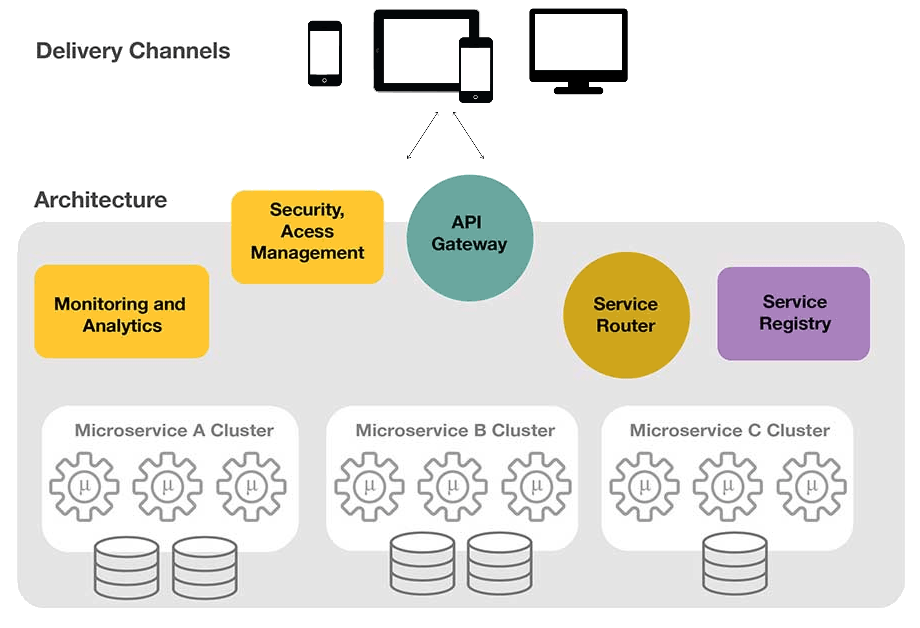
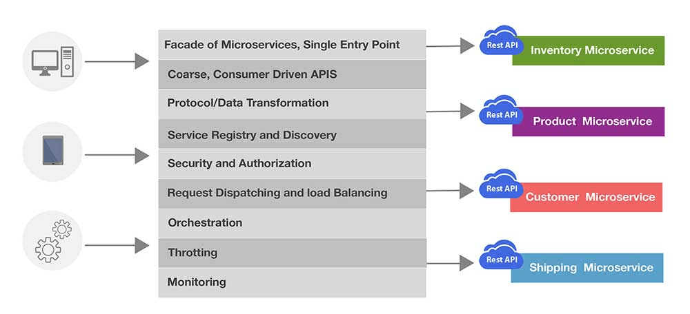
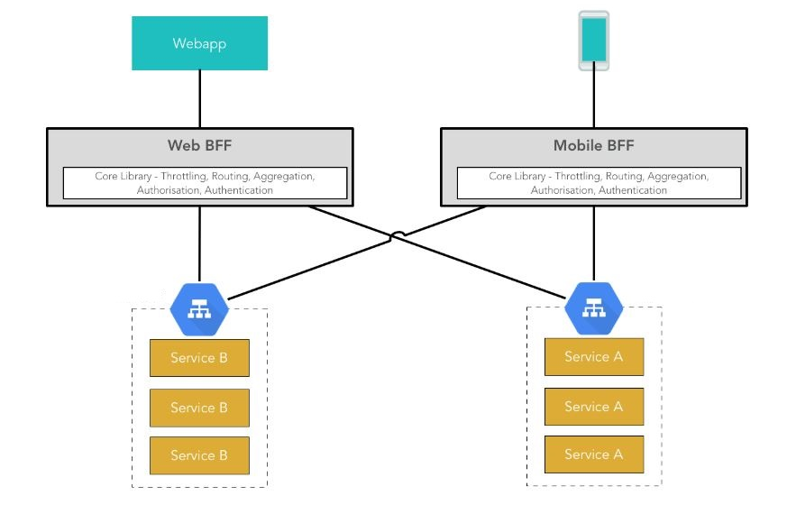

### API Gateway

API Gateway provides a single and unified API entry point across one or more internal APIs. It mediates, routes, and invokes a respective endpoint after request verification, content filtering, authentication, and authorization. It is an essential element of cloud-native architectures. The API gateway hides the diversity of protocols from multiple background microservices. It provides a common API for each client and microservice. An API gateway is responsible for request routing, composition, and protocol translation. It also has other functionalities, such as authentication, monitoring, load balancing, caching, request shaping and management, and static response handling.

The API Gateway is a unified proxy interface delegating the calls to several microservices-based on the URL pattern. An API Gateway mechanism is an optimization necessary to implement the common aspects of a microservice architecture, such as [CORS](https://pradeeploganathan.com/rest/what-is-cors/), authentication, security, and monitoring, This helps from not having to implement these aspects into all API services, and to centralize these concerns across all microservices.

An API gateway also insulates clients from the application. The microservices can be partitioned into multiple related blocks. Multiple backend microservices and data sources can be orchestrated on a need basis to produce an improved experience. Any kind of microservice refactoring, re-platforming, and retrofitting does not have any negative impact on clients. The API gateway also enables clients to retrieve data from multiple services and sources with a single round-trip operation. Fewer requests also mean less overhead and improve the user experience.

API Gateway Design

An API gateway can route requests either by proxying/routing requests to the appropriate microservice or by scattering them to multiple microservices.

#### API Gateway - Benefits

An API gateway provides the following benefits:

- Clients don't need to worry about resolving the location of each microservice instance
- It can provide a custom API for each client.
- It reduces unnecessary network roundtrips. by enabling a client to make a single request for specific data from multiple microservices
- It provides the flexibility to merge two or more services as a single service, or even split a single service into two or more services
- It supports protocol diversity as well as client device diversity
- It can centralize cross-cutting concerns, such as security, monitoring, rate limiting etc.
- API Gateway is an Edge microservice and is independently scalable.

API Gateway functionality

#### API Gateway - Overheads

On the other hand, deploying an API gateway brings in certain limitations such as

- API gateways are edge applications, which must be developed, deployed, and managed.
- It increases the response time due to additional processing at the gateway.
- It could become a single point of failure if the proper measures are not taken.

#### API Gateway - Functionality

An API gateway generally provides the following functionality, although some API gateways may provide some additional functionality.

- Request Aggregation
- Request Routing
- Request offloading
- Rate Limiting
- Load Balancing
- Authentication/Authorization
- Distributed Tracing
- Quality of Service

##### Request Aggregation

API Gateways can be used to implement Request aggregation pattern. This pattern aggregates multiple individual requests to backend services into a single request. This pattern is especially useful when a client must make multiple requests to different microservices to perform an operation as a unit of work. By aggregating the unit of work into a single request to the gateway, we reduce latency, providing a better client experience. The API Gateway partitions a single client request to multiple microservices and aggregates the data before sending it back to the consumer. It may even transform the data before sending the response back.

##### Request Routing

API gateways implement request routing pattern. This pattern is especially useful when a client needs to consume multiple services across multiple endpoints. The client would now need to manage multiple end points and manage client-side configuration and operations across these endpoints. We can use request routing to setup an OSI layer 7 routing service to expose a single endpoint and route requests to the appropriate instances. Request routing also provides flexibility for introducing new functionality. When an updated version of a service is deployed, we can route requests to the updated version for only a subset of clients. If this partial deployment goes well, we can subsequently roll out the latest version to everyone.

##### Request Offloading

An API Gateway can offload cross cutting concerns from services making them lean and focused on providing business functionality. All services provide for infrastructure related concerns such as SSL termination, CORS, Token validation, Authentication/Authorization, logging, auditing etc. Most of this functionality requires specialized knowledge and skill to implement and get it right. It is a good practice to consolidate these services into the gateway to reduce overhead and the chance for errors. The API Gateway can also provide additional functionality such as caching, compression, protocol conversion etc.

##### Rate Limiting

Rate limiting provides the ability to limit the number of requests a client can make based on a rate/quota definition. A Throttling filter enables you to limit the number of requests that pass through the API Gateway instances over a specified time period. The throttling filter definition can be per second (rate) or per day/week/month (Quota). Rate limiting is applied to maintain high availability and fair use of services, to prevent denial-of-service attacks (DoS) and to constrain the costs of resource usage. This is especially useful to protect your system from resource starvation caused by clients flooding your system with requests. This can also be used in high volume elastic deployments, where dynamic topology changes can destabilize back-end servers. Rate limiting can also be used to restrict usage of APIs by specific user categories (free tier vs premium tier) to monetize APIs. If rate limits are exceeded, the API gateway will reject additional requests, most commonly returning a “Too Many Requests” HTTP 429 status code to the calling client.

##### Load Balancing

An API Gateway can act as a load balancer to handle client requests efficiently. It can keep track of the request load directed to different nodes of a service. It can use this information to load balance between the different nodes of that service. The requests can be load balanced based on service (host header), API method (Get, Post, Put) and even URL parameters. This provides massive flexibility and power compared to traditional load balancers. Load balancing support provided by Tyk is listed [here](https://tyk.io/docs/planning-for-production/ensure-high-availability/load-balancing/) and support by Nginx is listed [here](https://www.nginx.com/blog/consolidating-your-api-gateway-and-load-balancer-with-nginx/).

##### Quality of Service

An API gateway can define metrics of requirements for ensuring service availability, performance, integrity, and reliability. These metric definitions are called as QoS policies. QoS policies can be attached to specific services managed by the API gateway. QoS policies make use of patterns such as [Circuit Breaker](https://pradeeploganathan.com/patterns/circuit-breaker-pattern/), [Bulkhead Isolation](https://pradeeploganathan.com/patterns/bulkhead-isolation/) etc. to provide necessary reliability and fault tolerance.

### Backend for Frontend (BFF)

Another interesting aspect of API gateway is the ability to provide an interaction point which is optimized to the caller and redirect all callers to their optimized entry point. For. e.g. A mobile device may ideally want to get all information in a single API call rather than firing multiple API calls. At the same time, a SPA web client may want to have a chatty interface and make multiple calls to get the same information. This distinction may be due to their network characteristics. This can be handled using an API gateway by using a pattern called Backed for Front ends (BFF).

API Gateway - BFF

[Netflix ZUUL](https://github.com/Netflix/zuul) , [Tyk](https://tyk.io/api-gateway/open-source/), [Mashape Kong](https://github.com/Kong/kong) , [Ocelot](https://github.com/ThreeMammals/Ocelot) are well known opensource API Gateways.

> Photo by [Azlan Baharudin](https://unsplash.com/photos/-XBAEOR2ysM?utm_source=unsplash&utm_medium=referral&utm_content=creditCopyText) on [Unsplash](https://unsplash.com/search/photos/gate?utm_source=unsplash&utm_medium=referral&utm_content=creditCopyText)
