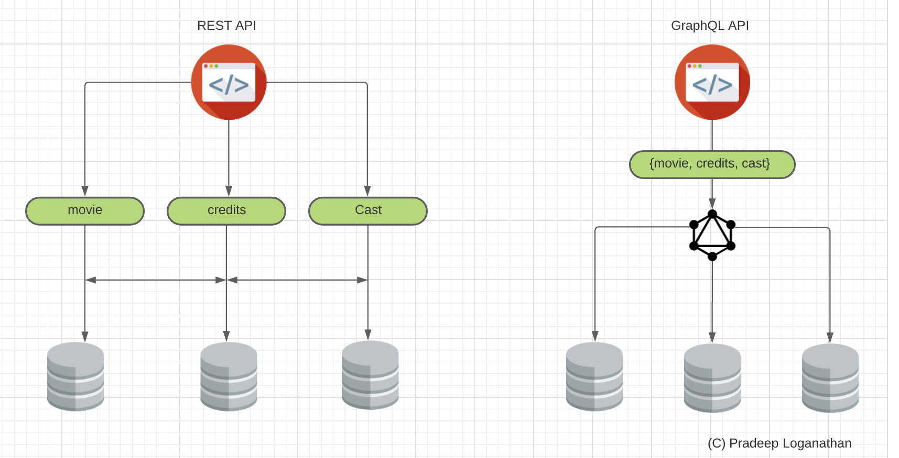

GraphQL is a query language for APIs. It is a query language that provides for client-tailored queries. It is an API specification. It is also a runtime designed for fulfilling these queries. [REST APIs](https://pradeeploganathan.com/rest/identifying-resources-and-designing-representations/), adhere to the requirements dictated by the server in the form of an API contract, GraphQL APIs respond to client queries with a response that adheres to the shape of the query specified by the client. GraphQL service is transport agnostic but is typically served over HTTP.

GraphQL was developed by Lee Byron, Nick Schrock, and Dan Schafer at Facebook in 2012. It was shared with the broader community in 2015 and is now governed through the GraphQL foundation. You can read more about it here… [Introducing the GraphQL Foundation (leebyron.com)](https://leebyron.com/introducing-the-graphql-foundation/)

### Shortcomings of REST

GraphQL is not a replacement for REST API’s, it complements a REST API by compensating for some of the drawbacks of using the [REST specification](https://pradeeploganathan.com/rest/what-is-rest/). (I have also seen some teams replace the REST design completely with a GraphQL approach.) Some of the drawbacks of REST API’s are

### Overfetching

Overfetching happens when an API sends data that is not required by a client. This happens since the API spec is defined in advance and sometimes to cater to a broad range of data needed by the client. This results in wasted bandwidth and processing power. For e.g., a /movies/movie\_id endpoint may provide over fifty attributes of a movie. If a mobile application which only needs the movie name and genre of this movie calls this end point, it will still get all the attributes that it does not need.

```shell
    GET https://api.themoviedb.org/3/movie/550/
```

```json
{
   "adult":false,
   "backdrop_path":"/rr7E0NoGKxvbkb89eR1GwfoYjpA.jpg",
   "belongs_to_collection":null,
   "budget":63000000,
   "genres":[
      {
         "id":18,
         "name":"Drama"
      }
   ],
   "homepage":"http://www.foxmovies.com/movies/fight-club",
   "id":550,
   "imdb_id":"tt0137523",
   "original_language":"en",
   "original_title":"Fight Club",
   "overview":"A ticking-time-bomb insomniac and a slippery soap salesman channel primal male aggression into a shocking new form of therapy. Their concept catches on, with underground \"fight clubs\" forming in every town, until an eccentric gets in the way and ignites an out-of-control spiral toward oblivion.",
   "popularity":49.901,
   "poster_path":"/pB8BM7pdSp6B6Ih7QZ4DrQ3PmJK.jpg",
   "production_companies":[
      {
         "id":508,
         "logo_path":"/7PzJdsLGlR7oW4J0J5Xcd0pHGRg.png",
         "name":"Regency Enterprises",
         "origin_country":"US"
      },
      {
         "id":711,
         "logo_path":"/tEiIH5QesdheJmDAqQwvtN60727.png",
         "name":"Fox 2000 Pictures",
         "origin_country":"US"
      },
      {
         "id":20555,
         "logo_path":"/hD8yEGUBlHOcfHYbujp71vD8gZp.png",
         "name":"Taurus Film",
         "origin_country":"DE"
      },
      {
         "id":54051,
         "logo_path":null,
         "name":"Atman Entertainment",
         "origin_country":""
      },
      {
         "id":54052,
         "logo_path":null,
         "name":"Knickerbocker Films",
         "origin_country":"US"
      },
      {
         "id":25,
         "logo_path":"/qZCc1lty5FzX30aOCVRBLzaVmcp.png",
         "name":"20th Century Fox",
         "origin_country":"US"
      },
      {
         "id":4700,
         "logo_path":"/A32wmjrs9Psf4zw0uaixF0GXfxq.png",
         "name":"The Linson Company",
         "origin_country":"US"
      }
   ],
   "production_countries":[
      {
         "iso_3166_1":"DE",
         "name":"Germany"
      },
      {
         "iso_3166_1":"US",
         "name":"United States of America"
      }
   ],
   "release_date":"1999-10-15",
   "revenue":100853753,
   "runtime":139,
   "spoken_languages":[
      {
         "english_name":"English",
         "iso_639_1":"en",
         "name":"English"
      }
   ],
   "status":"Released",
   "tagline":"Mischief. Mayhem. Soap.",
   "title":"Fight Club",
   "video":false,
   "vote_average":8.4,
   "vote_count":21642
}
```

Overfetching can be solved either by specifying the fields required in the HTTP request using query parameters. However, this does not scale well in complex scenarios. Another option is to create a BFF (Backend for Frontend). BFF’s are API’s which provide a facade around a backend API and are customized for a specific front end. In the above example we can use a BFF to provide a facade around the /products endpoint called maybe /mobile-products and allow mobile clients to call a /mobile-products endpoint which only provides the two fields that the mobile clients are interested in. This causes proliferation of BFF’s based on client applications.

### Underfetching



Underfetching is when an API response does not have the necessary data. The client may have to call multiple endpoints and correlate them to get the necessary data. This also results in wasted bandwidth and performance issues due to multiple requests to the server. If I want to fetch a movie name and biographies of its cast members, then I will need to issue two calls. The first one to get the movie name and it cast identifiers from the movie end point as below.

```shell
GET https://api.themoviedb.org/3/movie/550/credits
```

```json
{
   "id":550,
   "cast":[
      {
         "adult":false,
         "gender":2,
         "id":819,
         "known_for_department":"Acting",
         "name":"Edward Norton",
         "original_name":"Edward Norton",
         "popularity":4.26,
         "profile_path":"/5XBzD5WuTyVQZeS4VI25z2moMeY.jpg",
         "cast_id":4,
         "character":"The Narrator",
         "credit_id":"52fe4250c3a36847f80149f3",
         "order":0
      },
      {
         "adult":false,
         "gender":2,
         "id":287,
         "known_for_department":"Acting",
         "name":"Brad Pitt",
         "original_name":"Brad Pitt",
         "popularity":19.61,
         "profile_path":"/oTB9vGIBacH5aQNS0pUM74QSWuf.jpg",
         "cast_id":5,
         "character":"Tyler Durden",
         "credit_id":"52fe4250c3a36847f80149f7",
         "order":1
      }
   ]
}
```

The above call results in the movie details and identifiers which can be used to query for biographies of its cast members. If I want more details about Brad Pitt who is cast as Tyler Durden in the movie, I need to issue another call to the person endpoint with the person\_id 819 obtained previously as below.

```shell
    GET https://api.themoviedb.org/3/person/819
```

```json
{
   "adult":false,
   "also_known_as":[
      "برد پیت",
      "Бред Пітт",
      "Брэд Питт",
      "畢·彼特",
      "ブラッド・ピット",
      "브래드 피트",
      "براد بيت",
      "แบรด พิตต์",
      "William Bradley \"Brad\" Pitt",
      "William Bradley Pitt",
      "Μπραντ Πιτ",
      "布拉德·皮特",
      "Breds Pits",
      "ബ്രാഡ് പിറ്റ് "
   ],
   "biography":"William Bradley Pitt is an American actor and film producer. He has received multiple awards, including two Golden Globe Awards and an Academy Award for his acting, in addition to another Academy Award and a Primetime Emmy Award as producer under his production company, Plan B Entertainment. Pitt first gained recognition as a cowboy hitchhiker in the road movie Thelma & Louise (1991). His first leading roles in big-budget productions came with the drama films A River Runs Through It (1992) and Legends of the Fall (1994), and the horror film Interview with the Vampire (1994). He gave critically acclaimed performances in the crime thriller Seven (1995) and the science fiction film 12 Monkeys (1995), the latter earning him a Golden Globe Award for Best Supporting Actor and an Academy Award nomination. Pitt starred in Fight Club (1999) and the heist film Ocean's Eleven (2001), as well as its sequels, Ocean's Twelve (2004) and Ocean's Thirteen (2007). His greatest commercial successes have been Ocean's Eleven (2001), Troy (2004), Mr. & Mrs. Smith (2005), World War Z (2013), and Once Upon a Time in Hollywood (2019), for which he won a second Golden Globe Award and the Academy Award for Best Supporting Actor. Pitt's other Academy Award nominated performances were in The Curious Case of Benjamin Button (2008) and Moneyball (2011). He produced The Departed (2006) and 12 Years a Slave (2013), both of which won the Academy Award for Best Picture, and also The Tree of Life (2011), Moneyball (2011), and The Big Short (2015), all of which were nominated for Best Picture. As a public figure, Pitt has been cited as one of the most influential and powerful people in the American entertainment industry. For a number of years, he was cited as the world's most attractive man by various media outlets, and his personal life is the subject of wide publicity. From 2000 to 2005, he was married to the actress Jennifer Aniston, and from 2014 to 2019, he was married to the actress Angelina Jolie. Pitt and Jolie have six children together, three of whom were adopted internationally.",
   "birthday":"1963-12-18",
   "deathday":null,
   "gender":2,
   "homepage":null,
   "id":287,
   "imdb_id":"nm0000093",
   "known_for_department":"Acting",
   "name":"Brad Pitt",
   "place_of_birth":"Shawnee, Oklahoma, USA",
   "popularity":19.61,
   "profile_path":"/oTB9vGIBacH5aQNS0pUM74QSWuf.jpg"
}
```

This is inefficient as I need to make two network round trips for associated data. The client now needs to correlate data across multiple network calls and handle for errors. This makes the client more complex.

### N + 1 problem

Underfetching also results in the N +1 problem. The N + 1 problem occurs when we need to fetch the children in a parent child relationship. Let us look at a scenario which requires us to display the last three books published by a list of authors in our system. Let us assume that we have /authors end point which lists all authors and a /authors/author\_id/books endpoint which list all books written by an author. To list the latest three books published by all the authors the client code will need to initially call the author endpoint to get a list of all author\_id’s. It will then have to loop through the author\_id’s and call the books endpoint multiple times for each author\_id. It may then have to additionally maybe sort & filter to get the last three books published. Thus, if we have N authors in our system, we need to do N + 1 calls to get the last 3 books published by them all. This results in the backend being flooded by a lot of calls to fetch the many (children) parts of the parent child relationship. This can be detrimental in large systems and can result in massive performance issues. On the client side it results in slower user experience. This can be resolved by fetching all the data as a single query.

GraphQL solves the above problems as it allows the client to specify the data that it needs. This allows the client to get the exact data needed in a single call to the server.

GraphQL and REST both share the same transport protocol (HTTP) and the same data representation format (JSON), they offer different approaches for querying data. Thus, GraphQL can be used to complement a REST API rather than replacing it entirely.

### GraphQL Specification

REST is an architectural style. It specifies an architectural pattern. In contrast GraphQL is a specification that both the client and the server can reference and agree on. The specification is listed [here](https://spec.graphql.org/June2018/). The specification defines the GraphQL language syntax and a server-side runtime layer specification, The GraphQL language syntax defines the syntax of the queries and how the server should execute and respond to queries. The language specification defines a query language that allows for clients to query for data consistently and define the structure of the response payload. The specification also defines the GraphQL Schema definition language (SDL). The SDL defines the structure and behavior of a GraphQL Service. The specification defines structure using type definitions and fields. It then defines how operations can be performed on types. This is implemented using resolver functions. The specification defines the root operations such as query, mutation, and subscription.

The GraphQL server loads the GraphQL Schema on instantiation and builds the type schema as defined, allowing clients to execute operations against the schema. The GraphQL Server is also responsible for parsing, validating, and executing queries.

### Types

A type is an Object for e.g., a Customer, a Product etc. A simple example of a Customer type is below

```
type Customer {
   firstName: String!
   lastName: String!
   .....
   .....
   
}
```

This Customer type represents the structure of a customer model. An object of this type has a firstName, lastName and many other fields. The exclamation mark at the end of the field means that it cannot be empty. When a client requests for a customer type the server, response includes the fields specified in the type.

Types are the building blocks of GraphQL and represent the core concepts exposed by the API. However, unlike REST API’s we can model richer types using GraphQL with complex relationships to other types. As an example, the customer type above can be designed to have type-based references to orders, carts etc. This allows the clients to traverse a graph of connected objects by referencing customer.orders , order.customer or cart.customer.

```
type Customer {
   firstName: String!
   lastName: String!
   .....
   .....
   orders: [Order!]!
   carts:  [Cart!]!
}

type Order {
   orderId:  String!
   .....
   .....
   customer: Customer!
}

type Cart {
   cartId: String!
   .....
   .....
   customer: Customer!
}
```

Fields represent attributes of a type. Each field has a datatype. The datatype can be scalar types such as String, Integer, Float etc., or a complex type such as Order, list of Orders, Customer, Cart etc. A field can also be a custom scalar type or an enumeration.

### Arguments

Arguments can be passed into a GraphQL Operation. One or many arguments can be passed into an operation. The datatypes of the arguments can be simple scalars or complex types.

### Operations

GraphQL Supports four types of operations Query, Mutation, Subscription, and Introspection. Let us look at each of them.

#### Query

A query is an operation that is used to retrieve data. A query can be defined as follows

```
query OrderDetailsQry {
  order {
   orderId
   customerId
   .........
  }
}
```

The query specifies the keys whose values are to be retrieved. A query can be built to have arguments, use variables, and provide for logical grouping using fragments. The response to a query will start with a data key. Reponses with errors start with the errors key. The response to a query can contain both a data and error key. An example of a successful response is below.

```
{
   "data" {
       "order": {
          "orderId" : "123-SRVF-235",
          "customerId" : "4546-ADSDF-232",
          ........
          ........ 
        }
   }
}
```

#### Mutation

Mutations are used to perform changes to data that affect state. This includes creation, updates, and deletion of data. This is similar to the Post, Put, and Delete REST verbs. A mutation that creates orders can be defined as below. It takes a bunch of arguments necessary to create the order starting with customerid.

```
mutation createOrderMutation {
  createorder (customerId: "3676-AFRMK-356",.....){
    orderId
    customerId
  }
}
```

If this mutation is successful, it will return an Order type containing details of the order that was created and we select the orderid and the customerid. In case of a failure the mutation would return an error in the json response.

#### Subscription

Subscriptions provide for real time update pushed out from the server. A subscription allows a client to listen to a GraphQL API for real time updates. Subscriptions allow for bi-directional communication. For example, if a client wants to be notified of changes to an order, then we can define a subscription as below

```
subscription {
  orderStatusChange {
    orderId
    customerId
    .....
    sentAt
  }  
}
```

When the above subscription is initiated by the client it opens a channel where the server will send real time updates whenever the order status is updated. To stop listening to order updates the client can unsubscribe which closes the channel, and no further updates will be sent.

#### Introspection

Introspection provides the ability to query the API’s schema. This operation allows the client to understand the types exposed by the API, the fields available and the corresponding metadata. This allows GraphQL to validate queries before executing them. Introspection allows for a rich tooling to be built to dynamically introspect and execute queries.
