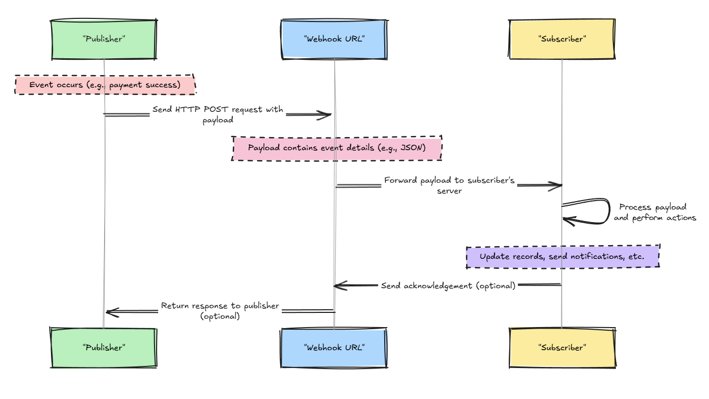

## Introduction

In the ever-evolving landscape of Cloud native applications, real-time communication between applications has become increasingly critical. Webhooks have emerged as a powerful solution to this challenge, offering a lightweight and efficient mechanism for applications to stay synchronized and respond instantly to events.

Webhooks are a method for enabling real-time communication between applications by sending automated HTTP requests to a specified URL when certain events occur. They act as a "reverse API," where instead of an application polling for updates, the server actively pushes updates to a client application. This eliminates unnecessary requests, reduces latency, and optimizes resource utilization .   

The key problem webhooks solve is the inefficiency and latency caused by constant polling. Traditionally, applications would repeatedly query an API to check for updates, which wastes resources and increases latency. Webhooks eliminate this by delivering updates only when specific events are triggered, ensuring timely and efficient communication.

In modern web development, webhooks have grown in importance due to their ability to streamline integrations, improve responsiveness, and reduce server load. As applications become more interconnected and event-driven architectures gain traction, webhooks play a crucial role in enabling seamless interactions across platforms. In this blog post will explore the technical intricacies of webhooks, their benefits over traditional methods, and their integration with various API architectures.

## How Webhooks Work

Webhooks operate on a publisher-subscriber model to facilitate real-time communication. In this model the application triggering an event (the publisher) sends data to another application (the subscriber) in real time. This relationship allows for efficient and timely communication between systems.

### Typical Webhook Workflow


Here's a breakdown of the typical webhook workflow:

* **Publisher**: The application or service responsible for generating events (e.g., a payment gateway). When an event of interest occurs, the publisher initiates a webhook process.
   - Example: Stripe processes a payment and triggers a `payment_success` event.

* **Webhook URL**: A unique, preconfigured endpoint provided by the subscriber. This is where the publisher sends event details. The URL must be publicly accessible and capable of handling incoming requests.
   - Example: `https://example.com/webhooks/payment-success`.

* **Payload**: The data sent by the publisher to the webhook URL, typically in JSON format. It contains details about the event, such as the type of event and relevant metadata.
   - Example Payload:
     ```json
     {
       "event": "payment_success",
       "transaction_id": "abc123",
       "amount": 49.99,
       "currency": "USD"
     }
     ```

* **Subscriber**: The application or service that owns the webhook URL and receives the payload. The subscriber processes the incoming data and performs actions like updating records or sending notifications.
   - Example: A subscriber updates its internal database to mark a payment as successful and sends a receipt email.
 
### Security Considerations

Webhooks require robust security practices to prevent unauthorized access or malicious activities. HTTPS ensures secure communication, and authentication mechanisms like signatures or tokens verify the legitimacy of requests.

- **[HTTPS]()**: Ensure that all webhook communication occurs over [HTTPS]() to encrypt data in transit.
- **Authentication**: Use secret tokens or API keys included in headers to verify the authenticity of incoming requests.
- **Signature Verification**: Implement HMAC (Hash-based Message Authentication Code) or similar methods to validate that the payload hasn't been tampered with.
- **IP Whitelisting**: Restrict incoming requests to known IP ranges associated with the publisher.

By understanding and implementing these components, developers can ensure their webhook systems are reliable, secure, and efficient.


## Architectural Deep Dive

Implementing webhooks effectively requires careful consideration of architectural patterns to ensure reliability, scalability, and security.  Here's a deep dive into some key aspects:

### Asynchronous Processing and Queuing Mechanisms

Processing webhooks asynchronously is crucial for scalability and responsiveness. Instead of processing the webhook payload immediately, the receiving application acknowledges receipt and queues the webhook for background processing . This prevents delays and ensures that the publisher is not blocked while the subscriber processes the event.   

Message queues, such as RabbitMQ or Kafka, play a vital role in asynchronous processing. They provide a reliable mechanism for storing and managing webhook messages, ensuring that they are processed in the correct order and without loss 

### Error Handling and Retry Strategies

Transient errors, such as network issues or temporary service unavailability, can occur during webhook delivery. Implementing robust error handling and retry mechanisms is essential to ensure data consistency and prevent message loss .   

Exponential backoff is a common retry strategy, where the delay between retries increases exponentially after each failure. This helps prevent overloading the receiving system and allows time for temporary issues to resolve.

### Security Considerations

Security is paramount in webhook implementations. Here are some key considerations:

* **Encryption:** Always use HTTPS to encrypt communication between the publisher and subscriber, protecting sensitive data in transit .   
* **Authentication:** Implement authentication mechanisms, such as HMAC-based signatures or API keys, to verify the origin of webhook requests and prevent unauthorized access .   
* **Payload Validation:** Validate the webhook payload to ensure it conforms to the expected format and prevent malicious data from affecting your application .

An example of payload validation using HMAC signatures is below

```csharp
    using System;
    using System.Security.Cryptography;
    using System.Text;

    public static class WebhookSecurity
    {
        public static bool VerifySignature(string payload, string signature, string secret)
        {
            using (var hmac = new HMACSHA256(Encoding.UTF8.GetBytes(secret)))
            {
                var computedHash = hmac.ComputeHash(Encoding.UTF8.GetBytes(payload));
                var computedSignature = BitConverter.ToString(computedHash).Replace("-", "").ToLower();
                return computedSignature == signature;
            }
        }
    }
```

## Webhooks vs. Traditional Methods

Webhooks are a modern approach to real-time communication, offering distinct advantages over traditional methods such as polling and other communication technologies like server-sent events (SSE).

### Polling

In polling, the client application repeatedly sends requests to the server to check for updates . This approach can be inefficient, as it consumes resources even when no new data is available . The frequency of polling determines how "real-time" the updates are, but frequent polling increases server load and can lead to delays .

### Server-Sent Events (SSEs):

SSEs are another mechanism for server-to-client communication. They provide a unidirectional channel for the server to push updates to the client . However, unlike webhooks, SSEs are not suitable for bi-directional communication . They are also less flexible than webhooks, as they are limited to server-to-client communication and require a persistent connection .

### Advantages of Webhooks:

* Efficiency: Webhooks reduce resource consumption by eliminating unnecessary requests. Unlike polling, webhooks send data only when an event occurs, reducing unnecessary requests and conserving resources.
* Real-time Updates: Webhooks deliver updates instantly, enabling applications to react to events in real-time .   
* Reduced Latency: Events are pushed immediately, avoiding the delays inherent in polling intervals.
* Simplicity: Webhooks use standard HTTP protocols, making them easy to implement and integrate.

### Comparison of Webhooks, Polling, and SSE

Webhooks offer a more efficient and real-time solution for event-driven communication compared to traditional polling and SSEs. They are particularly well-suited for applications that require instant updates and seamless integration between different systems. By combining efficiency and real-time updates, webhooks have become the preferred method for many modern applications, complementing or replacing traditional methods in scenarios where timely event handling is critical.

| Feature                | Webhooks                              | Polling                               | Server-Sent Events (SSE)            |
|------------------------|---------------------------------------|---------------------------------------|-------------------------------------|
| **Communication Type** | Event-driven, push-based              | Request-driven, pull-based            | Push-based                          |
| **Latency**            | Low                                  | High (depends on polling interval)    | Low                                 |
| **Efficiency**         | High (events sent only when needed)  | Low (constant requests waste resources)| High (open connection)              |
| **Scalability**        | Scales well with proper architecture | Limited by server load                | Limited by open connections          |
| **Use Case**           | Asynchronous event notifications     | Periodic updates                      | Real-time streaming                 |
| **Protocol**           | HTTP POST                            | HTTP GET                              | HTTP (persistent connection)        |
| **State Maintenance**  | Stateless                            | Stateless                            | Stateful                            |


## Webhooks and API Architectures

Webhooks can be seamlessly integrated with various API architectures, enhancing their functionality and enabling real-time communication. Here's how webhooks complement different API styles:


### [REST APIs]()

Webhooks are a valuable addition to [RESTful architectures](), providing a mechanism for real-time notifications . While REST APIs primarily rely on a request-response model for retrieving and modifying data, webhooks enable servers to proactively push updates to clients whenever specific events occur . This eliminates the need for clients to continuously poll the server for changes, improving efficiency and reducing latency . For example, in an e-commerce application, a webhook can notify a customer's order management system about shipment updates without requiring the system to repeatedly check the shipping provider's API.   

### [GraphQL]()

Webhooks can be integrated with [GraphQL]() to provide real-time updates to subscribed clients . When an event occurs that affects data a client is interested in, a webhook can trigger a [GraphQL]() subscription, delivering the updated data to the client instantly . This allows for efficient and targeted real-time updates without the overhead of continuous polling. For example, in a social media application, a webhook can notify a user's newsfeed about new posts from their friends in real-time.   

### [gRPC]()

While [gRPC]() is typically used for low-latency, synchronous communication, webhooks can be used in [gRPC]() for specific event-driven scenarios . By leveraging webhooks, [gRPC]() services can provide asynchronous notifications without affecting their core functionality . This can be useful for events that don't require an immediate response or involve long-running processes. For example, in a financial application, a [gRPC]() service can use a webhook to notify a user about the completion of a long-running transaction.   

In essence, webhooks act as a bridge between different API architectures, enabling real-time communication and enhancing the functionality of existing systems. By understanding how webhooks integrate with REST APIs, GraphQL, and gRPC, developers can build more efficient, responsive, and interconnected applications.

## Webhooks as an Extension Mechanism

Webhooks are a powerful tool for extending the functionality of your platform and integrate seamlessly with external systems. By providing webhooks, you enable external developers to build integrations and custom solutions that leverage real-time data and events from your application. It enables you to foster a thriving ecosystem of tools and services. It emppwers them to extend the functionality of your platform, attracting new users and driving adoption . Well designed webhooks can handle a large volume of events without impacting the performance of your core application. This is crucial for supporting a growing ecosystem of integrations and extensions.

When external developers can tap into the events happening on your platform, they can create integrations that enhance your core capabilities without requiring changes to the underlying system. This allows developers to build integrations without needing deep knowledge of your internal systems or requiring tight integration with your codebase .This decoupled design not only improves scalability but also accelerates innovation by inviting collaboration from the wider developer community.

For instance, an e-commerce platform can use webhooks to notify logistics partners about new orders or inventory updates. Similarly, CI/CD tools rely on webhooks to trigger pipelines or notify teams of build statuses. Content Management Systems (CMS) leverage webhooks to integrate with external analytics tools or AI-powered content enhancers. Each of these scenarios demonstrates the extensibility and adaptability that webhooks bring to modern applications.

## Real-World Applications

Several industry leaders illustrate how webhooks have transformed their platforms into robust ecosystems:

* **GitHub:** Webhooks notify users of pull request updates, issue changes, and repository events, automating workflows for millions of developers.
* **Stripe:** Merchants receive real-time updates on payment statuses, disputes, and account changes, enabling streamlined financial operations.
* **Slack:** Webhooks power integrations for sending custom notifications and commands, enhancing collaboration and team productivity.

## Best Practices for Extensible Webhook Systems

Building a successful webhook system requires careful attention to documentation, security, and reliability. Comprehensive documentation with clear examples ensures that developers can easily integrate with your platform. Security measures such as HTTPS, secret tokens, and signature verification protect both your system and the subscribers' applications.

Versioning is another critical aspect. As your platform evolves, maintaining backward compatibility through versioned endpoints prevents disruptions for existing integrations. Finally, monitoring and logging webhook deliveries provide subscribers with insights into their integration's performance, helping them debug issues proactively.

By offering these capabilities, platforms can transform their webhooks into powerful extension mechanisms that drive innovation, scale effortlessly, and foster a dynamic ecosystem of integrations.

## Challenges of Webhooks

While webhooks are a powerful tool for real-time communication, they come with several challenges that developers and organizations must address to ensure reliable and secure implementations.

One of the primary challenges is **delivery reliability**. Since webhooks rely on HTTP requests, issues such as network failures or subscriber downtime can result in undelivered events. To address this, publishers often implement retry mechanisms with exponential backoff. However, retries can lead to **duplicate events**, requiring subscribers to handle idempotency carefully by using unique event identifiers to prevent processing the same event multiple times.

**Security** is another critical consideration. Webhooks are exposed over the internet, making them susceptible to unauthorized access and malicious attacks. To mitigate this, publishers and subscribers must enforce security best practices, such as encrypting data with HTTPS, verifying requests using HMAC signatures or tokens, and restricting incoming requests to whitelisted IPs.

Scalability can also pose a challenge, especially for subscribers receiving a high volume of webhook events. Immediate processing of these events can overload the system and lead to delays. Introducing queuing systems like RabbitMQ or Kafka can offload processing to background workers, ensuring responsiveness and scalability even during peak loads.

A lack of **standardization** in webhook implementations further complicates integrations. Different platforms use varying payload structures, authentication methods, and retry strategies, increasing the burden on developers building integrations. Clear, consistent documentation and adherence to common conventions can help address this issue and improve the developer experience.

Finally, **debugging and monitoring** webhook delivery can be challenging without proper tooling. Issues such as failed deliveries, incorrect payloads, or unexpected responses may require extensive troubleshooting. Logging webhook requests, responses, and delivery attempts, coupled with tools for replaying events, can make debugging easier and provide insights into the system's performance.

By thoughtfully addressing these challenges, you can harness the true potential of webhooks and build secure, scalable, and future-proof communication channels for your applications.endeavors.

## Conclusion

Webhooks have revolutionized the way applications communicate in real time, providing an efficient, event-driven alternative to traditional polling methods. By enabling instant updates and seamless integrations, webhooks empower developers to build responsive, scalable, and interconnected systems. 

However, as with any powerful tool, implementing webhooks effectively requires careful consideration of challenges such as delivery reliability, security, and scalability. By adhering to best practices and addressing potential pitfalls, developers can create robust webhook systems that enhance the functionality of their platforms while maintaining security and performance.

As modern software development continues to embrace event-driven architectures, webhooks will remain a cornerstone of real-time communication. Whether you're designing a new system or enhancing an existing one, webhooks provide a versatile and efficient mechanism for integrating with external systems and fostering innovation.


 