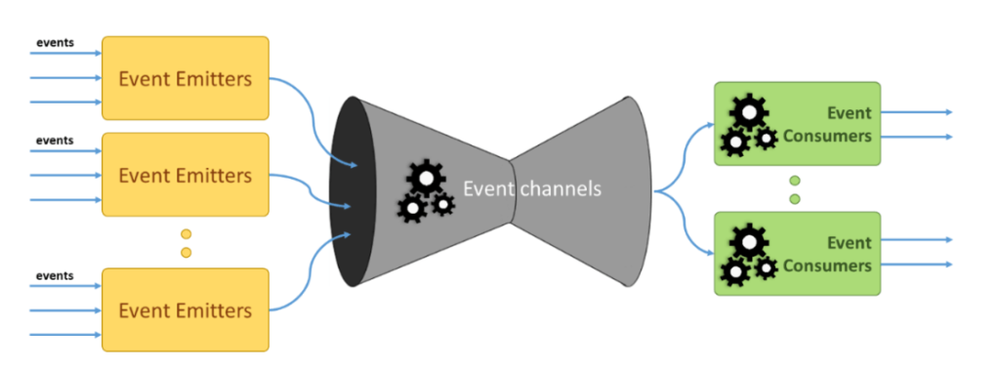
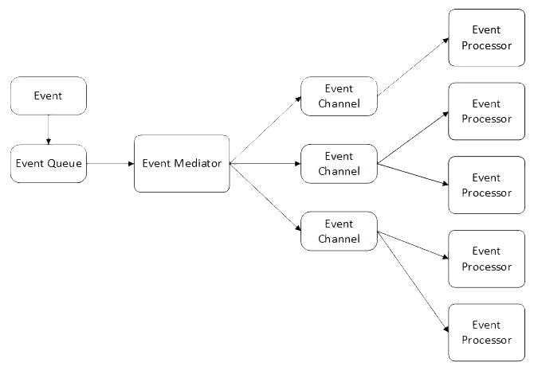
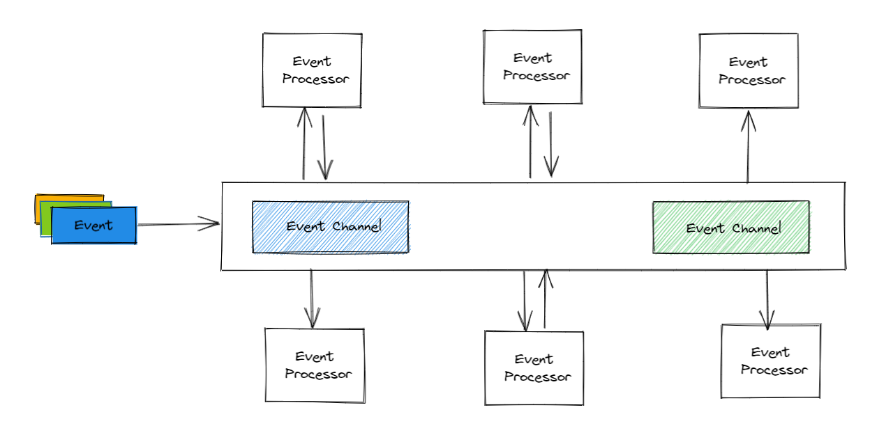

## Introduction

Event driven architecture (EDA) is an architectural paradigm where behavior is composed by reacting to events. In this paradigm events imply a significant change in state. This allows you to create a systems architecture in which the flow of information is determined by events. In an Event-Driven architecture state changes flow through endpoints , events, and the actors are ephemeral and stateless. This creates a separation of logic from data, cache, and state. Event-driven architecture is also sometimes referred to as message-driven architecture or stream processing architecture based on its variations.

A message bus serves as the event delivery mechanism. Services listen on Topics in the message queue, consume new messages, and then react to them. The main advantage of this design is that functional domains are loosely coupled. They do not explicitly refer to each other. The producer of an event does not have any knowledge regarding the event subscribers or what actions may take place as a result of the event. This allows different groups of services to be developed in their own cadence. Furthermore, it minimizes the need for highly coordinated and risky big-bang releases. If behavior needs to be extended so that new systems can react to events, the original plumbing and existing consuming components remain unaffected.

### Events

An event refers to a significant change in state and is an implicit fact in the system. Events do not exist in isolation. An event can be described as:

- **Atomic** - A simple indisputable fact indicating that something happened (Quote Created, Email Sent, Order Dispatched)
- **Related** - A stream or sequence of atomic events (tracking a pricing change, device metrics changes over time)
- **Behavioral** - The accumulation of a stream of facts captures behavior.

Events can be grouped into logical collections of events called topics. Topics are partitioned for parallel processing. We can think of a partitioned topic as a queue. Events are delivered in the order they are received. Unlike a queue, events are persisted. They remain on the partition even after they are delivered and are available to other consumers. Older messages can be automatically deleted based on the stream's time-to-live setting. If the setting is zero, then they will never be deleted. Messages are not deleted from topics when read, and topics can have multiple consumers. This allows processing of the same messages by different consumers for different purposes.

Events can be

- **Discrete** - Discrete events are individually actionable. It does not rely on previous events to describe current state. The event encapsulates data about what happened but doesn’t have the data that initiated the event. For example, an event notifies consumers that a social media post was created.
- **Series** - Events that are part of a stream are time-ordered and interrelated. The consumer needs the sequenced series of events to analyze what happened. Typical use cases are telemetry data or events from IoT devices.For e.g an IoT device may send a stream of temperature readings to a consumer. The consumer needs to correlate it to previous readings to figure out if the temperature has changed and the direction of change.

### Characteristics of EDA

The main characteristics of an Event-Driven architecture are

- **Multicast communications** - The publishers or the participating systems have the capability to send events to multiple systems that have subscribed to it. This is contrary to unicast communication in which one sender can send data to only one receiver.
- **Real-time transmission** - Publishers publish the events as and when they occur in real time to the subscribers. The mode of processing or transmission is real time rather than batch processing.
- **Asynchronous communication** - The publisher does not wait for the receiver to process an event before sending the next event.
- **Fine-grained communication** - Publishers keep publishing individual fine-grained events instead of waiting for a single aggregated event.
- **Event Ontology** - EDA systems always have a technique to classify events in terms of some form of a group/hierarchy based on their common characteristics. This gives flexibility to the subscribers to subscribe to a specific event or specific category of events.

### Considerations for choosing EDA

The main considerations for choosing Event-Driven architecture are:

- **Agility** - Agility refers to the ability to cope with the rapid changes that happen in the environment. In an EDA pattern, functional domains are loosely coupled. This ensures that changes that happen to one component do not affect the other components in the system. Hence, the degree of agility offered by the EDA pattern is high. This makes it it an ideal choice for the design of systems that require continuous changes without any downtime.
- **Ease of deployment** - In an EDA pattern components are loosely coupled. This results in relatively simple deployments.
- **Testability** - Unit testing of in an EDA pattern is moderately difficult because of the fact that it requires special test clients and test tools to generate events that are required for testing purposes. Additionally factors such as order of delivery across functional domains needs to be considered. The combination of events and the sequence of delivery play a key role in system behavior and needs to be a key consideration for testing.
- **Performance** - EDA has the capability to perform asynchronous operations in parallel. This results in better performance of the architecture, irrespective of the time lag involved in queuing and dequeuing messages.
- **Scalability** - EDA offers a high level of scalability because of the highly decoupled nature of the components. EDA scales extremely well to large number of producers, consumers and messages.
- **Ease of development** - Ease of development using this pattern is low because of the asynchronous nature of the pattern.

### Challenges in EDA

The key challenges in an EDA are Guaranteed delivery, Processing events in order or exactly once and managing consistency across service boundaries.



- **Atmost once** - The producer sends a message, and the consumer application may / may not receive it.  
- **Atleast once** - The producer sends a message, and the consumer may process duplicate instances of the message.  
- **Exactly once** - The producer sends a message exactly once, and the consumer processes it exactly once.

Different messaging platforms solve these problems differently. RabbitMQ and ActiveMQ provide atleast once and [atmost once guarantees](https://www.rabbitmq.com/reliability.html), but not exactly-once. The solution that these frameworks suggest is to make our consumer idempotent.

In Event-Driven architecture managing consistency across service boundaries can be challenging. One option to managing consistency across service boundaries is to use event sourcing. In event sourcing we model data operations as a sequence of events in an append-only log, rather than the absolute values. The current state is composed only when needed and is easy to do—just take the latest update.

## Parts of an EDA architecture

An event-driven architecture in general comprises of three essential pieces: an event emitter, an event channel, and an event consumer. The event emitters are responsible for gathering state changes or events that occur within the event-driven system. They simply get the event and send it to the next step of the process which is the event channel. The event channel serve two purposes. one is to simply channel or funnel the event to a particular waiting consumer where the event will be processed and acted upon. Alternatively, the channel itself can react to the event, and perform some level of pre-processing on the event and then send it down to the consumers for the final processing. In some instances Pipelining is also possible where a consumer enriches an event and re-publishes it to the channel. Event processors/consumers are components that perform a specific task based on the event being processed.

Event Driven Architecture

### Event Channels

Event messages contain data about an event. They are created by event producers. These event messages use event channels, which are streams of event messages, to travel to an event processor. Event channels are typically implemented as message queues, which use the point-to-point channel pattern, or message topics, which use the publish-subscribe pattern.

### Event Channel Topologies

The two main Event channel topologies for EDAs are the mediator and broker topologies.

#### Mediator topology

The mediator topology pattern is used to design systems/processes that will need some level of coordination/orchestration in order to process the event. This topology uses a single event queue and an event mediator to route events to the relevant event processors. This topology is commonly used when multiple steps are required to process an event. In mediator topology, event producers send events into an event queue. There can be many event queues in an EDA. Event queues are responsible for sending the event messages on to the event mediator. All of these events, referred to as initial events, go through an event mediator. In order to perform each step in the initial event,the event mediator sends a specific processing event to the event channel. This processing event is received and processed by the event processor. Event channels are used to pass processing events associated with each step to the event processors. Event channels can either be in the form of message queues or in the form of message topics.The application logic that is required for processing the events is present in the event processor. Event processors are typically highly decoupled architectural components that are associated with a specific task in the system.

Mediator Topology

#### Broker topology

The event broker topology pattern is used in scenarios where the event flow is relatively simple in nature and does not require any central event orchestration. In a broker topology, the event messages created by event producers enter an event broker, sometimes referred to as an event bus. The event broker can be centralized or federated and contains all of the event channels used for the event flow. The event channels may be message queues, message topics, or some combination of the two. Unlike the mediator topology, there is no event queue with the broker topology. The event processors are responsible for picking up events from an event broker.

Broker Topology

### Event consumers and Event Processing Styles

Event processors/consumers are components that perform a specific task. They contain logic to analyze and take action on events. Each event processor is independent and loosely coupled with other event processors.

Once event messages reach event processors, there are three prevalent styles for processing events. The type of event processing depends on the processing complexity dictated by the functional domain. EDAs may utilize a combination of these three styles.

#### Simple event processing patterns (SEP)

An event from a publisher immediately triggers an action in the consumer. In SEP, notable events are immediately routed in order to initiate some type of downstream action. This pattern is used in scenarios that demand real-time flow of work to be triggered without any other constraints or considerations.

#### Event stream processing patterns (ESP)

ESP deals with the task of processing streams of event data with the goal of identifying meaningful patterns within those streams. ESP employs techniques such as detection of relationships between multiple events, event correlation, event hierarchies, and other aspects such as causality, membership and timing. This pattern facilitates real-time decision-making. An example is a stock trading system in which an event takes place and enters an event stream whenever a stock ticker reports a change in price. An algorithm determines whether a buy or sell order should be created based on the price . It then notifies the appropriate subscribers, if necessary.

#### Complex event processing patterns (CEP)

In CEP, analysis is performed to find patterns in events to determine whether a more complex event has occurred. A complex event is an event that summarizes or represents a set of other events. The various events that are taken into consideration may be evaluated over a long period of time. The event correlation between the various events may occur in various dimensions, such as temporal, causal, and spatial. It combines data from multiple sources to infer events or patterns that suggest more complicated circumstances. An example of functionality that uses CEP is a credit card fraud engine. Each transaction on a credit card is an event and the system analyse clusters of events for a particular credit card to try to find a pattern that might indicate fraud. If fraud is detected, a downstream action is initiated.

## Patterns of Event Driven Architectures

An EDA can provide variations in how it is implemented. These variations are primarily based on how events are generated and processed. They can be categorized as event notification, event-carried state transfer, and event sourcing. Event-driven software systems can also provide a combination of these variations.

### Event Notification

The event notification pattern works by emitting events to subscribers once a command is executed. There is no expectation that the recipient of the message produce a reply. The source system doesn’t expect it, and doesn’t use it. This is a fire-and-forget one way mechanism. The event notification is immutable.

The benefits of using event-notification are

- Decoupled systems and functionalities.
- Inverted dependencies.

There is a decoupling between the event producer and any event consumers as well as between the logic that sends event messages and logic that responds to the events. This loose coupling allows us to change the logic in one without affecting the other. Event processor components are single-purpose and independent of other event processors, allowing them to be modified without affecting others. New Event processor components can be plugged in without any changes to the producer.

The drawback to the loose coupling between event producers and event consumers is that it can be difficult to see the logical flow of event notifications. This added complexity also makes it more difficult to debug and maintain. A variety of event consumers, including ones in software systems other than the one that produced the event notification, may react to an event. Sometimes the only way to understand the logical flow is to monitor your systems to see the flow of event messages. The mediator and broker topologies allow us to implement event notifications.

### Event Carried State Transfer

Event-carried state transfer is a variation on event notification. These are events where a message does not contain any data that requires the receiver to call back to the source system. These forms of event messages will include everything the recipient will need to process an event.

When an event consumer receives an event notification, it may need more information from the event producer in order to take the action that they want to take. While the event publisher may not need to know anything about their subscribers, the subscriber is coupled to the producer in the sense that it needs to be aware of the producer and have a way to get more information from the producer.

Callbacks to the system that produced an event notification for more data in order to handle an event increase network load and traffic. One way to resolve this is to add state information to the events so that they contain enough information to be useful for potential consumers. For example, an event notification for a new order could contain the line item details needed by the shipping system so that no callback is required. The shipping system can keep its own copy of only the order details that it needs.  
Although more data is being passed around, we gain a greater level of availability and resilience. The shipping system can function, at least with orders it has already received, even if the order system is temporarily unavailable. The shipping system does not need to call back to the order system after the initial event notification is received, which can be particularly beneficial if contacting and receiving data from the order system is slow.  
However, with greater availability comes lower consistency. The replication of some data between the order and shipping systems lowers the consistency of the data.

### Event Sourcing

Event sourcing captures all changes to application state as a sequence of events. These events are persisted in an event log and can be replayed to recover application state. Events are immutable facts that are only ever appended to an event log which allows for very high transaction rates and efficient replication. To optimize the time required to calculate the current state, an application can periodically build and save snapshots. To reduce the storage size, events before the selected snapshot may be deleted.

## Cloud based EDA support

Cloud providers have built a lot of the support infrastructure necessary to implement event driven architectures. Large cloud platforms such as Azure, AWS and GCP support EDA implementation using various technologies. [This post refers]() to implementing an Event driven architecture pattern using Azure event grid.