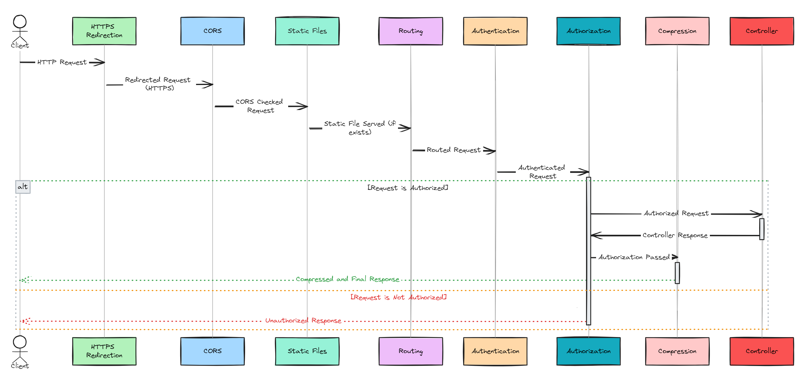

## Lifecycle

A lifecycle is a series of components, events, and stages that process a request or respond to user interaction. This encompasses how a web application handles incoming requests, processes them, and generates responses. The lifecycle offers extension points and hooks into these components so that you can customize the final output. It provides structure and abstraction that makes building complex applications easier. Understanding the lifecycle is crucial for developers as it provides insight into how the framework processes requests, allowing for better control over the application's behavior, customization, and optimization of performance. 

The concept of a lifecycle that handles incoming requests and generates responses is a common and fundamental aspect of web application development across many languages and frameworks.Languages such as java, python , ruby also provide the concept of a lifecycle.  For example, in Spring-based web applications, the lifecycle includes receiving a request, mapping it to a controller, handling exceptions, processing requests with service and repository layers, and returning a response. Similarly in Flask, the lifecycle includes request routing, view function execution, response generation, and request context teardown.

The ASP.NET lifecycle has undergone a major overhaul in .Net core. Prior to ASP.Net core, ASP.NET applications were tightly integrated with Internet Information Server(IIS). It depended on IIS for request handling, lifecycle management, etc. ASP.NET core supports OWIN  and the new generation of applications built with ASP.Net core are highly portable. They can run on non-windows platforms such as Linux, Mac OS or even within Docker containers. This cross-platform reach meant that the dependency on IIS had to be removed. To understand more about the secret sauce that enables this head over to [this post about OWIN, Katana, and Kestrel](). ASP.NET Core has been engineered with dependency injection and a modular HTTP middleware pipeline to facilitate application services.

## Middleware

Middleware components form the basic building blocks of an ASP.NET core pipeline providing capabilities such as the ability to serve files and route requests. Middleware is a series of components that form the applications request pipeline. Middleware components provide many of the underlying application level infrastructures. Routing, CORS, authentication and caching are implemented using middleware. App-specific middleware can also be written. Each middleware component acts on the request as they come in and on the response as it is sent back. It can choose to act on a request, ignore it or pass it to a specific component. These components are called in the order they are added to the pipeline. ASP.Net Core does not have HTTP Modules and handlers. Previously HTTP modules and handlers provided common services such as caching, authorization, and request handling. Modules provided application level services, they provided a hook into application lifecycle events to author reusable services. Handlers were responsible for generating the response. Module and handler execution were driven by application events whereas middleware exaction is dependent on the order in which they are added to the pipeline. Middleware provides the same results as handlers and modules.  The middleware can also integrate with a larger framework like MVC. While middleware executes in the order in which they are added, httphandlers execute every time the associated application event is fired and httpmodule is executed exactly once to generate a response.

In ASP.NET Core, the methods Use, Map, and MapWhen are all used to configure the middleware pipeline, but they serve different purposes and are used in different scenarios. Understanding the distinction between them is key to effectively managing how your application handles incoming HTTP requests.

1. _**Use**_- The Use method is used to add a middleware component to the application's request pipeline. This middleware component is invoked on every request. We can add as many app.Use methods as we want. They will be executed in the order in which they were added to the pipeline. It also has the option to pass the request to the next component or to short-circuit the pipeline. When middleware is written as an app.Use(...) method, a middleware delegate is added to the application's request pipeline. It can be written as an inline delegate or in a class.

2. _**Map**_ - Branches to different middleware components based on the incoming request URL path segment. When a request matches the specified path segment, only the middleware configured within Map is executed. It's a way to conditionally apply middleware based on the request path. As an example Map is used when applying certain middleware only when the request path starts with a specific segment, such as "/api" or "/admin".

3. _**MapWhen**_ - Adds additional functionality to the Map method by using predicate-based branching. A request pipeline can be branched off based on the conditions specified in the predicate. This predicate examines the incoming HTTP context and decides whether to execute the specified middleware. It's more granular than Map, as you can base your condition on various aspects of the HTTP context, not just the path. It can be used to conditionally apply middleware based on headers, query string parameters, or other aspects of the request.

4. _**Run**_ - short circuits the request and directly generates a response. It terminates the middleware. Any middleware components added after Run will not be processed. It is commonly used for scenarios where you want to end the request pipeline with a specific action, like returning a custom error response or a specific resource.

Let's see each of these in further detail

### Use

A middleware can be added to the pipeline using app.Use(). app.Use() adds a requestdelegate to the applications request pipeline. It can be written as an inline delegate or a separate class. This is an extension method and has a delegate taking two parameters. The first parameter is an HTTPContext and the second one is a RequestDelegate. A basic middleware written with Use is below.

```csharp
app.Use(async (context, next) => 
{ 
    await context.Response.WriteAsync("Middleware One"); 
    await next.Invoke(); 
}); 
 ```

The above middleware prints a simple response using the Response object of HTTPContext. It then calls the next middleware component in the pipeline by using the next parameter. We can chain multiple middleware components similarly.

```csharp
app.Use(async (context, next) => 
{ 
    await context.Response.WriteAsync("Middleware One</br>"); 
    await next.Invoke(); 
}); 

app.Use(async (context, next) => 
{ 
    await context.Response.WriteAsync("Middleware Two</br>"); 
    await next.Invoke(); 
}); 

app.Use(async (context, next) => 
{ 
    await context.Response.WriteAsync("Middleware Three</br>"); 
    await next.Invoke(); 
}); 
```

This prints the below output


### Map

The Map() method adds the capability to branch the middleware pipeline processing. The branching is based on specific request path matches. This method takes two parameters: PathString and the delegate named Configuration. If the path matches the pathString provided, then the components are added to the middleware pipeline. 

```csharp
app.Use(async (context, next) =>
{
  await context.Response.WriteAsync("Middleware One</br>");
  await next.Invoke();
});

app.Use(async (context, next) =>
{
await context.Response.WriteAsync("Middleware Two</br>");
await next.Invoke();
});

app.Use(async (context, next) =>
{
await context.Response.WriteAsync("Middleware Three</br>");
await next.Invoke();
});

app.Map("/branch1", (appBuilder) =>
{
  appBuilder.Use(async (context, next) =>
  {
  await context.Response.WriteAsync("--Branch 1 - Middleware One</br>");
  await next.Invoke();
  });

  appBuilder.Use(async (context, next) =>
  {
    await context.Response.WriteAsync("--Branch 1 - Middleware Two</br>");
    await next.Invoke();
   });
});
```

This prints the below output when we navigate to the branch1 path. If we do not navigate to the branch1 path, the previous output is produced since the map condition matching to "branch1" fails and the branch1 middleware is not added to the processing pipeline. 


### MapWhen

MapWhen works like Map() but provides more control over branching based on URL, request headers, query strings, and so on. The MapWhen() method returns Boolean after checking any condition from the HttpContext as a parameter.

```csharp
app.MapWhen( context => context.Request.Query.ContainsKey("querypath1"), (appbuilder) =>
{
  appbuilder.Use(async (context, next) =>
  {
    await context.Response.WriteAsync("-- Map when -- querypath1 - Middleware One</br>");
   });
});
```


### Run()
 
Run short circuits the pipeline. The Run method is used to add middleware and immediately return a response. It should be added at the end of the middleware since Run() ends the pipeline and won't call anything after itself.

```csharp
app.Run(async context =>
{
    await context.Response.WriteAsync("This middleware ends the pipeline.");
});
```
 
## Built-In Middleware
 
Asp.net core has a lot of cross-cutting functionality built in as middleware. These are pre-built and available out of the box with Asp.net Core. Examples of pre-built middleware are Authentication, Routing, Session, Static files etc. 



## Building your own Middleware component

Building your own middleware component in ASP.NET Core involves creating a class that encapsulates the logic you want to execute as part of the request processing pipeline. You can then register this middleware in the application's request pipeline. You can create a middleware class by defining a class with an Invoke or InvokeAsync method that takes HttpContext as a parameter. Dependencies required by the component can be injected through the constructor.

```csharp
public class MyCustomMiddleware
{
    private readonly RequestDelegate _next;

    public MyCustomMiddleware(RequestDelegate next)
    {
        _next = next;
    }

    public async Task InvokeAsync(HttpContext context)
    {
        // Pre-processing custom middleware logic here

        await _next(context); // Call the next middleware in the pipeline

        // Post-processing custom middleware logic here
    }
}
```

In the above code snippet, MyCustomMiddleware has an InvokeAsync method that contains the logic to be executed when the request passes through this middleware. The RequestDelegate _next is used to call the next middleware in the pipeline.

To easily add your custom middleware to the pipeline, it's a good practice to create an extension method for the IApplicationBuilder interface as below

```csharp
public static class MyCustomMiddlewareExtensions
{
    public static IApplicationBuilder UseMyCustomMiddleware(this IApplicationBuilder builder)
    {
        return builder.UseMiddleware<MyCustomMiddleware>();
    }
}
```

We can now use this extension method to add this custom middleware to the pipeline as below

```csharp
public void Configure(IApplicationBuilder app, IWebHostEnvironment env)
{
    // Other middleware registrations...

    app.UseMyCustomMiddleware();

    // Other middleware registrations...
}
```

By following these steps, you can create custom middleware tailored to your application's specific needs, enabling you to add custom logic to the request handling pipeline of your ASP.NET Core application.

## Setting up the middleware pipeline
 
Program and startup are the two main classes involved in setup and configuration of the pipeline. Program is a low-level entry point into the application through Main(). Main calls startup which configures all the middleware components. An ASP.NET Core application is a console application hosting a web application. Main creates a webhostbuilder and chains a series of methods to build the application. UseKestrel() sets up the Kestrel web server which is a cross-platform web server. The UseStartup method allows us to specify an application configuration class using a type parameter. This influences details such as how the HTTP pipeline is set up. The build and run methods implement the configuration and startup the application.

The startup class has two methods

1. ConfigureServices - Configures services that will be used by the application. This is tied into dependency injection making registered services available to controllers and other components.
2. Configure - Establishes the core HTTP pipeline by registering the Middleware components. Default helper methods like UseStaticFile and UseMVC which register middleware components.

```csharp
public void ConfigureServices(IServiceCollection services)
{
    // Add services to the container.
    services.AddControllersWithViews(); // For MVC
    // Other services like AddDbContext, AddIdentity, etc.
}
public void Configure(IApplicationBuilder app, IWebHostEnvironment env)
{
    // Configure the HTTP request pipeline.
    if (env.IsDevelopment())
    {
        app.UseDeveloperExceptionPage();
    }
    else
    {
        app.UseExceptionHandler("/Home/Error");
        app.UseHsts();
    }
    app.UseHttpsRedirection();
    app.UseStaticFiles();
    app.UseRouting();
    app.UseAuthorization();
    app.UseEndpoints(endpoints =>
    {
        endpoints.MapControllerRoute(
            name: "default",
            pattern: "{controller=Home}/{action=Index}/{id?}");
    });
}
```
The above code sample builds the pipeline and adds multiple middleware components such as static files, routing, authorization and MVC.

However, with .NET 6 and onwards, including .NET 8, there has been a shift towards a more streamlined setup that can merge the Program and Startup functionalities into a single file. The newer template for ASP.NET Core applications consolidates the Program and Startup classes into a single Program.cs file for simplicity.

```csharp
var builder = WebApplication.CreateBuilder(args);

// Add services to the DI container.
builder.Services.AddControllers();

var app = builder.Build();

// Configure the HTTP request pipeline.
app.UseRouting();
app.UseAuthorization();

app.MapControllers();

app.Run();
```

This evolution reflects a trend towards more concise and readable codebases.

## Conclusion

Using the lifecycle pattern with middleware components in ASP.NET Core offers several advantages that make application development both easier and better in various ways. It enables modular architecture promoting reusability and separation of concerns. It improves maintainability by providing a clear structure and patterns for handling requests and response. It improves performance by enabling asynchronous processing and increases efficiency through conditional branching for middleware components.