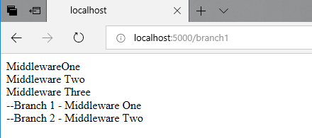

A lifecycle is a series of components, events, and stages that process a request or respond to user interaction. The framework lifecycle offers extension points and hooks into these components so that you can customize the final output. Lifecycles provide structure and abstraction that makes building complex applications easier. Android apps have an activity lifecycle, so do WordPress and AngularJs frameworks. Understanding the processing pipeline of a framework and knowing how to work with it empowers you as a developer. The ASP.NET lifecycle has undergone a major overhaul in .Net core. Prior to ASP.Net core, ASP.NET applications were dependent on and were loaded by IIS. ASP.NET core supports OWIN  and the new generation of applications built with ASP.Net core can run on non-windows platforms such as Linux, Mac OS or even within Docker. This cross-platform reach meant that the dependency on IIS had to be removed. To understand more about the secret sauce that enables this head over to [this post about OWIN, Katana, and Kestrel](). ASP.NET Core has been engineered with dependency injection and a modular HTTP middleware pipeline to facilitate application services.

## Middleware

Middleware components form the basic building blocks of an ASP.NET core pipeline providing capabilities such as the ability to serve files and route requests. Middleware is a series of components that form the applications request pipeline. Middleware components provide many of the underlying application level infrastructures. Routing, CORS, authentication and caching are implemented using middleware. App-specific middleware can also be written. Each middleware component acts on the request as they come in and on the response as it is sent back. It can choose to act on a request, ignore it or pass it to a specific component. These components are called in the order they are added to the pipeline. ASP.Net Core does not have HTTP Modules and handlers. Previously HTTP modules and handlers provided common services such as caching, authorization, and request handling. Modules provided application level services, they provided a hook into application lifecycle events to author reusable services. Handlers were responsible for generating the response. Module and handler execution were driven by application events whereas middleware exaction is dependent on the order in which they are added to the pipeline. Middleware provides the same results as handlers and modules.  The middleware can also integrate with a larger framework like MVC. While middleware executes in the order in which they are added, httphandlers execute every time the associated application event is fired and httpmodule is executed exactly once to generate a response. The ASP.Net core middleware pipeline can be configured using the following methods

1. _**Use**_- Use adds a middleware component to the pipeline. The component’s code must decide whether to terminate or continue the pipeline. We can add as many app.Use methods as we want. They will be executed in the order in which they were added to the pipeline. When middleware is written an app.Use(...), a middleware delegate is added to the application's request pipeline. It can be written as an inline delegate or in a class.
2. _**Map**_ - Branches to different middleware components based on the incoming request URL path.
3. _**MapWhen**_ - Adds additional functionality to the Map method by using predicate-based branching. A request pipeline can be branched off based on the conditions specified in the predicate.
4. _**Run**_ - short circuits the request and directly generates a response. It terminates the middleware. Any middleware components added after Run will not be processed.

Let's see these in further detail

### Use

A middleware can be added to the pipeline using app.Use(). app.Use() adds a requestdelegate to the applications request pipeline. It can be written as an inline delegate or a separate class. This is an extension method and has a delegate taking two parameters. The first parameter is an HTTPContext and the second one is a RequestDelegate. A basic middleware written with Use is below.

```csharp
app.Use(async (context, next) => 
 { 
    await context.Response.WriteAsync("Middleware One"); 
    await next.Invoke(); 
 }); 
 ```

The above middleware prints a simple response using the Response object of HTTPContext. It then calls the next middleware component in the pipeline by using the next parameter. We can chain multiple middleware components similarly.

```csharp
app.Use(async (context, next) => 
{ 
    await context.Response.WriteAsync("Middleware One</br>"); 
    await next.Invoke(); 
}); 

app.Use(async (context, next) => 
{ 
    await context.Response.WriteAsync("Middleware Two</br>"); 
    await next.Invoke(); 
}); 

app.Use(async (context, next) => 
{ 
    await context.Response.WriteAsync("Middleware Three</br>"); 
    await next.Invoke(); 
}); 
```

This prints the below output


### Map

The Map() method adds the capability to branch the middleware pipeline processing. The branching is based on specific request path matches. This method takes two parameters: PathString and the delegate named Configuration. If the path matches the pathString provided, then the components are added to the middleware pipeline. 

```csharp
app.Use(async (context, next) =>
{
  await context.Response.WriteAsync("Middleware One</br>");
  await next.Invoke();
});

app.Use(async (context, next) =>
{
await context.Response.WriteAsync("Middleware Two</br>");
await next.Invoke();
});

app.Use(async (context, next) =>
{
await context.Response.WriteAsync("Middleware Three</br>");
await next.Invoke();
});

app.Map("/branch1", (appBuilder) =>
{
  appBuilder.Use(async (context, next) =>
  {
  await context.Response.WriteAsync("--Branch 1 - Middleware One</br>");
  await next.Invoke();
  });

  appBuilder.Use(async (context, next) =>
  {
    await context.Response.WriteAsync("--Branch 2 - Middleware Two</br>");
    await next.Invoke();
   });
});
```

This prints the below output when we navigate to the branch1 path. If we do not navigate to the branch1 path, the previous output is produced since the map condition matching to "branch1" fails and the branch1 middleware is not added to the processing pipeline. 



### MapWhen

MapWhen works like Map() but provides more control over branching based on URL, request headers, query strings, and so on. The MapWhen() method returns Boolean after checking any condition from the HttpContext as a parameter.

```csharp
app.MapWhen( context => context.Request.Query.ContainsKey("querypath1"), (appbuilder) =>
{
  appbuilder.Use(async (context, next) =>
  {
    await context.Response.WriteAsync("-- Map when -- querypath1 - Middleware One</br>");
   });
});
```


### Run()
 
Run short circuits the pipeline. The Run method is used to add middleware and immediately return a response. It should be added at the end of the middleware since Run() ends the pipeline and won't call anything after itself.
 
## Built-In Middleware
 
Asp.net core has a lot of cross-cutting functionality built in as middleware. These are pre-built and available out of the box with Asp.net Core. Examples of pre-built middleware are Authentication, Routing, Session, Static files etc.
 
## Program and Startup
 
Program and startup are the two main classes involved in setup and configuration of MVC application. Program is a low-level entry point into the application through Main(). Main calls startup which configures all the middleware components. An ASP.NET Core application is a console application hosting a web application. Main creates a webhostbuilder and chains a series of methods to build the application. UseKestrel() sets up the Kestrel web server which is a cross-platform web server. The UseStartup method allows us to specify an application configuration class using a type parameter. This influences details such as how the HTTP pipeline is set up. The build and run methods implement the configuration and startup the application.

The startup class has two methods

1. ConfigureServices - Configures services that will be used by the application. This is tied into dependency injection making registered services available to controllers and other components.
2. Configure - Establishes the core HTTP pipeline by registering the Middleware components. Default helper methods like UseStaticFile and UseMVC which register middleware components.

A simple example of middleware components are components that enable using static files app.useStaticFiles() adds middleware that enables our application to serve static files such as CSS and JS. This avoids triggering the MVCrequest lifecycle thus optimizing it. Another example of a complex and powerful middleware component is app.useMvcWithDefaultRoutes(). This is the most common route template used by MVC and the routing middleware component. These are wrapper extension methods on the app builder class that calls app.use middleware internally.
