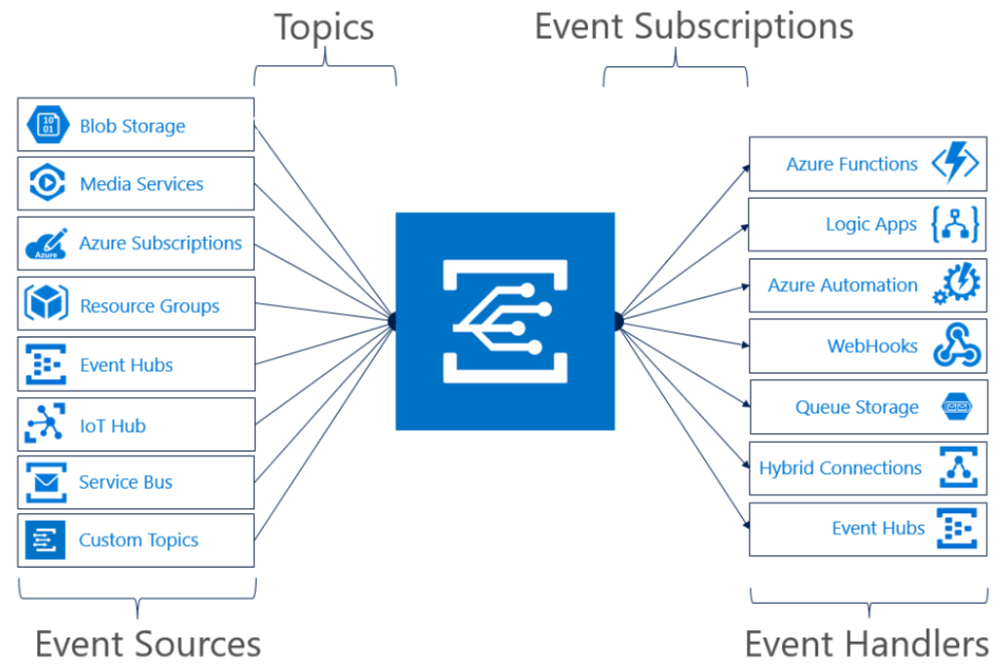
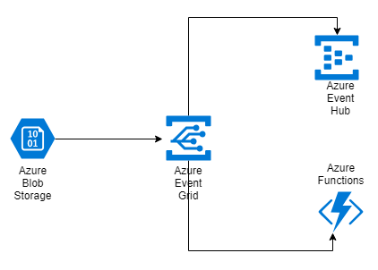
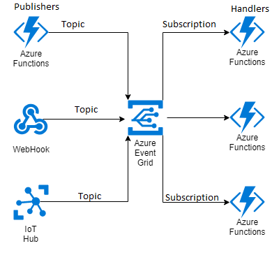

This post is part of a three post series on Azure Event Grid

[Part 1 - Azure Event Grid - Introduction]()

[Part 2 - Azure Event Grid - Create Topics]()

[Part 3 - Azure Event Grid - Creating Custom events]()

An introduction to Event driven architecture is essential to understand the architectural pattern supported by Azure event grid and is located [here]().

Azure Event Grid is an eventing back plane that enables [eventdriven](), [reactive programming]() . It is a cloud-based publisher and subscriber service that helps users build an event-based reactive architecture for their applications. It sends HTTP requests as notifications. Event grid has in-built support for events from Azure services. It allows you to choose the Azure service or resource that you want to be notified about. These notifications contain events that happen in the publisher. It enables event management across different Azure resources such as blob storage, functions, logic apps etc. Instead of creating a polling mechanism in your application that polls for changes, the apps get notified when an event happens automatically.

Image Source : [Microsoft Docs](https://docs.microsoft.com/en-us/azure/event-grid/media/overview/functional-model.png)

It is important to understand the primary concepts of Azure event grid to use it effectively.

**_Events_** \- An event describes something that happened in the system. It represents a fact. Some examples of events maybe Order Created, Order Shipped, File deleted, Message enqueued etc. An event generally has two blocks of information. One block is general information which maybe common across all events and the other block is information specific to the event. The general block may contain generic information such as Event identifier, Source of event, time the event took place etc. The event specific block contains event specific information, for e.g the order created event may contain the order details, item details etc. An event is limited to 64KB.

**_Event source_** \- An event source is where the event happened. It is the origin of an event that was then handled by Event Grid. Azure Event Grid supports multiple event sources such as Azure Blob Storage, Azure IOT Hub, Azure Service Bus, Container Registry, Azure Event Hubs etc. Many more event sources are being added frequently. It also supports custom events from applications. It is also possible to publish your own custom events directly to an Event Grid endpoint using Custom topics.

**_Event handlers_** \- An event handler process an event. Azure Event Grid will forward events to event handlers, where they will be deserialized and processed. An event can be processed by a single or multiple event handlers. An event handler can be designed as a Webhook, Azure Automation, Azure Functions, Logic Apps, Event Hubs, or Microsoft Flow.

Azure Event Grid - Event handlers

In the above example the event source is an azure blob storage. There are multiple event handlers represented by an Azure function and an Azure event hub. Event grid will now publish events published by blob storage to both the subscribers.

**_Topics -_** A topic is a collection of related events. It is a channel between a service and Azure Event Grid, which allows the former to push an event to the Azure service. A topic is created by a publisher. Subscribers can subscribe to topics they are interested in. There are two types of topics namely System topics and Custom topics.System topics are azure inbuilt topics. Custom topics are defined by the developer and can be application specific.

**_Event subscriptions -_** A subscription is a channel between Azure Event Grid and a service. This channel is used to retrieve events from the grid. A subscription tells Event Grid which events on a topic you're interested in receiving. You publish a message to a topic , and then subscribe to it with your consumer. Events send to the endpoint can be filtered by event type or subject pattern.

Publisher, Topic - Subscription, Handler

The next part of the series is [here]()