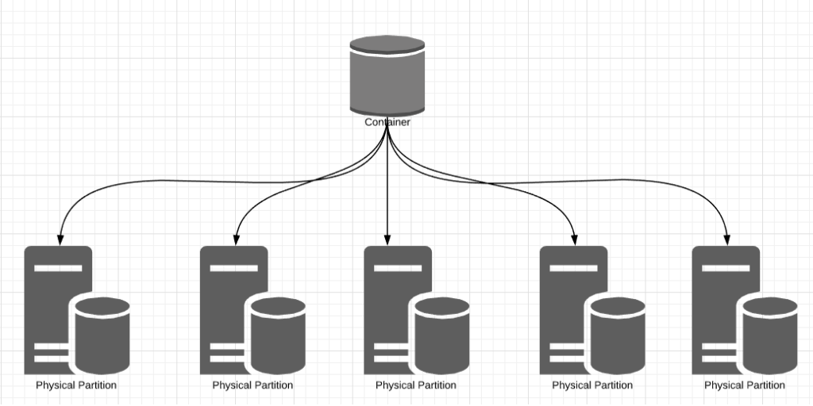
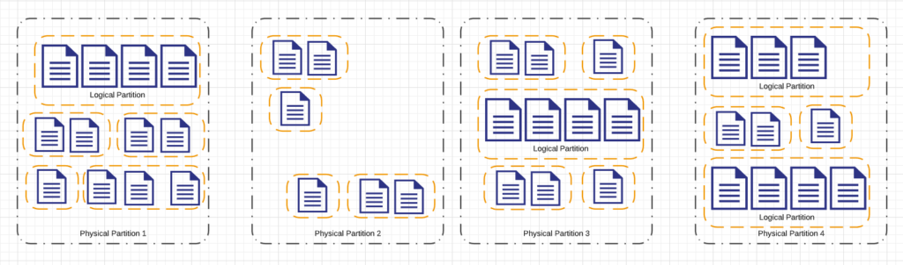
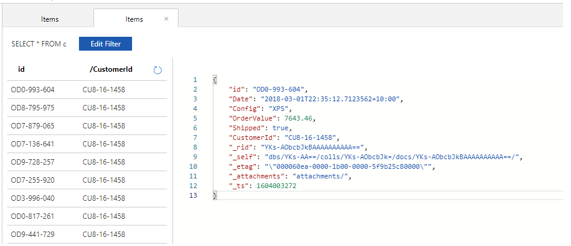

Cosmos DB is an extremely powerful cloud native database. It is imperative to understand core concepts involved in modelling data in Cosmos Db to harness its power. Unlike relational databases Cosmos Db provides a lot of flexibility in modelling schema. The two primary knobs to tune performance are latency and throughput. Cosmos Db uses partitions to provide massive scalability and high performance. It is key to understand the concepts of throughput, partitioning and choosing partition keys to be able to model schema effectively.

### Throughput

Throughput is used as a measure to indicate the number of requests that can be served in a specific period. Cosmos Db uses the concept of provisioned throughput. This can be configured at the account or container level by specifying and paying for Request Units (RU). Once we provision a specific throughput, we are constrained by it. If we exceed the throughput specified, Cosmos Db will throttle requests. Storage in Cosmos Db is costed and charged separately and is not part of the RU charge. We can think of request units as throughput currency. It is a blended measure of the computational cost incurred to serve requests. Simple queries are cheaper compared to complex queries and correspondingly cost less RU's. Writes are more expensive than reads since a write involves updating a replica set and hence cost more RU's. Cosmos DB is completely transparent about the RU charges incurred by each request. Every Cosmos Db response header shows the RU charge incurred for that request. The azure portal provides further details on RU's consumed, and requests throttled over a period. Request units are deterministic. Identical requests will always cost the same provided no data changes between the requests.

There are three different options to specify throughput at the container level based on the workload characteristics

- Manual - In manual provisioning we explicitly reserve a fixed number of RU's per second that are guaranteed to be available all the time. If we utilize less than what was provisioned, it results in unused capacity and wasted money. We can increase or decrease the provisioned RU's manually at any point in time. This option is good for predictable and stable workloads where we can specify the throughput needed precisely.
- Autoscale - Cosmos Db can automatically scale throughput up and down. We can reserve the max RU's needed which is always available. Cosmos Db can automatically scale from the maximum provisioned capacity down to 10% of the reserved capacity based on usage. This option is best for unpredictable and variable workloads.
- Serverless - Serverless provisioning is in preview currently. In this option we do not specify the throughput needed rather it is consumption based. We only pay for the RU's that we use.

### Partitioning

Partitioning is a strategy to split data based on a key and distribute it across multiple servers. Partitioning allows us to massively scale a database both in terms of storage and throughput. Partitioning data is key to scale in Cosmos Db. A container is represented as a single logical resource from which we can read and write data. However, Cosmos Db manages a cluster of servers under the covers for each container. These are called physical partitions. Cosmos Db shards data and distributes workloads across these physical partitions to ensure better parallelism. Each of these physical partitions hosts a database engine with storage and compute resources. This design results in unlimited storage and throughput for each container. Cosmos Db can add more physical partitions dynamically as needed to accommodate any growth in data and workloads. Cosmos Db transparently splits partitions to manage growth. It automatically maintains the cluster and dynamically adds more partitions to accommodate growth and still provide high throughput. This ensures that there is no practical limit to the storage and compute power available for a container. This partitioning is automated and transparent; It does not involve any user intervention. Each physical partition is also a unit of replication. Each physical partition is distributed across multiple replicas called replica sets. To ensure high availability Cosmos Db maintains at least four replicas of each physical partition in each data center.



Cosmos Db - Physical Partitions

Now that we have our documents spread across multiple physical partitions, how does Cosmos Db know which physical partition to use for a document? This is where logical partitions come into play. A physical partition is further composed of logical partitions. All documents in a container are split into groups called logical partitions. Logical partitions are defined by a partitioning strategy defined by a partition key. These logical partitions group documents according to the containers partition key. Cosmos Db seamlessly shuffles logical partitions across physical partitions to scale horizontally. This is called as partition splits and occurs automatically, instantaneously and without any disruptions.



Cosmos Db Logical Partitions

The key selected to split and distribute data across logical partitions is called as Partition key. We define a partition key at the container level. The container specification provides a key or a path that Cosmos Db uses as the partition key. Choosing the right partition key helps improve performance and lowers cost. Cosmos Db has a maximum document size of 2 MB and a maximum logical partition size of 20 GB. It is ideal to choose a partition key that results in logical partition sizes below this limit. A good partition key ensures well balanced partitions. Cosmos Db generates a hash value for each document in a container using the partition key. It then uses this hash value to place the document into appropriate logical partitions. If the partition key is the same, then the hash value generated will be identical. Hence all documents with the same partition key value will generate the same hash value and will end up in the same logical partition. If a document does not have a partition key value it ends up in the default logical partition. It is particularly important to pick the right partition key to ensure that data is distributed evenly across multiple logical partitions. The selected partition key should be able to generate a broad range of logical partitions and evenly distribute data across them. The larger the number of partitions, the better Cosmos Db can distribute it. This will result in better performance and query characteristics.

The partition key must provide for an even distribution of data across partitions. The distribution must be considered both in terms of storage and throughput. Data access patterns also play a key role in choosing the partition key. For e.g. In an Order management scenario, we can choose order date as the partition key. This will result in an even distribution of data but is not ideal due to data access patterns. The partition with the current date will have most of the reads and writes resulting in most of the throughput being consumed by this partition. The containers throughput is evenly divided across all its partitions and this will result in skewed usage of the throughput. This partition is now a hot partition and will not scale effectively. Additionally, the partition key should align with operations to optimize RU spend. The partition key should help avoid cross partition queries which are expensive and consume a lot of RU's.

We can also use a composite key as a partition key. A composite partition key is composed of multiple partition keys. We can also generate a synthetic partition key which can be generated by adding synthetically generated value to a partition key.

### Schema Modelling

There are different options to model our documents such as Embedding, Referencing, Hybrid or using Document Types.

Cosmos Db is a schemaless document database. Being schema less there is no constraint on the structure of the document that we can add to a collection. We can leverage the schema-agnostic nature of cosmos db by adding documents with completely different JSON structures to a collection. We can think of a collection as a logical container of all the different data types needed for a workload. The joy of a Document database is that it eliminates lots of Joins. The first instinct is to place as much in a single document as possible. Cosmos Db enforces a 2 MB per document limit. In a world of data this works out to 15 thousand tweets or 125 typical Stack Overflow answers or 10 flicker photos. We need to carefully think through if we want to embed specific pieces of information into a single document or split it out into a different document and reference it.

Embedding refers to storing information within the same document. Referencing refers to storing information across different documents and joining them together using an identifier. We embed documents if there is a one - one or a one - few relationship. While the concept of a one-to-one relationship is well known, the concept of a one - few relationship is esoteric. The one to few relationship helps to draw a distinction between low and high cardinality. For e.g. In the Orders Database scenario, it is recommended to embed a customer's addresses since the cardinality between a customer and address is low. Each customer has only a few billing and shipping addresses. They can be stored together in the same document as the rest of the customer information. However, it is recommended to split out and reference orders belonging to a customer. We do not want to limit the number of orders that belong to a customer. The relationship between a customer and his/her orders have a high cardinality and is unbounded. Additionally, we may not need to read the whole customer document to add more orders or update existing orders. The rate of change of data also plays a key role. Data which is updated together at the same rate can be embedded whereas data which changes at different rates should ideally be referenced. Hence it is optimal to store orders separately from the customer data as the rate of change for orders is much higher compared to the rate of change for customer data. Data which changes together is ideal to be embedded in a single document. We store orders in a separate document with the same customerid as the partition key to provide a reference to it. In the below gist we are embedding a customer's address in the customers document.

```json
{
 "id": "CU8-16-1458",
 "CustomerId": "CU8-16-1458",
 "ModifiedDate": "2020-10-10T23:29:22.413755+10:00",
 "Title": "Mrs.",
 "FirstName": "Elda",
 "LastName": "Hyatt",
 "MiddleName": "Manuela",
 "Suffix": "V",
 "CompanyName": "Abernathy, Feeney and Walker",
 "SalesPerson": "Felton Conn",
 "CreditLimit": 498.73,
 "Contact": {
  "EmailAddress": "Edna.Lesch17@hotmail.com",
  "Phone": "(565) 635-9626 x7638"
 },
 "Address": [{
   "StreetAddress": "4942 Lakin Rapid",
   "City": "Port Virginia",
   "ZipCode": "30524",
   "State": "Pennsylvania",
   "County": "Berkshire",
   "Country": "USA"
  },
  {
   "StreetAddress": "4942 St Lupin",
   "City": "Harrera",
   "ZipCode": "3467",
   "State": "Omaha",
   "County": "Orange County",
   "Country": "USA"
  }
 ],
 "_rid": "YKs-AJC4vmMBAAAAAAAAAA==",
 "_self": "dbs/YKs-AA==/colls/YKs-AJC4vmM=/docs/YKs-AJC4vmMBAAAAAAAAAA==/",
 "_etag": "\"00004009-0000-1b00-0000-5f9b25c70000\"",
 "_attachments": "attachments/",
 "_ts": 1604003271
}
```

Customer Document

Related items are queried or updated together. It therefore makes more sense to embed this information as we can read and write this information in a single operation. For e.g. In the Orders database it makes sense to embed a customer's payment information along with his personal details as they would be typically updated together. Sometimes this also corelates to the rate of change. Data which changes at the same rate can be ideally embedded together. For e.g. In orders database the customer information changes very infrequently and can be embedded whereas we may rapidly add or update orders for a customer. We can store order information in a separate document and reference it using customerid as the reference key. In the below image we store orders in their own documents and use the customerid as the reference.



Orders document collection

In summary we use embedding when there is

- contained relationships between entities.
- one-one or one-few relationship between entities.
- Embedded data changes infrequently.
- Embedded data is bounded.
- Embedded data is queried together frequently.
- ideal for read heavy applications
- Not ideal for write heavy requests as it can lead to bottlenecked requests.

We use reference to join entities across documents when there is

- One to many relationships between entities
- Many to many relationships between entities.
- Related data changes frequently.
- Reference data ca grow without bounds.

The hybrid model which uses a mix of both referencing and embedding entities depending on what works best in the context.

> Photo by [Amador Loureiro](https://unsplash.com/@amadorloureiroblanco?utm_source=unsplash&utm_medium=referral&utm_content=creditCopyText) on [Unsplash](https://unsplash.com/s/photos/geometric-types?utm_source=unsplash&utm_medium=referral&utm_content=creditCopyText)
