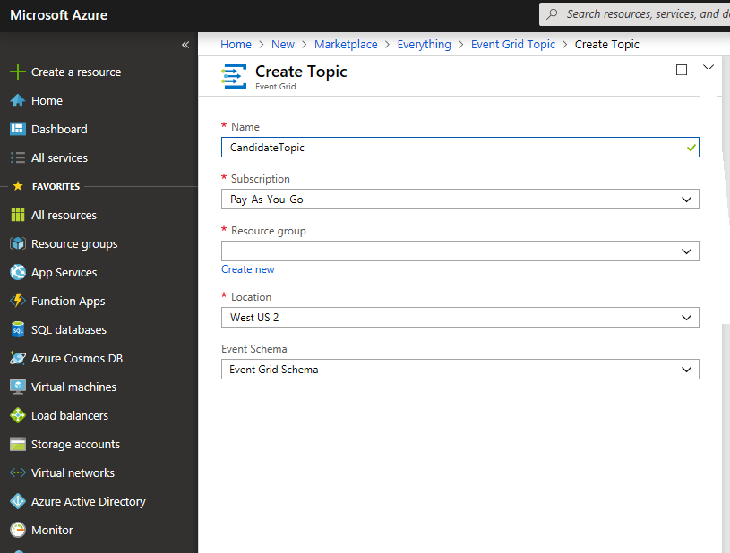
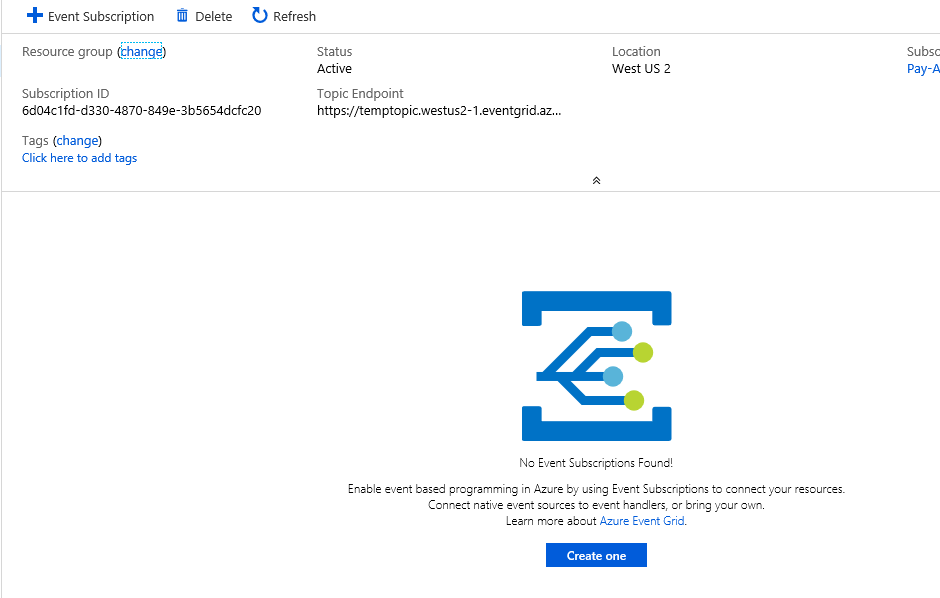
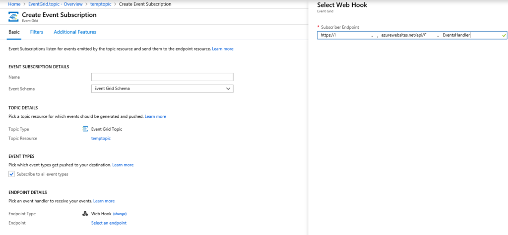
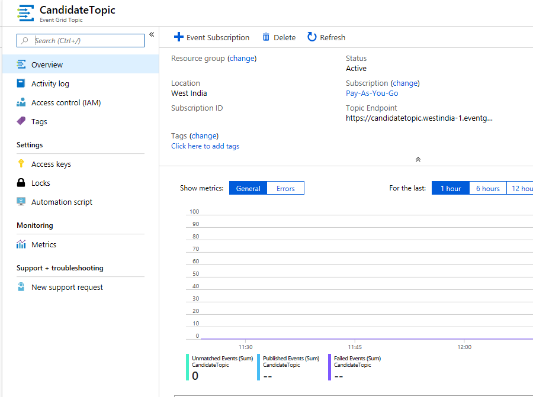

This post is part of a three post series on Azure Event Grid

[Azure Event Grid - Introduction](https://pradeeploganathan.com/azure/azureeventgrid-introduction)

[Azure Event Grid - Create Topics](https://pradeeploganathan.com/azure/azureeventgrid-createtopic)

[Azure Event Grid - Creating Custom events](https://pradeeploganathan.com/azure/azureeventgrid-createcustomevents)

To get started with Azure Event grid we need to create three primary elements as described previously. We need to create a Topic, a subscription and an Event handler .

**_Creating the Topic -_** On Azure portal use the create resource option to create an Event Grid topic as shown below. I have created a topic and named it as CandidateTopic. I have specified the resource group , the location and the event schema.

**_Creating the Subscription -_** The topic is now created but as you can see below the topic needs a subscription in order for it to deliver events.

**_Creating the Handler -_** I have created a subscription and have used a Web hook as the handler for the subscription as seen below. The web hook is a custom API that i created to be called by the subscription.

Azure Event Grid - Topic Created

Photo by [Steve Long](https://unsplash.com/photos/xRSSxi2OK5I?utm_source=unsplash&utm_medium=referral&utm_content=creditCopyText) on [Unsplash](https://unsplash.com/search/photos/road-sign?utm_source=unsplash&utm_medium=referral&utm_content=creditCopyText)
