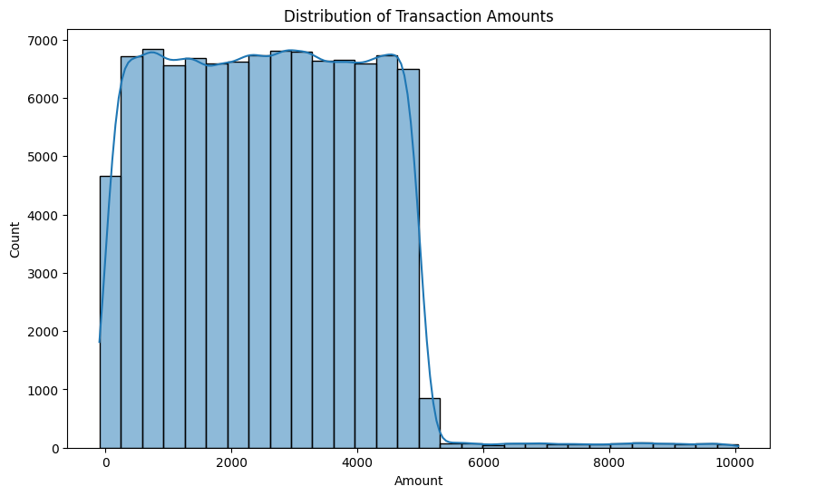

## What is Fraud Detection?

Fraud detection is the process of identifying and preventing fraudulent transactions, activities, or behavior in various industries, including finance, e-commerce, insurance, and government. Fraud can take many forms, including:

* Financial fraud (e.g., credit card fraud, money laundering)
* Identity fraud (e.g., phishing, identity theft)
* Online fraud (e.g., transaction fraud, account takeover)
* Insurance fraud (e.g., claims fraud, premium fraud)
* Healthcare fraud (e.g., medical billing fraud, prescription fraud)

## Why is Fraud Detection Important?

Fraud detection is crucial for several reasons:

* Financial losses: Fraud can result in significant financial losses for individuals, businesses, and organizations.
* Reputation damage: Fraud can damage an organization's reputation and erode customer trust.
* Legal and regulatory issues: Fraud can lead to legal and regulatory issues, resulting in fines, penalties, and even criminal prosecution.
* National security: Fraud can be linked to criminal organizations and terrorist financing, posing a threat to national security.

## Fraud Detection Methods

Fraud detection typically involves identifying fraudulent transactions among a set of transactions. The foundational idea behind most fraud detection models is anomaly detection. This can be framed as a binary classification problem, where each transaction is labeled as either fraudulent or non-fraudulent. We establish patterns of "normal" behavior and then identify transactions or activities that deviate significantly from these patterns as potential fraud. Fraud detection methods can be categorized into two main approaches:

* Rules-Based Approach: This approach uses predefined rules to identify fraudulent transactions or behavior. Rules are based on historical data, industry expertise, and regulatory requirements.
* Machine Learning Approach: This approach uses machine learning algorithms to analyze patterns and anomalies in data, identifying potential fraud. Machine learning models can be trained on historical data and adapt to new fraud patterns.

## Rules-Based Engines: A Solid Foundation for Fraud Detection

In the world of fraud detection, rules-based engines serve as the first line of defense. These systems rely on a set of carefully crafted rules, developed by experts, to identify suspicious transactions. For example, a rule might flag a transaction above $10,000 or one originating from a high-risk country. The strength of this approach lies in its transparency and simplicity. Each decision can be traced back to a specific rule, providing clear explanations for stakeholders and regulators. Examples of rules based engines for fraud detection are [FICO Falcon Fraud Manager](https://www.fico.com/en/products/fico-falcon-fraud-manager), [NICE Actimize](https://www.niceactimize.com/fraud-management/), [FRISS](https://www.friss.com/) and others. While rules-based engines are an excellent starting point, especially for organizations with limited data or resources, they have limitations. As fraudsters become more sophisticated, their tactics evolve, rendering static rules less effective. This is where machine learning models come into play.

## Machine Learning: Adapting to the Evolving Fraud Landscape

Machine learning models offer a dynamic and adaptive approach to fraud detection. Unlike rigid rules, these models learn from vast datasets of historical transactions, uncovering subtle patterns and anomalies that might escape human observation. Through techniques like logistic regression, decision trees, or even deep neural networks, these models continuously refine their understanding of fraudulent behavior. This adaptability is crucial in the face of ever-changing fraud tactics. However, transitioning to machine learning requires substantial amounts of labeled data for training, specialized expertise to build and maintain the models, and a focus on interpretability to ensure decisions remain transparent.

## Training and Building an ML model for Fraud detection

With this let's get started on building a very naive fraud detection model using Python. This guide is intended as a demonstration for getting started with machine learning and building models. We will use a Jupyter notebook to demonstrate the steps involved in data preprocessing, feature engineering, model training, and evaluation.


### Step 1: Importing Libraries

First, we need to import the necessary libraries. These include ```pandas``` for data manipulation, ```numpy``` for numerical operations, ```matplotlib```, ```seaborn``` for data visualization, and several modules from ```sklearn``` for machine learning.

```python
import pandas as pd
import numpy as np
import matplotlib.pyplot as plt
import seaborn as sns
from sklearn.model_selection import train_test_split
from sklearn.preprocessing import StandardScaler
from sklearn.linear_model import LogisticRegression
from sklearn.pipeline import Pipeline
from sklearn.metrics import accuracy_score, classification_report
import pickle
```

### Step 2: Loading the Dataset

We will load a dataset containing transaction data. This dataset should have features related to the transactions and a target variable indicating whether a transaction is fraudulent or not. We'll load the dataset and perform some initial exploration to understand its structure and content using the code below.

```python
# Load the dataset
df = pd.read_csv('transactions.csv')

# Explore the dataset
# Display the first few rows of the dataset
print(df.head())
# Get information about the dataset (columns, non-null values, data types)
print(df.info())
# Get basic statistics about the numerical columns
print(df.describe())
# Check the distribution of the class label
print(df['Is Fraud'].value_counts())

```

In the above code the ```pd.read_csv```  function from the pandas library is used to read the transactions.csv file into a DataFrame. This ```df.head()``` method returns the first five rows of the DataFrame by default. It helps you quickly inspect the data and understand its structure. It produces output similar to below

```
Transaction ID   Amount   Time                          Location             Merchant Type  Customer Age   Card Type      Online Transaction      Country       Device Type  IP Address         PurchaseCount  AveragePurchaseValue Product Category Transaction Frequency  Is Fraud  
qw243457a        1576.08  2024-04-13 16:37:06.167515    North Jennifer       Gas               75.0          Amex            False              Czech Republic  Desktop       61.225.111.230       2.0                   60.90         Health               Monthly           0  
fh465784d        4520.34  2024-02-07 15:45:27.648097    West Heatherborough  Restaurant        62.0          Mastercard      True               Slovakia        Mobile        195.161.202.92       7.0                   85.09         Food                 Daily             0  
yi476896d        1649.20  2023-09-24 07:25:51.750003    Port Ronnie          Electronics       55.0          Mastercard      True               Spain           Mobile        156.61.89.70         1.0                   81.15         Furniture            Weekly            1  
hi575685s        787.04   2023-12-07 15:14:06.510224    Lake Joshuaview      Electronics       37.0          Amex            False              Latvia          Desktop       203.85.61.245        7.0                  102.18         Books                Daily             0  
wt465883v        4221.80  2023-12-09 16:39:24.631475    Andrewhaven          Pharmacy          53.0          Discover        True               Sweden          Tablet        88.99.161.204        4.0                  158.90         Beauty               Weekly            0  
```

The ```df.info()``` method provides a concise summary of the DataFrame. This helps us understand the dataset better. The output from this method is below

```cmd
RangeIndex: 20000 entries, 0 to 19999
Data columns (total 18 columns):
 #   Column                  Non-Null Count  Dtype  
---  ------                  --------------  -----  
 0   Transaction ID          19982 non-null  float64
 1   Amount                  19983 non-null  float64
 2   Time                    19981 non-null  object 
 3   Location                19980 non-null  object 
 4   Merchant Type           19982 non-null  object 
 5   Customer Age            19983 non-null  float64
 6   Card Type               19984 non-null  object 
 7   Online Transaction      19980 non-null  object 
 8   Country                 19984 non-null  object 
 9   Device Type             19974 non-null  object 
 10  IP Address              19982 non-null  object 
 11  Purchase Count          19970 non-null  float64
 12  Average Purchase Value  19974 non-null  float64
 13  Product Category        19966 non-null  object 
 14  Transaction Frequency   19969 non-null  object 
 15  Velocity                19975 non-null  float64
 16  Merchant Risk           19974 non-null  float64
 17  Is Fraud                19978 non-null  float64
dtypes: float64(8), object(10)
memory usage: 2.7+ MB
```

The output indicates the number of non-null entries, column names, data types, and memory usage. This information is useful for identifying missing values and understanding the types of data you're working with.  The ```df.describe()``` method generates descriptive statistics for the numerical columns in the DataFrame. It includes measures such as count, mean, standard deviation, minimum, 25th percentile (Q1), median (Q2), 75th percentile (Q3), and maximum. These statistics help you understand the distribution and spread of the numerical features. The ```df['Is Fraud'].value_counts()``` method counts the occurrences of each unique value in the 'Is Fraud' column. It's particularly useful for understanding the class distribution in a classification problem, helping to identify if the dataset is balanced or imbalanced. The above methods help us get a better understanding of the data that we will be using to train our model. We can now further explore this dataset to understand data distribution and patterns using exploratory data analysis.

### Step 3: Exploratory Data Analysis (EDA)

EDA helps us understand the data and identify any patterns or anomalies. We will visualize the distribution of the target variable and examine correlations between features.

```python
# 1. Univariate Analysis
# Histogram of Transaction Amounts
plt.figure(figsize=(10, 6))
sns.histplot(df['Amount'], kde=True, bins=30)
plt.title('Distribution of Transaction Amounts')
plt.show()

# 2. Bar plot of Merchant Type frequencies
plt.figure(figsize=(10, 6))
sns.countplot(x='Merchant Type', data=df)
plt.title('Frequency of Merchant Types')
plt.xticks(rotation=45)
plt.show()

# 3. Bivariate Analysis
# Box plot of Amount by Merchant Type
plt.figure(figsize=(12, 8))
sns.boxplot(x='Merchant Type', y='Amount', data=df)
plt.title('Transaction Amounts by Merchant Type')
plt.xticks(rotation=45)
plt.show()


# 4. Fraudulent transaction profiling
fraud_df = df[df['Is Fraud'] == 1]
sns.histplot(fraud_df['Amount'], kde=True, bins=30, label='Fraud')
sns.histplot(df[df['Is Fraud'] == 0]['Amount'], kde=True, bins=30, label='Non-Fraud')
plt.title('Amount Distribution for Fraudulent vs. Non-Fraudulent Transactions')
plt.legend()
plt.show()

# 5. Time-based analysis
df['Time'] = pd.to_datetime(df['Time'])
df['Hour'] = df['Time'].dt.hour
fraud_by_hour = df.groupby('Hour')['Is Fraud'].mean()
plt.plot(fraud_by_hour, marker='o')
plt.title('Fraud Rate by Hour of Day')
plt.xlabel('Hour')
plt.ylabel('Fraud Rate')
plt.show()
```

The first histogram visualizes the distribution of transaction amounts in the dataset. This graph provides a clear picture of how transaction amounts are distributed in your dataset, which is essential for further analysis and model building in your fraud detection project. Understanding the distribution helps in engineering features that can improve model performance. It produces the below graph output. . We can observe that the transaction amounts range from 0 to approximately 10,000. There is a high frequency of transactions within the lower range (0 to around 4,000). The frequency of transactions remains relatively stable within this range. The data is heavily skewed towards lower transaction amounts, with a long tail extending towards higher amounts. The KDE line shows that the highest density of transactions is within the 0 to 4,000 range. Beyond 4,000, the density sharply declines, indicating fewer transactions of higher amounts. 


### Step 4: Data Preprocessing

Data preprocessing involves handling missing values, encoding categorical variables, and scaling numerical features. In our case, we'll focus on scaling the features.

```python
# Separate features and target variable
X = data.drop(columns=['is_fraud'])
y = data['is_fraud']

# Scale the features
scaler = StandardScaler()
X_scaled = scaler.fit_transform(X)
```

### Step 5: Building the Model Pipeline

We will use a logistic regression model for this simple fraud detection task. We will create a pipeline that includes scaling and the logistic regression model.

```python
# Create a pipeline with scaling and logistic regression
pipeline = Pipeline([
    ('scaler', StandardScaler()),
    ('logistic_regression', LogisticRegression(max_iter=1000))
])
```

### Step 6: Training and Evaluating the Model

We split the data into training and testing sets, train the model, and evaluate its performance.

```python
# Split data into training and testing sets
X_train, X_test, y_train, y_test = train_test_split(X, y, test_size=0.2, random_state=42)

# Fit the pipeline to the training data
pipeline.fit(X_train, y_train)

# Make predictions on the testing set
y_pred = pipeline.predict(X_test)

# Evaluate the model
print("Accuracy:", accuracy_score(y_test, y_pred))
print("Classification Report:\n", classification_report(y_test, y_pred, zero_division=1))
```

### Step 7: Saving the Model

We can save the trained model using `pickle` for future use.

```python
# Save the model
with open('fraud_detection_model.pkl', 'wb') as file:
    pickle.dump(pipeline, file)
```

## Conclusion

In this post, we walked through the process of building a simple fraud detection model. We covered data loading, exploratory data analysis, data preprocessing, model building, and evaluation. This is a naive approach and can be further improved with more advanced techniques and domain-specific knowledge. 

Feel free to experiment with different models and techniques to improve the performance of your fraud detection system.
