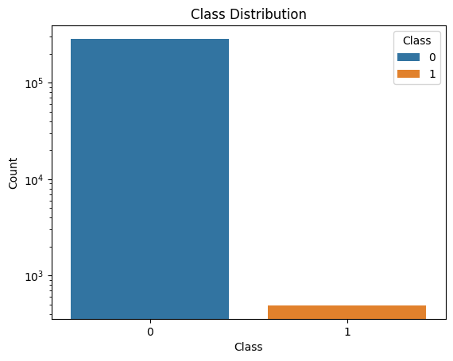
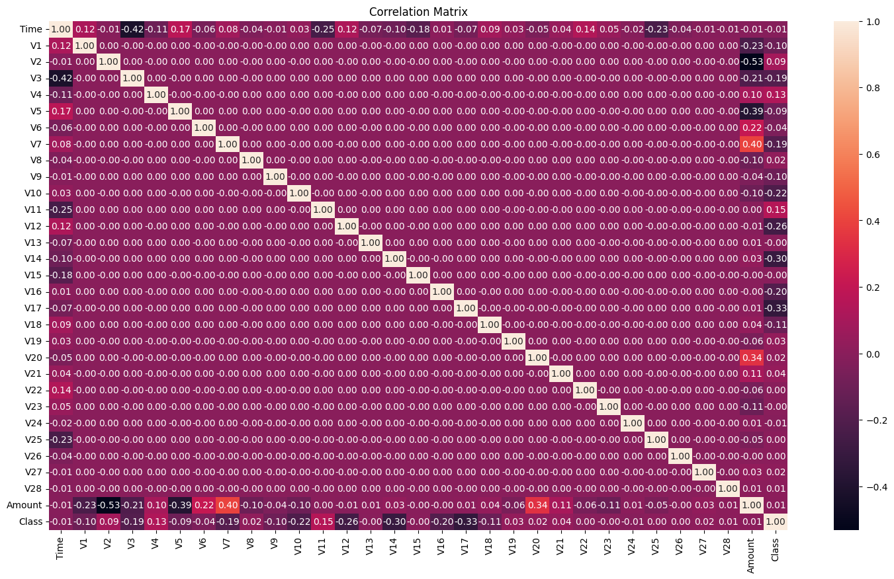
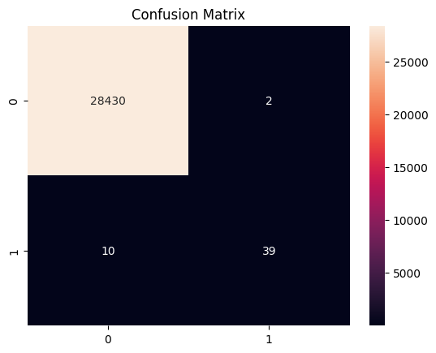

## Introduction

In today's digital age, fraudulent activities pose a significant threat to businesses and consumers alike. Financial losses, reputational damage, and compromised customer trust are just a few of the consequences of unchecked fraud. Identifying fraudulent activities quickly and accurately is crucial to protecting financial assets, saving millions of dollars and maintaining customer trust by protecting users from malicious activities. In this blog post we will build an effective fraud detection model using AI and machine learning techniques. We will explore the entire process, from data preprocessing to model deployment, and highlight key strategies to enhance detection accuracy.

While traditional rule-based systems have been the cornerstone of fraud detection for years, they come with several limitations. Rule-based systems rely on predefined patterns and thresholds, which can be rigid and inflexible. They often fail to adapt to new and evolving fraud tactics, leading to high false positive rates and missed fraudulent activities. In contrast, machine learning models offer a transformative, dynamic and scalable approach to fraud detection. It enables us to build models that adapt and learn from vast amounts of data. These models can learn from historical data, identify complex patterns, and adapt to emerging fraud schemes. By leveraging AI and machine learning, businesses can achieve higher accuracy, reduce false positives, and continuously improve detection capabilities. This adaptive nature makes machine learning models a superior choice for combating the ever-changing landscape of fraud.

In this blog post, we will build a fraud detection model using a public dataset from Kaggle and deploy it as a Flask API. We'll cover the entire process, including data preparation, model building, evaluation, and deployment.

## Setting Up Your Environment

Before diving into the exciting world of fraud detection, let's make sure we have all the necessary tools in place. We'll be using Python as our programming language along with several powerful libraries for data manipulation, machine learning, and API deployment.

1. Install Python: If you don't have Python installed, you can download the latest version from the official Python website: <https://www.python.org/downloads/>. Be sure to follow the instructions specific to your operating system.

2. Create a Virtual Environment: To keep your project organized and prevent conflicts with other Python packages you may have installed, it's recommended to create a virtual environment and activate it. Here's how:

```bash
python -m venv fraud_detection_env 
.\fraud_detection_env\Scripts\activate 
```

3. Install Libraries: Now, with your virtual environment activated, you can install the required libraries using pip:

```bash
pip install pandas numpy scikit-learn matplotlib seaborn imbalanced-learn flask
```

Here's what each library will be used for:

* pandas: Data loading, manipulation, and analysis
* NumPy: Numerical operations and array handling
* scikit-learn: Machine learning algorithms and model evaluation tools
* matplotlib and seaborn: Data visualization
* imbalanced-learn: Techniques to handle imbalanced datasets (where one class is significantly more frequent than others)
* Flask: Web framework for deploying our model as an API

With these libraries installed, you'll have a complete toolkit to build and deploy your fraud detection model!

## Dataset Overview

To embark on our fraud detection journey, we'll be using the [Credit Card Fraud Detection Dataset](https://www.kaggle.com/datasets/mlg-ulb/creditcardfraud) from Kaggle. This dataset provides a fascinating glimpse into real-world transactions made by European cardholders in September 2013.  It contains a wealth of information, including:

* Transactions: Each row represents a single credit card transaction.
* Features: The dataset includes 30 features, most of which have been anonymized using PCA (Principal Component Analysis) for privacy reasons. These features capture various aspects of the transaction, such as:
  * Time: The seconds elapsed between each transaction and the first transaction in the dataset.
  * Amount: The transaction amount.
  * V1 - V28: Principal components obtained with PCA, masking the original features.
* Target Variable: The "Class" column indicates whether a transaction is fraudulent (1) or legitimate (0).

This dataset has 284,807 transactions, with 492 frauds, making it highly imbalanced.

### The Challenge of Imbalance

One of the key challenges of fraud detection is that fraudulent transactions are relatively rare compared to legitimate ones. This makes the dataset highly imbalanced, with a significant majority of transactions belonging to the non-fraud class. This imbalance poses a unique challenge for our machine learning model, which we'll address in later stages of this tutorial.

Important Considerations:

* Anonymized Features: Due to privacy concerns, the feature names are anonymized. However, we can still gain valuable insights by exploring the relationships and patterns within these features.
* Time and Amount: These two features are not transformed with PCA and can provide crucial clues in our fraud detection model.

By understanding the structure and characteristics of this dataset, we'll be well-equipped to build a model that can effectively distinguish between fraudulent and legitimate transactions.

### Loading and Exploring the Dataset: First Glimpse into Fraudulent Activity

Now that our environment is set up, let's get our hands on the data and start exploring the landscape of credit card transactions. We'll begin by loading the dataset into a pandas DataFrame, the workhorse of data analysis in Python.

```python
import pandas as pd

# Load the dataset
data = pd.read_csv('creditcard.csv')

# Display the first few rows
print(data.head())
print(data.describe())
```

Key points to note about this dataset are

* Mostly Non-Fraudulent: The dataset is heavily skewed towards non-fraudulent transactions, as indicated by the very low mean and median values of the "Class" column (our target variable).
* Anonymized Features: Most of the features are labeled V1, V2, etc., due to privacy reasons. This means we won't have specific domain knowledge about these features, but we can still explore their relationships and statistical properties.
* Time and Amount Variation: The "Time" and "Amount" features show a wide range of values, indicating that transactions vary in both timing and size.

With the dataset loaded and a basic understanding of its structure, we're ready to move into the crucial phase of data preparation, where we'll transform the data into a format suitable for our machine learning model.

## Data Preparation: Shaping the Data for Machine Learning

Now that we've loaded our dataset and gained some initial insights, it's time to roll up our sleeves and get it ready for machine learning. Think of this stage as preparing ingredients before cooking a delicious meal. Our raw data needs some cleaning and transformation before our model can feast on it and extract valuable patterns.

### Handling Missing Values (or Lack Thereof)

A common challenge in data preparation is handling missing values. However, in our credit card fraud dataset, we have a pleasant surprise:

```python
# Check for missing values
print("Missing values in each column:\n")
print(data.isnull().sum().to_markdown(numalign="left", stralign="left"))
```

It turns out there are no missing values! This means we can skip the imputation step and move on to the next task.

### Scaling Features: Leveling the Playing Field

The features in our dataset vary greatly in magnitude. The "Time" feature measures seconds elapsed, while the "Amount" feature can range from small purchases to large transactions. This discrepancy in scales can negatively impact the performance of our machine learning model. To address this, we'll scale the "Time" and "Amount" features using standardization.

```python
from sklearn.preprocessing import StandardScaler

# Scale the 'Amount' and 'Time' features
scaler = StandardScaler()
data[['Amount', 'Time']] = scaler.fit_transform(data[['Amount', 'Time']])
```

Standardization rescales these features to have a mean of 0 and a standard deviation of 1, ensuring they contribute equally during model training.

### Splitting the Dataset: Preparing for Training and Testing

To evaluate the performance of our model, we need to split the data into two sets:

* Training set: This is the data the model will learn from.
* Testing set: This is the data we'll use to assess how well our model generalizes to unseen transactions.

We'll use a 70/30 split, allocating 70% of the data for training and 30% for testing.

```python
from sklearn.model_selection import train_test_split

# Split the dataset
X = data.drop('Class', axis=1)
y = data['Class']
X_train, X_test, y_train, y_test = train_test_split(X, y, test_size=0.3, random_state=42, stratify=y)
```

**NOTE**: The stratify parameter is added to the train_test_split function to ensure that the same ratio of target variable (Class) is maintained in both training and test datasets, This is especially important for Imbalanced datasets to avoid bias in the model due to uneven distribution of Class values in the datasets.

## Handling Class Imbalance: A Critical Step

Before building and training our model, we need to address the severe class imbalance in our dataset. Our dataset has 284,807 legitimate transactions versus only 492 fraudulent ones. This is a ratio of roughly 580:1. Without proper balancing of the legitimate and the fraudulent transactions, the model could achieve >99% accuracy simply by predicting all transactions as legitimate and completely miss all fraud cases.

### Understanding the Imbalance Problem

A naive model trained on this imbalanced data without special handling will learn to predict the majority class (non-fraud) by default. This is why we need specialized techniques such as 

1. **SMOTE (Synthetic Minority Over-sampling Technique)**: Generates synthetic samples of the minority class to balance the training set
2. **Class Weights**: Assigns higher misclassification costs to the minority class during training
3. **Threshold Tuning**: Adjusts the decision boundary to optimize for fraud detection rather than accuracy

### Implementing Imbalance Handling Techniques

Let's implement these complementary techniques in our model building process:

```python
from imblearn.over_sampling import SMOTE
from sklearn.utils.class_weight import compute_class_weight

# Apply SMOTE to balance the training set
smote = SMOTE(random_state=42, k_neighbors=5)
X_train_balanced, y_train_balanced = smote.fit_resample(X_train, y_train)

print(f"Original training set - Non-Fraud: {(y_train == 0).sum()}, Fraud: {(y_train == 1).sum()}")
print(f"Balanced training set - Non-Fraud: {(y_train_balanced == 0).sum()}, Fraud: {(y_train_balanced == 1).sum()}")

# Calculate class weights to penalize minority class misclassification
class_weights = compute_class_weight('balanced', 
                                     classes=np.unique(y_train), 
                                     y=y_train)
class_weight_dict = {0: class_weights[0], 1: class_weights[1]}
print(f"Class weights: {class_weight_dict}")
```

### Why These Techniques Matter

- **SMOTE** creates realistic synthetic minority samples by finding nearest neighbors in feature space
- **Class Weights** automatically adjust the penalty for incorrect predictions, making fraudulent misclassifications more costly
- Together, they prevent the model from simply predicting everything as non-fraudulent

Now that we've balanced our training data and calculated class weights, we can proceed with building the model.

With our data cleaned, scaled, split and balanced, we've laid the groundwork for the next exciting phase: exploratory data analysis (EDA). This will help us uncover hidden patterns and relationships in the data, guiding us towards the best model for fraud detection.

## Exploratory Data Analysis (EDA): Unveiling Hidden Patterns in Fraud

With our data prepped and ready for action, it's time to embark on an exploratory journey to uncover the hidden patterns that differentiate fraudulent transactions from legitimate ones. This step, known as exploratory data analysis (EDA), is like putting on a detective's hat and examining the clues our dataset has to offer. Through visualizations and statistical analyses, we can gain insights into the relationships and distributions of different features, setting the stage for effective model building.

### Class Imbalance: The Elephant in the Room

As we saw earlier, our dataset suffers from a severe class imbalance, with fraudulent transactions being far less frequent than legitimate ones. Let's visualize this imbalance. This code creates a count plot to visualize the distribution of classes in a dataset, with the y-axis scaled logarithmically to better show the class imbalance.

```python
# Plot class distribution
sns.countplot(x='Class', data=data, hue='Class', hue_order=[0, 1])

# Set title and labels
plt.title('Class Distribution')
plt.xlabel('Class')
plt.ylabel('Count')

# Set y-axis to logarithmic scale
plt.yscale('log')

# Show plot
plt.show()
```

The graph produced is here



This plot starkly reveals the challenge we face – our model will need to learn from a dataset where the "Fraud" class is significantly underrepresented. We'll address this issue later using specialized techniques.

### Correlation Matrix: Unmasking Relationships

To get a sense of how the features interact with each other and with the target variable ("Class"), we'll plot a correlation matrix. Identifying strongly correlated features can help in feature selection and engineering, reducing redundancy and improving model performance.Visualizing the correlation matrix helps identify relationships between features.

```python
# Correlation matrix
corr_matrix = data.corr()
plt.figure(figsize=(12, 8))
sns.heatmap(corr_matrix, annot=True, fmt='.2f')
plt.title('Correlation Matrix')
plt.show()
```

The correlation matrix produced is below



While most features are anonymized, we can still observe some interesting patterns:

* Low Correlation with Target: None of the features seem to be strongly correlated with the "Class" variable, indicating that fraud detection isn't a straightforward task. This suggests that fraudulent transactions might be subtle and harder to distinguish from legitimate ones based on individual features. The highest correlation with "Class" is around 0.15, which is still relatively low.
* This low correlation implies that detecting fraud based on individual features is challenging, and a combination of features (perhaps using advanced methods like machine learning models) might be necessary to effectively identify fraudulent transactions.
* Negative Correlation: Some features show negative correlations, meaning that as one feature increases, the other tends to decrease. For example, V3 and V7 have a negative correlation of -0.42, indicating a moderate inverse relationship between these two features.Understanding these negative correlations can help in feature engineering, as these relationships might provide insights into the patterns of the data.

### EDA Complete: The Investigation Continues

Through our EDA, we've confirmed the class imbalance challenge and gained a preliminary understanding of the feature relationships. This knowledge will guide us as we move on to model building and evaluation. Stay tuned as we continue our quest to build a robust fraud detection model!

## Model Building

With our data thoroughly explored, it's time to unleash the power of machine learning and build a model that can distinguish fraudulent transactions from legitimate ones. Our weapon of choice for this task will be the Random Forest classifier, a robust algorithm renowned for its ability to handle imbalanced datasets and capture complex relationships within the data.

### Why Random Forest?

* Handles Imbalance (with proper techniques): While Random Forests have some built-in robustness through ensemble averaging, they work best when combined with techniques like SMOTE, class weights, and threshold tuning.
* Ensemble Power: It combines the predictions of multiple decision trees, reducing the risk of overfitting and improving overall accuracy.
* Feature Importance: Random Forests provide insights into which features are most important for fraud detection.

### Building the Model

Let's get down to business and train our Random Forest model

```python
from sklearn.ensemble import RandomForestClassifier
from sklearn.metrics import classification_report, confusion_matrix, roc_auc_score

# Train the model
model = RandomForestClassifier(n_estimators=100, random_state=42)
model.fit(X_train, y_train)
```

In this code snippet, we create a Random Forest classifier with 100 decision trees (n_estimators=100). The random_state parameter ensures reproducibility of our results. We then train the model using the fit method, feeding it the training features (X_train) and corresponding labels (y_train).

### Making Predictions and Probability Outputs

Now that our model is trained on balanced data with class weights, we have both discrete predictions and probability scores. The probability scores are particularly valuable for imbalanced datasets as they allow us to adjust the decision threshold based on business requirements.

## Model Evaluation : Assessing Our Fraud-Fighting Arsenal

Now that our Random Forest model is trained, it's time to put it to the test and see how well it can distinguish between genuine and fraudulent transactions. However, evaluating a model on an imbalanced dataset requires a nuanced approach, as traditional metrics like accuracy can be misleading.

### Metrics for Imbalanced Datasets

* Confusion Matrix:This table provides a detailed breakdown of the model's predictions, showing true positives (TP), true negatives (TN), false positives (FP), and false negatives (FN).

* Precision: The proportion of positive predictions that are actually correct (TP / (TP + FP)).  In our case, precision tells us how often our model correctly identifies fraudulent transactions when it flags them.

* Recall (Sensitivity): The proportion of actual positives that are correctly identified (TP / (TP + FN)).  Recall indicates how well our model captures all the fraudulent transactions in the dataset.

* F1-Score:  The harmonic mean of precision and recall, providing a single metric that balances both.  It's particularly useful for imbalanced datasets.

* ROC-AUC Curve:The Receiver Operating Characteristic Area Under the Curve (ROC-AUC) is a graphical representation of the model's ability to discriminate between classes at various thresholds. A higher AUC indicates better overall performance.

### Evaluating Our Model

Let's calculate these metrics to get a clear picture of our model's performance:

```python
# Classification report
print(classification_report(y_test, y_pred))

# Confusion matrix
conf_matrix = confusion_matrix(y_test, y_pred)
sns.heatmap(conf_matrix, annot=True, fmt='d')
plt.title('Confusion Matrix')
plt.show()

# ROC-AUC score
roc_auc = roc_auc_score(y_test, model.predict_proba(X_test)[:, 1])
print(f'ROC-AUC Score: {roc_auc:.2f}')
```

NOTE: The model.predict_proba[X_test](:,1) statement returns the probabilities of all data points belonging to class 1 (fraud).

The confusion matrix produced is below



### Confusion Matrix Interpretation

The confusion matrix provides a summary of the performance of a classification model. Here's a breakdown of the information contained in the confusion matrix you provided:

* **True Positives (TP)**: The number of correctly predicted positive cases.
  * In this matrix, TP = 39 (bottom-right cell).

* **True Negatives (TN)**: The number of correctly predicted negative cases.
  * In this matrix, TN = 28430 (top-left cell).

* **False Positives (FP)**: The number of incorrectly predicted positive cases.
  * In this matrix, FP = 2 (top-right cell).

* **False Negatives (FN)**: The number of incorrectly predicted negative cases.
  * In this matrix, FN = 10 (bottom-left cell).

## Interpretation

* **High True Negative Rate**: The model correctly identifies a large number of legitimate transactions (28430).
* **Low False Positive Rate**: Only 2 legitimate transactions are incorrectly labeled as fraudulent, indicating the model has a low rate of false alarms.
* **Moderate True Positive Rate**: The model correctly identifies 39 fraudulent transactions.
* **False Negatives**: There are 10 fraudulent transactions that the model failed to identify, classifying them as legitimate.

## Key Metrics

* **Accuracy**


  \[
  \frac{TP + TN}{TP + TN + FP + FN} = \frac{39 + 28430}{39 + 28430 + 2 + 10} = \frac{28469}{28481} \approx 0.9996
  \]


This indicates that the model is highly accurate overall.

* **Precision (for the positive class)**

  \[
  \frac{TP}{TP + FP} = \frac{39}{39 + 2} \approx 0.9512
  \]


This measures the accuracy of positive predictions, i.e., how many predicted fraud cases are actually fraud.

* **Recall (for the positive class)**

  \[
  \frac{TP}{TP + FN} = \frac{39}{39 + 10} \approx 0.7959
  \]


This measures the model's ability to correctly identify actual fraud cases.

* **F1 Score**:

  \[
  2 \times \frac{\text{Precision} \times \text{Recall}}{\text{Precision} + \text{Recall}} = 2 \times \frac{0.9512 \times 0.7959}{0.9512 + 0.7959} \approx 0.8657
  \]


This is the harmonic mean of precision and recall.

The model performs well with high accuracy and precision, but there is room for improvement in recall. This means the model is very good at predicting legitimate transactions and correctly identifying fraudulent ones it predicts, but it misses some fraudulent transactions. Further tuning or using more advanced methods may help in improving recall while maintaining precision.

Evaluate precision and recall to understand the trade-off between catching all fraud cases and minimizing false alarms.
Consider the F1-score as a balanced measure of overall performance.
The ROC-AUC score provides a general idea of the model's discriminatory power.

### Threshold Tuning for Imbalanced Data

The default decision threshold of 0.5 may not be optimal for imbalanced datasets. We can adjust the threshold to prioritize catching fraud cases (higher recall) or reducing false alarms (higher precision), depending on business requirements.

```python
from sklearn.metrics import precision_recall_curve, f1_score

# Find optimal threshold by evaluating precision-recall trade-off
precision_scores, recall_scores, thresholds = precision_recall_curve(y_test, y_pred_proba)

# Calculate F1-scores for each threshold
f1_scores = 2 * (precision_scores * recall_scores) / (precision_scores + recall_scores + 1e-10)

# Find threshold that maximizes F1-score
optimal_idx = np.argmax(f1_scores)
optimal_threshold = thresholds[optimal_idx] if optimal_idx < len(thresholds) else 0.5

print(f"Optimal threshold: {optimal_threshold:.3f}")
print(f"F1-Score at optimal threshold: {f1_scores[optimal_idx]:.4f}")

# Apply custom threshold
y_pred_tuned = (y_pred_proba >= optimal_threshold).astype(int)

print(f"\n--- Default Threshold (0.5) ---")
print(classification_report(y_test, y_pred))

print(f"\n--- Optimized Threshold ({optimal_threshold:.3f}) ---")
print(classification_report(y_test, y_pred_tuned))
```

This approach finds the threshold that maximizes the F1-score, providing a good balance between precision and recall. The comparison shows how threshold tuning can improve your model's performance on imbalanced data.

### Further Fine-tuning Options

If you want to fine-tune further, consider:

* **Hyperparameter Tuning**: Adjust Random Forest parameters like `max_depth`, `min_samples_split`, or `n_estimators` using GridSearchCV
* **Ensemble methods**: Combine multiple models (Gradient Boosting, XGBoost) for potentially better performance
* **Advanced resampling**: Experiment with different SMOTE variations or hybrid approaches like SMOTETomek

By carefully evaluating our model with proper imbalance handling techniques, we can refine it to become a powerful tool in the fight against fraud.

## Feature Importance Analysis: Understanding What Matters

One of the significant advantages of Random Forest models is their ability to provide feature importance scores. These scores tell us which features the model relies on most heavily when making fraud detection decisions. Understanding feature importance provides valuable insights into fraud patterns and helps with model interpretability.

### Why Feature Importance Matters

* **Model Transparency**: Understand why the model makes specific predictions
* **Business Insights**: Identify which transaction characteristics are most indicative of fraud
* **Feature Selection**: Determine if all 30 features are necessary or if a subset would suffice
* **Domain Validation**: Confirm that the model's decision factors align with fraud detection domain knowledge

### Extracting and Visualizing Feature Importance

Let's examine which features are most important for our fraud detection model:

```python
# Extract feature importance from the trained model
feature_importance_df = pd.DataFrame({
    'feature': X_train_balanced.columns,
    'importance': model.feature_importances_
}).sort_values('importance', ascending=False)

# Display top 20 important features
print("Top 20 Most Important Features for Fraud Detection:")
print(feature_importance_df.head(20).to_string(index=False))

# Visualize feature importance
plt.figure(figsize=(12, 8))
top_features = feature_importance_df.head(15)
plt.barh(range(len(top_features)), top_features['importance'])
plt.yticks(range(len(top_features)), top_features['feature'])
plt.xlabel('Importance Score')
plt.ylabel('Feature')
plt.title('Top 15 Most Important Features for Fraud Detection')
plt.gca().invert_yaxis()
plt.tight_layout()
plt.show()

# Calculate cumulative importance
cumulative_importance = feature_importance_df['importance'].cumsum()
cumulative_pct = (cumulative_importance / cumulative_importance.iloc[-1]) * 100

print(f"\nCumulative Feature Importance:")
print(f"Top 5 features account for: {cumulative_pct.iloc[4]:.2f}% of importance")
print(f"Top 10 features account for: {cumulative_pct.iloc[9]:.2f}% of importance")
print(f"Top 15 features account for: {cumulative_pct.iloc[14]:.2f}% of importance")
```

### Interpreting Feature Importance Results

The output provides several valuable insights:

* **Top Features**: The features listed first have the strongest predictive power for fraud detection
* **Cumulative Importance**: Shows how many features are needed to capture most of the model's decision-making power
* **Feature Interactions**: Random Forest captures complex interactions between features automatically
* **Anonymized Features**: Since our features are anonymized (V1-V28), importance scores help us understand which PCA components are most relevant

### Key Observations

In fraud detection models, feature importance typically reveals:

1. **Amount and Time patterns**: These raw features often rank highly as fraudsters exhibit different spending patterns
2. **Specific PCA components**: Certain anonymized features (like V4, V10, V14) often emerge as critical for fraud detection
3. **Non-linear relationships**: Features that matter only in specific combinations appear important in ensemble methods
4. **Domain alignment**: Important features often align with known fraud indicators in the financial domain

This analysis validates that our model is learning meaningful patterns rather than relying on noise or spurious correlations.

## Saving the Model: Preserving Our Fraud-Fighting Knowledge

Congratulations! You've successfully trained a machine learning model that can identify fraudulent transactions. But before we move on to the exciting phase of deploying our model as an API, let's take a moment to preserve our hard work. We'll save the trained model to a file using Python's pickle module. This will allow us to load the model later without having to retrain it from scratch. Think of it as freezing your culinary masterpiece so you can enjoy it later without all the prep work.

```python
import pickle

# Save the model
with open('fraud_detection_model.pkl', 'wb') as f:
    pickle.dump(model, f)
```

In this code, we're essentially "pickling" the model object, converting it into a byte stream that can be written to a file. We can then load this file later to use the model for making predictions.

### Why Save the Model?

* Efficiency: Avoids the need to retrain the model, which can be time-consuming, especially with large datasets.
* Deployment: Enables us to easily integrate the model into other applications, such as our upcoming Flask API.
* Versioning: Allows us to keep track of different model iterations as we refine and improve our fraud detection system.

## Model Deployment: Unleashing Your Fraud Detector on the Web

With our fraud detection model trained and saved, it's time to unleash its power on the real world. In this section, we'll deploy our model as a web API using Flask, a lightweight Python web framework. This will allow other applications or systems to easily access our model and get predictions on new transactions.

### Why Flask?

Flask is a great choice for deploying machine learning models because:

* Simplicity: It's easy to learn and use, making it a great option for beginners.
* Flexibility: It gives you full control over how you structure your API.
* Lightweight: It's fast and efficient, perfect for creating APIs that need to handle a lot of requests.

### Setting Up Flask

First, install Flask if you haven't already

```bash
pip install Flask
```

### Creating the Flask API

Let's create a Flask app that will serve our fraud detection model: Create a new file called app.py and add the following code to set up the Flask API

```python
from flask import Flask, request, jsonify
import pickle
import pandas as pd

# Load the trained model
model = pickle.load(open('fraud_detection_model.pkl', 'rb'))

app = Flask(__name__)

@app.route('/predict', methods=['POST'])
def predict():
    data = request.get_json(force=True)
    df = pd.DataFrame([data])
    prediction = model.predict(df)
    return jsonify({'prediction': int(prediction[0])})

if __name__ == '__main__':
    app.run(debug=True)
```

How It Works:

* Load the Model: The app loads the saved model from the fraud_detection_model.pkl file.
* Define the API Endpoint: We create an endpoint called /predict that accepts POST requests.
* Receive Data: When a POST request is made, the app extracts the transaction data from the request's JSON body.
* Prepare Data: The data is converted into a pandas DataFrame, the format our model expects.
* Make Prediction: The model predicts whether the transaction is fraudulent or not.
* Return Prediction: The prediction is returned as a JSON response.

### Testing the API

Run the Flask app

```bash
python app.py
```

To test the API, you can use a tool like curl or Postman to send a POST request to <http://127.0.0.1:5000/predict> with JSON data. You can use a curl command as below

```bash
curl -X POST -H "Content-Type: application/json" -d '{"Time":-1.359807134,"V1":-0.0727811733094,"V2":2.536346737,"V3":1.378155224,"V4":0.001542962,"V5":0.300687081,"V6":0.47668358,"V7":-0.358792343,"V8":0.676280733,"V9":0.027056132,"V10":0.082794295,"V11":0.078497073,"V12":-0.39500069,"V13":-0.33832077,"V14":0.462387778,"V15":-0.57534921,"V16":-0.346379052,"V17":0.623157105,"V18":0.855191578,"V19":-0.254117518,"V20":0.11794168,"V21":-0.064306244,"V22":0.305486771,"V23":-0.00610653,"V24":0.002678882,"V25":0.024708905,"V26":0.001694461,"V27":0.01771508,"V28":0.000774177,"Amount":149.62}' http://127.0.0.1:5000/predict
```

This command sends a JSON object representing a transaction to the API and return a prediction (0 for non-fraud, 1 for fraud).

## Conclusion

In this comprehensive blog post, we've embarked on a journey to build and deploy a robust fraud detection system using the power of machine learning. We started by laying the foundation with our development environment, explored the intricacies of a real-world fraud dataset, and prepared the data for analysis. We then performed exploratory data analysis, uncovering the hidden patterns of fraud, before training a Random Forest model to identify fraudulent transactions. Finally, we deployed our model as a user-friendly Flask API, making it accessible for real-time fraud detection. The ability to create a model fine tuned for a specific task and deploying it to be used in various business process and applications is pretty powerful.

While we've covered the core steps, the world of fraud detection is constantly evolving. Here are some additional avenues to explore to further enhance your system:

* Advanced Algorithms: Experiment with other machine learning algorithms like XGBoost, LightGBM, or even deep learning models to see if they can further improve your fraud detection accuracy.

* Feature Engineering: Craft new features based on domain knowledge or insights gained from your analysis. For instance, you could create features that capture the frequency of transactions or the velocity of spending.

* Hyperparameter Tuning: Fine-tune the parameters of your model (like the number of trees in a Random Forest) to optimize its performance.

* Real-Time Monitoring: Integrate your model into a real-time monitoring system to flag potentially fraudulent transactions as they occur.

* Feedback Loop: Continuously update your model with new data and feedback to ensure it stays ahead of the latest fraud trends.

Remember, the battle against fraud is ongoing. By leveraging machine learning and continuously refining your models, you can empower your business to detect and prevent fraudulent activity, safeguard your customers, and maintain a trustworthy environment for all.

You can find the complete code on GitHub.

## Code and Resources

* [Credit Card Fraud Detection Dataset](https://www.kaggle.com/datasets/mlg-ulb/creditcardfraud)

* [Code for Fraud Detection model](https://github.com/PradeepLoganathan/Fraud-Detection-Model/blob/main/FraudDetection.ipynb)

By following these steps, you will have a fully functional fraud detection model and a deployed API ready for use. Happy coding!
