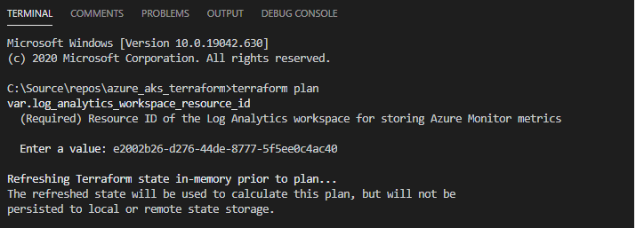
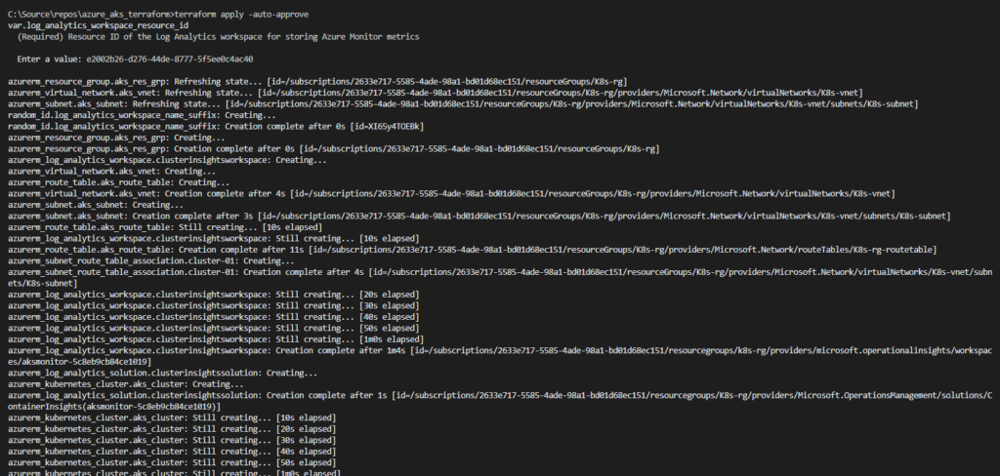

I have been part of a couple of build outs where we built [Kubernetes](https://pradeepl.com/kubernetes/kubernetes-concepts-pods/) clusters to run our cloud workloads. These builds involved deploying AKS clusters using terraform and AzDO. Designing the AKS infrastructure is key to ensure that the cloud workloads running on them can be deployed, secured, and hosted effectively. In this post I am documenting the general steps involved in building out a Kubernetes infrastructure on Azure Kubernetes Service (AKS) using terraform and deploy workloads using Azure devops (AzDO) and Helm charts.

You can follow along as we build the AKS Kubernetes cluster using the code at [this github repository](https://github.com/PradeepLoganathan/azure_aks_terraform).

I generally breakdown my terraform code into multiple terraform modules and files based on the function they perform. The files are named based on the functionality provided by them. The terraform binary will read all the resources defined in all the templates and create a dependency tree in memory and deploy resources starting from the root node. Let us start by building the various parts if the infrastructure and bringing them all together to build the terraform cluster.

### Providers

The main.tf template defines the resource providers needed and configures the backend for the solution. We are using the Azure resource manager and the Azure Active directory providers for this solution. We can also configure the backend used by terraform for state management. We use an Azure blob store as the back end for the terraform state files. This blog post shows how to configure an Azure blob store as the back end for terraform.

```terraform
provider "azurerm" {
  version = "~>2.35.0"
  features {}
}
provider "azuread" {
  version = "~>1.0.0"
}
terraform {
   backend "azurerm" {} 
}
```

Configuring providers in main.tf

### Variables

The variables.tf template declares variables and contains values for variables which terraform needs to deploy the solution. They are like parameters in ARM templates and contains values which need to specified explicitly for terraform to create resources. We can override these values during deployment and provide default values. The below gist contains a snapshot of some of the variables required to build the Kubernetes cluster. The complete variables file for the solution is [here](https://github.com/PradeepLoganathan/azure_aks_terraform/blob/main/variables.tf).

```terraform
variable "resource_prefix" {
  type        = string
  description = "(Required) Prefix given to all resources within the module."
}

variable "location" {
  type        = string
  description = "(Required) Specifies the supported Azure location where the resource exists. Changing this forces a new resource to be created."
}

variable "kubernetes_version" {
  type        = string
  default     = "1.16.8"
  description = "Version of Kubernetes specified when creating the AKS managed cluster. If not specified, the latest recommended version will be used at provisioning time (but won't auto-upgrade)."
}

variable "tags" {
  type        = map
  default     = {}
  description = "Set of base tags that will be associated with each supported resource."
}
```

Declaring variables

### Resource Group

We can now create a resource group which will group all the resources needed to create our Kubernetes cluster in the aks\_rg manifest file as below. resource\_prefix and location are variables declared in the variables.tf file. These provide the values needed to create the resource group.

```terraform
resource "azurerm_resource_group" "aks_res_grp" {
    name        = "${var.resource_prefix}-rg"
    location    = var.location
}
```

Creating Resource group

### Network resources

Let us next create the network resources needed to standup the AKS cluster. The network resources are generally created as part of the hub and spoke network design and we can pass in the necessary identifiers but for the sake of completeness of this post, I am creating the necessary network resources in aks\_network.tf file. In the below gist I am creating a vnet and adding a subnet to it. I am then creating a route table and associating it with the subnet. It is important to note that all nodes created in the Kubernetes cluster will be associated with this subnet.

```terraform
resource "azurerm_virtual_network" "aks_vnet" {
    name                = "${var.resource_prefix}-vnet"
    location            = azurerm_resource_group.aks_res_grp.location
    resource_group_name = azurerm_resource_group.aks_res_grp.name
    address_space       = ["10.1.0.0/16"]
}

resource "azurerm_subnet" "aks_subnet" {
    name                = "${var.resource_prefix}-subnet"
    resource_group_name = azurerm_resource_group.aks_res_grp.name
    virtual_network_name= azurerm_virtual_network.aks_vnet.name
    address_prefixes    = ["10.1.0.0/24"]
}


resource "azurerm_route_table" "aks_route_table" {
  name                = "${azurerm_resource_group.aks_res_grp.name}-routetable"
  location            = azurerm_resource_group.aks_res_grp.location
  resource_group_name = azurerm_resource_group.aks_res_grp.name

  route {
    name                   = "cluster-01"
    address_prefix         = "10.100.0.0/14"
    next_hop_type          = "VirtualAppliance"
    next_hop_in_ip_address = "10.10.1.1"
  }
}
resource "azurerm_subnet_route_table_association" "cluster-01" {
  subnet_id      = azurerm_subnet.aks_subnet.id
  route_table_id = azurerm_route_table.aks_route_table.id
}
```

Creating Network resources

### Log Monitoring

Monitoring is critical to successfully managing the AKS instance. AKS provides seamless integration between the cluster and Azure log analytics to monitor container logs. To enable monitoring, we need to create a log analytics workspace resource. This resource is created in the aks\_loganalytics.tf file in the code sample and I have added the same to the gist below. The log analytics workspace name should be unique globally and we can ensure this by generating and adding a random id into the name.

```terraform
resource "azurerm_virtual_network" "aks_vnet" {
    name                = "${var.resource_prefix}-vnet"
    location            = azurerm_resource_group.aks_res_grp.location
    resource_group_name = azurerm_resource_group.aks_res_grp.name
    address_space       = ["10.1.0.0/16"]
}

resource "azurerm_subnet" "aks_subnet" {
    name                = "${var.resource_prefix}-subnet"
    resource_group_name = azurerm_resource_group.aks_res_grp.name
    virtual_network_name= azurerm_virtual_network.aks_vnet.name
    address_prefixes    = ["10.1.0.0/24"]
}

resource "azurerm_route_table" "aks_route_table" {
  name                = "${azurerm_resource_group.aks_res_grp.name}-routetable"
  location            = azurerm_resource_group.aks_res_grp.location
  resource_group_name = azurerm_resource_group.aks_res_grp.name

  route {
    name                   = "cluster-01"
    address_prefix         = "10.100.0.0/14"
    next_hop_type          = "VirtualAppliance"
    next_hop_in_ip_address = "10.10.1.1"
  }
}
resource "azurerm_subnet_route_table_association" "cluster-01" {
  subnet_id      = azurerm_subnet.aks_subnet.id
  route_table_id = azurerm_route_table.aks_route_table.id
}
```

Creating Log analytics workspace

### Kubernetes Cluster

Now that we have the necessary prerequisites to create a Kubernetes cluster, we can get started with defining the azurerm\_kubernetes\_cluster resource. The Kubernetes cluster is configured in the aks\_cluster.tf file in the github sample. Configuring the Kubernetes cluster is an involved process. However, we can work through configuring it in incremental logical steps to build a secure and high-performance system. We will start by configuring the basic properties of the cluster

#### Basic Properties

The basic properties of the cluster include its name, location, resource group and a bunch of other properties. We can use the private\_cluster\_enabled flag to indicate if we want to build a private kubernetes cluster.In a private cluster traffic between the nodes and the API server does not leave the private network. We will not be building a private cluster and hence I have set this flag to false. We can use the kubernetes\_version to specify the version of kubernetes that needs to be installed on the cluster. When an AKS cluster is deployed a second resource group gets created for the worker nodes. We can specify the name for this resource group using the node\_resource\_group property. The dns\_prefix forms part of th fully qualified domain name used to access the clsuter. The below gist shows these properties and their values in the sample.

```terraform
resource "azurerm_kubernetes_cluster" "aks_cluster" {
    name                            = "${var.resource_prefix}-cluster"
    location                        = azurerm_resource_group.aks_res_grp.location
    resource_group_name             = azurerm_resource_group.aks_res_grp.name
    dns_prefix                      = "${var.resource_prefix}-akscluster"
    kubernetes_version              = var.kubernetes_version
    node_resource_group             = "${var.resource_prefix}-worker"
    private_cluster_enabled         = false
    sku_tier                        = var.sku_tier
}
```

Defining Basic AKS configuration

#### Default Node Pool

Node pools contain the underlying VM's that host pods. There are two types of node pools, the system node pool, and the user node pool. The system node pool hosts critical system pods which are required to run Kubernetes ( CoreDNS, Kuberentes Dashboard, tunnelfront, metrics-server, omsagent etc. ). The user node pool hosts custom user pods which contain the application workload. There can be only one system node pool in the AKS cluster. We can setup multiple user node pools. We can host applications on the system node pool too. However, it is recommended to schedule your application pods on user node pools and dedicate system node pools to only critical system pods. The default node pool block defines the number of nodes and the type of VM that the cluster uses.

In this block we can specify the Kubernetes version to install, the node count, availability zones and the vm type to use. Here I have specified VM scale sets for the nodes spread across availability zones which have been configured in variables.tf. To ensure that application workloads are not scheduled on the default node pool I am using taints to constrain the type of workloads that can be scheduled on the default node pool. I am using the "CriticalAddonsOnly=true:NoSchedule" taint to ensure this. This is specified in the var.system\_node\_pool.taints variable. I am also configuring the subnet for the default node pool to point to the subnet created earlier as part of setting up the network stack. The subnet id is obtained by referencing the azurerm\_subnet.aks\_subet.id reference.

```terraform
#create system node pool
default_node_pool {
    name                  = substr(var.system_node_pool.name, 0, 12)
    orchestrator_version  = var.kubernetes_version
    node_count            = var.system_node_pool.node_count
    vm_size               = var.system_node_pool.vm_size
    type                  = "VirtualMachineScaleSets"
    availability_zones    = var.system_node_pool.zones
    max_pods              = 250
    os_disk_size_gb       = 128
    node_labels           = var.system_node_pool.labels
    node_taints           = var.system_node_pool.taints
    enable_auto_scaling   = var.system_node_pool.cluster_auto_scaling
    min_count             = var.system_node_pool.cluster_auto_scaling_min_count
    max_count             = var.system_node_pool.cluster_auto_scaling_max_count
    enable_node_public_ip = false
    #advanced networking
    vnet_subnet_id        = azurerm_subnet.aks_subnet.id
  }
```

Create Default node pool

#### Network Profile

AKS supports two networking models namely Kubenet networking and Azure CNI networking. Microsoft recommends choosing CNI networking for production deployments. With CNI networking every pod gets an IP address from the subnet and can be accessed directly. These IP addresses must be unique across the address space and need to be planned carefully to avoid IP address exhaustion. Each node hosts multiple pods (the default is 30) and in a cluster of 3 nodes we would easily need to plan for 90 IP addresses.

```terraform
network_profile {
  network_plugin     = "azure"
  network_policy     = "azure"
  service_cidr       = var.service_cidr
  dns_service_ip     = var.dns_service_ip
  docker_bridge_cidr = var.docker_cidr
  outbound_type      = "userDefinedRouting"
}
```

We can specify CNI networking by setting the network\_plugin to azure. The network\_policy parameter sets up the network policy to be used with Azure CNI. The choices are Azure and Calico. I have set it to Azure here. We are customizing cluster egress by setting the outbound type property to userDefinedRouting. Since we are using UDR we will need to specify the route tables with a NVA hop destination. The route tables have been previously setup in the network definition file.

#### Addons

The addon\_profile block allows us to specify addons to be installed. In the below addon\_profile block, I am installing the azure policy, Kube dashboard and the oms agent addons. The OMS agent addon connects the pods to the log analytics workspace created earlier enabling rich cluster insights.

```terraform
addon_profile {
    # PREVIEWFEATURE: AzurePolicy
    azure_policy {
    enabled = true
    }

    kube_dashboard {
    enabled = false
    }

    oms_agent {
    enabled                    = true
    log_analytics_workspace_id = azurerm_log_analytics_workspace.clusterinsights.id
    }
}
```

Addons to be installed

We would need to create a log analytics workspace and retrieve the resource ID of the log analytics workspace. Now that we have all the pieces of the infrastructure ready, we can go ahead and initialize terraform to ensure that the necessary modules are downloaded. once terraform is initialized we can validate that our code is good to go. If I run terraform apply as below, terraform will indicate the infrastructure changes that it will perform to standup the Kubernetes cluster on AKS.



Terraform Plan

The output of terraform plan is below

```terraform
An execution plan has been generated and is shown below.  
Resource actions are indicated with the following symbols:
  + create
-/+ destroy and then create replacement

Terraform will perform the following actions:

  # azurerm_kubernetes_cluster.aks_cluster will be created
  + resource "azurerm_kubernetes_cluster" "aks_cluster" {
      + dns_prefix              = "K8s-akscluster"       
      + fqdn                    = (known after apply)
      + id                      = (known after apply)
      + kube_admin_config       = (known after apply)
      + kube_admin_config_raw   = (sensitive value)
      + kube_config             = (known after apply)
      + kube_config_raw         = (sensitive value)
      + kubelet_identity        = (known after apply)
      + kubernetes_version      = "1.16.8"
      + location                = "australiaeast"
      + name                    = "K8s-cluster"
      + node_resource_group     = "K8s-worker"
      + private_cluster_enabled = false
      + private_fqdn            = (known after apply)
      + private_link_enabled    = (known after apply)
      + resource_group_name     = "K8s-rg"
      + sku_tier                = "Free"

      + addon_profile {

          + azure_policy {
              + enabled = true
            }

          + kube_dashboard {
              + enabled = true
            }

          + oms_agent {
              + enabled                    = true
              + log_analytics_workspace_id = (known after apply)
              + oms_agent_identity         = (known after apply)
            }
        }

      + auto_scaler_profile {
          + balance_similar_node_groups      = (known after apply)
          + max_graceful_termination_sec     = (known after apply)
          + scale_down_delay_after_add       = (known after apply)
          + scale_down_delay_after_delete    = (known after apply)
          + scale_down_delay_after_failure   = (known after apply)
          + scale_down_unneeded              = (known after apply)
          + scale_down_unready               = (known after apply)
          + scale_down_utilization_threshold = (known after apply)
          + scan_interval                    = (known after apply)
        }

      + default_node_pool {
          + availability_zones    = [
              + "1",
              + "2",
            ]
          + enable_auto_scaling   = true
          + enable_node_public_ip = false
          + max_count             = 5
          + max_pods              = 250
          + min_count             = 3
          + name                  = "systempool"
          + node_count            = 2
          + node_taints           = [
              + "CriticalAddonsOnly=true:NoSchedule",
            ]
          + orchestrator_version  = "1.16.8"
          + os_disk_size_gb       = 128
          + type                  = "VirtualMachineScaleSets"
          + vm_size               = "Standard_D2s_v3"
          + vnet_subnet_id        = (known after apply)
        }

      + identity {
          + principal_id = (known after apply)
          + tenant_id    = (known after apply)
          + type         = "SystemAssigned"
        }

      + network_profile {
          + dns_service_ip     = "100.64.0.10"
          + docker_bridge_cidr = "100.65.0.1/16"
          + load_balancer_sku  = "standard"
          + network_plugin     = "azure"
          + network_policy     = "azure"
          + outbound_type      = "userDefinedRouting"
          + pod_cidr           = (known after apply)
          + service_cidr       = "100.64.0.0/16"

          + load_balancer_profile {
              + effective_outbound_ips    = (known after apply)
              + idle_timeout_in_minutes   = (known after apply)
              + managed_outbound_ip_count = (known after apply)
              + outbound_ip_address_ids   = (known after apply)
              + outbound_ip_prefix_ids    = (known after apply)
              + outbound_ports_allocated  = (known after apply)
            }
        }

      + role_based_access_control {
          + enabled = true

          + azure_active_directory {
              + managed   = true
              + tenant_id = (known after apply)
            }
        }

      + windows_profile {
          + admin_password = (sensitive value)
          + admin_username = (known after apply)
        }
    }

  # azurerm_kubernetes_cluster_node_pool.aks_cluster_user_pool["pool2"] will be created
  + resource "azurerm_kubernetes_cluster_node_pool" "aks_cluster_user_pool" {
      + availability_zones    = [
          + "1",
          + "2",
        ]
      + enable_auto_scaling   = false
      + id                    = (known after apply)
      + kubernetes_cluster_id = (known after apply)
      + max_pods              = 30
      + mode                  = "User"
      + name                  = "pool2"
      + node_count            = 1
      + node_taints           = [
          + "kubernetes.io/os=windows:NoSchedule",
        ]
      + orchestrator_version  = "1.16.8"
      + os_disk_size_gb       = (known after apply)
      + os_type               = "Windows"
      + priority              = "Regular"
      + spot_max_price        = -1
      + vm_size               = "Standard_D4_v3"
    }

  # azurerm_kubernetes_cluster_node_pool.aks_cluster_user_pool["pool3"] will be created
  + resource "azurerm_kubernetes_cluster_node_pool" "aks_cluster_user_pool" {
      + availability_zones    = [
          + "1",
          + "2",
          + "3",
        ]
      + enable_auto_scaling   = true
      + id                    = (known after apply)
      + kubernetes_cluster_id = (known after apply)
      + max_count             = 12
      + max_pods              = 30
      + min_count             = 4
      + mode                  = "User"
      + name                  = "pool3"
      + node_count            = 4
      + orchestrator_version  = "1.16.8"
      + os_disk_size_gb       = (known after apply)
      + os_type               = "Linux"
      + priority              = "Regular"
      + spot_max_price        = -1
      + vm_size               = "Standard_E4_v3"
    }

  # azurerm_log_analytics_solution.clusterinsightssolution will be created
  + resource "azurerm_log_analytics_solution" "clusterinsightssolution" {
      + id                    = (known after apply)
      + location              = "australiaeast"
      + resource_group_name   = "K8s-rg"
      + solution_name         = "ContainerInsights"
      + workspace_name        = (known after apply)
      + workspace_resource_id = (known after apply)

      + plan {
          + name      = (known after apply)
          + product   = "OMSGallery/ContainerInsights"
          + publisher = "Microsoft"
        }
    }

  # azurerm_log_analytics_workspace.clusterinsightsworkspace will be created
  + resource "azurerm_log_analytics_workspace" "clusterinsightsworkspace" {
      + daily_quota_gb       = -1
      + id                   = (known after apply)
      + location             = "australiaeast"
      + name                 = (known after apply)
      + portal_url           = (known after apply)
      + primary_shared_key   = (sensitive value)
      + resource_group_name  = "K8s-rg"
      + retention_in_days    = 30
      + secondary_shared_key = (sensitive value)
      + sku                  = "PerGB2018"
      + workspace_id         = (known after apply)
    }

  # azurerm_resource_group.aks_res_grp must be replaced
-/+ resource "azurerm_resource_group" "aks_res_grp" {
      ~ id       = "/subscriptions/2633e717-5585-4ade-98a1-bd01d68ec151/resourceGroups/test-rg" -> (known after apply)
        location = "australiaeast"
      ~ name     = "test-rg" -> "K8s-rg" # forces replacement
      - tags     = {} -> null
    }

  # azurerm_route_table.aks_route_table will be created
  + resource "azurerm_route_table" "aks_route_table" {
      + disable_bgp_route_propagation = false
      + id                            = (known after apply)
      + location                      = "australiaeast"
      + name                          = "K8s-rg-routetable"
      + resource_group_name           = "K8s-rg"
      + route                         = [
          + {
              + address_prefix         = "10.100.0.0/14"
              + name                   = "cluster-01"
              + next_hop_in_ip_address = "10.10.1.1"
              + next_hop_type          = "VirtualAppliance"
            },
        ]
      + subnets                       = (known after apply)
    }

  # azurerm_subnet.aks_subnet must be replaced
-/+ resource "azurerm_subnet" "aks_subnet" {
      ~ address_prefix                                 = "10.1.0.0/24" -> (known after apply)
        address_prefixes                               = [
            "10.1.0.0/24",
        ]
        enforce_private_link_endpoint_network_policies = false
        enforce_private_link_service_network_policies  = false
      ~ id                                             = "/subscriptions/2633e717-5585-4ade-98a1-bd01d68ec151/resourceGroups/test-rg/providers/Microsoft.Network/virtualNetworks/test-vnet/subnets/test-subnet" -> (known after apply)
      ~ name                                           = "test-subnet" -> "K8s-subnet" # forces replacement
      ~ resource_group_name                            = "test-rg" -> "K8s-rg" # forces replacement
      - service_endpoints                              = [] -> null
      ~ virtual_network_name                           = "test-vnet" -> "K8s-vnet" # forces replacement
    }

  # azurerm_subnet_route_table_association.cluster-01 will be created
  + resource "azurerm_subnet_route_table_association" "cluster-01" {
      + id             = (known after apply)
      + route_table_id = (known after apply)
      + subnet_id      = (known after apply)
    }

  # azurerm_virtual_network.aks_vnet must be replaced
-/+ resource "azurerm_virtual_network" "aks_vnet" {
        address_space       = [
            "10.1.0.0/16",
        ]
      - dns_servers         = [] -> null
      ~ guid                = "ee9cecd0-c18b-4cc2-a296-9789aff6ace8" -> (known after apply)
      ~ id                  = "/subscriptions/2633e717-5585-4ade-98a1-bd01d68ec151/resourceGroups/test-rg/providers/Microsoft.Network/virtualNetworks/test-vnet" -> (known after apply)
        location            = "australiaeast"
      ~ name                = "test-vnet" -> "K8s-vnet" # forces replacement
      ~ resource_group_name = "test-rg" -> "K8s-rg" # forces replacement
      ~ subnet              = [
          - {
              - address_prefix = "10.1.0.0/24"
              - id             = "/subscriptions/2633e717-5585-4ade-98a1-bd01d68ec151/resourceGroups/test-rg/providers/Microsoft.Network/virtualNetworks/test-vnet/subnets/test-subnet"
              - name           = "test-subnet"
              - security_group = ""
            },
        ] -> (known after apply)
      - tags                = {} -> null
    }

  # random_id.log_analytics_workspace_name_suffix will be created
  + resource "random_id" "log_analytics_workspace_name_suffix" {
      + b64_std     = (known after apply)
      + b64_url     = (known after apply)
      + byte_length = 8
      + dec         = (known after apply)
      + hex         = (known after apply)
      + id          = (known after apply)
    }

Plan: 11 to add, 0 to change, 3 to destroy.

------------------------------------------------------------------------
```



```shell
Terraform Apply -auto-approve
```