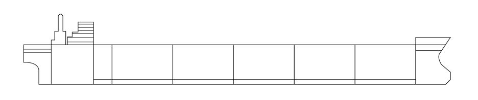

Bulkhead Isolation pattern is used to make sure that all our services work independently of each other and failure in one will not create a failure in another service. Techniques such as single-responsibility pattern, asynchronous-communication pattern, [Circuit Breaker](http://pradeeploganathan.com/patterns/circuit-breaker-pattern/) and [Retry pattern](http://pradeeploganathan.com/patterns/retry-pattern/) help achieve the goal of stopping a failure propagating throughout the whole application. To implement this pattern, all our services need to work independently of each other and failure in one should not create a failure in another service. We also need to partition the overall system into a few isolated groups, so that any failure in one partition does not percolate to others. Containerization and microservices are an option for having partitioned and isolated systems.

This pattern takes inspiration from partitioned parts of a ship's hull.  
A bulkhead is the partition built between different cargo sections in the ship. If any one section of the ship is breached, the bulkheads would prevent the water from flowing into the other sections. This allows the ship to continue to operate after what otherwise might have been a catastrophic failure.

Ship Bulkhead
