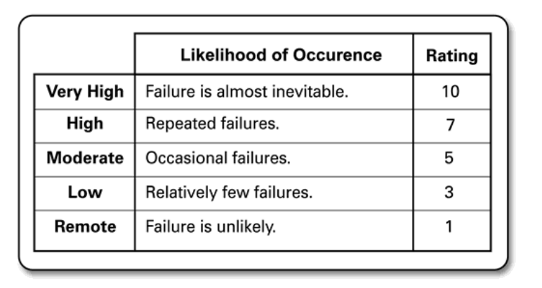
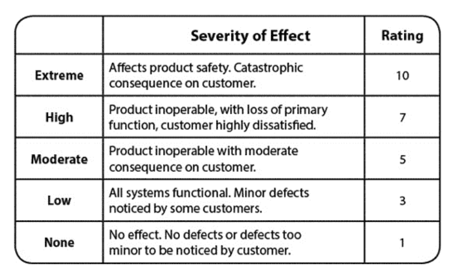

### Introduction

> _"Chaos Engineering is the discipline of experimenting on a system in order to build confidence in the system’s capability to withstand turbulent conditions in production."_
>
> Priciples of Chaos Engineering

### Introduction

In modern, rapidly evolving distributed systems, components fail all the time. These failures can be complex as they can cascade across systems. System weaknesses such as latency, race conditions, byzantine failures etc can be exacerbated in the face of large traffic volumes. Chaos engineering is key to discovering how these complex failures may affect the system and then validating over time that the weaknesses have been overcome.

Chaos Engineering is an experimental discipline that's used to test systems for fragility and build constructs that help a system survive chaos. Instead of waiting for things to break at the worst possible time, Chaos Engineering proactively injects failures in order to gauge how the system behaves in these scenarios. Applying chaos engineering improves the resilience of a system. Chaos engineering seeks to surface, explore, and test against system weaknesses through careful and controlled chaos experiments. Designing and executing chaos engineering experiments, helps learn about weaknesses in the system that could potentially lead to outages. These weaknesses can then be addressed proactively, going beyond the reactive processes that currently dominate most incident response models.

Chaos experiments can be planned as Game Days or automated chaos experiments. Gameday exercises are planned and scheduled in advance and all particpants are informed. Game Days provide a level of safety by running chaos experiments against a sandbox environment and ensuring that everyone — participants, observers, and external parties are aware of Game Day. Automated experiments could potentially be executed by anyone, at any time, and possibly against any system

### Principles of Chaos engineering

The principles of chaos engineering guide the design of the chaos engineering experiments. They are

- Hypothesize about steady state.
- Vary real-world events.
- Run experiments in production.
- Automate experiments to run continuously.
- Minimize blast radius.

### Hypothesize about steady state

Chaos engineering starts by identifying key metrics which characterize the steady state of a system. Steady state of a system can be identified by instrumenting the service with a metrics collection system. Metrics such as CPU load, memory utilization, network I/O, and all kinds of timing information can be used. Business metrics also play a key role in identifying the steady state of a system. Metrics such as page views, orders processed, carts saved, payments processed, emails sent etc are primary indicators of the health of a system and can be used to build a view of what comprises the steady state of a system. Chaos engineering uses these metrics to measure system drift.

Distributed systems specifically cloud based , are optimized for maximum gain. When throughput is maximized systems work close to the point of disruption. Highly efficient systems handle disruption badly. Chaos engineering provides the counter balance by optimizing systems for availability and tolerance along with designing for optimized throughput.

### Vary real world events

The next step is to build a failure _Hypothesis backlog_. This backlog is a collection of failure scenarios which can be built by analysing past incidents, building failure scenarios a.k.a _pre mortems_ etc. The backlog represents events which cause the system to deviate from its steady state. [Failure Mode and Effects Analysis (FMEA)](https://en.wikipedia.org/wiki/Failure_mode_and_effects_analysis) is then applied on the backlog to identify and organize it into potential failure models. FMEA is a bottoms-up analytical approach to system design that is used to assess failure impact. FMEA list the process steps, potential failure modes, potential failure effects, potential causes of failure and the potential control measures. An additional dimension of probability and criticality also need to be added. To do so, such analysis methods define and estimate the occurrence probability of each failure mode providing an evaluation of its consequences. Each backlog item can also be classified into a critical sytem feature such as reliability, safety, security, durability, availability etc. A Likelihood-Impact map can then be created to asses the probability and impact of each backlog item.

Likelihood Classification

Impact Classification

The variables in a chaos experiment should reflect real world events closely. They can be a combination or variation or multple real world events. Prioritize events based on the chaos backlog created previously.

### Run experiments in production

In Chaos engineering experiments should be run as close to production as possible and ideally directly in production. In distributed systems state is not limited to the stateful data contained in an individual service. The system state is composed of a lot of other factors such as configuration data ( static configuration as well as dynamic configuration injected at runtime ), in memory data structures , configuration data in containers, instances, network load balancers , auto scaling groups, switches, routers and other components. This state is very specific and a lot of times unique to each environment. In order to catch the threats to resiliency that Chaos Engineering is interested in, you need to expose experiments to the state problems that exist in the production environment and are unique to it.

Even if we could foresee all of the states of the system under our own control, we invariably depend on external systems, whose behavior we cannot possibly hope to know. On Prem systems depend on external services such as DNS, SMTP, Load balancers etc. Cloud based systems also depend on the infrastructure provided by the cloud providers. The only way to truly build confidence in the system at hand is to experiment with an authentic production environment rather than a synthetic non- production environment. While planning to run as close to production we should also be mindful of designing the experiment to minimize the blast radius.

### Automate experiments to run Continously

In Chaos Engineering, the execution of experiments, the analysis of the results, and the creation of new experiments should ideally be automated. Chaos tests enable the potential for “continuous chaos.” Continuous chaos means that you have regularly scheduled—often frequent—executions of your chaos tests. Usually chaos tests, rather than chaos experiments, are scheduled, because the intent is to validate that a weakness has not returned. The more frequently you schedule your chaos tests to run, the more often you can validate that a transient condition has not caused the weakness to return.

### Minimize blast radius

The idea of chaos experiments is to build confidence in the resilience of the system, one small and contained failure at a time. Chaos experiments should take careful, measured risks that build upon each other. A low-risk experiment involve few users, limited number of devices, limited user flows etc. To accomplish this, we inject failures that verify functionality for a subset or small group of clients/devices. When these low-risk experiments succeed, the next step is to run small-scale diffuse experiments. These experiments impact a small percentage of traffic and are evenly distributed throughout the production servers. These tests allow traffic to follow normal routing rules. The advantage of a small-scale diffuse experiment is that it does not cross thresholds that would open circuits. This allows to verify single-request fallbacks and timeouts. This verifies the systems resilience to transient errors. It can be used for verifying the logical correctness of fallbacks, but not the characteristics of the system during failure at scale.

> [https://github.com/worstcase/blockade](https://github.com/worstcase/blockade)

> Photo by [Dan Freeman](https://unsplash.com/@danfreemanphoto?utm_source=unsplash&utm_medium=referral&utm_content=creditCopyText) on [Unsplash](https://unsplash.com/search/photos/busy?utm_source=unsplash&utm_medium=referral&utm_content=creditCopyText)
