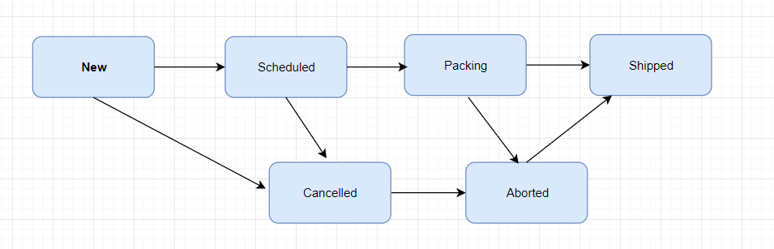

Many moons ago I was working on an online eCommerce platform. The platform used to undergo massive traffic spikes periodically.

I was trying to implement a distributed counter. I was using a distributed counter because I wanted to be able to increment the counter on multiple servers.

## CAP Theorem

The CAP theorem was proposed by Eric Brewer.

## CRDT

CRDT stands for conflict-free replicated datatype. Conflict-free replicated datatype describe data-types that can be replicated across multiple computation units or nodes, they can be updated concurrently without any coordination, and then merged to get a consistent state. It doesn’t matter in which order you execute operations on the data type or if you repeat operations the result is eventually correct. Each node in a distributed system has its own replica of the CRDT. Each replica can resolve queries in isolation and can also process commands that immediately alter its state. CRDTs  they can be concurrently updated across nodes and any conflicts can be resolved sensibly. CRDTs always have a merge function that can take many data entries living on different nodes and merge these automatically into one consistent view of the data, without any coordination between the nodes. CRDTs allow two conflicting updates to be merged. All replicas will converge to the same state when all updates have been delivered. The most important properties of the merge function are that it is symmetric and monotonic.
The issue that CRDTs address is conflict resolution when different versions of the structure appear due to network partitions and their eventual repair. For a general data structure, if there are two conflicting versions, the solution is either to choose one (according to some general rules, like take the random one or the latest one, or application-specific logic) or to keep both versions and defer conflict resolution to the client code. CRDTs are conflict-free, that is, the structures are devised so that any conflict is resolved automatically in a way that doesn’t bring any data loss or corruption.

<!--  -->



flowchart  LR
A(New):::class1 ----> B(Scheduled)
classDef class1 fill:#007ba7,stroke:#333,stroke-width:4px;
B:::class1 ----> C(Packing):::class2
C:::class1 ----> D(Shipped)
A --> E(Cancelled)
B --> E:::class1
E --> F(Aborted)
C --> F:::class1
F --> D:::class1

CRDT Walk path

Lets go through a simple example of how CRDT's work by walking through all possibilities of a simple Order processing workflow. Initially, define all possible status values and their merge order, as shown in figure. A graphical representation is the easiest way to get started when designing a CRDT with a small number of values. The states are represented by the rounded rectangles and their merge order indicated by the state progression arrows. So an order can progress from New to cancelled, or from scheduled to cancelled or from Packing to Aborted.

Lets assume two nodes report different status. Now we need to merge the two status . When merging two statuses, there are three cases.

- If both statuses are the same, then obviously you just pick that status.
- If one of them is reachable from the other by walking in the direction of the arrows, then you pick the one toward which the arrows are pointing; as an example, merging “New” and “Packing” will result in “Packing.”
- If that is not the case, then you need to find a new status that is reachable from both by walking in the direction of the arrows, but you want to find the closest such status (otherwise, “Shipped” would always be a solution, but not a useful one). There is only one example in this graph, which is merging “Packing” and “Cancelled,” in which case you choose “Aborted”—choosing “Shipped” would technically be possible and consistent, but that choice would lose information (you want to retain both pieces of knowledge that are represented by “Packing” and “cancelled”).

> Photo by [NeONBRAND](https://unsplash.com/@neonbrand?utm_source=unsplash&utm_medium=referral&utm_content=creditCopyText) on [Unsplash](https://unsplash.com/search/photos/conflict-free?utm_source=unsplash&utm_medium=referral&utm_content=creditCopyText)
