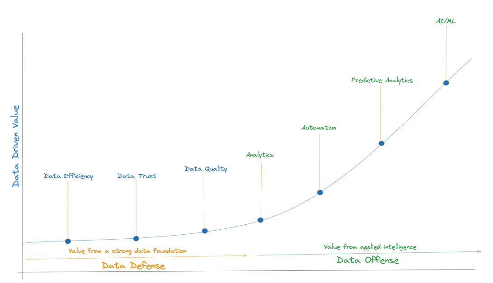
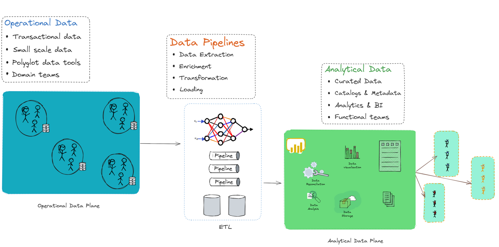
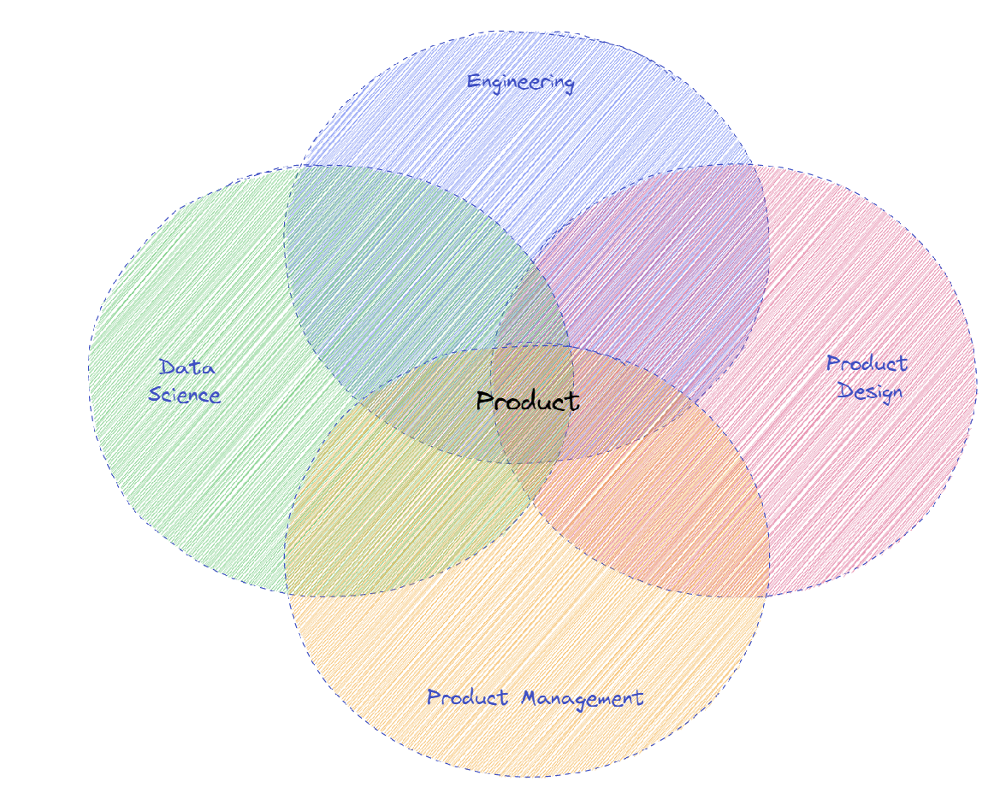
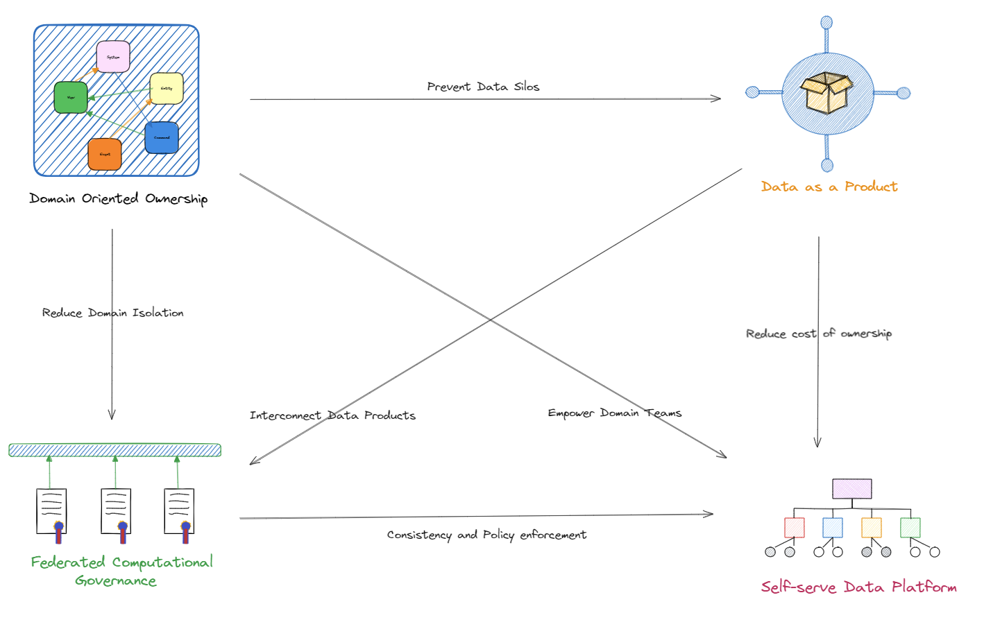

# Introduction

The proliferation and advancements in data analytics, AI, and machine learning provide unprecedented opportunities to harness data for strategic advantage. Data mesh architectures enable organizations to move up the continuum of data transformation from defensive to offensive capabilities to empower them to use data strategically. DataMesh empowers organizations to turn their data landscape into a platform enabling self-serve data products, fostering decentralization, scalability, and agility in data intelligence.

 To understand more about data mesh architectures, lets look at the evolution of data architectures and the forces that have influenced this evolution. Organizations generally start with a monolithic data architecture. The monolithic data architecture is characterized by a centralized approach to data storage, processing and analytical capabilities. As organizations grow, monolithic architecture often fall short.  Monolithic architectures often struggle with scalability. As data volumes and processing needs grow, these systems can become overloaded, leading to performance bottlenecks. As organizations start to feel this pain they generally evolve to hybrid data architectures. Hybrid data architectures is the most architectures across many organizations.

# Monolithic Data Architectures

# Hybrid Data Architectures

The operational data plane is responsible for handling the day-to-day operations of the business. It includes systems that support business processes, such as transaction processing systems, CRMs, ERPs, and other operational databases. This layer handles transactions and operations in real-time, ensuring immediate consistency and availability. This layer is optimized for OLTP (Online Transaction Processing) workloads, focusing on efficiently handling large numbers of transactions. As this layer deals with transactional data, it maintains strict data integrity rules and transactional consistency, often using ACID (Atomicity, Consistency, Isolation, Durability) properties.

Data pipelines are the conduits through which data flows from operational systems to analytical systems. They are responsible for extracting, transforming, and loading (ETL) data into a suitable format for analysis. The pipelines extract data from various operational data sources. This data is then cleaned, normalized, enriched, and transformed into a format suitable for analysis. This process might involve data deduplication, validation, and format standardization. The transformed data is then loaded into the analytical data plane's storage system. The extraction, transformation and loading of data is a resource intensive process. Data pipelines are often orchestrated and scheduled to run at specific intervals, ensuring optimum resource utilization and data freshness in the analytical systems.

The analytical data plane is optimized for data analysis and decision-making. It stores processed data from operational systems and is designed to handle complex queries and large-scale analytics. The analytical data plane includes components such as data warehouses/data lakes, data marts, analytical tools, Dashboards, reports and many others. Data warehouses and Data lakes are storage solutions optimized for querying and analyzing large datasets. Data warehouses provide structured data optimized for SQL queries, while data lakes offer raw, unstructured data suitable for big data processing. Tools such as Hadoop, Spark, or Flink are used for processing large volumes of data in parallel, handling complex analytical tasks or machine learning workloads. Business intelligence (BI) tools, reporting tools, and dashboards are used to visualize, report, and derive insights from data stored in date warehouses and data lakes.

This architecture is powerful and offers numerous benefits. This architecture separates the concerns of operational processing and analytical processing, allowing each layer to be optimized for its specific use case. The operational data plane ensures high performance and data integrity for business operations, while the analytical data plane provides the necessary infrastructure for deep analysis, insights, and decision support. Data pipelines play a crucial role in ensuring that the data flows smoothly between these planes, maintaining data quality and freshness. 

However, this architecture also comes with its own set of challenges and drawbacks. The ETL process in data pipelines can introduce latency. The time it takes to extract, transform, and load data can lead to delays in data availability in the analytical plane. Real-time or near-real-time analytics requirements can be hard to meet due to these inherent latencies. Ensuring data consistency across operational and analytical systems can be challenging. Data quality can be compromised during the transformation process if not handled meticulously, leading to unreliable insights and decisions. Integrating various data sources and systems can be complex and often requires significant effort in terms of middleware or custom integration development. As data volumes grow, scaling the data pipelines and storage efficiently while maintaining performance can become a significant challenge. This architecture requires upfront design to handle scalability, which can be complex and expensive.

# Data Mesh

Data Mesh architecture is a modern approach to data engineering and data operations that aims to improve the scalability, agility, and innovation of data teams within an organization. It promotes a  more decentralized, domain-oriented, and collaborative approach to data engineering, enabling organizations to scale, adapt, democratize, and govern their data effectively. It's a socio-technical approach that emphasizes decentralization of data ownership and architecture. This shift enables organizations to transition from a defensive approach to an offensive strategy, aimed at leveraging data for growth, innovation, and competitive advantage. Data defense is about protecting the organization's data assets, maintaining regulatory compliance, and managing risks. It focuses on ensuring the security, quality, and governance of data. Data offense, on the other hand, focuses on leveraging data to drive business growth, innovation, and competitive advantage. It's about extracting value from data, making informed decisions, and enhancing customer experiences. Understanding the differences between these strategies can help organizations balance their approach and harness the full potential of their data assets. 

In a Data Mesh architecture, data ownership is distributed among domain-oriented teams who are responsible for the data within their respective domains. These domain teams operate with a product mindset, treating data as a product and using product management practices to define data product roadmaps, iterate on data products, and align them with business needs. The concept of domain-oriented teams in data mesh architecture is based on the idea that data expertise should be distributed across the organization, rather than being concentrated in a central data team. By empowering domain-oriented teams with data ownership and autonomy, organizations can enable faster decision-making, agility, and innovation in their data operations. These teams have access to self-serve data infrastructure, which provides standardized data tools, services, and APIs allowing them to create, manage, and operate their data pipelines, data stores, and data products independently. This promotes agility and reduces dependence on centralized data engineering teams.

By adopting a Data Mesh approach, organizations aim to overcome the limitations of traditional centralized data engineering practices, such as data silos, lack of ownership, scalability and agility challenges.

## Key concepts of Data Mesh Architecture

### Domain Team

In a data mesh architecture, a domain team is structured around a specific business domain or capability. This team is responsible for the data within their domain, including the data pipelines, storage, and serving layers. The team consists of cross-functional members, including data engineers, data scientists, domain experts, and product owners.The domain team has the autonomy to make decisions about the data within their domain, including data quality, data formats, and data contracts. They work closely with other domain teams and the data platform team to ensure that their data is discoverable and accessible to the broader organization. This team is responsible for the architecture and design of the data domain. They may choose to use different architectural patterns such as [Lambda architecture](), [Kappa architecture]() and others.This team is responsible for defining and maintaining the data products that are specific to their domain. These data products are used by other teams within the organization to build applications and make data-driven decisions. The domain team is responsible for ensuring that the data products meet the needs of the organization and that they are aligned with the broader data mesh architecture principles. This fosters a data product thinking mindset within domain-oriented teams, treating data as a valuable product that can be used to drive business outcomes.

### Data Product

A data product is a software application, tool, or service that leverages data as a primary input to deliver value to users or customers. Data products are designed to extract insights, generate meaningful information, or enable data-driven decision making. They can take various forms, such as dashboards, reports, APIs, machine learning models, data visualizations, data analytics tools, data processing pipelines, data integration tools, data cataloging and discovery platforms, and more. Data products are typically built by data teams or data engineers who use data engineering, data science, and software development skills to design, develop, and deploy data-driven applications. These products are often used by business stakeholders, analysts, data scientists, and other users to interact with and derive insights from data. Data products are different from traditional data pipelines or data warehouses, as they are typically more user-centric and focus on delivering actionable insights or valuable information to end users. They are designed with user experience, usability, and data accessibility in mind. Data products can be used for various purposes, such as data exploration, data visualization, data analysis, data discovery, data monitoring, data prediction, and data-driven decision making.

Data Mesh also emphasizes the use of modern data practices such as event-driven architecture, dataOps, and data meshOps, which align with the principles of DevOps and Agile methodologies. Additionally, Data Mesh encourages the use of data mesh patterns, such as data product thinking, data discovery, and data infrastructure as code, to enable efficient and effective data operations.

Overall, Data Mesh architecture aims to decentralize data ownership, promote product thinking, enable self-serve data infrastructure, treat data as a first-class citizen, democratize data access, and foster a culture of collaboration. By adhering to these principles, organizations can improve their data operations and drive data-driven agility and innovation.

*Data Mesh Architecture*

## Principles of Data Mesh Architecture

Data Mesh architecture is based on a set of key principles that provide a foundation for its design and implementation. These principles are:

1. Domain-oriented ownership: Data is owned by domain-oriented teams who are responsible for the data within their respective domains. This promotes data autonomy and accountability, allowing domain teams to make decisions on data models, data pipelines, and data products that are aligned with their specific domain needs. These teams are responsible for data architecture for the respective domains

2. Data as a Product (DaaP): Data is treated as a product, and data teams operate with a product mindset. This includes applying product management practices such as understanding customer needs, defining data product roadmaps, and iterating on data products based on feedback and data-driven insights.

3. Self-serve data infrastructure: Data teams have access to self-serve data infrastructure that allows them to create, manage, and operate their data pipelines, data stores, and data products independently. This promotes agility and reduces dependence on centralized data engineering teams for day-to-day data operations.

4. Federated data governance: This principle refers to the distributed and collaborative approach to data governance across domain-oriented teams in a data mesh architecture. In a data mesh, each domain-oriented team is responsible for the data products and services within their domain, including data ingestion, data storage, data processing, and data serving. This decentralized approach allows domain-oriented teams to have ownership and autonomy over their data assets and enables them to iterate and innovate faster.

These principles lay emphasis on

1. Data as a first-class citizen: Data is treated as a first-class citizen in the organization, with proper governance, quality, and security measures in place. This includes establishing data standards, data lineage, data quality checks, and data security protocols to ensure data integrity and compliance.

2. Platform thinking: Data infrastructure is treated as a platform that provides standardized data tools, services, and APIs that can be leveraged by domain teams to build and operate their data products. This promotes consistency, reusability, and scalability across different domains.

3. Democratized data access: Data is democratized and made accessible to various stakeholders across the organization. This includes providing self-service data access tools and technologies that empower business users, data scientists, and other stakeholders to access and analyze data without relying on data teams for every data request.

4. Culture of collaboration: Data teams collaborate closely with domain teams, business stakeholders, and other data teams to ensure alignment, knowledge sharing, and cross-domain learning. This promotes a culture of collaboration, innovation, and continuous improvement in the organization.

These key principles of Data Mesh architecture emphasize domain-centric ownership, product thinking, self-serve data infrastructure, platform thinking, data governance, democratized data access, and a culture of collaboration. By adhering to these principles, organizations can unlock the benefits of Data Mesh architecture and enable data-driven agility and innovation in their data operations. The concept of distributed ownership of data products also ensures that each domain is responsible for all aspects of the data lifecycle such as ingestion, mapping lineage, quality, consolidation etc. Applying these principles in an iterative approach across the domains listed above would result in an architectural evolution to data mesh similar to the below.

This empowers teams to define and manage the lifecycle of the data product.

## Challenges of implementing a Data mesh architecture

Implementing a data mesh architecture can come with its own set of challenges. Some of the key challenges that organizations may face when implementing a data mesh architecture are:

1. Cultural Shift: The primary challenge in implementing a data mesh architecture is the cultural shift required within an organization. Data mesh promotes a shift towards domain-oriented teams, where data ownership and responsibilities are distributed across different teams. This can require changes to the organization's culture, structure, and mindset, including fostering a culture of collaboration, empowerment, and accountability.

2. Skill Set and Talent: Implementing a data mesh architecture may require a different skill set and talent pool compared to traditional data engineering approaches. Domain-oriented teams need to have the necessary skills in data engineering, data modeling, data governance, data quality, and domain expertise, among others. Organizations may need to invest in the right tools, training and hiring talent with the right skill set required to support a data mesh architecture.

3. Data Governance and Security: Distributing data ownership and responsibilities across domain-oriented teams in a data mesh architecture can present challenges in maintaining consistent data governance and security practices. Ensuring data consistency, data quality, data privacy, and data security can require robust governance processes, data standards, and data policies across different domains, teams, and technologies.

4. Data Integration and Interoperability: In a data mesh architecture, data is distributed across different domain-oriented teams, and integrating data from different domains can be challenging. Organizations may need to establish robust data integration and interoperability mechanisms, such as data APIs, data pipelines, or data sharing agreements, to enable seamless data exchange and collaboration between different domain-oriented teams.

5. Scalability and Complexity: Implementing a data mesh architecture can introduce complexity and scalability challenges. With multiple domain-oriented teams working independently, managing and scaling the data platform, data infrastructure, and data processing pipelines can become complex. Organizations need to carefully plan for scalability, performance, and complexity management to ensure smooth operations of the data mesh architecture.

6. Change Management: Implementing a data mesh architecture involves significant changes in the organization's data engineering practices, team structure, and data ownership. Change management can be challenging, and organizations need to carefully plan and manage the change process, including stakeholder engagement, communication, and training, to ensure successful adoption of data mesh architecture.

7. Tooling and Technology: Data mesh architecture emphasizes the use of self-serve data infrastructure and tooling by domain-oriented teams. Organizations may need to evaluate, select, and implement appropriate data tools and technologies that align with the principles of data mesh architecture. This can involve challenges in tooling standardization, integration, and maintenance.

These are some of the challenges that organizations may face when implementing a data mesh architecture. However, with proper planning, governance, collaboration, and change management, these challenges can be overcome, and organizations can reap the benefits of a data mesh architecture in terms of improved data agility, scalability, and innovation.

# Conclusion

In conclusion, data mesh architecture is a modern approach to data engineering that addresses some of the challenges of traditional data architectures. It emphasizes the principles of domain-oriented teams, self-serve data infrastructure, and data product thinking to enable organizations to scale data capabilities, improve data agility, and foster a culture of data ownership and collaboration. By distributing data responsibilities across domain-oriented teams, organizations can harness the collective expertise and creativity of their teams to drive innovation and deliver value from their data assets.

We explored the key principles of data mesh architecture, including domain-oriented teams, product thinking, self-serve infrastructure, and platform thinking. We also discussed how data mesh architecture differs from traditional data warehousing, data lake, and monolithic data architectures, highlighting the advantages of a distributed and collaborative approach.

Implementing a data mesh architecture comes with its own set of challenges, including cultural shift, skill set and talent, data governance and security, data integration and interoperability, scalability and complexity, and change management. However, with proper planning, governance, collaboration, and change management, these challenges can be overcome, and organizations can realize the benefits of improved data agility, scalability, and innovation.

In today's data-driven world, organizations need to adapt and evolve their data engineering practices to keep up with the growing demands of data processing, analytics, and insights. Data mesh architecture provides a promising approach that empowers domain-oriented teams, fosters collaboration, and enables organizations to unlock the true potential of their data assets. By embracing the principles of data mesh architecture, organizations can position themselves for success in the data-driven era and drive meaningful business outcomes.