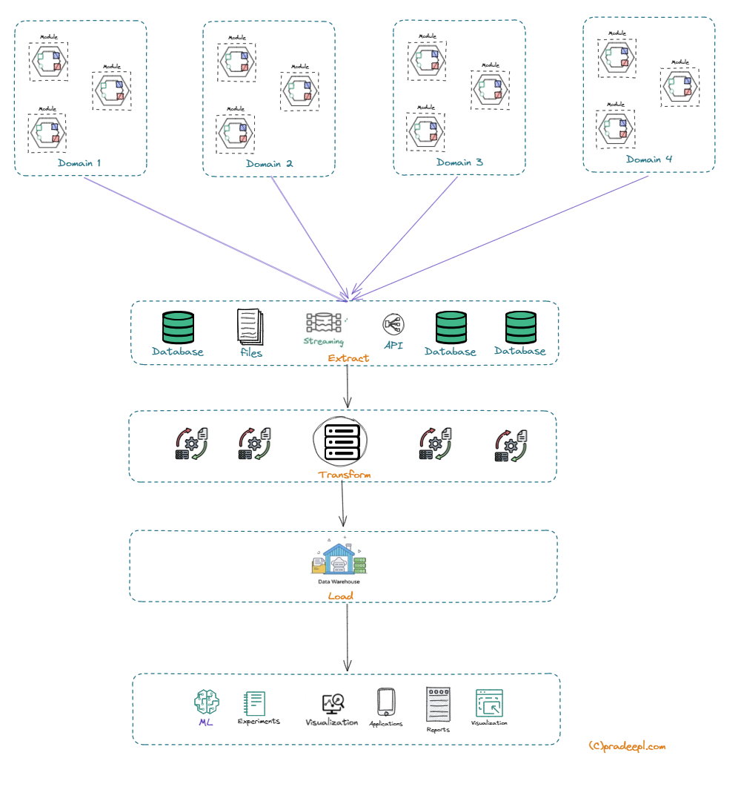
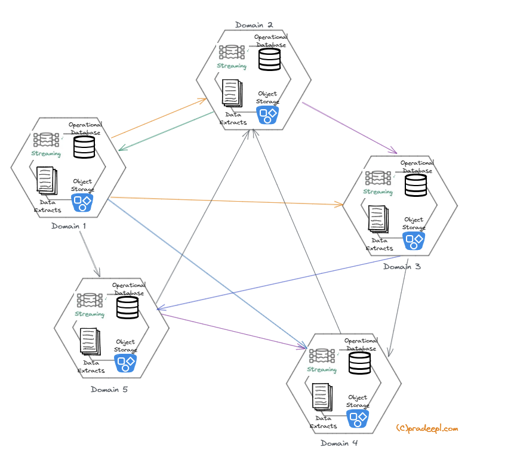
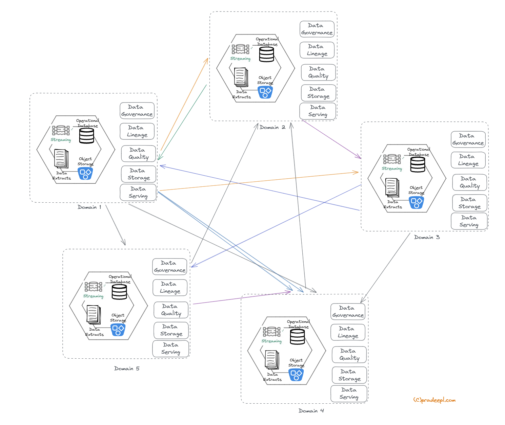

## Introduction

Data Mesh architecture is a modern approach to data engineering and data operations that aims to improve the scalability, agility, and innovation of data teams within organizations. It promotes a  more decentralized, domain-oriented, and collaborative approach to data engineering, enabling organizations to scale, adapt, democratize, and govern their data effectively. It is based on the principles of domain-oriented ownership, product thinking, self-serve data infrastructure, platform thinking, data as a first-class citizen, democratized data access, and a culture of collaboration.

In a Data Mesh architecture, data ownership is distributed among domain-oriented teams who are responsible for the data within their respective domains. These domain teams operate with a product mindset, treating data as a product and using product management practices to define data product roadmaps, iterate on data products, and align them with business needs. The concept of domain-oriented teams in data mesh architecture is based on the idea that data expertise should be distributed across the organization, rather than being concentrated in a central data team. By empowering domain-oriented teams with data ownership and autonomy, organizations can enable faster decision-making, agility, and innovation in their data operations. These teams have access to self-serve data infrastructure, which provides standardized data tools, services, and APIs allowing them to create, manage, and operate their data pipelines, data stores, and data products independently. This promotes agility and reduces dependence on centralized data engineering teams.

By adopting a Data Mesh approach, organizations aim to overcome the limitations of traditional centralized data engineering practices, such as data silos, lack of ownership, scalability and agility challenges. 

## Monolithic Data Architectures

The most prevalent architecture currently is the Monolithic data architecture with a centralized data warehouse or data lake. In this design, data is ingested, stored, and processed in a central repository such as a data warehouse or data lake. Data is then made available to various data consumers and applications for analysis and insights. It serves the needs for several  business units using a single data model. This approach provides a unified data repository and central data governance but may face challenges in scalability, flexibility, and agility for domain-specific data operations.

A data warehouse or data lake is a centralized data storage system that is designed for efficient querying and analysis of large volumes of data from various sources. Centralized Data warehouses are used by organizations to support decision-making processes, enable data-driven insights, and facilitate business intelligence (BI) and analytics.

In this architecture, data is ingested from various sources into a centralized data storage and processing layer. Data is then analyzed using data analytics tools , and data governance policies and practices are enforced. Data operations, such as data integration, transformation, and management, are also performed within this centralized data storage and processing layer.

*Monolithic Datawarehouse*

An evolution of this architecture is the Hub and Spoke data architecture, where a central data hub acts as the primary repository for data, and data spokes that are connected to the hub ingest data from various sources. The central data hub is responsible for data integration, transformation, and storage, while the data spokes are responsible for data ingestion from different sources. Some organizations also create data marts. Data marts are specialized, smaller-scale data repositories that are designed for specific business units or departments within an organization. Data is extracted, transformed, and loaded into data marts to serve the data needs of specific business units or departments, often with a focus on specific data domains or use cases.

The design of a Centralized data warehouse and its variants creates several challenges, such as:

1. Scalability: Centralized data warehouses may have limitations in terms of scalability, as they are often built on fixed hardware infrastructure that may not easily accommodate growing data volumes or changing data requirements. Scaling up or out may be time-consuming and expensive.

2. Cost: Centralized data warehouses typically require significant upfront investments in hardware, software, and skilled personnel for setup, maintenance, and ongoing operations. These costs can be prohibitive for smaller organizations or those with limited budgets.

3. Complexity: Centralized data warehouses can be complex to set up, configure, and maintain, as they often involve multiple components such as database servers, ETL processes, data integration, and data modeling. Managing these components and ensuring their interoperability can be challenging.

4. Data Integration: Centralized data warehouses may face challenges in integrating data from diverse sources, as they may require complex ETL processes, data mapping, and data consolidation. Data integration may require significant time and effort, and changes in data sources may require updates to the ETL processes and data models.

5. Latency: Centralized data warehouses have limitations in handling real-time data or near-real-time data, as data may need to go through ETL processes before being loaded into the data warehouse. This can result in data latency, which may not be suitable for organizations that require up-to-date insights from their data. Most organizations generally have a latency of 16 - 24 hours before the data warehouse has the necessary data ready to be served up.

6. Agility: Centralized data warehouses may lack the agility required to quickly adapt to changing business requirements or data needs. Changes in data sources, data models, or data processing requirements may require significant effort and time to implement in traditional data warehouse architectures.

7. Data Governance: Centralized data warehouses may face challenges in implementing robust data governance practices, such as data lineage, data quality, and data security. Ensuring consistent data governance across the data warehouse may require additional effort and resources.

8. Vendor Lock-In: Centralized data warehouses may be tied to specific vendors or technologies, which may result in vendor lock-in and limit the organization's ability to switch to different technologies or vendors in the future.

9. Performance: Centralized data warehouses may face performance challenges in handling large data volumes, complex queries, or high concurrency. Tuning and optimizing performance in traditional data warehouses requires specialized skills and expertise.

10. Data Privacy and Compliance: Centralized data warehouses may face challenges in meeting data privacy and compliance requirements, such as GDPR, HIPAA, or industry-specific regulations. Ensuring compliance and data privacy in Centralized data warehouses may require additional efforts in terms of data masking, data encryption, and access controls.

11. Data Innovation and Experimentation: In traditional data architectures, innovation and experimentation with new data technologies or approaches may be challenging due to centralized control and rigid processes. Data Mesh encourages domain teams to experiment and innovate with new data technologies, tools, and approaches within their domains, fostering a culture of continuous improvement and innovation.

Monolithic Data Architecture also results in data-related tasks and responsibilities to be consolidated within a single team or department, covering data engineering, data science, data analytics, data governance, and data operations. In this architecture data governance policies, standards, and practices are enforced centrally by the data team, covering all data-related tasks. Monolithic Data Architecture provides a single point of control and coordination for data initiatives, which can be beneficial in organizations with centralized data management requirements, strict data governance policies, and standardized data processing. However, it may face challenges in agility, autonomy, and scalability, especially in organizations with diverse data needs across different domains or business units. Most of these challenges vary depending on the specific architecture and implementation, as well as the organization's data requirements, size, and industry. However, these challenges are some of the common ones that organizations face when working with a monolithic data architecture with a centralized data warehouse/data lake.

Data mesh architectures attempts to resolve these challenges by scaling out data lifecycle processes by enabling teams to manage data where it originates and ensures scalability and agility.

## Key concepts of Data Mesh Architecture

In a Data mesh architecture data is treated as a first-class citizen, with proper data governance, quality, and security measures in place. Democratized data access is enabled, providing self-service data access tools and technologies that empower business users, data scientists, and other stakeholders to access and analyze data without relying on data teams for every data request.

Data teams collaborate closely with domain teams, business stakeholders, and other data teams to ensure alignment, knowledge sharing, and cross-domain learning. This promotes a culture of collaboration, innovation, and continuous improvement in the organization. Data teams are groups of individuals within an organization who are responsible for various aspects of data-related tasks, such as data engineering, data science, data analytics, data governance, and data operations. These teams work collaboratively to manage and leverage data assets to support the organization's objectives and goals.This team typically consist of professionals with diverse skills and expertise, including data engineers who design and implement data pipelines and data infrastructure, data scientists who develop models and algorithms to extract insights from data, data analysts who analyze data and generate actionable insights, and data governance professionals who ensure data quality, security, and compliance.

Data Mesh also emphasizes the use of modern data practices such as event-driven architecture, dataOps, and data meshOps, which align with the principles of DevOps and Agile methodologies. Additionally, Data Mesh encourages the use of data mesh patterns, such as data product thinking, data discovery, and data infrastructure as code, to enable efficient and effective data operations.

Overall, Data Mesh architecture aims to decentralize data ownership, promote product thinking, enable self-serve data infrastructure, treat data as a first-class citizen, democratize data access, and foster a culture of collaboration. By adhering to these principles, organizations can improve their data operations and drive data-driven agility and innovation.

*Data Mesh Architecture*

### Principles of Data Mesh Architecture

Data Mesh architecture is based on a set of key principles that provide a foundation for its design and implementation. These principles include:

1. Domain-oriented ownership: Data is owned by domain-oriented teams who are responsible for the data within their respective domains. This promotes data autonomy and accountability, allowing domain teams to make decisions on data models, data pipelines, and data products that are aligned with their specific domain needs.

2. Product thinking: Data is treated as a product, and data teams operate with a product mindset. This includes applying product management practices such as understanding customer needs, defining data product roadmaps, and iterating on data products based on feedback and data-driven insights.

3. Self-serve data infrastructure: Data teams have access to self-serve data infrastructure that allows them to create, manage, and operate their data pipelines, data stores, and data products independently. This promotes agility and reduces dependence on centralized data engineering teams for day-to-day data operations.

4. Platform thinking: Data infrastructure is treated as a platform that provides standardized data tools, services, and APIs that can be leveraged by domain teams to build and operate their data products. This promotes consistency, reusability, and scalability across different domains.

5. Data as a first-class citizen: Data is treated as a first-class citizen in the organization, with proper governance, quality, and security measures in place. This includes establishing data standards, data lineage, data quality checks, and data security protocols to ensure data integrity and compliance.

6. Federated data governance: This principle refers to the distributed and collaborative approach to data governance across domain-oriented teams in a data mesh architecture. In a data mesh, each domain-oriented team is responsible for the data products and services within their domain, including data ingestion, data storage, data processing, and data serving. This decentralized approach allows domain-oriented teams to have ownership and autonomy over their data assets and enables them to iterate and innovate faster.

7. Democratized data access: Data is democratized and made accessible to various stakeholders across the organization. This includes providing self-service data access tools and technologies that empower business users, data scientists, and other stakeholders to access and analyze data without relying on data teams for every data request.

8. Culture of collaboration: Data teams collaborate closely with domain teams, business stakeholders, and other data teams to ensure alignment, knowledge sharing, and cross-domain learning. This promotes a culture of collaboration, innovation, and continuous improvement in the organization.

These key principles of Data Mesh architecture emphasize domain-centric ownership, product thinking, self-serve data infrastructure, platform thinking, data governance, democratized data access, and a culture of collaboration. By adhering to these principles, organizations can unlock the benefits of Data Mesh architecture and enable data-driven agility and innovation in their data operations. The concept of distributed ownership of data products also ensures that each domain is responsible for all aspects of the data lifecycle such as ingestion, mapping lineage, quality, consolidation etc. Applying these principles in an iterative approach across the domains listed above would result in an architectural evolution to data mesh similar to the below.

This empowers teams to define and manage the lifecycle of the data product.

## Challenges of implementing a Data mesh architecture

Implementing a data mesh architecture can come with its own set of challenges. Some of the key challenges that organizations may face when implementing a data mesh architecture are:

1. Cultural Shift: The primary challenge in implementing a data mesh architecture is the cultural shift required within an organization. Data mesh promotes a shift towards domain-oriented teams, where data ownership and responsibilities are distributed across different teams. This can require changes to the organization's culture, structure, and mindset, including fostering a culture of collaboration, empowerment, and accountability.

2. Skill Set and Talent: Implementing a data mesh architecture may require a different skill set and talent pool compared to traditional data engineering approaches. Domain-oriented teams need to have the necessary skills in data engineering, data modeling, data governance, data quality, and domain expertise, among others. Organizations may need to invest in the right tools, training and hiring talent with the right skill set required to support a data mesh architecture.

3. Data Governance and Security: Distributing data ownership and responsibilities across domain-oriented teams in a data mesh architecture can present challenges in maintaining consistent data governance and security practices. Ensuring data consistency, data quality, data privacy, and data security can require robust governance processes, data standards, and data policies across different domains, teams, and technologies.

4. Data Integration and Interoperability: In a data mesh architecture, data is distributed across different domain-oriented teams, and integrating data from different domains can be challenging. Organizations may need to establish robust data integration and interoperability mechanisms, such as data APIs, data pipelines, or data sharing agreements, to enable seamless data exchange and collaboration between different domain-oriented teams.

5. Scalability and Complexity: Implementing a data mesh architecture can introduce complexity and scalability challenges. With multiple domain-oriented teams working independently, managing and scaling the data platform, data infrastructure, and data processing pipelines can become complex. Organizations need to carefully plan for scalability, performance, and complexity management to ensure smooth operations of the data mesh architecture.

6. Change Management: Implementing a data mesh architecture involves significant changes in the organization's data engineering practices, team structure, and data ownership. Change management can be challenging, and organizations need to carefully plan and manage the change process, including stakeholder engagement, communication, and training, to ensure successful adoption of data mesh architecture.

7. Tooling and Technology: Data mesh architecture emphasizes the use of self-serve data infrastructure and tooling by domain-oriented teams. Organizations may need to evaluate, select, and implement appropriate data tools and technologies that align with the principles of data mesh architecture. This can involve challenges in tooling standardization, integration, and maintenance.

These are some of the challenges that organizations may face when implementing a data mesh architecture. However, with proper planning, governance, collaboration, and change management, these challenges can be overcome, and organizations can reap the benefits of a data mesh architecture in terms of improved data agility, scalability, and innovation.

## Conclusion

In conclusion, data mesh architecture is a modern approach to data engineering that addresses some of the challenges of traditional data architectures. It emphasizes the principles of domain-oriented teams, self-serve data infrastructure, and data product thinking to enable organizations to scale data capabilities, improve data agility, and foster a culture of data ownership and collaboration. By distributing data responsibilities across domain-oriented teams, organizations can harness the collective expertise and creativity of their teams to drive innovation and deliver value from their data assets.

We explored the key principles of data mesh architecture, including domain-oriented teams, product thinking, self-serve infrastructure, and platform thinking. We also discussed how data mesh architecture differs from traditional data warehousing, data lake, and monolithic data architectures, highlighting the advantages of a distributed and collaborative approach.

Implementing a data mesh architecture comes with its own set of challenges, including cultural shift, skill set and talent, data governance and security, data integration and interoperability, scalability and complexity, and change management. However, with proper planning, governance, collaboration, and change management, these challenges can be overcome, and organizations can realize the benefits of improved data agility, scalability, and innovation.

In today's data-driven world, organizations need to adapt and evolve their data engineering practices to keep up with the growing demands of data processing, analytics, and insights. Data mesh architecture provides a promising approach that empowers domain-oriented teams, fosters collaboration, and enables organizations to unlock the true potential of their data assets. By embracing the principles of data mesh architecture, organizations can position themselves for success in the data-driven era and drive meaningful business outcomes.