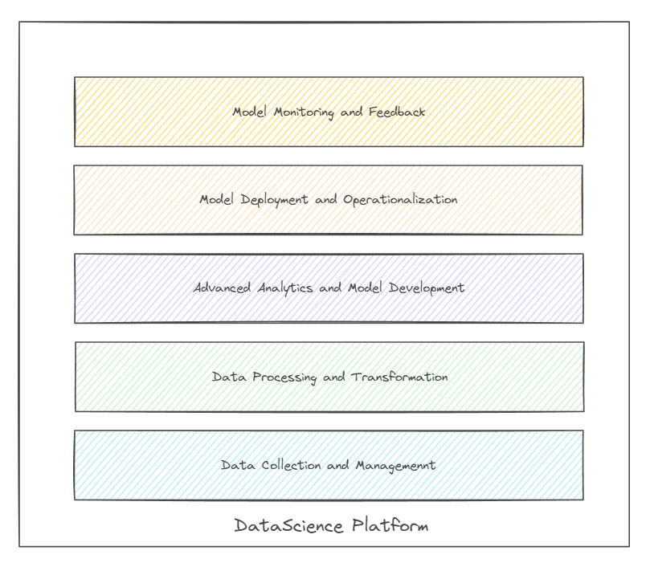

# Building a Data Science Platform with Open-Source Technologies

Imagine this: you’ve built a machine learning model that could save your company millions of dollars by identifying customers at risk of leaving. But instead of driving business decisions, the model ends up forgotten in a spreadsheet. Sound familiar? Unfortunately, this scenario happens far too often. A staggering [87% of data science projects](https://www.rexeranalytics.com/data-science-survey) never make it to production.

Why? The journey from raw data to impactful insights is fraught with challenges—disconnected tools, manual processes, and limited collaboration. Open-source data science platforms offer a way to bridge these gaps and turn potential into real-world impact.

In this blog, we’ll explore how open-source technologies can help you build a data science platform that simplifies workflows, fosters innovation, and makes collaboration seamless. Whether you're starting fresh or optimizing an existing setup, this guide will help you design a platform that unlocks the full value of your data.

---

## Why Build a Data Science Platform?

What if your team could stop wrestling with tools and start solving real problems? What if data scientists could focus on discovering insights instead of configuring environments? 

A data science platform provides the infrastructure and tools needed to transform raw data into actionable insights. Think of it as a workshop where data engineers, scientists, and analysts can collaborate to create meaningful solutions. Open-source platforms take this a step further by offering flexibility, cost-efficiency, and access to cutting-edge innovations from global communities.

---

## Key Components of a Data Science Platform

Let’s break down the journey of turning data into insights into five key layers. Each layer plays a critical role in ensuring your data science platform isn’t just functional but transformative.

 Conceptual Data Science Platform

### 1. Data Collection and Management: The Foundation

Every great structure starts with a solid foundation. For a data science platform, this means collecting and organizing your data effectively. But how do you unify data scattered across marketing systems, CRM tools, and social media platforms? How much more valuable would your data be if you could access, process, and trust it instantly?

Open-source tools like **PostgreSQL**, **Apache Kafka**, and **Apache Spark** make this possible. PostgreSQL offers reliable and structured storage, Kafka manages real-time data streams, and Spark ensures scalability for large datasets. Together, they form a cohesive foundation for your platform.

---

### 2. Data Processing and Transformation: The Refinery

Imagine transforming a tangled ball of yarn into a neatly woven fabric. That’s what data processing achieves. At this stage, data engineers and scientists collaborate to clean, transform, and prepare data for analysis.

Open-source tools like **Apache Airflow** and **dbt** streamline workflows, while **Pandas** and **PySpark** empower teams to manipulate data at scale. The goal? To turn messy, inconsistent data into a clean, structured format ready for analysis.

---

### 3. Advanced Analytics and Model Development: The Art of Discovery

What untapped opportunities could your data reveal if you had the tools to explore it freely? This is where the magic happens. Data scientists dive into the prepared data, using tools like **Jupyter Notebooks**, **scikit-learn**, and **TensorFlow** to uncover patterns and build predictive models.

The flexibility of open-source tools allows teams to experiment rapidly, scale workloads using **Docker** and **Kubernetes**, and deploy models that can adapt to real-world demands.

---

### 4. Deployment and Operationalization: From Lab to Reality

Operationalizing models is like putting a theory into practice—it’s where the value becomes real. A brilliant model is useless unless it can be deployed where it’s needed. Open-source frameworks like **MLflow** and **Kubeflow** simplify this process, enabling seamless integration with business systems.

Using **Kubernetes**, you can scale deployments effortlessly while monitoring performance with tools like **Prometheus** and **Grafana**. This ensures your models are not just operational but optimized.

---

### 5. Monitoring and Feedback: Closing the Loop

How do you ensure your insights remain relevant in a world that’s constantly changing? Once deployed, models need continuous care. Are they still accurate? Are they drifting from real-world trends? Tools like **Evidently AI** and **ELK Stack** (Elasticsearch, Logstash, Kibana) help teams monitor performance and refine models based on feedback.

---

## The Open-Source Advantage

By choosing open-source technologies, you’re not just adopting tools—you’re joining a global movement. Open-source platforms give you access to innovation, flexibility to customize solutions, and the power to scale cost-effectively.

Imagine building a platform that evolves with your needs, supported by a vibrant community of contributors. That’s the promise of open source.

---

## A Call to Action

What if your data could do more? What if your team could collaborate better, innovate faster, and drive smarter decisions—all using tools that are accessible and flexible?

Building a data science platform is not just a technical endeavor; it’s an opportunity to rethink how your organization approaches data. With open-source technologies, the possibilities are endless.

Stay tuned for the next blog in this series, where we’ll dive deeper into the first layer: **Data Collection and Management** using open-source tools.
