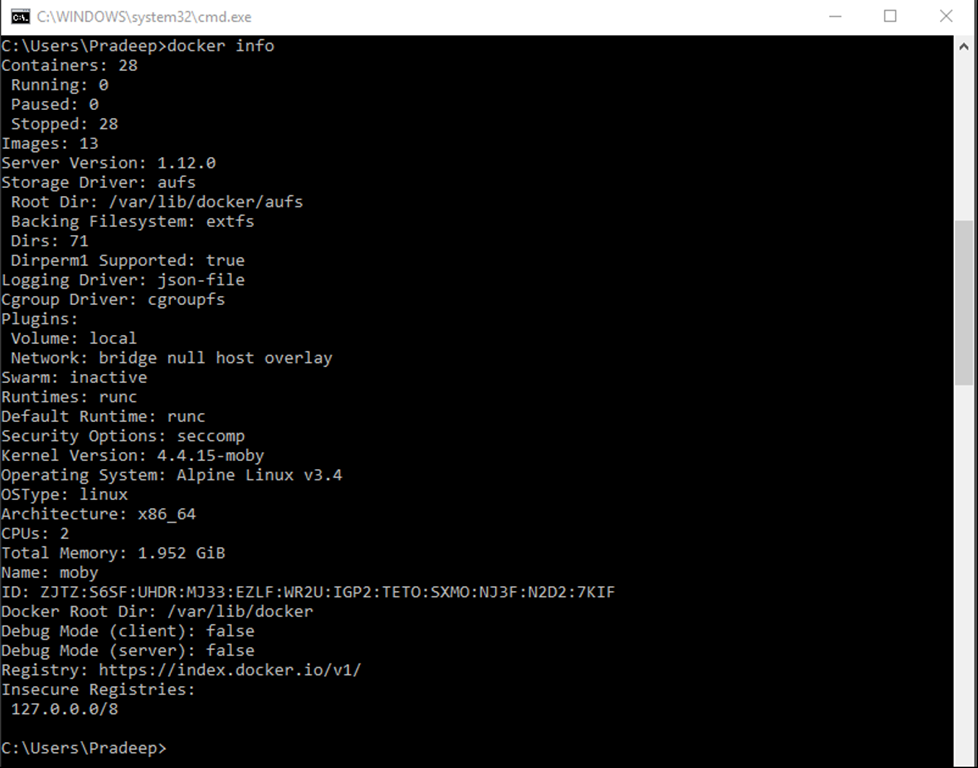

This post is part of a three-post series on Docker

- [What is Docker](https://pradeeploganathan.com/docker/docker-part-1/)
- [Docker Architecture](https://pradeeploganathan.com/docker/docker-architecture/) 
- [Docker on Windows](https://pradeeploganathan.com/docker/docker-part-3-installing-docker-on-windows/)

The concept of containers has been on the making for some time. Docker is currently available in two primary flavors namely, Docker for Linux and Docker for Windows based on the platform on which it is running. Docker for Mac is a version of Docker for Linux. It is also available on all cloud platforms such as Azure, AWS, Google Cloud, and others. The Docker architecture is different based on the platform on which it is running.

## Docker for Linux - Kernel Architecture

Docker for Linux - Architecture

### Linux constructs for containerization

Docker for Linux uses a bunch of Linux constructs to enable containerization of applications. Some of these are

#### **CGroups**

CGroups or control groups provides a mechanism to manage, isolate and limit a group of processes. They allow the control of several aspects of the group's use of resources. Limits can be applied on shared resources such as CPU, Memory, network, or Disk IO. CGroups also allow for accounting, checkpointing, and restarting groups of processes. Cgroups can also be used to snapshot and restore the state of running processes. CGroups were originally implemented by the Engineers at Google in 2006 and was merged into the Linux kernel version 2.6.24, released in January 2008. The Linux Kernel documentation states it succinctly as

> "Control Groups provide a mechanism for aggregating/partitioning sets of tasks, and all their future children, into hierarchical groups with specialized behaviour."
> 
> [https://www.kernel.org/doc/Documentation/cgroup-v1/cgroups.txt](https://www.kernel.org/doc/Documentation/cgroup-v1/cgroups.txt)

Control groups are split into different subsystems, such as CPU, CPU sets, memory block I/O, and so on. Each subsystem can be used independently or can be grouped with others. Some of the subsystems managed by cgroups are

- blkio: Sets I/O access to and from block devices, such as disks, SSD's etc. This tracks the I/O usage per group, across the read and write activity per block device. Limits can be set by throttling per group on specific devices.
- Cpu: Limits access to CPU. This CGroup keeps track of user and system CPU time and usage per CPU. It allows you to set weights, but not limits.
- Cpuset: Assigns CPUs on a multicore system to tasks in a cgroup, pinning a group to a specific CPU in a multicore system. Applications can be pinned to a specific CPU.
- Cpuacct: Generates CPU resource utilization.
- Memory: Sets limits on memory use by tasks in a cgroup. It can define limits for physical, kernel, and total memory.
- Devices: Grants devices access to a set of tasks in a group.
- Freezer: Suspends or resumes tasks in a cgroup.

Control Groups ensure that containers cannot suffer from the noisy-neighbor syndrome, where a single container can consume most or all the available resources of the whole Docker host.

#### **Namespaces** 

Namespaces are a kernel security feature that was introduced in Linux kernel version 2.4.19 in 2002. A namespace is an abstraction of global resources such as filesystems, network access, process tree, user IDs etc. Linux namespaces are used to create process that are isolated from the rest of the system without the need to use low level virtualization technology. Each process can be assigned to a namespace and can then only see the resources connected to that namespace. Namespaces limit the visibility a process has on the networking, filesystems, and user ID components of other processes. Container processes are limited to seeing only what is in the same namespace. Linux namespaces are created via the syscall unshare. clone and setns syscalls allow us to manipulate namespaces.

Some of the resources that can be namespaced are:

- PID: Provides process isolation by providing an independent set of process IDs from other namespaces. The process ID namespace is nested. Hence, the host can only see the processes running inside of the containers when inspecting the process list.
- Network: A network namespace contains one or more network interfaces. The namespace has its own private network resources, such as addresses, the routing table, and firewall. Process namespacing allows us to run two instances of apache on different containers and network namespacing allows both these instances of apache webserver to listen on port 80 on the same host.
- IPC: Manages access to interprocess communication & isolates them to a container. IPC provides for message queues, semaphores, and shared memory segments.
- Mount: Mount namespaces control access to the filesystem mount points. This allows a container to have its own set of mounted filesystems and root directories. Processes in one mnt namespace cannot see the mounted filesystems of another mnt namespace.
- Users: The user namespace allows mappings of users and group IDs per namespace. This namespace allows you to map UID/GID from container to host and prevents the need for extra configuration in the container. User ID namespaces are nested, and thus a user in a higher-level namespace can be mapped to another in a lower level. This is what allows a container to run processes as root, without giving that process full permission to the root system.

#### **Union File System (UFS)**

The Union file system also called a Union Mount allows multiple file systems to be overlaid, appearing as a single file System to the user. Contents of directories that have the same path within the overlaid branches will be seen together in a single merged directory, within the new virtual filesystem. When overlaying branches, the priority between the branches is specified. If two branches contain the same file, the one with the higher priority is seen in the final filesystem.

Docker supports several UFS implementations AUFS, BTRFS, ZFS and others. The installed UFS system can be identified by running the Docker info command and checking the storage information. On my system the storage driver is aufs. Docker images are made up of multiple layers. Each instruction adds a layer on top the existing layers. when a container is built, Docker adds a read write file system on top of these layers along with other settings.

The combination of the above technologies allowed the development of Linux Containers (LXC) which is a precursor to Docker.

### Container Plumbing

The layer which provides the necessary functionality to implement containers in docker is composed of two primary components namely runC and ContainerD.

#### runC

runC is a lightweight container runtime for launching and running containers from the command-line. runC oversees the setting up of proper isolation mechanisms. It uses Linux kernel facilities discussed above, such as cgroups and namespaces, to properly isolate the filesystem, process namespace, and network addresses. runC is responsible for

- Life cycle management of the container.
- Runtime container information.
- Running commands within the container.
- Generating the specs (image ID, tags, and so on).

runC is a command-line wrapper around libcontainer to start containers from an image. A developer can start a container by invoking the runC binary and passing a root filesystem and a container specification to it. runC makes dependencies simpler as it only needs a single binary, a root filesystem, and a configuration file to start a container. runC is a concrete implementation of the OCI container specification, in the form of a container runtime and an image format. It is a formally specified configuration format, governed by the Open Container Project (OCP) under the auspices of the Linux Foundation. The technical details of runC are on [GitHub](https://github.com/opencontainers/runc).

#### ContainerD

ContainerD manages the complete lifecycle of containers. It not only spawns containers from images using runC but also builds on top of runC to add higher-level features, such as image transfer and storage, container execution, and supervision as well as network and storage attachments. the containerD daemon is responsible for

- The image registry.
- The image including image metadata, building an image etc.
- Networking
- Volumes
- Signing

### Docker Engine

The Docker Engine is designed as a client-server application and is composed of

- A daemon process, which is a server and long-running process in the background
- A REST service interface, which used to talk to the daemon process and instruct it what to do
- A command-line interface (CLI) client

#### **Docker Daemon**

The Docker daemon is the server-side component that runs on the host machine. It is responsible for building, running, and distributing the Docker containers. The Docker daemon exposes APIs for the Docker client to interact with the daemon. These APIs are primarily REST-based endpoints. One can imagine the Docker daemon as a controller service running on the host machine. Developers can programmatically use the APIs to build custom clients as well.

#### Docker REST API

Docker daemon exposes a [REST API](https://pradeeploganathan.com/rest/what-is-rest/), which the Docker client uses to interact with the Docker daemon. The API allows us to control every aspect of Docker from within any application. The Docker REST API is public, and there are alternative management tools that are powered by the API, like [Portainer](https://www.portainer.io/), [Dockstation](https://dockstation.io/), [Shipyard](https://shipyard-project.com/), Docker Universal Control Plane etc. which make effective use of the API to provide control functions. The Docker API client can be written in any language which can make a REST call like C#, Java, JavaScript, Python etc. Docker also offers SDKs for C#, Java, Python and Go languages which makes it easier to interact with a REST API using a native client library. For full list of SDKs or libraries available in various language visit https://docs.docker.com/engine/api/sdks/

#### **Docker CLI**

The Docker client or CLI is used to operate or control the Docker Daemon. The client may run on the container host or on remote client connected to the container host through http.

**Docker Registry** – This is a registry of images. It contains images, layers, and metadata about the images.   Docker hub is a public registry which hosts thousands of public images.

> Photo by [Vivek Doshi](https://unsplash.com/@vivekdoshi?utm_source=unsplash&utm_medium=referral&utm_content=creditCopyText) on [Unsplash](https://unsplash.com/s/photos/hive?utm_source=unsplash&utm_medium=referral&utm_content=creditCopyText)
