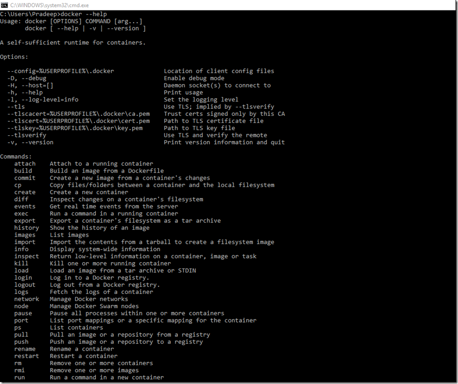
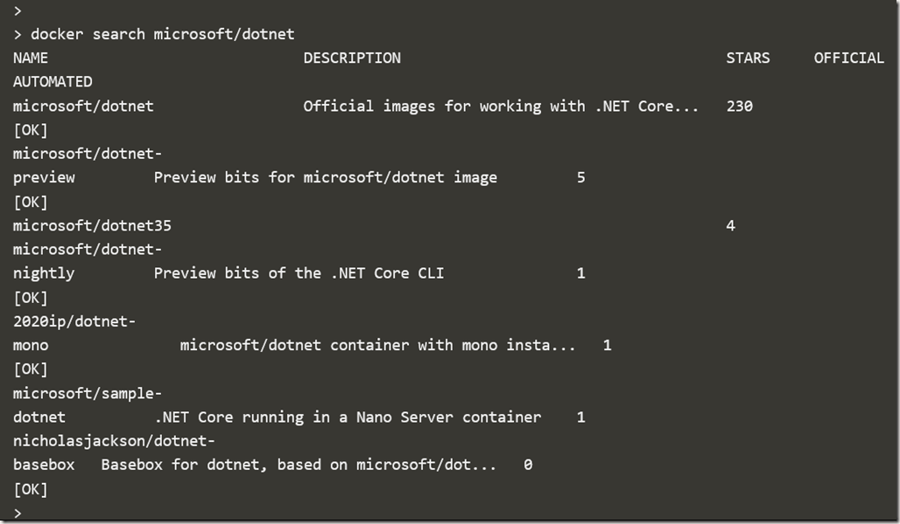
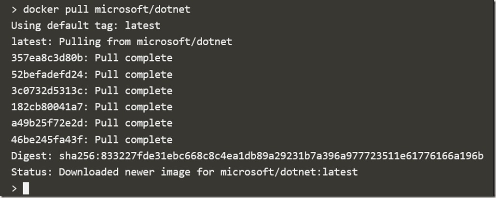
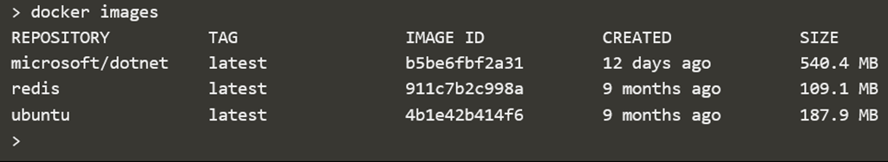
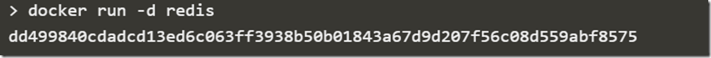
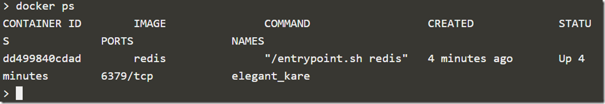
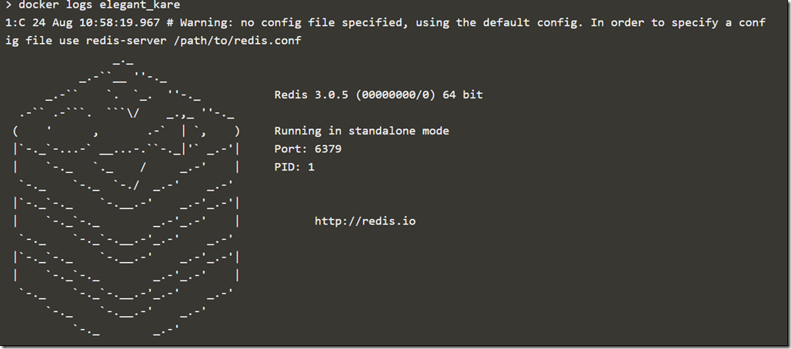

This post is part of a three-post series on Docker

- [What is Docker](https://pradeeploganathan.com/docker/docker-part-1/)
- [Docker Architecture](https://pradeeploganathan.com/docker/docker-architecture/)
- [Docker on Windows](https://pradeeploganathan.com/docker/docker-part-3-installing-docker-on-windows/)

To install Docker, head over to [Download Docker for Windows](https://download.docker.com/win/stable/InstallDocker.msi "Download Docker for Windows") if you are running windows 10 Pro or enterprise 64 bit and download the installer from this link. If you are on a previous version of Windows, you would need to download Docker [Toolbox](https://www.docker.com/products/docker-toolbox "Docker Toolbox"). Also, you would need to enable Hyper-V virtualization to enable Docker to work. The setup installs the Daemon and the CLI tools. The Docker engine is installed as a service, and you also have a helper on the task bar which is used to further configure Docker. You can also download Kitematic from download.Docker.com to graphically manage Docker containers.

Once installed head over to a command prompt and type Docker –help to see the list of commands to interact with Docker.

For a quick sanity check run the command Docker version to check the version of Docker installed. As of writing this post my local instance of Docker was on version 1.12.0 for both the client and server components.

Let's start by searching for the official dotnet core image from Microsoft to load into a container. To search for the image, we need to use the command

> Docker search microsoft/dotnet

This command returns the above list of dotnet images available from Microsoft. Next let's pull an image using the command Docker Pull and the name of the image to pull.

We can see that the Microsoft/dotnet image with the latest tag has been downloaded. Another interesting fact to note is the various layers being pulled and extracted asynchronously to create this image locally.

Now let us check the images available locally using the command **Docker images**

We have 3 images available locally including a redis and an Ubuntu image. Now for the first run fire the below command

This command loads the Redis image into a container. The –d option runs the container in the background. Now let us run the below command to check on the running containers

The output indicates that there is a Redis container running since the past four minutes with an entry point and a name. To get more details about this container we can use the docker inspect command which will return a json output with detailed information about the container such as IP address, volumes mounted etc.

We can use the docker logs command to view messages that the container has written to standard output or standard error.

