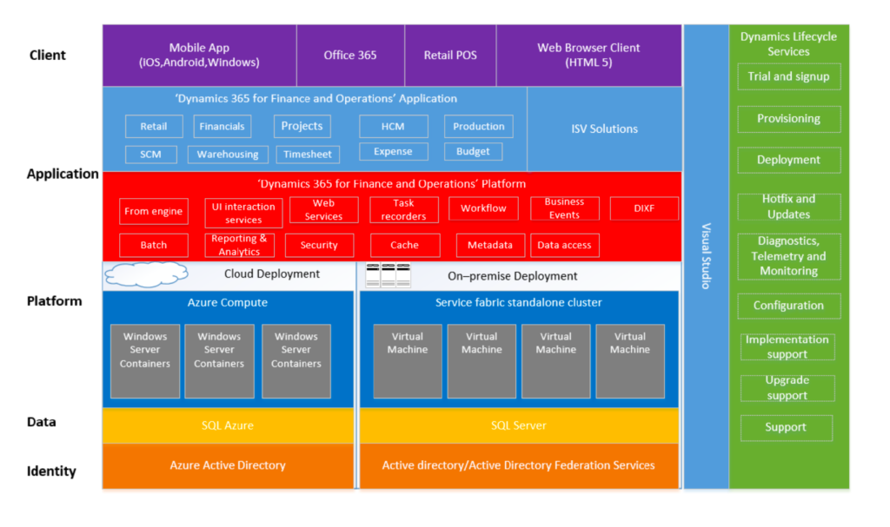
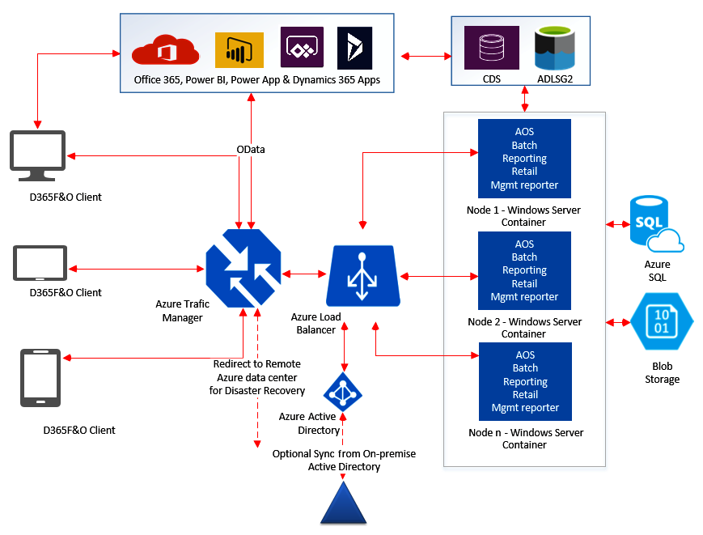

## Introduction

Dynamics 365 for Finance and Operations is designed and architected for the cloud. It can be deployed as an on-premises system or on the cloud. On the cloud it can be deployed to Azure, and the production environment is fully managed by Microsoft. It can also be deployed to a data center on premise and can be fully managed by an internal engineering team.

## Conceptual Architecture

Dynamics 365 Finance and Operations Architecture

### Identity Layer

The identity layer forms the foundation of the conceptual architecture for D365 FnO. This layer is responsible for the authentication and identity aspects of the overall architecture. In a cloud deployment scenario, it uses Azure Active Directory (AAD) for authentication. AAD is a multi-tenant, cloud-based directory, and identity management solution. AAD is provided as part of the subscription to FnO. In an on-premises deployment, it uses Active Directory Federation Services for authentication.

### Data Layer

The data layer hosts the databases used to store the core business configuration and transaction data. In a cloud deployment scenario, the database is hosted on Azure SQL. In case of an on-premises deployment the data layer consists of Microsoft SQL Server databases either enterprise or standard edition. On the cloud database availability, reliability and other factors are catered for by Azure. In an on-premises deployment these factors must be designed and built by the implementation team.

### Platform Layer

The platform layer consists of the compute infrastructure that host the various components of D365 Finance and Operations. These components include the operating systems and their various features that together provide the underlying functionality. In a cloud environment this layer is hosted on Windows server containers on Azure Compute. An on-premises deployment uses service fabric to stitch across the various components hosted on virtual machines in the data center environment.

### Application Layer

This layer consists of the core application components of D365 Finance and Operations. It is composed of application components, code, and metadata. This layer is composed of the application platform, application foundation and the application suite.

### Client Layer

This layer consists of the client components needed to access D365 Finance and Operations. This layer caters to different form factors such as web browsers, mobile devices etc. but also, to other integrations such as Microsoft 365.

### Development Tools

This layer consists of tools, languages, and frameworks to enable further enhancements or customization. Visual Studio is an exclusive IDE for development. Visual Studio contains the necessary project templates, element designers and the code editor.

### Lifecycle Services

This layer provides the necessary tools to manage the lifecycle of a D365 instance. It includes the deployment, updates, monitoring and other aspects of managing a D365 instance. It also provides functionality for software development, customer provisioning, service level agreement (SLA) monitoring, and reporting capabilities.

## Cloud Deployment Architecture

D365 Cloud deployment architecture

The above diagram indicates a typical cloud deployment architecture on Azure for D365 FnO. This architecture uses various azure infrastructure components to provide for high availability, reliability, and disaster recovery. It uses Azure traffic manager to route traffic across data centers to provide for disaster recovery in case a data center goes down. Azure Traffic manager then redirects the call to an Azure Load balancer which can be used to load balance across multiple nodes. The nodes are Windows server containers running the D365 FnO Application layer. The application layer then connects to the data layer on Azure SQL and to the Blob storage which is used to store files and documents.
