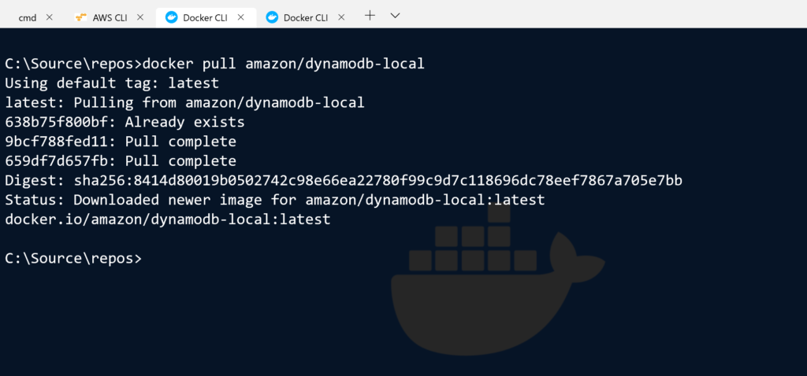
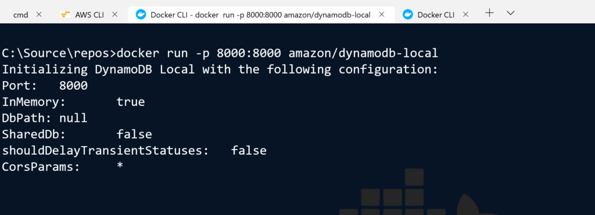
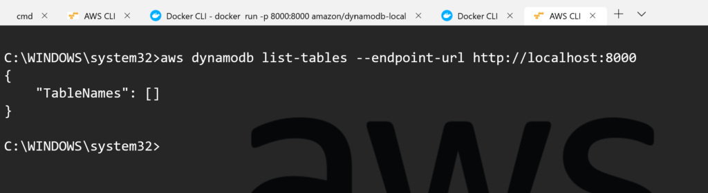
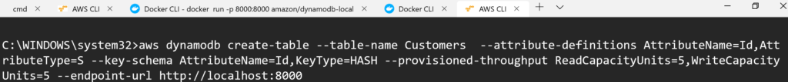
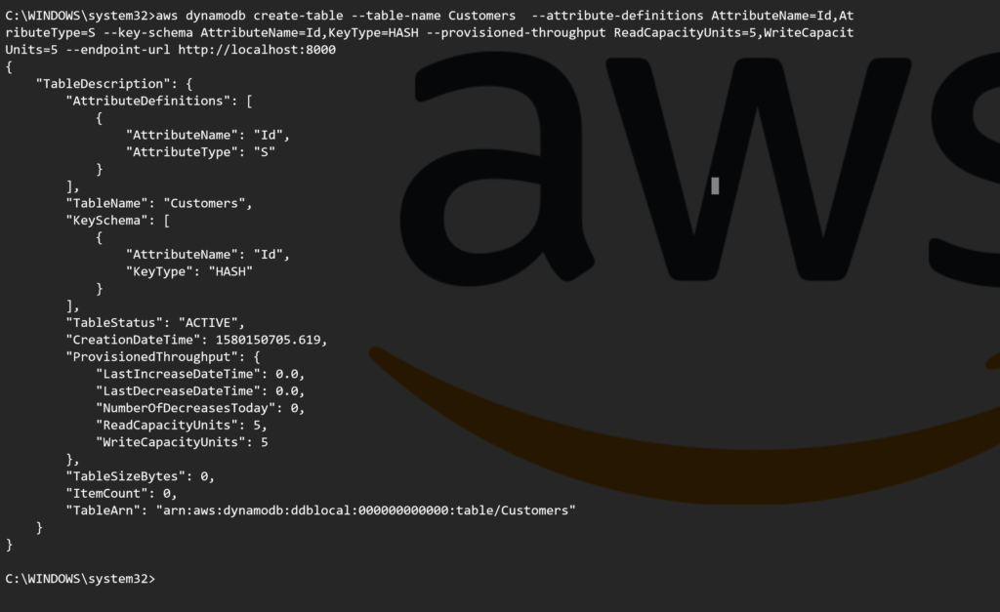

DynamoDb from AWS is a major player in the cloud NoSQL database market. It can scale globally and is blazing fast when used appropriately. There are a bunch of reasons to use [Dynamodb](https://aws.amazon.com/dynamodb) locally, the primary ones being development cost and integration testing. DynamoDB does not have a desktop install, however thankfully, AWS has created a [Docker image](https://pradeeploganathan.com/docker/docker-architecture/) to enable running DynamoDb locally.

To run DynamoDb locally pull the docker image using the command

> docker pull amazon/dynamodb-local

Docker Pull DynamoDb image

Once the DynamoDb image has been downloaded locally , we can run it using the Docker run command. The DynamoDb image exposes port 8000 and we can map it as necessary to a port on the host. I am using the docker run command to run DynamoDb locally and map the port 8000 on the container to the port 8000 on the host using the command

> docker run -p 8000:8000 amazon/dynamodb-local

The above command runs the container in interactive mode. The container can be run in detached mode using the -d flag.

To test that the DynamoDb instance running locally I can use the list tables command, to list any tables in the DynamoDb docker instance. With the AWS CLI , I can use the list-tables command as below. Note the --endpoint argument which specifies that the command should be run on the DynamoDb instance running on localhost at port 8000.

> aws dynamodb list-tables --endpoint-url <http://localhost:8000>

DynamoDb running locally

We now have an instance of Dynamodb running locally and in the next post will use a .Net core application to connect and perform CRUD operations.

We can now create a table on the local instance using the AWS CLI and specifying the endpoint URL to the local instance , in this case localhost:8000. Below is an example of a create table CLI command.

DynamoDb Create Table Request

The create table response is below indicating a successful table creation.

DynamoDB Create Table respons

Now we are good to go with a putitem, getitem and other operations on this freshly minted DynamoDb table.

> Photo by [Kolar.io](https://unsplash.com/@jankolar?utm_source=unsplash&utm_medium=referral&utm_content=creditCopyText) on [Unsplash](https://unsplash.com/s/photos/drawers?utm_source=unsplash&utm_medium=referral&utm_content=creditCopyText)
