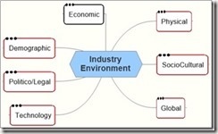
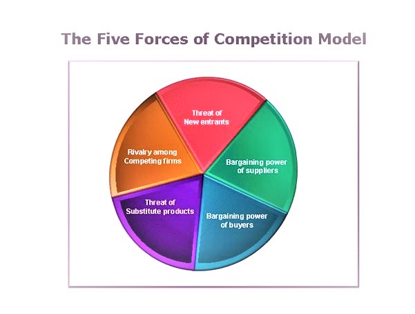

### External Environment

The external environment includes the areas of General, Industry and Competitor environment. The general environment is the broader society dimensions that influence an industry and the firms within it. It is grouped into seven dimensions or ‘environmental segments’ which cannot be controlled or manipulated. However, segment intelligence of each of these can help reorient strategy to mitigate influence in the long term.

The industry environment is a set of factors which directly influence a firm’s competitive actions and responses. These factors can be analyzed using Porters Five forces model. Competitor Analysis is used to gather and interpret competitor information. The Competitor environment gives information about a firms direct and indirect competitor and the competitive dynamics expected to impact a firm's efforts to generate an above average return.

### External Environment Analysis.

An Opportunity is a general environment condition that is exploited helps a company achieve strategic competitiveness. A threat is a general environmental condition that may hinder a company’s efforts to achieve strategic competitiveness. There are four components of external environmental analysis namely

- Scanning: is the process of identifying early signal of environment changes and trends.
- Monitoring: is the process of detecting meaning through ongoing observation of environmental changes and trends obtained through scanning.
- Forecasting: is the process of developing projections of anticipated outcomes based on monitored changes and trends.
- Assessing: is the process of determining the timing and importance of environmental changes and trends that impact a firm's strategies and their management.

General Environment - 7 Segments & Elements

### Industry environmental analysis

An industry is defined as a group of firms producing products that are close substitutes the industry environment has a higher impact on a firm’s general competitiveness and ability to earn above average return compared to the general environment. The intensity of competition and profit potential are a function of Porters Five forces analysis.

The five forces of competition

#### Porters Five Forces

1. Threat of new Entrants: New entrants can threaten market share of existing competitors. It brings additional production capacity to the industry. This is a function of two factors namely
    - Barriers to Entry: Economies of scale, Product differentiation, Capital requirements, switching costs, Access to distribution channels, Cost disadvantage, Government policy are the various barriers to entry faced by a new entrant into an industry.
    - Expected Retaliation: An expectation of vigorous and swift retaliation reduces the likelihood of entry. Retaliation is vigorous when the existing firm has a large stake in the industry, invested substantial resources and when industry growth is slow.
2. Bargaining Power of Suppliers: Suppliers can exercise their power by reducing quality or increasing price. Suppliers are powerful when there are very few large suppliers and are they are more concentrated than the industry they sell to, there are no substitutes for the supplier’s product, the firms are not a significant customer to the supplier group, the supplier’s goods are critical to a buyer’s success, there is a high switching cost due to effectiveness of a suppliers products. and there exists a threat of forward integration.
3. Bargaining power of buyers: Buyers want to buy at the lowest price and demand higher levels of service at the best quality. They are powerful when they purchase a substantial proportion of the industries output. The products sales accounts for a significant portion of the seller’s annual revenue. The industries products are undifferentiated and standardized raising the threat of backward integration.
4. Threat of substitute products is the threat when goods or services outside of the given industry perform the same or similar functions at a competitive price or have low switching costs. Product and service differentiation helps overcome the threat of substitute products. E.g. Plastic has replaced steel and other materials in many applications at an extremely competitive price and value preposition.
5. Intensity of rivalry among competing firms: The intensity of rivalry in an industry is the extent to which competitors within an industry compete with one another and limit other profit potential. If rivalry is fierce the profit potential in the industry declines for all firms. Low intensity of rivalry increases profit potential and makes the industry less competitive.

Intensity of Rivalry is high if

- Competitors are numerous.
- Competitors have equal size.
- Competitors have equal size.
- Competitors have equal market share.
- Industry growth is slow.
- Fixed costs are high.
- Products are undifferentiated.
- Brand loyalty is insignificant.
- Consumer switching costs are low.
- Competitors are strategically diverse.
- There is excess production capacity.
- Exit barriers are high

Intensity of Rivalry is Low if

- Competitors are few.
- Competitors have unequal size.
- Competitors have unequal market share.
- Industry growth is fast.
- Fixed costs are low.
- Products are differentiated.
- Brand loyalty is significant.
- Consumer switching costs are high.
- Competitors are not strategically diverse.
- There is no excess production capacity.
- Exit barriers are low.

### Competitor Analysis

Competitor intelligence is the data and information that a firm gathers to better understand and anticipate its competitor’s objectives, strategies, assumptions, and capabilities. When gathering competitive intelligence firms must pay specific attention to complementors who add value to the focal firms' products and strategies. E.g. Microsoft and Intel are complementors. Competitor Intelligence collection needs to follow ethical practices which can be through obtaining and analyzing public information or attending trade fairs, obtaining brochures etc.
