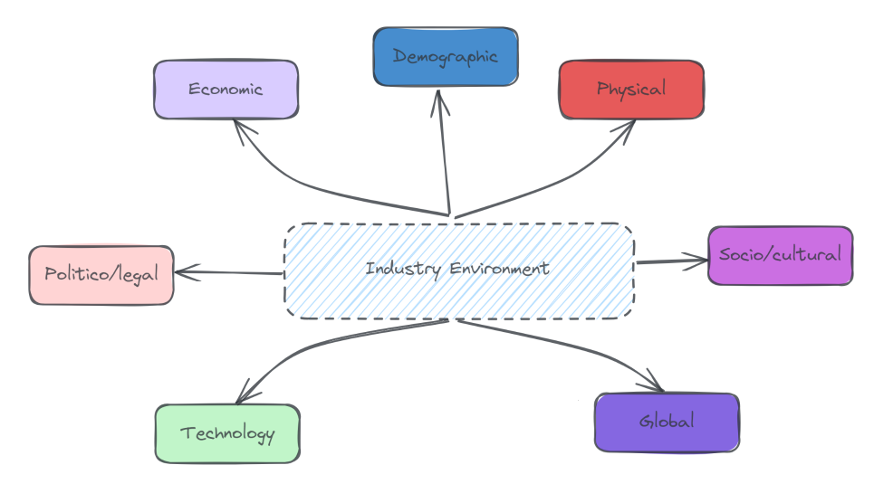
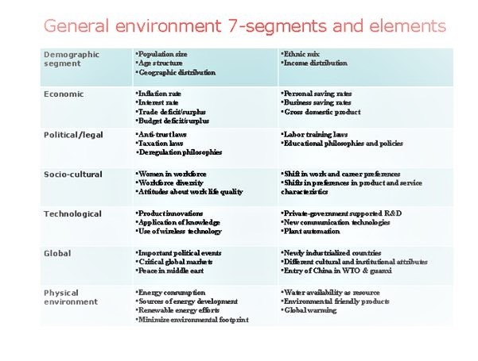
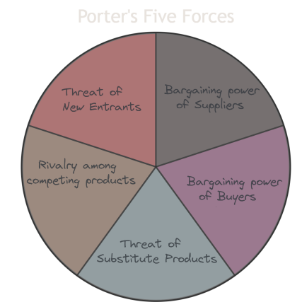

### External Environment

The external environment includes the areas of General, Industry and Competitor environment. The general environment is the broader society dimensions that influence an industry and the firms within it. It is grouped into seven dimensions or ‘environmental segments’ which cannot be controlled or manipulated. However, segment intelligence of each of these can help reorient strategy to mitigate influence in the long term.

The industry environment is a set of factors which directly influence a firm’s competitive actions and responses. These factors can be analyzed using Porters Five forces model. Competitor Analysis is used to gather and interpret competitor information. The Competitor environment gives information about a firms direct and indirect competitor and the competitive dynamics expected to impact a firm's efforts to generate an above average return.

### External Environment Analysis

An Opportunity is a general environment condition that is exploited helps a company achieve strategic competitiveness. A threat is a general environmental condition that may hinder a company’s efforts to achieve strategic competitiveness. There are four components of external environmental analysis namely

- Scanning: is the process of identifying early signal of environment changes and trends.
- Monitoring: is the process of detecting meaning through ongoing observation of environmental changes and trends obtained through scanning.
- Forecasting: is the process of developing projections of anticipated outcomes based on monitored changes and trends.
- Assessing: is the process of determining the timing and importance of environmental changes and trends that impact a firm's strategies and their management.

<!-- | General Environment Segment | Elements |
|-----------------------------|----------|
| Demographic Segment         | - Population size - Age structure - Geographic distribution - Ethnic mix - Income distribution |
| Economic                    | - Inflation rate - Interest rate - Trade deficit/surplus - Budget deficit/surplus - Personal savings rate - Business savings rate - Consumer durable product |
| Political/Legal             | - Anti-trust laws - Taxation laws - Deregulation philosophies - Labor training laws - Educational philosophies and policies |
| Socio-cultural              | - Women in workforce - Workforce diversity - Attitudes about work life quality - Shift in work and career preferences - Shift in preferences in product and service characteristics |
| Technological               | - Product innovation - Application of knowledge - Use of wireless technology - Private-government supported R&D - New communication technologies - Plant automation |
| Global                      | - Important political events - Critical global markets - Rise in middle class - Newly industrialized countries - Different cultural and nutritional attributes - Entry of China in WTO & global markets |
| Physical Environment        | - Energy consumption - Sources of energy - Renewable energy efforts - Minimize environmental footprint - Water availability & resources - Environmentally friendly products - Global warming | -->

General Environment - 7 Segments & Elements

### Industry environmental analysis

An industry is defined as a group of firms producing products that are close substitutes the industry environment has a higher impact on a firm’s general competitiveness and ability to earn above average return compared to the general environment. The intensity of competition and profit potential are a function of Porters Five forces analysis.

The five forces of competition

#### Porters Five Forces

1. Threat of new Entrants: New entrants can threaten market share of existing competitors. It brings additional production capacity to the industry. This is a function of multiple factors such as
  
      - Barriers to Entry: High entry barriers (like significant capital requirements, stringent regulations, and strong brand loyalty) can discourage new entrants, while low barriers make it easier for new competitors to join the market.
  
      - Economies of Scale: Industries where existing players can achieve significant cost advantages due to large-scale production can be less attractive for new entrants.
  
      - Access to Distribution Channels: In some industries, securing distribution can be challenging, which can be a deterrent to new entrants.

      - Capital Requirements: The need for large upfront investment can be a significant barrier for new companies.
  
      - Brand Identity and Customer Loyalty: Well-established brands with strong customer loyalty can make it challenging for new entrants to gain market share.

2. Bargaining Power of Suppliers: Suppliers can exercise their power by reducing quality or increasing price. Suppliers are powerful when
    - There are very few large suppliers and they are more concentrated than the industry they sell to.
    - There are no substitutes for the supplier’s product,
    - The firms are not a significant customer to the supplier group,
    - The supplier’s goods are critical to a buyer’s success,
    - There is a high switching cost due to effectiveness of a suppliers products and,
    - There exists a threat of forward integration.

3. Bargaining power of buyers: Buyers want to buy at the lowest price and demand higher levels of service at the best quality. They are powerful when they purchase a substantial proportion of the industries output. The products sales accounts for a significant portion of the seller’s annual revenue. The industries products are undifferentiated and standardized raising the threat of backward integration.

4. Threat of substitute products is the threat when goods or services outside of the given industry perform the same or similar functions at a competitive price or have low switching costs. Product and service differentiation helps overcome the threat of substitute products. E.g. Plastic has replaced steel and other materials in many applications at an extremely competitive price and value preposition.

5. Intensity of rivalry among competing firms: The intensity of rivalry in an industry is the extent to which competitors within an industry compete with one another and limit other profit potential. If rivalry is fierce the profit potential in the industry declines for all firms. Low intensity of rivalry increases profit potential and makes the industry less competitive.

| Intensity of Rivalry: High | Intensity of Rivalry: Low |
|----------------------------|---------------------------|
| Competitors are numerous. | Competitors are few. |
| Competitors have equal size. | Competitors have unequal size. |
| Competitors have equal market share. | Competitors have unequal market share. |
| Industry growth is slow. | Industry growth is fast. |
| Fixed costs are high. | Fixed costs are low. |
| Products are undifferentiated. | Products are differentiated. |
| Brand loyalty is insignificant. | Brand loyalty is significant. |
| Consumer switching costs are low. | Consumer switching costs are high. |
| Competitors are strategically diverse. | Competitors are not strategically diverse. |
| There is excess production capacity. | There is no excess production capacity. |
| Exit barriers are high. | Exit barriers are low. |

### Competitor Analysis

Competitor intelligence is the data and information that a firm gathers to better understand and anticipate its competitor’s objectives, strategies, assumptions, and capabilities. When gathering competitive intelligence firms must pay specific attention to complementors who add value to the focal firms' products and strategies. E.g. Microsoft and Intel are complementors. Competitor Intelligence collection needs to follow ethical practices which can be through obtaining and analyzing public information or attending trade fairs, obtaining brochures etc.
