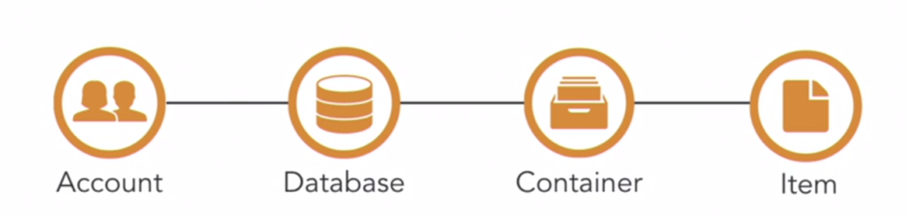

### Introduction

Cosmos DB is a cloud native database engine on Azure. It is a born-in the-cloud database with no legacy compatibility requirements. It can expose data using a variety of models and API's. It can be used as a document store, a key value store, a graph store or as a column-family store. It can expose this data using a MongoDB API, Cassandra API, Gremlin or SQL API. Cosmos DB automatically translates data from the underlying Atom Record Sequence (ARS) to the model supported by the API. If we use SQL or Mongo API Cosmos DB translates ARS to a JSON document, Similarly, if we use the etcd api Cosmos DB translates ARS to a key value pair.

The sample application for this post is on [github here](https://github.com/PradeepLoganathan/CosmosStarter) .

### JSON Data Model

The SQL API provided by Cosmos DB can be used to store and retrieve JSON documents. The SQL API is the flagship API for Cosmos DB and provides sophisticated features such as server-side JavaScript programming, embedded metrics etc. This API transforms the native Atom Record Sequence into JSON documents. It is imperative to understand the structure of a JSON document to effectively use the SQL API.

A JSON document can be visualized as a nested dictionary of properties. We can traverse through the JSON document to address specific properties by visualizing it as a tree structure. The JSON document used in this post is below. If we have a collection of JSON documents with the below structure, we can find customers who live in the state of Maryland with the filter /Address/State = "Maryland".

<a href="https://gist.github.com/PradeepLoganathan/a683ecded264e1c58da752c421a52643">View this gist on GitHub</a>

Sample JSON Document

One of the key design decisions when using Cosmos DB as a document store is the structure of the JSON document. How simple or how complex should the JSON documents be? Should they be normalized or denormalized? This decision is remarkably similar to the normalization design in RDBMS databases. Normalization results in faster write performance and denormalization results in faster read performance. The decision to normalize or denormalize is dependent on data access patterns, rates of change and a host of other factors. Normalization is achieved by embedding documents and denormalization by splitting documents and referencing them. We embed documents if there is a one-to-one relationship between the child and the parent documents, or if the child document is dependent on the parent document and is queried together. Documents are referenced if there is a one-to-many relationship between the parent and the child documents. I have authored a detailed post on [modelling data for Cosmos Db here](https://pradeeploganathan.com/azure/high-performance-data-modelling-with-cosmos-db/).

### Cosmos DB - System defined properties

There are some properties that are added to our document after we save it to Cosmos DB. These properties are added to every document in a container and is dependent on the type of API being used. Some of the common properties are

- id - This property is used to assign a unique identifier. This can be either user assigned or automatically assigned by Cosmos DB.
- \_ts - This property is used to add a timestamp which is updated every time the document is modified.
- \_self - This property is used to provide a unique reference to identify the document directly when using the REST API interface.
- \_etag - This property is used to implement optimistic concurrency.

### Cosmos DB - Resource Model

Cosmos Db Resource Model

Data in Cosmos DB is stored in a hierarchy of resources.

- Account - At the root of the resource hierarchy is an Account. This provides a unique resource identifier (URI) used for all resource requests. It provides both read-only and read - write keys needed by client applications to access Cosmos DB. it also provides configuration that impacts all resources within the account.
- Database - Each account can have zero to many databases. A database is a unit of management.
- Container - Each database can have zero to many containers. Containers hold data. A container supports different models. A container also supports Stored procedures, functions, and triggers.
- Item - Items are individual data elements stored in a container. The items can be documents, nodes/vertices or key value pairs depending on the data model used.

> Photo by [Benjamin Voros](https://unsplash.com/@vorosbenisop?utm_source=unsplash&utm_medium=referral&utm_content=creditCopyText) on [Unsplash](https://unsplash.com/s/photos/cosmos?utm_source=unsplash&utm_medium=referral&utm_content=creditCopyText)
