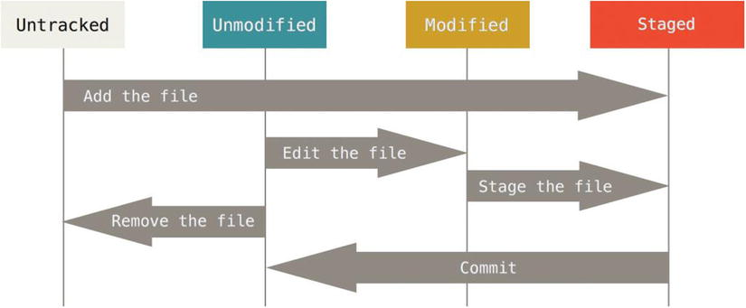
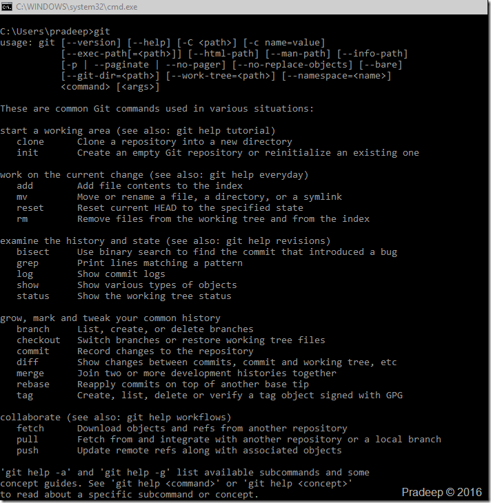

#### Introduction

Git, affectionately termed “the information manager from hell” by its creator [Linus Torvalds](https://en.wikipedia.org/wiki/Linus_Torvalds) is a distributed version control system. It allows for fast scaling, has robust branching features and is an open source software. It is also a relatively new version control system released in April 2005. It was created to version control the Linux source code and as such was a much proven system at birth. GIT is optimized for distributed development, large file counts, complex merge scenarios and is blazingly fast.

Before we dive into using GIT we need to understand some basic concepts and understand how GIT is different from other VCS’s.

#### GIT Snapshots

Almost all version control systems store information as a list of file based changes. When a file is added to a version control system it is marked as a baseline. All further changes to this file are stored as delta differences to this base file over a period of time. This baseline of the file and the history associated with the changes is stored on a central server. The advantage of this system is that every developer knows what the others are changing and the administrator has a greater level of control on the centralized repository. This design requires that users need to be connected to the central server for history as well as to commit changes.

GIT follows a different design and stores changes as a series of snapshots of the complete folder structure. Every time a commit is made in GIT a snapshot of the folder at that point in time is saved and GIT maintains a reference of this snapshot as a SHA1 hash. During subsequent commits if some files in the snapshot have not changed then GIT only stores a reference to the same file from the previous snapshot. This prevents duplication of data that has not changed over snapshots. This makes GIT more like a file system with powerful  tools built on top of it. Most operations in GIT are local only and do not need any connection to other computers on the network.

GIT maintains integrity by check summing all changes. GIT creates checksums by calculating SHA-1 hashes of all objects ( files, folder structures etc.) A SHA-1 hash is a forty character string like 09182c053bb89b35c3d222ef100b48cff5e3d346.  You will see this everywhere when using GIT.

#### Repository

The repository is the place where the version control system keeps track of all the changes you make. You can think of a repository like a bank vault and its history like the ledger. To put it simply for GIT a repository is any directory with a .git folder.

Repositories can be centralized or distributed. Version control systems like CVS, Subversion, VSS follow the centralized repository model. All changes are maintained on a central repository and each developer sends out changes to the centralized repository after working on them locally. With a centralized repository developers have to look up to it for history. No history information is available locally and if disconnected, developers had only their latest version locally. It also required a consistent network connection to enable committing changes, creating branches etc. This is a critical issue. I have worked with VSS on a remote connection a decade back and have seen it take almost an hour to check out a single code file.  In a distributed version control system each team member has a local repository with a complete history of the project. Changes can be made and committed locally with a complete history of change available. Additionally a complete history and functionality is available even when disconnected from any origin sources.

A Git repository is a collection of refs—branches and .tags. (Branches are also known as heads.). A ref is a named mutable pointer to an object .A Git repository contains four kinds of objects,  a blob (file), a tree (directory), a commit (revision), or a tag. Every object is uniquely identified by a 40 hex digit number, which is the SHA-1 hash of its contents. Git makes it easier by having us reference only the first 5-7 characters of the hash to identify the object. Blobs and trees represent files and directories.Tags are named references to another object, along with some additional metadata. A commit object contains a tree id, zero or more parents (commit ids) ,an author (name, email, date) ,a committer (name, email, date) and a log message.

#### Working tree

A "working tree" consist of files that you are currently working on. This is the developers working directory and consists of changes that may or may not get promoted into the repository.

#### Stage or Index

An "index" is a staging area where new commits are prepared. It acts as an intermediary between a repository and a working tree. Changes made in the working tree will not be committed directly to the repository. They need to be staged on the index first. All changes residing on the index will be the ones that actually get committed into the repository. Changes in the index can also be un-staged or rolled back if necessary.

#### GIT Lifecycle

The general workflow for using GIT is as follows

1. Initialize or clone a Git repository.
2. Add or modify working copy by modifying/adding files.
3. Stage the changes necessary.
4. Review changes before commit.
5. Commit changes.
6. Finally push changes to remote repository as needed.

Git file lifecycle

#### The Git Command Line

#### 

#### Basic  Commands

- Git init - Create an empty Git repository in the current directory. By default it will have one branch named master.
- Git Clone - Clone the Git repository from a source. This may be over HTTP, SSH, or the Git protocol, or it may be a path to another local repository.
- Git add - Add file contents from work space to the index.
- Git Commit - Store the changes (that are added) to the repository, using the index.
- Git Status -  view the status of your files in the working directory and staging area
- Git log - Git log is used to display commits that have been made in the repository.

#### Branching and merging

- Git Branch  - List all the branches in your repo, and also tell you what branch you're currently in.
- Git commit - Commit any files you've added with `git add`, and also commit any files you've changed since then.
- Git reset  - Drop all your local changes and commits, fetch the latest history from the server and point your local master branch at it
- Git Push -Send changes to the master branch of your remote repository
- Git Pull - Fetch and merge changes on the remote server to your working directory.
- Git Clone - Create a working copy of a repository.
- Git Merge – Merges a different branch into your active branch.

#### Online providers

- [GitHub](https://github.com/) \-  is a site for online storage of Git repositories.  Many open source projects use it, such as [AngularJS](https://github.com/angular/angular.js), [React](https://github.com/facebook/react), [Docker](https://github.com/docker/docker), [Typerscript](https://github.com/Microsoft/TypeScript) etc.
- [Bitbucket](https://bitbucket.org/) \- from [Atlassian](https://www.atlassian.com/) is another online storage for GIT repository.
