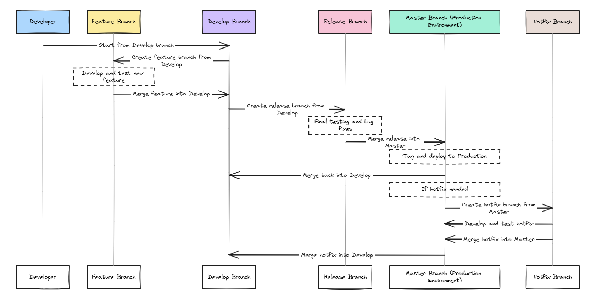
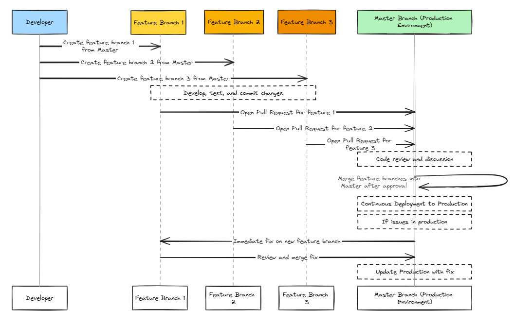
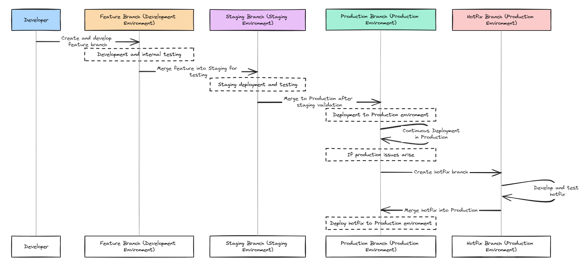

# Git Branching

[Git]() branches allow a code base to evolve organically in a coherent way. When you create a git branch, you're setting up a new line of development. Git branches enables multiple team members to work on different tasks simultaneously without stepping on each other's toes. It is a fundamental concept for implementing features, fixing bugs, and testing new ideas safely. It is a powerful feature that allows developers to diverge from the main line of development and continue to work independently without disrupting the main codebase. A branch in Git is essentially a pointer to a snapshot of your changes. It is one of Git's most popular features. The primary benefits of Git branches are 

- __Isolation__: Changes in a branch do not affect other branches or the main codebase until they are merged.
- __Parallel Development__: Multiple features or fixes can be developed in parallel, speeding up the development process.
- __Risk Reduction__: Testing new code in branches reduces the risk to the main codebase.
- __Flexibility__: Easy to experiment with new ideas without disturbing the main codebase.

# Git Branching Strategies
A branching strategy is a convention, or a set of rules, that describes when git branches are created, naming guidelines for branches, what use branches should have, and so on. Branching strategies allow for separation of work grouped by concept ideas. These concept ideas can be developed in parallel and may also involve bug fixes and patches. Different projects require different branching models depending on their size, workflow, and deployment strategies. Some of the most popular git branching strategies are 

- __Gitflow__ - Scheduled deployment strategy. 
- __Github flow__ - Branch per feature deployment strategy.
- __Gitlab flow__ - State branching strategy. 

Let us take a look at each of these branching strategies in detail.

## Gitflow

Gitflow was originally designed by Vincent Driessen in 2010. He proposed this branching model in a blog post [here](https://nvie.com/posts/a-successful-git-branching-model/). This workflow is based on the use of some main branches. These branches are nothing special but have a certain significance attributed to them. In the Driessen model there are two permanent branches.

1. Main branch - The branch from which software is released to production. Only production ready code can be committed to this branch. All commits are tagged, since they represent releases.

2. Develop/Dev branch - The main branch that developers work on. The develop branch is a long lived branch.

The other non-permanent branches are

1. Feature branches - Feature branches are used to develop new features. Feature branches will eventually be merged back into the development branch. Each feature branch is as small as possible.

2. Release branches - Once a set of features & their associated bug fixes have been implemented and merged into the develop branch a release branch is created. The branch is assigned a name. This is usually composed of the release prefix, followed by the numeric form of choice for your release. One of the standards for the numeric form is semver. The release branch is then subjected to integration and regression testing. Any bugs identified during this phase is fixed and committed directly to the release branch. Once the release branch has been confirmed to be free of bugs, it is merged into the main branch and released into production. These fixes are also merged back into dev and other release branches if any.

3. Hotfix/Patch branches - Hotfixes are production issues that need an immediate fix before a planned release. The development team creates a hotfix branch from main and applies the appropriate fixes. Once the fixes are tested, the hotfix branch is merged onto the main, to ship a new release.

### Gitflow Workflow steps

This workflow initially starts with a single develop branch. Developers create feature branches for each feature or a group of features that they work on. A feature can also be a bug fix or a refactor. The name of the feature branch indicates the feature being worked on. The feature branches are merged with the develop branch. Once a critical mass or a set of related features are built and merged, a new release branch is created. The team can then continue to work on further features while the release is tested and defects logged. The defects are fixed on the release branch and merged back into the develop branch. The new features created post the release branch creation are also committed to the develop branch.

Once the team has confirmed that the quality of the release is good, a new main branch is created from the release branch. The main branch is tagged with the version and deployed to production. If a production defect is identified post release, a hotfix branch is created from the production branch and the defect is fixed and merged back into main to be tagged and released to production. The hotfix is also merged back into the develop branch. This workflow is a variation of the scheduled deployment strategy.

In the figure below the solid lines represent the long lived branches (main & develop ) and the dashed lines represent short lived branches ( feature branches, hotfix, release etc)

### Gitflow CI/CD design

In the Gitflow model, development and release processes are more structured. A CI pipeline is setup for the develop and feature branches. This CI pipeline is triggered when commits are made to the develop or feature branches. When this CI pipeline is triggered, it runs tests and build processes on artifacts in these branches. This ensures that new features and ongoing development meet quality standards. When the release branch is created from the develop branch a release CI pipeline is triggered. This pipeline executes comprehensive tests including performance and regression tests. The main purpose of this CI pipeline is to prepare and validate code for production release. When code is merged into the main branch a CD pipeline is triggered. It deploys the stable, performant, production ready code to the production environment. This process of triggering continuous integration(CI) on the feature/release branches and continuous deployment(CD) on the main branch results in the deployment of stable releases to production. This is a typical CI/CD design for the gitflow model.

### Pros

- This is an ideal workflow for versioned software such as desktop applications, mobile applications etc.
- Convention based workflow enables developers to easily identify branch to begin work from.
- This workflow does not require a large initial investment in automated testing.

### Cons

- Cognitive overload for new developers on the team  .
- The effectiveness of Gitflow depends on the team's adherence to the workflow.

## Github flow

Github flow was first described by Scott Chacon on his blog [here](http://scottchacon.com/2011/08/31/github-flow.html). It is a lightweight, branch-based workflow that supports teams practicing continuous delivery. In fact, this workflow is optimized for frequent releases in a continuous delivery model. In Github flow there is only one permanent branch called main. The main branch should always be in a deployable state. Developers create new branches off the main branch for each feature or bug fix. Changes are reviewed through pull requests before being merged into the main branch. When any change is merged into the main branch it is usually deployed to production immediately.  If issues arise in production, immediate fixes are made and merged back to main to be deployed to production. This is best suited for small to medium-sized projects and for teams that prioritize rapid iterations and frequent releases.

### Github flow workflow steps

To work on a new feature a developer creates a feature branch from main and commits their work to this feature branch. The feature branch is kept up to date regularly. When the feature development is complete the developer issues a pull request to the main branch. This initiates a code review. If the pull request is reviewed and merged then the feature is deployed from the main branch. If there are issues then fixes are immediately made and merged back into main. Main is immediately redeployed since it is always in a proven working state. This requires a robust CI/CD process.

### Github flow CI/CD design

In GitHub Flow multiple teams work on different features across different branches. Whenever a commit is pushed to any feature branch, it triggers a CI pipeline. This pipeline builds the project and runs tests. These tests validate code changes in isolation before they are ready for merge into the master branch. Once this pipeline executes successfully, a pull request is opened from the feature branch to the main branch. This pull request triggers a CI pipeline which executes tests and build processes to ensure that the changes in the pull request are safe to merge into the main branch. When changes are merged into the main branch, it triggers a CD pipeline which runs final tests, builds the production-ready version of the project, and then deploys it to the production environment. This ensures that only thoroughly tested and reviewed code gets deployed to production. This is a typical CI/CD setup for github flow. It ensures that all features are independently tested and validated in their respective branches before they are merged, maintaining code quality and stability in the master branch.

### Pros

- Simplicity - Only one main development branch - main.
- Lightweight workflow for continuous deployment process.
- Pull requests allow for easy peer review and collaborative development

### Cons

- Large scale automated testing and robust CI/CD pipelines necessary to keep main always deployable.
- May not be suitable for projects that require long-term or parallel development of multiple features.
- No notion of semver based releases.

## Gitlab flow

Gitlab flow was created by [Gitlab](https://about.gitlab.com/) in 2014. Gitlab flow introduces the concept of a location or environment for some of the branches. Branches are linked to specific environments, like development, staging, or production. As code is merged from one branch to the other , it is generally deployed to specific environments. E.g when code is merged from a feature branch to develop branch it is deployed to the development environment, when code is merged from a development to release branch , it is deployed to the staging environment etc. This creates more opportunities for testing in the various environments leading to a more stable release to production. 

### Gitlab flow workflow steps

Developers create feature branches from the production branch. After development and internal testing, these branches are merged back. For complex projects, a staging branch can be used for pre-production testing. The production branch is updated with fully tested and reviewed code. Gitlab flow uses branch naming conventions to specify which branch is deployed to which environment and most importantly the conditions that need to be met before a branch is deployed to a specific environment. This workflow strategy is a variation of a state branching strategy

### Github flow CI/CD design

GitLab Flow incorporates environment-specific branches and the CI/CD design should cater to this. When code is committed to a feature branch, it triggers a CI pipeline which builds the project and runs tests. This ensures code quality before merging into higher-level branches. CI pipelines are also triggered when code is merged into environment-specific branches (like staging, pre-prod). These pipelines run extensive tests to validate that the code works in an environment similar to production. When code is merged into the production branch it triggers a CD pipeline. This CD pipeline deploys code to the production environment. This ensures that only fully tested and approved changes are deployed to production.

### Pros

- Allows for comprehensive testing in different environments.
- It defines clear pathways for Continuos integration and Continuos delivery 

### Cons

- Gitlab branching is more complex than Github flow branching and requires careful management.
- Git history is harder to reason with due to merges across multiple environments.

## Comparison of the various branching strategies

This table provides a side-by-side comparison of the key aspects of each Git branching strategy, helping you understand their differences and determine which might be best suited for various development scenarios.

| Feature                | Gitflow                         | GitHub Flow                      | GitLab Flow                       |
|------------------------|---------------------------------|----------------------------------|-----------------------------------|
| **Main Branches**      | Main, Develop                 | Main                           | Production                        |
| **Supporting Branches**| Feature, Release, Hotfix        | Feature                          | Feature, (Optional) Release       |
| **Primary Focus**      | Structured, scheduled releases  | Continuous delivery, simplicity  | Flexibility, environment-oriented |
| **Release Process**    | Scheduled, from Release branch  | Continuous, from Main          | Continuous, adaptable to env.     |
| **Best For**           | Larger, structured projects     | Rapid development, small teams   | CI/CD setups, balanced approach   |
| **Complexity**         | High                            | Low                              | Medium                            |
| **Testing Strategy**   | Staging before release          | Directly in production           | Multiple environments             |
| **Merge Flow**         | Feature -> Develop -> Release   | Feature -> Main                | Feature -> Production             |
| **Hotfixes**           | From Main to Hotfix branch    | Directly on Main               | From Production to Feature branch |
| **Suitability**        | Versioned software              | Small, fast-paced projects       | Projects with multiple envs.      |

## Conclusion

Branching allows teams of developers to easily collaborate inside of one central code base.Choosing the right branching strategy is key to ensure a good cadence of releasing code to production safely. Knowing and understanding the various branching strategies is key to making this decision. This also ensures that CI/CD process are designed to be triggered effectively ensuring deployment of stable code to production at a faster pace.