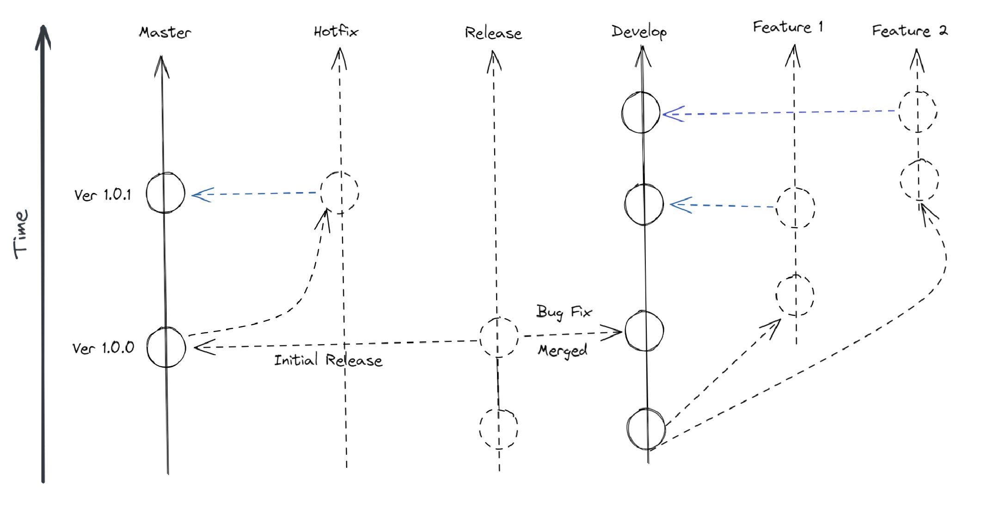
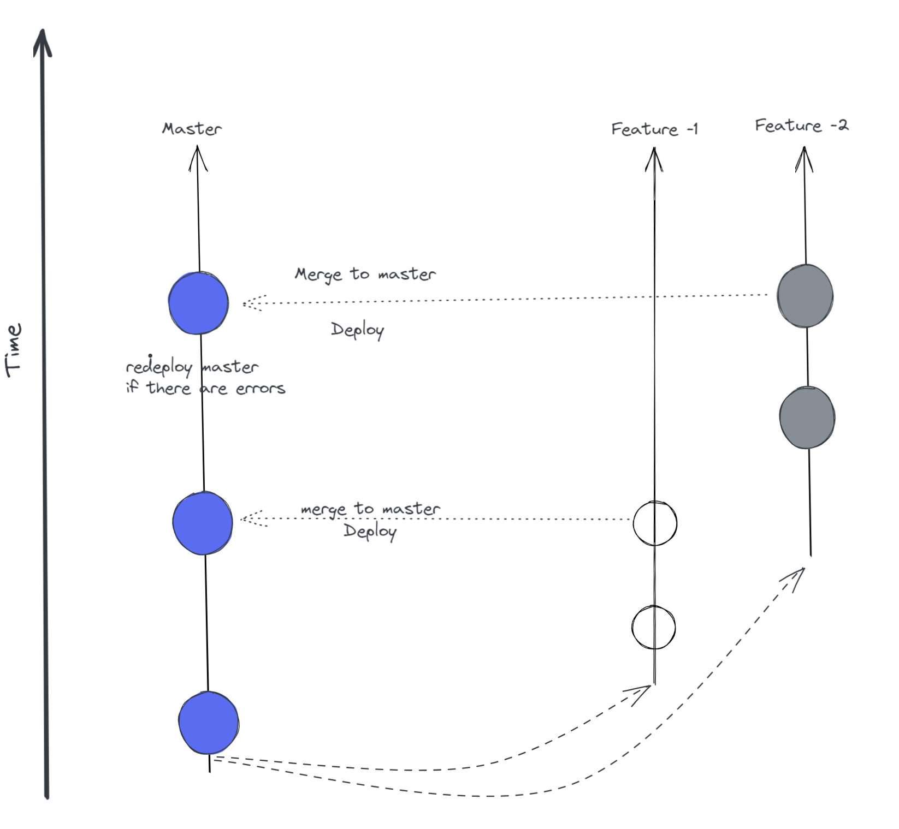

## Git Workflows

[Git](https://pradeepl.com/blog/git-basics/) branching strategies allow a code base to evolve organically in a coherent way. One of Git’s most popular features is its branches. Git branches allow a team to work on different features or multiple tasks at the same time. A branching strategy is a convention, or a set of rules, that describes when branches are created, naming guidelines for branches, what use branches should have, and so on. Branching strategies allow for separation of work grouped by concept ideas. These concept ideas can be developed in parallel and may also involve bug fixes and patches. There are various Git branching strategies such as

- Scheduled deployment strategy - Gitflow
- Branch per feature deployment strategy - Github flow
- State branching strategy - Gitlab flow

Let us take a look at each of these branching strategies in detail.

## Gitflow

Gitflow was originally designed by Vincent Driessen. He proposed this workflow in a blog post [here](https://nvie.com/posts/a-successful-git-branching-model/).This workflow is based on the use of some main branches. These branches are nothing special but have a certain significance attributed to them. In the Driessen model there are two permanent branches.

1. Master branch - The branch from which software is released to production. Only production ready code can be committed to this branch. All commits are tagged, since they represent releases.
2. Develop/Dev branch - The main branch that developers work on. The develop branch is a long lived branch.Whenever a new feature 

The other non-permanent branches are

1. Feature branches - Feature branches are used to develop new features. Feature branches will be eventually merged back into the development branch. Each feature branch is as small as possible.
2. Release branches - Once a set of features & their associated bug fixes have been implemented and merged into the develop branch a release branch is created. The branch is assigned a name composed of the release prefix, followed by the numeric form of choice for your release. One of the standards for the numeric form is semver. The release branch is then subjected to integration and regression testing. Any bugs identified during this phase is fixed and committed directly to the release branch. Once the release branch has been confirmed to be free of bugs, it is merged into the master branch and released into production. These fixes are also merged back into dev and other release branches if any.
3. Hotfix/Patch branches - Hotfixes are production issues that need an immediate fix before a planned release. The development team creates a hotfix branch from master and applies the appropriate fixes. Once the fixes are tested, the hotfix branch is merged onto the master, to ship a new release.

### Gitflow Workflow

This workflow initially starts with a single develop branch. Developers create feature branches for each feature or a group of features that they work on. A feature can also be a bug fix or a refactor. The name of the feature branch indicates the feature being worked on. The feature branches are merged with the develop branch. Once a critical mass or a set of related features are built and merged, a new release branch is created. The team can then continue to work on further features while the release is tested and defects logged. The defects are fixed on the release branch and merged back into the develop branch. The new features created post the release branch creation are also committed to the develop branch.

Once the team has confirmed that the quality of the release is good, a new master branch is created from the release branch. The master branch is tagged with the version and deployed to production. If a production defect is identified post release, a hotfix branch is created from the production branch and the defect is fixed and merged back into master to be tagged and released to production. The hotfix is also merged back into the develop branch. This workflow is a variation of the scheduled deployment strategy.

In the figure below the solid lines represent the long lived branches (master & develop ) vand the dashed lines represent short lived branches ( feature branches, hotfix, release etc)

### Pros

- This is an appropriate workflow for versioned software such as desktop applications, mobile applications etc.
- Convention based workflow enables developers to easily identify branch to begin work from.
- This workflow does not require a large initial investment in automated testing.

### cons

- Cognitive overload for newbie developers.
- Starting off on the wrong branch can cause large scale issues with merging.

## Github flow

Github flow was first described by Scott Chacon on his blog [here](http://scottchacon.com/2011/08/31/github-flow.html). This workflow is optimized for frequent releases in a continuous delivery model. In Github flow there is only one permanent branch called master.The master branch should always be in a deployable state. When any change is merged into the master branch it is usually deployed to production immediately.

To work on a new feature a developer creates a feature branch from master and commits their work to this feature branch. The feature branch is pushed to the remote and is kept upto date regularly. When the feature development is complete the developer issues a pull request to the master branch. If the pull request is accepted then the feature is ready to be deployed from the feature branch. If the feature branch is deployed and there are no issues then the changes are merged to master. However if there are issues then master is immediately redeployed since it is is always in a proven working state. This workflow is a variation of the Branch-Per-Feature deployment strategy.

### Github flow workflow

### Pros

- Simplicity - Only one main development branch - master.
- Lightweight workflow for continuous deployment process.

### Cons

- No notion of semver based releases.
- Large scale automated testing and robust build process necessary to keep master always depoyable.

## Gitlab flow

GItlab flow was created by [Gitlab](https://about.gitlab.com/) in 2014. Gitlab flow introduces the concept of a location or environment for some of the branches. These branches represent the organizations internal environments. As code is merged from one branch to the other , it is generally deployed to specific environments. E.g when code is merged from a feature branch to develop branch it is deployed to the development environment, when code is merged from a development to release branch , it is deployed to a pre-prod environment etc. This creates more opportunities for testing in the various environments leading to a more stable release to production.

Gitlab flow uses branch naming conventions to specify which branch is deployed to which environment and most importantly the conditions that need to be met before a branch is deployed to a specific environment. This workflow strategy is a variation of a state branching strategy

### Pros

- It is less complex than Gitflow branching.
- It defines clear pathways for Continuos integration and CContinuos delivery 

### Cons

- Gitlab branching is more complex than Github branching.
- Git history is harder to reason with due to merges across multiple environments.

## Conclusion

Branching allows teams of developers to easily collaborate inside of one central code base.Choosing the right branching strategy is key to ensure a good cadence of releasing code to production safely. Knowing and understanding the various branching strategies is key to making this decision.