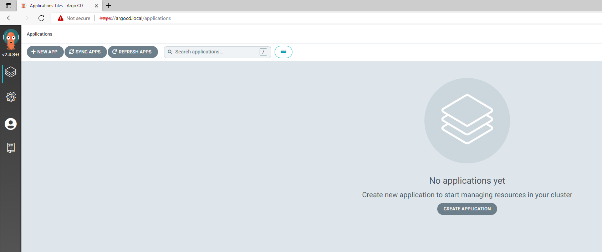
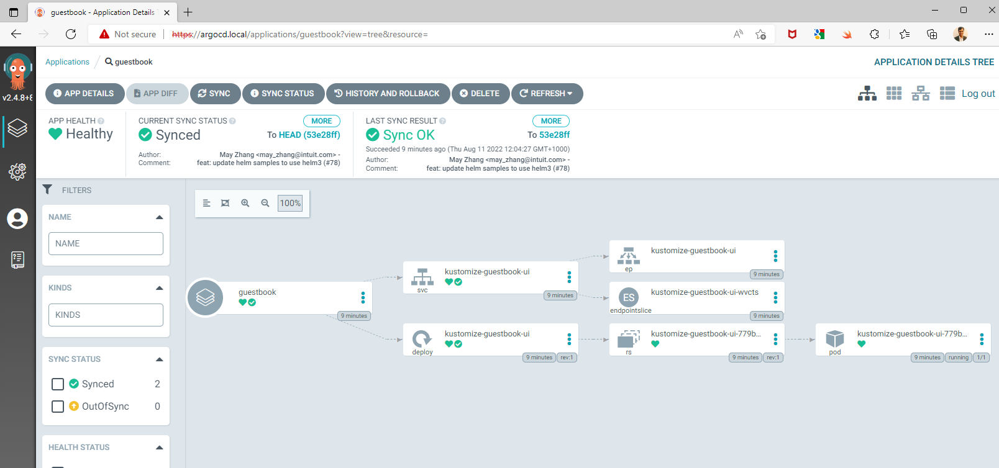

> **_NOTE:_**  The code for this blog post is in github [here](https://github.com/PradeepLoganathan/argocd-getting-started).  

## What is Argo CD?

Argo CD is a declarative, continuous delivery [GitOps](https://pradeepl.com/blog/gitops) operator for kubernetes. Argo CD was originally built by Applatix which was acquired by Intuit and open sourced in August 2018. It was accepted as a CNCF incubation-level project in April 2020. It is part of the [argo project](https://github.com/argoproj) which provides solutions for orchestrating container workflows. The other tools in this project are Argo Workflows, Argo Rollouts and Argo Events. [Argo Workflow]((https://github.com/argoproj/argo-workflows)) is a workflow engine for orchestrating directed acyclic graph(DAG) and step based workflows on kubernetes. [Argo Rollouts](https://github.com/argoproj/argo-rollouts) provides advanced deployment strategies such as blue-green, canary, experimentation and progressive delivery features to kubernetes. [Argo Events](https://github.com/argoproj/argo-events) is an event -driven workflow automation framework for kubernetes.

## Argo CD architecture

The main components of Argo CD are

## Getting started with Argo CD on Kind

Argo CD can be installed on any kubernetes cluster. The process of installing Argo CD involves the below steps

- [Creating the Kubernetes cluster](#create-kubernetes-cluster-using-kind)
- [Installing an ingress controller](#install-ngnix-ingress-controller)
- [Installing Certificate Manager](#installing-certificate-manager)
- [Generating Certificates](#generating-certificates-with-cert-manager)
- [Installing Argo CD](#install-argo-cd)
- [Configuring the ingress controller](#configure-ingress)


### Create Kubernetes cluster using Kind

To get started we can install Argo CD on a kind cluster locally. Kind allows you to run light-weight kubernetes clusters locally on docker. We would need to create a cluster and forward ports from the host to an ingress controller running on a node. We can do so by specifying extraport mappings in the cluster definition. The cluster definition for the kind cluster with the port mapping is below

```yaml
kind: Cluster
apiVersion: kind.x-k8s.io/v1alpha4
nodes:
- role: control-plane
  kubeadmConfigPatches:
  - |
    kind: InitConfiguration
    nodeRegistration:
      kubeletExtraArgs:
        node-labels: "ingress-ready=true"    
  extraPortMappings:
  - containerPort: 80
    hostPort: 80
    protocol: TCP
  - containerPort: 443
    hostPort: 443
    protocol: TCP
```

In the above cluster definition we are using the extraPortMappings to allow the local host to make requests to the ingress controller over ports 80/443. We are using node-labels to only allow the ingress controller to run on specific nodes matching the label selector.

### Install ingress controller

We can use an ingress to access the argo cd service or use port forwarding. In this post I am creating and using an ingress as it is a much more elegant method than port forwarding which is a blocking process. I am using ngnix as the ingress controller. We can install ngnix using the yaml file.

```shell
kubectl apply --filename https://raw.githubusercontent.com/kubernetes/ingress-nginx/master/deploy/static/provider/kind/deploy.yaml
```

We need to wait to ensure that all the necessary ngnix components have been installed. We can wait for the components to be completed and running by using ```kubectl wait``` as below

```shell
# wait for ngnix components to be ready
kubectl wait --namespace ingress-nginx \
  --for=condition=ready pod \
  --selector=app.kubernetes.io/component=controller \
  --timeout=90s
```

We have now installed ngnix as the ingress controller and are ready for the next steps.

### Installing certificate manager

We need certificates to be securely logon to the Argo CD UI. Certificate provisioning can be a very painful process. [cert-manager](https://github.com/cert-manager/cert-manager) makes it easy to create, obtain and renew certificates. It adds certificates and certificate issuers as custom resource types in kubernetes. We can install cert-manager as below

```shell
#install cert manager
kubectl apply -f https://github.com/cert-manager/cert-manager/releases/download/v1.9.1/cert-manager.yaml
```

We can verify that all components of cert manager are installed and running as below

```shell
#verify cert manager installation
kubectl get pods --namespace cert-manager
```

Executing this command gives me the below output indicating successful installation of cert manager.

```shell
NAME                                      READY   STATUS    RESTARTS   AGE
cert-manager-55649d64b4-5rmjg             1/1     Running   0          87s
cert-manager-cainjector-666db4777-5mkvh   1/1     Running   0          87s
cert-manager-webhook-6466bc8f4-rz5f9      1/1     Running   0          87s
```

We have now successfully installed certificate manager. We can now create a certificate issuer that can be used by the ngnix ingress.

### Generating certificates with cert-manager

We can now create a certificate issuing authority using the ClusterIssuer object. It is cluster scoped and can be referenced by resources in all namespaces. we can create a cluster issuer using the below yaml

```yaml
#certificate-issuer.yaml
apiVersion: cert-manager.io/v1
kind: ClusterIssuer
metadata:
  name: selfsigned-cluster-issuer
spec:
  selfSigned: {}
```

We can now install the cluster certificate issuer using kubectl.

```shell
#deploy self signed certificate issuer
kubectl apply -f certificate-issuer.yaml
```

once installation is complete we can verify that the cluster issuer is ready for signing using the below command

```shell
#check if cluster issuer is ready for signing
kubectl get clusterissuers -o wide selfsigned-cluster-issuer
```

This should produce the below output

```shell
NAME                        READY   STATUS   AGE
selfsigned-cluster-issuer   True             57s
```

The certificate issuer is now ready to issue certificates across all namespaces in the cluster

### Install Argo CD

We now have a kubernetes cluster with an nginx ingress controller. We have also configured a self signed certificate issuer. We are now ready to install Argo CD. We can now create a namespace for Argo CD and install it  as below.

```shell
kubectl create namespace argocd
kubectl apply -n argocd -f https://raw.githubusercontent.com/argoproj/argo-cd/stable/manifests/install.yaml
```

We can verify that Argo CD is installed fine by checking the pods in the argocd namespace using

```shell
kubectl get pods -n argocd
```

I get the below output confirming that the installation has been successful

```shell
NAME                                                READY   STATUS    RESTARTS   AGE
argocd-application-controller-0                     1/1     Running   0          1m13s
argocd-applicationset-controller-7849d94b6c-rw99z   1/1     Running   0          1m13s
argocd-dex-server-658db5794b-r7g7q                  1/1     Running   0          1m13s
argocd-notifications-controller-cc89554f9-sl8qn     1/1     Running   0          1m13s
argocd-redis-f4cdbff57-br5zv                        1/1     Running   0          1m13s
argocd-repo-server-867779844b-f6nfn                 1/1     Running   0          1m13s
argocd-server-659d88b596-drx56                      1/1     Running   0          1m13s
```

In the next step we need to configure the ingress controller to point to argocd-server

### Configure ingress

We now need to configure the nginx ingress controller. ArgoCD supports both HTTPS and gRPC protocols on port 443. The nginx ingress controller can accept only one protocol specified by the ```nginx.ingress.kubernetes.io/backend-protocol``` annotation. Since I am specifying a single ingress rule, ArgoCD will need to terminate tls rather than nginx. This will enable it to detect the protocol being used and respond appropriately. We can create two ingress rules but lets skip it for now with the knowledge that we will get a warning when using the CLI. See [here](https://argo-cd.readthedocs.io/en/stable/operator-manual/ingress/#option-2-multiple-ingress-objects-and-hosts) for more information on configuring multiple ingress objects. We also need to update our hosts file to create a local DNS. I am using argocd.local as below. You can find the hosts file in /etc/hosts. If you are on WSL in windows you need to edit the /etc/wsl.conf file. Add the below entry to the hosts file

```shell
127.0.0.1       localhost argocd.local
```

Now we can update the ingress to use this URL by creating the ingress yaml as below. We are specifying the certificate issuer using the cluster-issuer annotation.

```yaml
#ingress.yaml
apiVersion: extensions/v1beta1
kind: Ingress
metadata:
  name: argocd-server-ingress
  namespace: argocd
  annotations:
    kubernetes.io/ingress.class: nginx
    cert-manager.io/cluster-issuer: selfsigned-cluster-issuer
    nginx.ingress.kubernetes.io/force-ssl-redirect: "true"
    nginx.ingress.kubernetes.io/ssl-passthrough: "true"
    nginx.ingress.kubernetes.io/backend-protocol: "HTTPS"
spec:
  rules:
  - http:
      paths:
      - backend:
          serviceName: argocd-server
          servicePort: https
    host: argocd.local
  tls:
  - secretName: https-cert
    hosts:
    - argocd.local
```

We can now apply this ingress yaml file using ```kubectl apply -f ingress.yaml```.

We can verify the ingress configuration as below

```shell
kubectl get ingress -A
```

This produces the below output confirming ingress configuration

```shell
NAME                    CLASS    HOSTS          ADDRESS     PORTS     AGE
argocd-server-ingress   <none>   argocd.local   localhost   80, 443   2m20s
```

ArgoCD is now installed. We can view the web UI for Argo CD by navigating to https://argocd.local/. The user id is admin. The password can be obtained by querying the secret named ```argocd-initial-admin-secret``` and base64 decoding it as below.

```shell
kubectl -n argocd get secret argocd-initial-admin-secret -o jsonpath="{.data.password}" | base64 -d
```

### Argo CD web UI

We have so far run through an extensive set of steps to install and configure Argo CD on a kind cluster. Navigating to https://argocd.local/ opens the Web UI. 


We can enter the user id and password to move onto the next steps. 



## Install and setup Argo CD CLI

The Argo CD command line interface allows you to interact with Argo CD from the command line or in scripts. To install Argo CD CLI we can use Homebrew and install it as below

```shell
brew install argocd
```

We can now use the cli to login into ArgoCD using the credentials specified earlier as below

```shell
argocd login argocd.local
```

Once logged in , we can list all clusters managed by ArgoCD as below

```shell
$argocd cluster list
WARN[0002] Failed to invoke grpc call. Use flag --grpc-web in grpc calls. To avoid this warning message, use flag --grpc-web.
SERVER                          NAME        VERSION  STATUS   MESSAGE                                                  PROJECT
https://kubernetes.default.svc  in-cluster           Unknown  Cluster has no applications and is not being monitored.
```

See the warning about grpc. This is because of our ingress configuration as discussed previously. The ArgoCD instance currently manages a single cluster. Let us now deploy an application to this cluster using ArgoCD.

## Deploying an application - The GitOps way

We will deploy a sample application from ArgoCD called ```guestbook``` to this cluster. We will use the Kustomize overlays defined in this sample to deploy the application. We will deploy the application to the guestbook namespace. Lets initially create the namespace as below.

```shell
kubectl create namespace guestbook
````

We now need to create a yaml to define the application. In the below application definition we are providing the source and the destination details for the application. The destination includes the namespace and the cluster where the application will be deployed. The source includes the repository URL and the path of the application to be deployed.

```yaml
#guestbook.yaml
apiVersion: argoproj.io/v1alpha1
kind: Application
metadata:
  name: guestbook
  namespace: argocd
spec:
  destination:
    namespace: guestbook
    server: 'https://kubernetes.default.svc'
  source:
    path: kustomize-guestbook
    repoURL: 'https://github.com/argoproj/argocd-example-apps'
    targetRevision: HEAD
  project: default
  syncPolicy:
    automated:
      prune: false
      selfHeal: false
```

We can now apply the application definition using ```kubectl apply -f guestbook.yaml``` and check the status as ArgoCD starts to deploy the application.

```shell
kubectl get applications --all-namespaces
NAMESPACE   NAME        SYNC STATUS   HEALTH STATUS
argocd      guestbook   Synced        Progressing
```

Once ArgoCD has deployed the application the health status changes to healthy to indicate successful deployment. 

```shell
kubectl get applications -A
NAMESPACE   NAME        SYNC STATUS   HEALTH STATUS
argocd      guestbook   Synced        Healthy
```

We can also head over to the Web UI to check the deployment status. We are presented with this screen to indicate successful deployment of the application.



Yay, we have our first application deployed using GitOps principles by ArgoCD.

## Conclusion

GitOps provides an amazing path to production. It allows for streamlined processes and better deployment experience. However, installing, securing and configuring ArgoCD can be complex and daunting. In this blog post we deployed and configured ArgoCD for a single local development cluster. A production deployment of ArgoCD will be more rigorous as it will have to manage multiple clusters, provide better security including RBAC etc. However , there are products which come preinstalled with Gitops operators and enable better integration. [Tanzu Application Platform](https://docs.vmware.com/en/VMware-Tanzu-Application-Platform/1.2/tap/GUID-overview.html) is an example of a powerful applications platform providing GitOps functionality out of the box. GitOps has had strong adoption and the larger open source community is pushing the boundaries to enable simpler and powerful feature sets.
