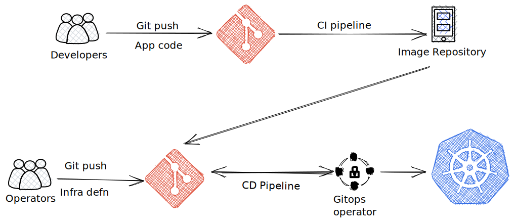

## What is GitOps ?

GitOps is a methodology for continuous deployment using a Git repository as the single source of truth. The Git repository is the source of truth for both declarative infrastructure as well as application workloads. The repository contains the YAML manifests or Helm charts for the Kubernetes resources to be created. The Git repo is used to store, track and version control changes to these YAML files containing the Kubernetes configuration such as Namespaces, Deployments, Pods, Services, Ingress, DaemonSets, ConfigMaps, Secrets etc. Changes to the live state versus the desired state is managed by examining Git diffs and using Git primitives to roll back and reconcile the live state.

GitOps makes Git the source of truth where you specify the desired state of your entire system. Developers introduce changes to the cluster state or application configuration, through a CI pipeline. These updates/changes are stored in a Git repository. Changes between versions can be compared and rolled back if necessary. Changes are explicit and are approved through pull requests. A dedicated GitOps component reads approved changes from the Git repository and applies the changes to the Kubernetes cluster through a CD pipeline. This provides for separation of concerns and also ensures that the Git repository reflects the current state of the cluster irrespective of who made the change and when. Any change to a defined branch will trigger the relevant updates to the cluster. The Git repo acts as a backup in case of catastrophic failures and allows for recovery from scratch.

GitOps as a methodology for managing Kubernetes clusters and applications was initially proposed by Alexis Richardson, co-founder and CEO of Weaveworks. ina series of [blog posts](https://www.weave.works/blog/gitops-operations-by-pull-request). Weaveworks used the GitOps methodology with their Kubernetes environments.

## Principles of GitOps

The principles of GitOps are:

* __Declarative configuration__ - The System state is described declaratively. Instead of providing a series of instructions on how to build the infrastructure, applying configurations and deploying the application, we declare the end state of what is needed. Declarative configuration is idempotent and can be run multiple times without any impact to the system consistency.

* __Version controlled, immutable storage__ - Git is the source of truth. The desired system state is versioned in Git. Multiple Git branches can be created to apply changes to different environments. A pull-request (PR) based approval process can be used along with gated check in to ensure that only approved changes are deployed to the environment. 

* __Automated delivery__ - Git is the single place for operations (create, change, delete) performed by autonomous agents. An approved Git commit will result in a new deployment and a Git revert would rollback changes.

* __Autonomous agents__ - Software agents known as operators enforce the desired state and alert on drift. These agents monitor the environment and alert for any divergence from the repository. It automatically corrects the divergence.

* __Closed loop__ - Delivery of approved system state changes is automated.

## Why do GitOps ?

GitOps extends DevOps by taking it's best practices such as version control, collaboration, continuous deployment and applying these to environment automation through application deployment, configuration, and infrastructure. GitOps allows developers and DevOps teams to version control the infrastructure and ship applications faster.

The key benefits of GitOps are

* __Standardized workflow__ -  Git as the source of truth improves Developer Experience and ensures easy adoption. Developers are familiar with Git.

* __Auditability__ - Tracking both application code & infrastructure definition in Git results in a full audit trail and compliance. Code reviews result in better stability.

* __Consistency__ - Infrastructure as a code results in easier rollback, more consistency, & standardization.

* __Reliabiity__ - Continuous sync and Configuration drift detection results in reliable environments.

* __Enhanced Security__ - Shifting security left to the GitOps operator. Security is also maintained as code.

## GitOps Operators

There are many GitOps operators out there, but the two main ones are [Flux](https://fluxcd.io/) and [Argo CD](https://argoproj.github.io/). The Flux and Argo CD GitOps operators are designed to work with Kubernetes. However, GitOps is not limited to Kubernetes operators alone. [Kubestack](https://www.kubestack.com/) is a Terraform based GitOps framework.