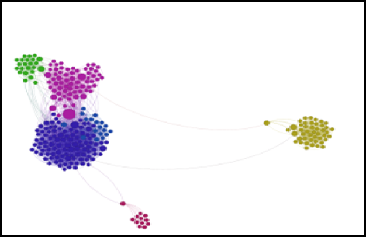

Netvizz is a cool tool which can export your Facebook data in a format which makes it easier to visualize or do a network analysis offline. There are other apps available on the Facebook platform which perform this using predefined bounds within the app itself but what I like about Netvizz is that it allows you to extract this information and play with it using any tool you are comfortable with like R, Gephi etc. This sort of visualization is a core of Social network analysis systems.  
I spent some time to play around with my Facebook network information over the weekend. I extracted out my network using Netvizz. It gives a GDF file with all the necessary information and can be imported into Gephi directly. The idea was to see how much the Facebook visualization of my friend network compares with my real life network. I do understand that the online world and the offline world social networks differ but on a massive system like Facebook my guess was that it should mirror my real life network much more realistically. I built the network and used the community detection algorithm and did a ForceAtlas2 layout. This is the network visualization I ended up with after tweaking a few things. The network diagram is both surprising and a bit scary.

**Accurate reflection of my Social network groups**: The network analysis shows the various groups of friends by my life events and their relationships. The green bunch of circles on the right are my friends from my ex company Logica. The small red bunch below is my network of friends from IIM-Lucknow and the big blob of circles on the top left are my friends from Dell. There were other individual circles in-between too which were removed because I filtered by degree of connectedness and represented friends who were not part of any of these big networks and were people with whom I was connected outside of all these bigger networks  
The network information on Facebook is more or less an accurate reflection of my networks in real life in terms of how I could group them by connectedness or with specific timelines of my life.

**Not so Accurate reflection of my Social network groups**: My assumptions of who were the best networkers was shattered when I could see that the some of the people in the top 10 in degree of connectedness were actually people who are more of introverts. Maybe the online world provides them a degree of comfort in connecting with people. Another surprise was that some of my friends in these disparate networks were also connected with each other. This can be seen by the 2 dots at the bottom connecting the bigger blob to them. Another aspect was that this is still not an accurate reflection of my actual social life and does not in any way reflect my actual day to day social interactions.

**Inference on Connectedness**: The connected inference was also surprising since it was an accurate reflection on the groups of people and their interactions. I was pretty surprised on how even within my current organization the connectedness numbers could pinpoint teams. This is reflected in the big blob on the top right which has 3 distinct colors representing the 3 large divisions I have worked across in my organization.

I will be playing around a lot more with this data and I am planning a further analysis on my LinkedIn network and overlay it onto my Facebook network to see how it compares.
