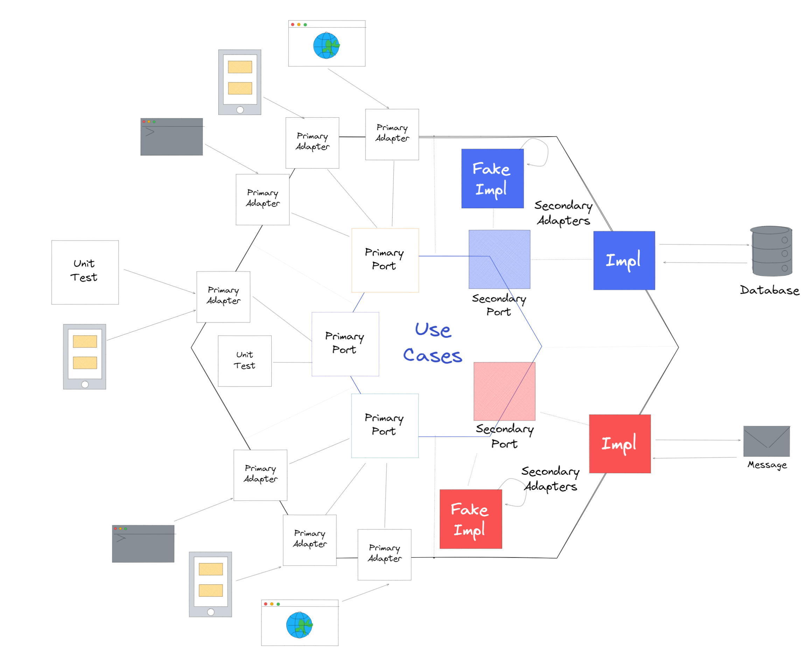

## Introduction

Hexagonal Architecture , also known as Ports and Adapters architecture was formally defined by Alistair Cockburn in his book, "Hexagonal Architecture". This design aims to decouple business logic from other parts of the component, especially the persistence, eventing and services layers. The core application logic is insulated with an isolation perimeter. A component, built on the ports and adapters pattern, exposes a set of ports to which one or more adapters can be added as necessary. The application as a whole is modelled as a hexagon, with the business domain located inside and the ports/adapters on the periphery. The business domain only cares about its own language and concepts. It uses ports to talk to whatever it needs.

## Port

A Port is a connector with a pluggable adapter that transforms an external input to something the internal application can understand. A port is an entry point that is provided by the core business logic to interact with other parts of the component. A port is a contract that defines the applications interaction boundary. An adapter is an implementation of a port, and there may be more than one adapter defined for a single port based on the requirement. For example, a REST adapter is used to accept requests from external users or other microservices components. It internally calls the service API port defined by the core business logic that performs that requested operation and generates a response. Similarly, a database adapter is used by the core business logic to interact with the external database via its database port

## Adapters

Adapters allow external systems and users to interact with the application. Adapters that expose application features are called input adapters. Output adapters are used to drive operations outside the application. Adapters are also classified as primary adapters and secondary adapters. Primary adapters help validate incoming service requests by referencing the service schema and call core business logic functions. The core business logic uses secondary adapters to help translate the application schema to an external service schema , such as a database schema. Primary adapters are initialized with the application, but references to the secondary adapters are passed to the core business logic via dependency injection. At runtime, pluggable adapters for specific input sources can be injected into the core business logic to provide access to events and data. Adapters can be swapped at build-time or runtime to create different configurations of the software system.
Correspondingly ports can also be classified as primary ports and secondary ports. *Primary ports* are called by the primary adapters and they act as the main interface between the core business logic and its users. Secondary ports and secondary adapters are used by the core business logic to generate events or interact with external services, like a database, message queue etc.

## Hexagonal Architecture

In Hexagonal Architecture everything external is fundamentally an outside interface, and thus it’s a symmetrical view rather than an asymmetrical layering scheme. It's often represented as a hexagon because it no longer makes sense to talk about a top layer or a bottom layer. Instead, Hexagonal Architecture talks mainly in terms of the outside and the inside.

In this pattern, the application as a whole is seen as a hexagon, with the business domain located inside. This core application logic is insulated with an isolation perimeter. This insulation helps an application to be unaware of the outside world. The insulation opens specific ports for establishing communication channels to and from the application code. Consuming applications can write adapters against these ports to communicate with the application or component. Furthermore, if the application needs to emit a message to the outside, it will also use a port with an adapter to send it and transform it into something that the outside can understand.

The hexagonal architecture is a natural fit for Domain-Driven Design (DDD). It isolates the domain logic from the infrastructure, such as the database, message queue, mail delivery, and the cache system. It can be extended to support different types of clients easily by adding a new adapter.

The Hexagonal architecture lets the application treat all of its consumers alike, whether it is a user interface, test suit, monitoring service, or an automation script.

REFERENCES  
[Cockburn, A. (2005). Hexagonal architecture](http://alistair.cockburn.us/Hexagonal+architecture).  
[The Clean Architecture](http://the%20clean%20architecture/) - Uncle Bob (2012)