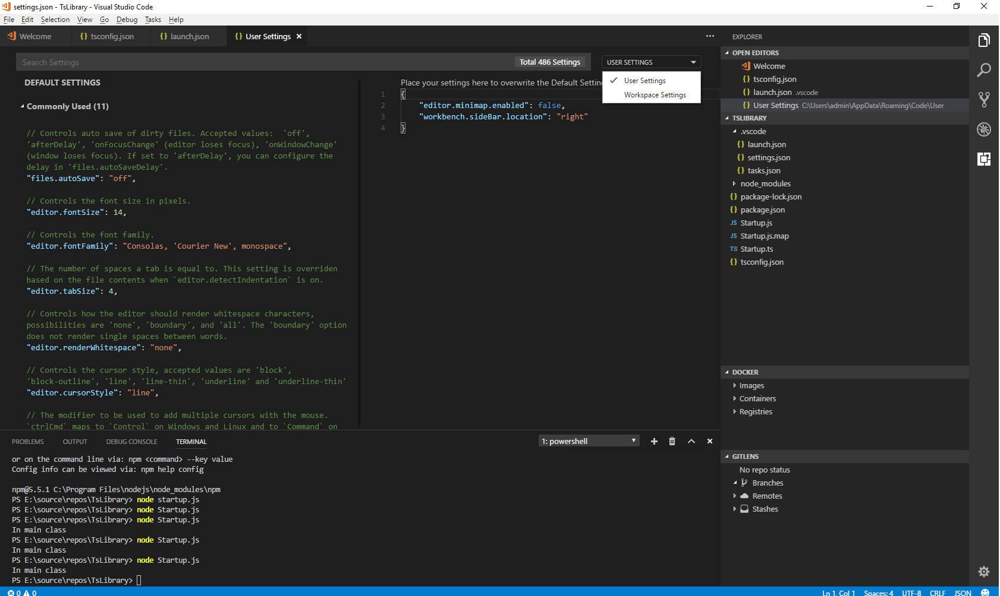
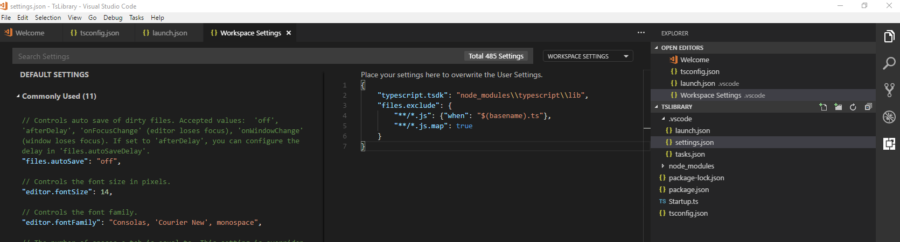

VS code is a nice IDE for typescript projects and is actually the fastest growing javascript and angular IDE. When working on typescript projects some of us do not like the explorer to be polluted with the transpiled js and the js.map files.

Luckily VScode allows us to hide the js files from the explorer using workspace settings. To do this open workspace settings from File --> Preferences --> Settings. Click on the drop down box to select Workspace Settings.

Now add the below lines to hide all js and js.map files

"files.exclude": {

"\*\*/\*.js": true,

"\*\*/\*.js.map": true

}

The above settings hides all js and js.map files. However if you want to only hide the js files when there is a corresponding ts file change the above to

"files.exclude": {

"\*\*/\*.js": {"when": "$(basename).ts"},

"\*\*/\*.js.map": true

}

voila, all js files with a corresponding ts file are hidden.

