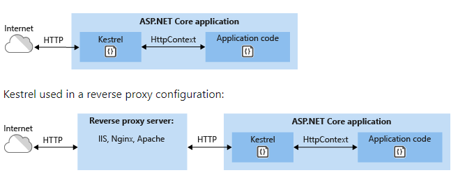

### Https Redirection middleware

In asp.net core [https](https://pradeepl.com/blog/https/) is enabled by default. The [HttpsRedirection middleware class](https://github.com/aspnet/BasicMiddleware/blob/354cb18d6304b24063d460e0a41c6c1d51ea4000/src/Microsoft.AspNetCore.HttpsPolicy/HttpsRedirectionMiddleware.cs#L139) provides the necessary functionality to enforce redirection from http to https. The UseHttpsRedirection extension method in startup is used to enforce this. This extension method issues a 307 temporary redirect response by default. It then uses the configured https port to specify the redirection endpoint. If the https port is not specified in code, this class will get the https port from HTTPS\_PORT environment variable or the IServerAddress feature. If either of them is not specified, then the middleware will log a warning and will not redirect. The code below shows an example of adding the https redirection middleware to the services collection and using it. The code below checks the environment and sets a permanent redirect to the HTTPS endpoint in production and a temporary redirect in development environment.

```csharp
public void ConfigureServices(IServiceCollection services)
{
   if (!_env.IsDevelopment())
   {
      services.AddHttpsRedirection(opts => {
          opts.RedirectStatusCode = StatusCodes.Status308PermanentRedirect;
          opts.HttpsPort = 44300;
      });
   }
  else
  {
    services.AddHttpsRedirection(opts => {
          opts.RedirectStatusCode = StatusCodes.Status307TemporaryRedirect;
          opts.HttpsPort = 44300;    
  }
  services.AddControllers();
}

public void Configure(IApplicationBuilder app, IHostingEnvironment env)
{
  if (env.IsDevelopment())
  {
    app.UseDeveloperExceptionPage();
  }
  else
  {
    app.UseHsts();
  }
  app.UseHttpsRedirection();
  app.UseEndpoints(endpoints =>
  {
    endpoints.MapControllers();
  });
}
```

Adding HTTPRedirection

### Development certificates

To enable the use of HTTPS in the development environment, .net core provides a global tool that creates a self-signed certificate on the local environment. The following command can install this tool

```shell
dotnet tool install --global dotnet-dev-certs
```

The tool can now be used to generate self-signed certificates with the following command. The -ep flag signifies the export path where the certificate will be exported and the -p flag signifies the password required to generate the certificate. We can use the --trust option to trust the certificate generated.

```shell
dotnet dev-certs https -ep <path\_to\_certificate>/certificate.pfx -p <certificate\_password>

dotnet dev-certs https --trust
```

On Linux/Mac OS we can use OpenSSL to generate the certificate for the local environment. Trusting the certificate is however a much more involved process depending on the version and flavor of the Linux OS.

```shell
openssl req -new -x509 -newkey rsa:2048 -keyout dev-certificate.key -out dev-certificate.cer -days 365 -subj /CN=localhost  
openssl pkcs12 -export -out dev-certificate.pfx -inkey dev-certificate.key -in dev-certificate.cer
```

The certificate path can be specified using the environmental variable ASPNETCORE\_Kestrel\_\_Certificates\_\_Default\_\_Path & the password using environment variable ASPNETCORE\_Kestrel\_\_Certificates\_\_Default\_\_Password

### Kestrel as edge server

Kestrel can be deployed either as an edge server or with a reverse proxy such as IIS, NGINIX or Apache.



Kestrel deployment scenarios

When Kestrel is deployed as a public facing edge server it can be configured to use https and a specific certificate and port using the below code

```csharp
webBuilder.ConfigureKestrel(serverOptions =>
{
    serverOptions.ConfigureHttpsDefaults(listenOptions =>
    {
        // certificate is an X509Certificate2
        listenOptions.ServerCertificate = certificate;
    });
});
```
Configuring Kestrel as edge server

### Terminating TLS at a Reverse proxy

If a reverse proxy such as Apache or NGNIX is used, then the forwarded headers middleware should be configured and setup before calling the Https redirection middleware. The forwarded headers middleware should set the X-Forwarded-Proto to https. This will enable https offloading at the proxy and a plain http call to the web application with a guarantee that the original call was made over a secure https channel. This is critical especially in non-IIS scenarios such as NGINIX or Apache. See the code below to configure the forwarded headers middleware

```csharp
public void ConfigureServices(IServiceCollection services)
{
    services.AddMvc();

    services.Configure<ForwardedHeadersOptions>(options =>
    {
        options.ForwardedHeaders = 
            ForwardedHeaders.XForwardedFor | ForwardedHeaders.XForwardedProto;
        options.KnownNetworks.Clear();
        options.KnownProxies.Clear();
    });
}

public void Configure(IApplicationBuilder app, IHostingEnvironment env)
{
    app.UseForwardedHeaders();

    if (env.IsDevelopment())
    {
        app.UseDeveloperExceptionPage();
    }
    else
    {
        app.UseExceptionHandler("/Home/Error");
    }

    app.UseMvc();
}
```

Forwarded headers from a reverse proxy

### HTTPS in containerized environment

In a containerized environment an option is to generate the certificates as part of container creation or startup and specify the same in the docker compose file. The environment files can then be used to configure the necessary environment variables as below

```yaml
version: "3.7"
services:
  policy_api:
    container_name: policyadmin_api
    build:
      context: .
      dockerfile: containers/api/Dockerfile
    volumes:
      - ./<path_to_certificate>/:/root/.dotnet/https
    env_file:
      - containers/api/policyadmin.env
    networks:
      - my_network
    ports:
      - 5000:5000
      - 5001:5001  
```

Using certificates in a docker volume

The corresponding environment files to specify the necessary environment variables are below

```
ASPNETCORE_ENVIRONMENT=PreProd
ASPNETCORE_URLS=https://*:5001
ASPNETCORE_Kestrel__Certificates__Default__Password=<certificate_password>
ASPNETCORE_Kestrel__Certificates__Default__Path=/root/.dotnet/https/certificate.pfx
```

using environment variables in docker to specify certificate path

### HTTPS strict transport security (HSTS)

Using HTTPS redirection still presents a minor security risk as the user can make an initial request using HTTP before being redirected to a secure HTTPS connection. To overcome this the HTTP Strict Transport Security (HSTS) Protocol adds a header in responses indicating that only HTTPS should be used when sending requests to the web endpoint. Once an HSTS header has been received, clients that support the HSTS protocol will always send requests to the application using HTTPS even if the user specifies an HTTP URL. In .NET Core 3.1, We can add the HSTS middleware to the pipeline as below.

```csharp
public void ConfigureServices(IServiceCollection services)
{
  // ...
  
  services.AddHsts(options =>
  {
    options.Preload = true;
    options.IncludeSubDomains = true;
    options.MaxAge = TimeSpan.FromDays(365);
  });

  //....
  
}
```

Adding HSTS

In the above code we are specifying HSTS preload to be set to true. [HSTS preloading](https://www.chromium.org/hsts) is a function built into the browser whereby a global list of hosts enforces the use of HTTPS ONLY on their site. The domains are hard coded into the browser, which avoids the initial insecure request and ensures that only HTTPS is used. Another crucial point that trips up a lot of folks is that the HSTS header is not set even if you specify the use of HSTS middleware for localhost and the loopback address for IPV6 and IPV4. This is because the ExcludeHosts parameter by default excludes these addresses.

> Note: HSTS is a browser only feature. This is not supported by API's. API clients such as HttpClient and HttpClientHandler do not support HSTS. I have seen API setup code using HSTS and it really does not work.

In summary .NET core provides a lot of ways to configure https for web applications with Kestrel as an edge server or through SSL offloading/TLS termination. It also provides for options to configure the same through code or through configuration or using a docker compose file.

> Photo by [alexander ehrenhöfer](https://unsplash.com/@alexeh99?utm_source=unsplash&utm_medium=referral&utm_content=creditCopyText) on [Unsplash](https://unsplash.com/s/photos/locks?utm_source=unsplash&utm_medium=referral&utm_content=creditCopyText)
