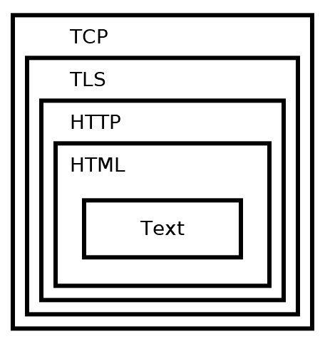

[HTTP]()(Hypertext transfer protocol) is a network protocol used to serve up web pages. HTTPS, or HTTP Secure, was designed to secure communications between a client and the HTTP server. The main purpose of HTTPS is to provide a secure channel over which data can be transmitted between a web browser and a web server. This is especially important when transferring sensitive information, like credit card details, login credentials, etc. This protocol encrypts HTTP traffic before sending it out on the network. Early versions of HTTPS used a protocol called Secure Socket Layer (SSL) to encrypt the HTTP traffic. Versions 1, 2, and 3 of SSL were discovered to have security flaws. The successor of SSL 3 was a new protocol called Transport Layer Security (TLS). TLS is a cryptographic protocol designed to provide secure communication over a computer network. The primary aim of TLS is to provide privacy and data integrity between two or more communicating computer applications. It's used in various applications like email, messaging, voice over IP, and HTTPS. Earlier versions of TLS have also been found to have flaws. TLS 1.3 fixed these flaws and should ideally be used, except when legacy systems require the use of older protocols for backward compatibility.

HTTPS secures HTTP by using TLS over TCP on port 443. Generally, establishing an HTTPS connection involves the client and server negotiating which protocol to use. The ideal outcome is that the client and server agree on the most secure, mutually supported protocol and cipher.

## HTTP

HTTP is most commonly used to transmit web pages. The text on a web page is first encoded as Hypertext Markup Language (HTML). HTML provides formatting, layout, and styling to web pages. HTTP is then used to transmit the HTML, and HTTP itself is transmitted over a TCP connection. This can be visually represented as below

## HTTPS - HTTP with TLS

HTTPS (Hypertext Transfer Protocol Secure) is a secure extension of the HTTP protocol. It leverages TLS (Transport Layer Security), or its predecessor SSL (Secure Sockets Layer), to encrypt communication between your web browser and the website you visit. This encryption ensures the confidentiality and integrity of data exchanged, preventing eavesdropping or tampering by unauthorized parties.

### How HTTPS and TLS Work Together

- TLS: This cryptographic protocol provides the foundation for HTTPS. It handles encryption, authentication, and data integrity, ensuring that communication between a web server and browser remains secure and reliable.
- HTTPS: This protocol essentially uses HTTP within a TLS-encrypted channel. This means your website requests and responses are protected as they travel over the internet.

### Beyond Web Traffic

While HTTPS is widely associated with securing websites, it's important to understand that TLS is a versatile protocol. It can  also secure other communication channels, including:

- Websockets (WSS): For secure real-time web communication.
- Email (SMTPS): For encrypted email transmission.
- FTP (FTPS): For secure file transfers.

### Key Benefits of HTTPS

- Data Privacy: HTTPS protects sensitive information like login credentials, personal details, and financial data.
- Data Integrity: HTTPS prevents unauthorized modification of data in transit.
- User Trust: The HTTPS padlock icon in browsers signals to users that their connection is secure, fostering trust in your website.

## TLS Handshake

After a TCP connection is established, the client initiates a TLS handshake. The client sends several specifications to the server, including which versions of SSL/TLS it is running, which cipher suites it supports, and which compression methods it would like to use.

The server selects the highest mutually supported version of SSL/TLS to use. It also chooses a cipher suite and compression method from the choices given by the client. If the client and server do not support any cipher suite in common, then no TLS connection can be established. Once the initial TLS connection is established, the client requests the server's certificate. Certificates are used to verify server identities with digital signatures. The client uses this to verify that it's connected to a legitimate server. The certificate must be trusted by the client or an authority party that the client trusts. Examples of certificate authorities are Network Solutions, GeoTrust, Let's Encrypt, and Amazon. Once the client has verified that the server really is who it claims to be, a key exchange is initiated. The key depends on the cipher that is chosen. After key exchange completes, both the client and server have a shared secret key. All further communication is encrypted using this key and their chosen symmetric cipher.

## Steps in the SSL/TLS handshake

A visual step by step representation of the entire process is below.

- `A`. Start of TLS Handshake: This is the initial phase where the client and server begin the process of establishing a secure connection.

- `B`. ClientHello:

  - The client initiates the handshake by sending a "ClientHello" message to the server.
  - This message includes the TLS version the client supports, a list of supported cipher suites (algorithms for encryption, key exchange, and authentication), and a list of supported compression methods.

- `C`. ServerHello:

  - In response, the server sends a "ServerHello" message.
  - It selects the highest TLS version both it and the client support, chooses a cipher suite from the list provided by the client (based on the server's preferences and capabilities), and selects a compression method.

- `D`. Server Certificate:

  - The server sends its digital certificate to the client.
  - This certificate contains the server's public key and is used by the client to authenticate the server's identity. The certificate is usually issued by a trusted Certificate Authority (CA).

- `E`. ServerKeyExchange (if required):

  - This message is sent if the chosen cipher suite requires it (for example, in Diffie-Hellman key exchange).
  - It contains cryptographic parameters that the client needs to generate the pre-master secret.

- `F`. ServerHelloDone:

  - This message indicates that the server has finished sending messages to support the key exchange and is now waiting for the client's response.

- `G`. ClientKeyExchange:

  - The client responds with a "ClientKeyExchange" message.
  - Depending on the cipher suite, this could involve sending a pre-master secret encrypted with the server's public key, or other key-exchange-specific data.

- `H`. [Optional] CertificateVerify:

  - If the client sent a certificate to the server (in client authentication scenarios), it also sends a "CertificateVerify" message.
  - This message contains a digital signature, allowing the server to verify the client's certificate.

- `I`. ChangeCipherSpec:

  - Both the client and the server send a "ChangeCipherSpec" message indicating that subsequent messages will be encrypted using the negotiated encryption settings.
  
- `J`. Finished:

  - Both parties exchange "Finished" messages, which are encrypted and serve as a final handshake step.
  - These messages verify that the key exchange and authentication processes were successful.

- `K`. TLS Handshake Completed: At this point, the handshake is complete, and the client and server have established a secure connection.

- `L`. Secure HTTP communication over TLS:

With the secure connection established, the client and server can now exchange HTTP data securely.
All transmitted data, including HTTP headers and content, is encrypted according to the negotiated cipher suite.
Secure TLS connections between the client and server have at least one of the following properties

- As symmetric cryptography is used to encrypt the transmitted data, it is the reason the connection is secure. The negotiation of a shared secret is both secure and reliable (the negotiated secret is unavailable to eavesdroppers and no attacker can modify the communications during the negotiation without being detected).

- Public-key cryptography is used to authenticate the identity of the communicating parties. The authentication procedure could be made optional, but typically it is required for the server.

- To prevent the undetected loss or alteration of the data during transmission, each transmitted message includes message integrity check using a message authentication code

A detailed post on implementing https in an ASP.Net Core web application is [here]()
