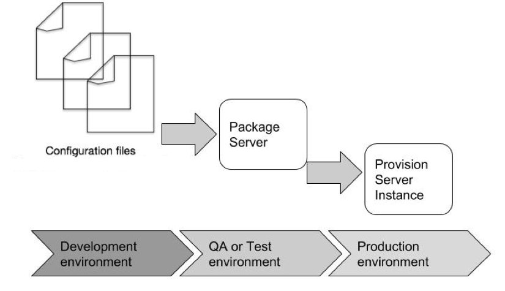

# Introduction

Infrastructure as Code (IaC) represents a fundamental reimagining of infrastructure management. It transcends the limitations of manual processes by leveraging the power of code. Infrastructure as code (IaC) is the process of provisioning and managing your infrastructure resources through definition files or code. This allows for the application of the best practices of software development to infrastructure provisioning and management. This declarative approach fosters transparency, consistency, and version control, enabling meticulous control over infrastructure state and facilitating collaboration across teams.

The modern cloud landscape demands agility, efficiency, and security. Yet, some organizations remain tethered to the archaic processes of manual infrastructure provisioning, a spell book of cryptic commands and error-prone configurations. This archaic approach stifles innovation, breeds inconsistencies, and exposes vulnerabilities. It is time to embrace a paradigm shift, and transition from the manual maze to the IaC highway.

IaC provides a centralized way to manage configuration in terms of implementation and version control. It emphasizes consistent, repeatable routines for provisioning and changing systems and their configuration. IaC provides speed, security, precision, and most importantly reproducibility while managing environments. This allows for the quick creation of infrastructure and servers using standardized patterns, easier management of patches and versions, automatic monitoring, and the replacement of faulty infrastructure components.

Infrastructure as Code

There are many benefits in designing infrastructure as code.

- Enhanced Agility: IaC facilitates rapid deployments and environment provisioning, enabling organizations to adapt to evolving business needs with speed and efficiency.

- Reduced Errors: Declarative configuration minimizes human error, leading to more consistent and reliable infrastructure.

- Improved Collaboration: Version control systems enable seamless collaboration, promoting knowledge sharing and ensuring configurations remain aligned with best practices.

- Streamlined Security: IaC allows for the integration of security policies directly into configuration files, proactively mitigating risks and bolstering overall security posture.

- Cost Optimization: Automation eliminates the need for manual intervention and optimizes resource utilization, leading to significant cost savings.

# Principles of IaC

The principles of IaC are

- Systems can be easily reproduced - It should be possible to rebuild any element of the infrastructure effortlessly and reliably. Decisions about which software and versions to install on a server, how to choose a hostname, and so on should be captured in declarative scripts and tooling that provision it.

- Systems are disposable - Infrastructure resources should be easily created, destroyed, replaced, resized, and moved. Embracing disposable infrastructure can play a key role in improving service continuity

- Systems are consistent - The reproducibility principle above help to easily build multiple identical infrastructure elements. Being able to build and rebuild consistent infrastructure helps with configuration drift.

- Processes are repeatable - Any action you carry out on your infrastructure should be repeatable.

- Design is always changing - Making a change to an existing system should be easy and cheap. The most important measure to ensure that a system can be changed safely and quickly is to make changes frequently. This forces everyone involved to learn good habits for managing changes, to develop efficient, streamlined processes, and to implement tooling that supports doing so.

# Demystifying IaC Concepts

A good understanding of the key concepts of IaC is key to implementing an effective process. some of the key concepts are

1. Declarative Configuration: IaC disrupts the traditional paradigm of imperative infrastructure management by embracing declarative configuration. Instead of issuing explicit commands to create or modify resources, IaC tools utilize languages like Terraform's HCL, Ansible's YAML, or CloudFormation's JSON to define the desired state of your infrastructure. This declarative approach promotes transparency, consistency, and version control by explicitly stating what you want, allowing tools to automatically reconcile the desired and actual states.

2. Resource Abstraction and Management: IaC transcends individual servers and network devices, treating them as abstract resources within your infrastructure. Tools like Terraform leverage plugins and modules to manage a diverse range of resources, from virtual machines and databases to firewalls and load balancers. This facilitates flexible and scalable infrastructure by decoupling your configuration from specific implementations.

3. Idempotency and State Management: IaC ensures idempotent operations, meaning repeated application of the same configuration will always yield the same desired state. This is achieved through state management, where tools track the current configuration and only make necessary changes to achieve the desired state. This eliminates the risk of accidental overwrites and inconsistencies, promoting predictable and reliable infrastructure.

4. Modularity and Reusability: IaC embraces modularization, allowing you to break down your infrastructure into reusable components called modules. These modules encapsulate specific configurations and can be combined, nested, and shared across projects. This promotes code reuse and DRY (Don't Repeat Yourself) principles, reducing development time and maintenance effort.

5. Collaboration and Version Control: IaC configurations are code, and code belongs in version control systems like Git. This facilitates collaborative infrastructure management, enabling teams to track changes, revert to previous versions, and share best practices. Version control also promotes auditability and compliance, ensuring configurations comply with internal policies and external regulations.

6. Security as Code: IaC empowers you to embed security directly into your infrastructure. Tools like Terraform Sentinel and Ansible Galaxy Roles enable you to define and enforce security policies, access controls, and compliance requirements within your configuration files. This leads to proactive and automated security, significantly reducing the attack surface and mitigating potential threats.

By embracing these core concepts, IaC empowers you to transform infrastructure management into a predictable, efficient, and secure practice. It liberates you from the shackles of manual configuration, allowing you to focus on innovation and agility in a rapidly evolving cloud landscape.

# IaC tooling
IaC represents more than just a collection of tools; it is a philosophical shift towards treating infrastructure as code. There are various tools which help implement key aspects of IaC. Each tool offers unique strengths and caters to specific needs. Let's delve into three popular options and understand what makes them shine:

1. Terraform: Terraform is vendor agnostic in its multi-cloud and hybrid cloud support. Whether you're in AWS, Azure, GCP, or on-premises, Terraform empowers you to manage infrastructure with a consistent approach. Terraform utilizes a human-readable configuration language (HCL) that focuses on desired state, making your code intuitive and easy to collaborate on. It embraces modularity through its extensive library of modules, allowing you to reuse configurations, share best practices, and accelerate development. [This blog post series]() is a good place to get started with terraform.

2. Ansible: Ansible relies on lightweight agents deployed on target machines, enabling push-based configuration management and automation. This architecture is ideal for complex configurations and orchestration across diverse environments. It utilizes YAML-based playbooks to define configuration tasks and sequences, offering a structured and repeatable approach to infrastructure management. Ansible Galaxy, a vibrant community-driven repository, provides a wealth of pre-built roles and modules, accelerating development and promoting knowledge sharing.

3. CloudFormation: CloudFormation is the native IaC service for AWS, offering seamless integration and access to the full range of AWS resources and services. This deep integration simplifies deployment, reduces configuration complexity, and leverages native AWS features. CloudFormation utilizes YAML templates to define infrastructure configurations, making it familiar for AWS users and offering a straightforward approach for describing desired state. [This blog post]() is a good place to get started on Cloudformation.

These are just three examples, and the IaC landscape continues to evolve with new tools and capabilities emerging. The best tool choice depends on your specific needs, cloud environment, and existing tooling. 

Choosing the right tool depends on  factors such as :

 - Cloud platform support: Do you need multi-cloud or vendor-specific features?
 - Configuration language preference: Are you comfortable with HCL, YAML, or other languages?
 - Agent-based vs. agentless: Do you need push-based automation or prefer a purely declarative approach?
 - Community and support: Is a vibrant community and extensive resources available?

By understanding the strengths and considerations of different IaC tools, you can make informed decisions and leverage the power of IaC to build and manage your infrastructure efficiently and effectively.