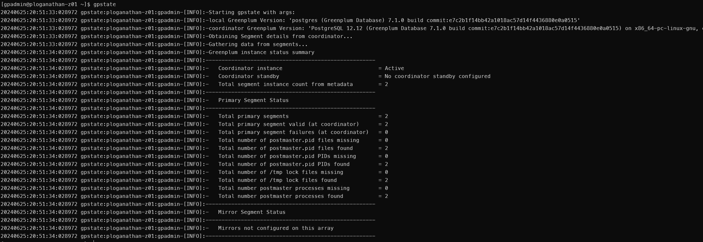
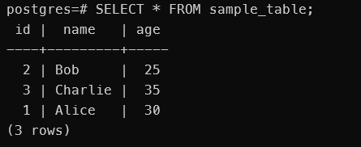

In today's data-driven world, the choice of database can significantly impact the performance and efficiency of your AI/ML workloads. VMWare's Greenplum, is a powerful,  massively parallel processing (MPP) data platform for analytics, machine learning, and AI. In this blog post, we will touch upon what makes Greenplum an excellent choice for developers and data scientists, but the post is focussed on providing detailed steps to install Greenplum on Windows using WSL2 (Windows Subsystem for Linux 2). I hope this blog post will enable you to easily install Greenplum and try out its powerful features. I will focus extensively on installing it on RockyLinux 8 in WSL2 but you can also use the same instructions to install it directly on RockyLinux 8.

## Introduction to Greenplum

Greenplum Database is an advanced, fully-featured, open-source data warehouse and analytics platform. It provides a robust feature set with capabilities designed for big data and large-scale data analytics. Here are some of the key features that make Greenplum stand out:

1. **Massively Parallel Processing (MPP):** Greenplum leverages a shared-nothing architecture, enabling it to distribute data and query workloads across multiple nodes. This results in exceptional performance and scalability for large datasets.
2. **High Availability:** Greenplum offers robust high-availability features, including data replication and failover mechanisms, ensuring continuous availability of your data.
3. **Advanced Analytics:** With built-in support for advanced analytics, Greenplum allows users to perform complex data processing tasks directly within the database. This includes in-database machine learning, geospatial analytics, and more.

## Greenplum for AI/ML Workloads

Greenplum's architecture and features make it particularly well-suited for AI/ML workloads. One of the exciting additions to Greenplum is the support for pgvector, an extension for vector similarity search, which is essential for AI applications. It can be used to build recommendation engines and nearest-neighbor searches. It provides amazing features that are key to build AI/ML applications

1. **Integration with AI/ML Libraries:** Greenplum integrates well with popular AI/ML libraries and frameworks such as TensorFlow, PyTorch, and scikit-learn. This makes it easier to bring models into production and leverage Greenplum's processing power.
2. **pgvector for Similarity Search:** The pgvector extension allows you to perform fast and efficient vector similarity searches. This is crucial for AI applications that require comparing high-dimensional data, such as image and text embeddings.
3. **Scalability:** Greenplum's MPP architecture ensures that AI/ML models can be trained on large datasets efficiently. The ability to scale horizontally across multiple nodes means you can handle ever-growing data volumes.

## Trying Out Greenplum

As part of my AI/ML workflow, Greenplum plays a crucial role in handling and processing large datasets efficiently. Its ability to scale and perform advanced analytics and machine learning processes directly within the database accelerates the AI/ML workflow. Setting up Greenplum on a single node is perfect for development and testing, allowing you to explore and experiment with Greenplum's features. Now, let's dive into the steps to install a single node Greenplum instance on Windows using WSL2.

## Step-by-Step Installation Guide

### Prerequisites

* Windows 10 or later with WSL2 enabled.
* Rocky Linux version 8 container rootfs
* Basic knowledge of Linux command line.

### Step 1: Download and Import Rocky Linux to WSL2

1. Download the Rocky Linux 8 tar file from the official website [here](https://dl.rockylinux.org/pub/rocky/8/images/x86_64/Rocky-8-Container-Base.latest.x86_64.tar.xz).

2. Open PowerShell as Administrator and import the Rocky Linux tar file downloaded in the above step into WSL

```powershell
wsl --import RockyLinux8 <InstallLocation> Rocky-8-Container-Base.latest.x86_64.tar.xz --version 2
```

3. Launch the Rocky Linux WSL instance wither using the command line or by selecting it from the dropdown in the terminal window. it generally take a few minutes for the distribution to be made available by WSL in Windows terminal.

```powershell
wsl -d RockyLinux8
```

### Step 2: Enable systemd in WSL2

systemd is a system and service manager for Linux operating systems. It is responsible for initializing the system and managing system processes after booting. systemd provides various features such as parallelized startup, on-demand starting of daemons, and monitoring and maintaining services.

systemd provides key features such as:

* Service Management: systemd can start, stop, and manage services efficiently.
* Parallel Initialization: Speeds up the boot process by initializing services in parallel.
* Socket-based Activation: Services are started on-demand using sockets.
* Logging: Integrates with journalctl for system and service logging

Windows Subsystem for Linux (WSL) provides a compatibility layer for running Linux binaries natively on Windows. By default, WSL uses a simplified init system to manage the Linux environment, which does not include systemd. This is because WSL aims to be lightweight and systemd introduces additional complexity and resource usage. However, with the introduction of WSL2, which uses a full Linux kernel, it's now possible to enable systemd and take advantage of its features. 

Here’s how you can enable systemd in WSL2..

1. To enable systemd in WSL2, create or modify the /etc/wsl.conf file

```bash
sudo vi /etc/wsl.conf
```

2. Add the following content to wsl.conf

Add the following lines to enable systemd at boot

```plaintext
[boot]
systemd=true
```

3. Restart your WSL2 instance

After modifying the configuration file, you need to restart your WSL2 instance for the changes to take effect. Open PowerShell and run:

```powershell
wsl --shutdown
wsl
```

4. Verify that systemd is running

Once WSL2 restarts, verify that systemd is running by checking the process with the following command:

```bash
ps -p 1 -o comm=
```

You should see systemd as the output, indicating that it is successfully running.

### Step 3: Install Required Packages

Before we proceed with installing Greenplum, it's crucial to update your system and install several essential packages. These packages include openssh-server, libcap, and vim.

* **openssh-server:** This package installs the OpenSSH server, which allows you to securely connect to your WSL instance using SSH. SSH is essential for running remote commands, managing files, and maintaining your Greenplum installation.
* **libcap:** The libcap library provides the POSIX 1003.1e capabilities interface. It allows programs to use fine-grained privileges rather than the traditional all-or-nothing root access. This is important for enabling non-root users to perform specific administrative tasks without granting full root permissions.
* **vim:** I prefer to use vim as a robust and efficient way to manage text files within my WSL environment. You can use any text editor of your choice.

```bash
sudo dnf update
sudo dnf makecache
sudo dnf install openssh-server libcap vim
```

This sets up the necessary packages to move onto the next step.

### Step 4: Set Up User for Greenplum

To run Greenplum effectively, it is best practice to create a dedicated user and group for managing the database. This ensures that the database processes run under a specific user account, enhancing security and manageability.

1. Create a user and group for Greenplum

First, create a group named gpadmin. This group will be associated with the Greenplum user and help manage permissions more effectively. Next, create a user named gpadmin and add it to the gpadmin group. This user will own the Greenplum processes and files. Assign a password to the gpadmin user. You will be prompted to enter and confirm the password.

```bash
sudo groupadd gpadmin
sudo useradd -g gpadmin gpadmin
sudo passwd gpadmin
```

2. Edit the sudoers file to allow gpadmin to execute commands without a password

To manage Greenplum effectively, the gpadmin user needs to execute administrative commands without constantly entering the password. This can be achieved by editing the sudoers file. Open the sudoers file using the visudo command. The visudo command safely edits the sudoers file and ensures that syntax errors are not saved, which could prevent gaining superuser access.

```plaintext
sudo visudo
```

3. Add the following line:

In the visudo editor, scroll down to find the section where user privileges are defined. Add the following line to grant the gpadmin user the ability to execute any command without a password. This line means that the gpadmin user can execute all commands (ALL) as any user ((ALL)) without providing a password (NOPASSWD).

```plaintext
gpadmin ALL=(ALL) NOPASSWD: ALL
```

We created a dedicated gpadmin user and group, and configured sudo privileges, ensuring that your Greenplum installation runs under a specific user account with the required permissions. This enhances both security and manageability of your Greenplum environment.

### Step 5: Set Up SSH

The Secure Shell (SSH) protocol provides secure command-line access to remote machines. For Greenplum, SSH is used to enable communication between nodes in the cluster. Setting up SSH involves generating SSH keys and configuring the SSH service.

SSH host keys are used to identify the server. These keys need to be generated if they are not already present.

1. The below commands generate RSA, ECDSA and ED25519 SSH keys and configure SSH for the root user

```bash
# As root
ssh-keygen -t rsa -b 2048 -f /etc/ssh/ssh_host_rsa_key -N ''
ssh-keygen -t ecdsa -b 256 -f /etc/ssh/ssh_host_ecdsa_key -N ''
ssh-keygen -t ed25519 -f /etc/ssh/ssh_host_ed25519_key -N ''
```

2. The below commands generate RSA, ECDSA and ED25519 SSH keys and configure SSH for the gpadmin user

Switch to the gpadmin user. This ensures that the keys are generated in the correct user context

```bash
# As gpadmin
sudo -i -u gpadmin
ssh-keygen -t rsa -b 2048
```

3. Copy the Public Key to Authorized Keys

```bash
ssh-copy-id gpadmin@127.0.0.1
```

4. Test SSH to 127.0.0.1 with no password to ensure it is ready.

```bash
ssh gpadmin@127.0.0.1
```

If everything is configured correctly, you will be logged into the same system without being asked for a password.

By generating SSH host and user keys and configuring SSH for the gpadmin user, you enable secure, passwordless authentication. This setup is essential for the seamless operation of Greenplum, as it relies on SSH for internal communication between cluster nodes.

### Step 6: Configure Ping for non-root users

The ping command is commonly used to test network connectivity by sending ICMP echo requests to a target host. By default, the ping command requires root privileges to send these requests. However, you can configure ping to work for non-root users by using the setcap command, which sets file capabilities on the executable.

1. The setcap command allows you to set specific capabilities on executables, granting them privileges without requiring full root access. In this case, we use it to grant the cap_net_raw capability to the ping command, allowing non-root users to execute it.

```bash
sudo setcap cap_net_raw+p /usr/bin/ping
```

2. Test the ping command as a non-root user to ensure that it works correctly:

```bash
ping 127.0.0.1
```

You should see the usual ping output, indicating that the command is functioning properly for non-root users.

### Step 7: Install Greenplum Software

Now we are ready to begin the process of downloading the RPM package and installing it in your Rocky Linux environment. First, you need to download the Greenplum RPM package. You can find the latest version of the Greenplum Database RPM on the official Greenplum website or on the Pivotal/Tanzu network. 

1. Download the .rpm file to your local machine. Save it in a directory that you can easily access from your WSL2 environment.
2. Use the dnf package manager to install the Greenplum RPM package. This command installs the Greenplum software and its dependencies.
3. After installation, change the ownership of the Greenplum installation directory to the gpadmin user. This ensures that the gpadmin user has the necessary permissions to manage and operate Greenplum.

```bash
cp /mnt/c/Users/pradeepl/Downloads/greenplum-db-7.1.0-el8-x86_64.rpm .
sudo dnf install greenplum-db-7.1.0-el8-x86_64.rpm
sudo chown -R gpadmin:gpadmin /usr/local/greenplum-db/
```

4. Verifying the Installation - After installing Greenplum, you should verify that the software is installed correctly. Switch to the gpadmin user to check the installation by checking the Greenplum version.

```bash
gpstate --version
```
This is my output.


### Step 8: Configure Environment for gpadmin

To ensure that the Greenplum database functions correctly, we need to configure the environment for the gpadmin user. This involves setting environment variables and sourcing the Greenplum environment script. Add the following lines to the .bashrc file. These lines set the GPHOME variable to the Greenplum installation directory, source the Greenplum environment script, and set the COORDINATOR_DATA_DIRECTORY to the appropriate data directory.

The COORDINATOR_DATA_DIRECTORY is an environment variable used in Greenplum to specify the location of the data directory for the Greenplum Coordinator, which is the master node of the Greenplum Database cluster. This directory stores metadata and data for the coordinator node, which includes information about the entire Greenplum Database system, such as the system catalog, user data, and other critical information.

Add the following content to the .bashrc file for gpadmin:

```bash
export GPHOME=/usr/local/greenplum-db
. $GPHOME/greenplum_path.sh
export COORDINATOR_DATA_DIRECTORY=/home/gpadmin/gp/gpsne-1
```

Reload the .bashrc file:

```bash
source ~/.bashrc
```

### Step 9: Initialize Greenplum

After setting up the environment and ensuring that SSH is configured properly, the next step is to initialize the Greenplum database. This involves creating necessary directories, configuring the initialization files, and running the initialization command to set up the Greenplum cluster.

1. Create necessary directories and configuration files:

First, create a directory to hold the Greenplum configuration and data files. Copy the sample configuration file provided by Greenplum to this directory.

```bash
mkdir ~/gp
cd ~/gp
cp $GPHOME/docs/cli_help/gpconfigs/gpinitsystem_singlenode .
```

2. Edit the gpinitsystem_singlenode file and update the necessary lines to configure the data directories and coordinator hostname.

```plaintext
declare -a DATA_DIRECTORY=(/home/gpadmin/gp /home/gpadmin/gp)
COORDINATOR_HOSTNAME=127.0.0.1
COORDINATOR_DIRECTORY=/home/gpadmin/gp
```

3. Create hostlist_singlenode file in /home/gpadmin/gp and add 127.0.0.1 to the file. This file lists the hosts that will participate in the Greenplum cluster.

```bash
echo "127.0.0.1" > ~/gp/hostlist_singlenode
```

4. Initialize the cluster (if SSH error comes up the first time, enter "yes"):

Run the gpinitsystem command to initialize the Greenplum cluster using the gpinitsystem_singlenode configuration file. If prompted with an SSH warning, enter "yes" to continue.

```bash
gpinitsystem -c gpinitsystem_singlenode
```

5. Verifying the Initialization: After the initialization process completes, verify that the Greenplum cluster is up and running by using the gpstate command.

```bash
gpstate
```

This command provides information about the status of the coordinator and segment instances. My output from this command is below



Initializing the Greenplum database involves creating the necessary directories, configuring initialization files, and running the initialization command. By following these steps, you ensure that your Greenplum cluster is set up correctly and ready for use. The initialization process configures the coordinator and segment instances, enabling you to manage and use Greenplum for your data processing needs.

### Step 10: Validation

The final step in setting up your Greenplum database is to validate that the system can be started and stopped correctly. This ensures that all configurations are correct and that Greenplum is functioning as expected.

Validate that you can restart Greenplum. This command starts the Greenplum database cluster, initializing all processes and ensuring that the database is ready for use. Validating the start and stop functionality of Greenplum ensures that your setup is complete and that the database is functioning correctly. This step confirms that all configurations are correct and that Greenplum can be managed effectively.
 
```bash
gpstop
gpstart
```

By following these steps, you should have a working Greenplum installation on Windows using WSL2 with Rocky Linux. Greenplum's powerful features and scalability make it an excellent choice for handling AI/ML workloads, providing a robust platform for your data processing and analytics needs. If you encounter any issues or have questions, feel free to leave a comment below.

### Step 11: Connect to your newly minted Greenplum system

Now that we have setup Greenplum we can login using the below command

```bash
psql -d postgres -U gpadmin
```

we can then create a table, add and query data to check as below

```sql
CREATE TABLE sample_table (
    id SERIAL PRIMARY KEY,
    name VARCHAR(50),
    age INT
);
```

```sql
INSERT INTO sample_table (name, age) VALUES
('Alice', 30),
('Bob', 25),
('Charlie', 35);
```

```sql
SELECT * FROM sample_table;
```

I get the below output on running the select




## Conclusion

In this guide, we've walked through the process of setting up Greenplum on a single-node system using Rocky Linux on WSL2. This setup is ideal for development and testing purposes, allowing you to explore the powerful features of Greenplum in a controlled environment.

We started by enabling systemd in WSL2 to ensure that essential services, such as sshd, can be managed efficiently. Next, we installed the required packages and set up a dedicated gpadmin user with the necessary permissions to manage the Greenplum database. We also configured SSH for secure, passwordless communication, and set up ping to work for non-root users.

After downloading and installing the Greenplum software, we configured the environment for the gpadmin user, ensuring that all necessary environment variables were set. We then initialized the Greenplum database, carefully configuring the system to run on a single node.

Finally, we validated our setup by ensuring that the Greenplum database could be started and stopped without issues, confirming that our configuration was correct and functional.

## Next Steps

With your Greenplum setup complete, you can now start exploring its capabilities. Use this single-node setup to develop and test your applications, experiment with data processing, and familiarize yourself with Greenplum's powerful features. When you're ready, you can scale your setup to a multi-node cluster for production use, leveraging the full power of Greenplum's massively parallel processing capabilities. We will start doing this in the next set of blog posts.