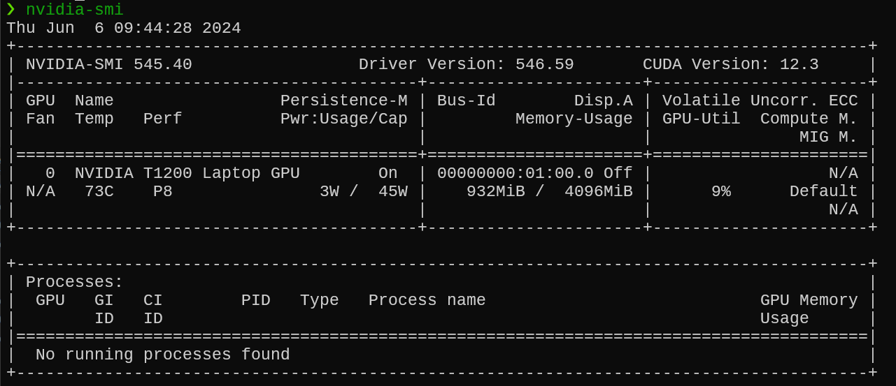
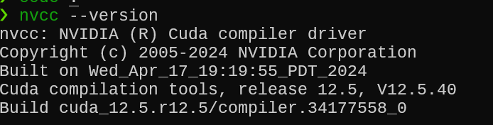

With the increasing complexity of machine learning models and the volume of data, leveraging GPU acceleration for training and inference has become essential. I have a Dell laptop with the NVIDIA T1200 Laptop GPU chip. I recently had to setup my laptop to use tensorflow on wsl2 and went through the setup process. The setup process was not straight forward and I ran into a bunch of issues and the documentation did not make it easy. This guide provides a detailed, step-by-step approach that worked for me to set up the NVIDIA GPU for TensorFlow on Windows Subsystem for Linux 2 (WSL2). By the end of this guide, you will have a working environment that uses your GPU to accelerate TensorFlow tasks.

## Step 1: Install WSL2 and Set Up a Linux Distribution

Windows Subsystem for Linux (WSL) allows you to run a Linux environment directly on Windows, unmodified, without the overhead of a virtual machine. WSL2 improves performance and provides a full Linux kernel.

### Enable WSL2 on Windows 10/11

1. Open PowerShell as Administrator and run the following command:

```bash
    wsl --install
```

2. Restart your computer if prompted.

### Install a Linux Distribution

1. From the Microsoft Store, install a Linux distribution such as Ubuntu. I already had Ubuntu 22.04 installed and setup.
2. Launch the installed distribution and complete the setup.

## Step 2: Update and Upgrade Packages

Once you have your Linux distribution set up, it is essential to update your package list and upgrade all packages to ensure you have the latest software.

```bash
sudo apt update
sudo apt upgrade -y
```

## Step 3: Install NVIDIA Drivers

To enable GPU support, ensure you have the latest NVIDIA drivers installed on your Windows system. Download and install the drivers from the [NVIDIA website](https://www.nvidia.com/Download/index.aspx).

## Step 4: Install CUDA Toolkit

CUDA is a parallel computing platform and application programming interface (API) model created by NVIDIA. Installing the CUDA Toolkit enables GPU acceleration for TensorFlow.

### Add NVIDIA's Package Repository

Add the CUDA repository to your system and install the CUDA Toolkit:

1. Download and move the repository pin:

    ```bash
    wget https://developer.download.nvidia.com/compute/cuda/repos/ubuntu2004/x86_64/cuda-ubuntu2004.pin
    sudo mv cuda-ubuntu2004.pin /etc/apt/preferences.d/cuda-repository-pin-600
    ```

2. Download and install the local repository package:

    ```bash
    wget https://developer.download.nvidia.com/compute/cuda/11.4.1/local_installers/cuda-repo-ubuntu2004-11-4-local_11.4.1-470.57.02-1_amd64.deb
    sudo dpkg -i cuda-repo-ubuntu2004-11-4-local_11.4.1-470.57.02-1_amd64.deb
    sudo apt-key add /var/cuda-repo-ubuntu2004-11-4-local/7fa2af80.pub
    sudo apt-get update
    ```

### Install CUDA Toolkit

1. Install the CUDA Toolkit using the following command:

```bash
sudo apt-get -y install cuda
```

2. Validate that it all works by using ``nvidia-smi`` command



## Step 5: Install cuDNN

cuDNN is a GPU-accelerated library for deep neural networks. It is required for TensorFlow to leverage the GPU for model training and inference.

### Download cuDNN

Visit the [NVIDIA cuDNN page](https://developer.nvidia.com/cudnn) and download the cuDNN tar file for your CUDA version.

### Install cuDNN

Extract the downloaded file and copy the contents to the CUDA installation directory:

```bash
tar -xzvf cudnn-11.4-linux-x64-v8.2.4.15.tgz
sudo cp cuda/include/cudnn*.h /usr/local/cuda/include
sudo cp cuda/lib64/libcudnn* /usr/local/cuda/lib64
sudo chmod a+r /usr/local/cuda/include/cudnn*.h /usr/local/cuda/lib64/libcudnn*
```

## Step 6: Set Environment Variables

To make CUDA and cuDNN available to TensorFlow, add their paths to your environment variables.

```bash
echo 'export PATH=/usr/local/cuda/bin:$PATH' >> ~/.bashrc
echo 'export LD_LIBRARY_PATH=/usr/local/cuda/lib64:$LD_LIBRARY_PATH' >> ~/.bashrc
source ~/.bashrc
```

## Step 7: Verify Installation

Verify the installation of CUDA and cuDNN to ensure everything is set up correctly.

### Check CUDA Installation

```bash
nvcc --version
```

This is my output



### Verify TensorFlow GPU Access

Create a simple Python script to verify that TensorFlow can access the GPU:

```python
import tensorflow as tf

print("Num GPUs Available: ", len(tf.config.list_physical_devices('GPU')))
```

### Expected Output

You should see output confirming the availability of GPUs. For example:
```
Num GPUs Available:  1
```

## Step 8: Install TensorFlow with GPU Support

Finally, ensure that TensorFlow is installed with GPU support.

```bash
pip install tensorflow
```

## Step 9: Verify TensorFlow install and access to GPU

You can use the below code the quickly check and ensure that TensorFlow is installed successfully and is able to use the GPU

```python
import tensorflow as tf

print("TensorFlow Version:", tf.__version__)

# List available devices
print("Available devices:")
for device in tf.config.list_physical_devices():
    print(device)

# Check for GPU
gpus = tf.config.list_physical_devices('GPU')
if gpus:
    print("GPU is available: ", gpus)
else:
    print("No GPU found")

from tensorflow.python.client import device_lib
print(device_lib.list_local_devices())
```

## Summary of Steps

1. **Enable WSL2** and install a Linux distribution (e.g., Ubuntu).
2. **Update and upgrade packages** in the Linux distribution.
3. **Install NVIDIA drivers** on Windows.
4. **Add NVIDIA’s package repository** and install the CUDA toolkit.
5. **Download and install cuDNN**, copying the necessary files to the CUDA directory.
6. **Set environment variables** for CUDA and cuDNN.
7. **Verify the installation** of CUDA and cuDNN.
8. **Install TensorFlow with GPU support**.
9. **Verify TensorFlow install and access to GPU.**

This quick guide hopefully helps ensure that your environment is ready for GPU-accelerated machine learning with TensorFlow on WSL2. Leveraging the power of GPU can significantly speed up your training and inference processes, allowing you to work with more complex models and larger datasets.

Feel free to reach out if you encounter any issues or need further assistance!

