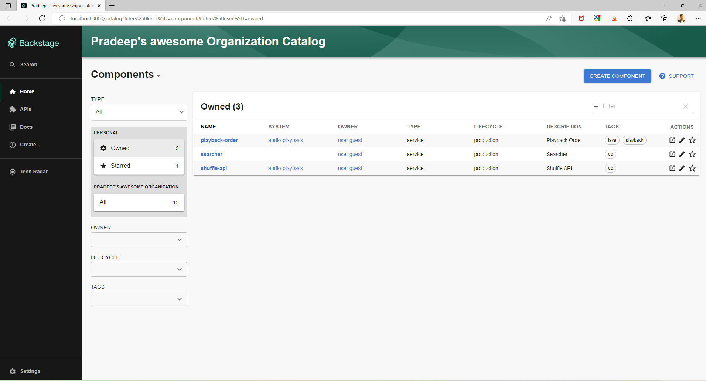
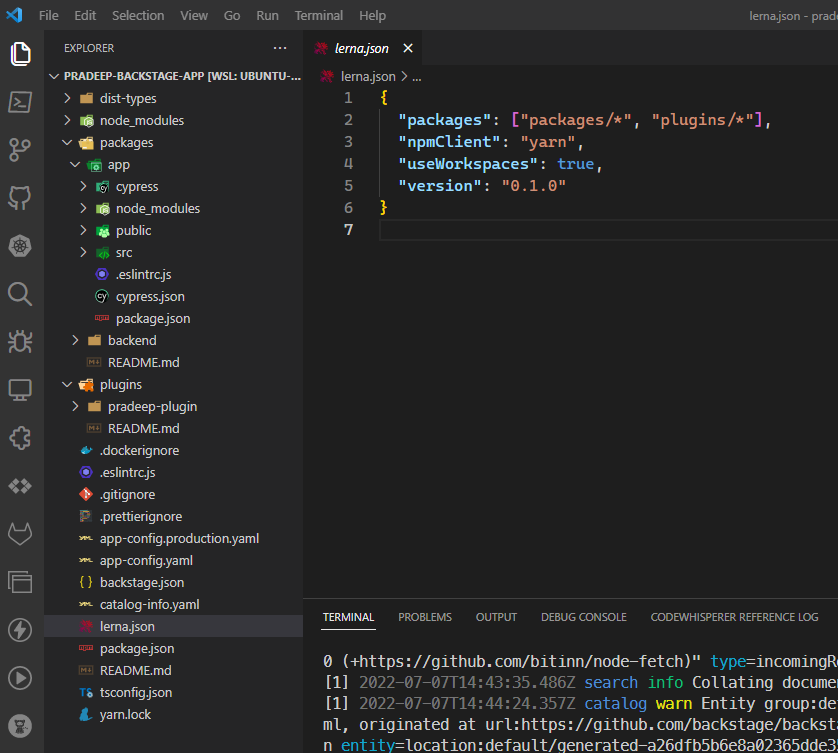
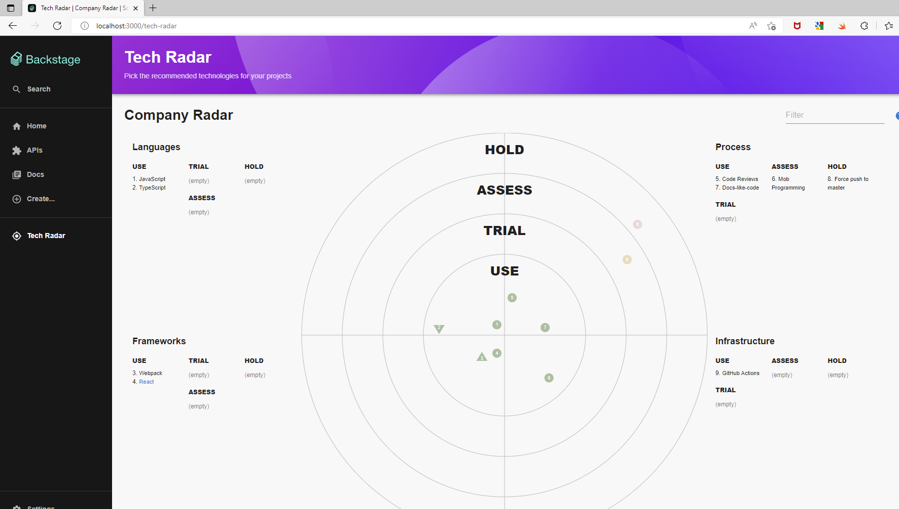

# Internal Developer Platforms (IDP)

An Internal Developer Platform (IDP) is a set of self-service tools, processes and services that help accelerate development velocity and reduce time to market. An IDP provides a standardized way for development teams to configure and deploy applications and application infrastructure. It is a self-service layer allowing developers to self-serve infrastructure requirements without having to worry about container orchestration, storage provisioning etc. IDPs support a range of infrastructure and hosting options such as public cloud, private cloud and on-premises environments. Development teams can self-serve infrastructure provisioning, application deployment or create new services thus reducing the load on platform teams. IDPs streamline infrastructure decisions and integrate with existing build and deploy pipelines while providing role-based access control to developers without the need for working through a wall of YAML files.

For example, a developer creating a new microservice would start by creating a repository in SCM. They would then raise a ticket to add the necessary collaborators to the repo and provide them with the right access. They would then raise one or more tickets to create a Kubernetes cluster, storage, a database, CI/CD pipelines, configure DNS etc. An IDP can automate this process and make it frictionless. It would also remove key person dependencies and improve developer UX.

IDPs provide key features such as Infrastructure orchestration, Environment management, Deployment management, Application configuration management, and role-based access control. They promote automation, enhance integration, improve security and improve collaboration.

# Backstage

Backstage is an open source platform for building Internal developer platforms. It improves the overall developer experience by delivering the core features of a developer portal, such as Software Catalogs, templates, and documentation. It helps build self-service internal tooling to enable teams to create workloads that meet compliance, regulatory and engineering requirements. It unifies tooling, services, apps, data, and docs into a single UI that allows developers to create, manage, and explore services and components. It thus brings together all aspects of a service such as its codebase, documentation, environments, infrastructure and the people who build them.  It's functionality can be extended with third-party plugins such as [kubernetes](https://backstage.io/docs/features/kubernetes/installation){:target="_blank"}, [Argo CD](https://github.com/RoadieHQ/roadie-backstage-plugins), [github](https://github.com/backstage/backstage/tree/master/plugins/github-actions), [AWS Proton](https://github.com/awslabs/aws-proton-plugins-for-backstage), [Harbor](https://github.com/BESTSELLER/backstage-plugin-harbor) and many [others](https://github.com/backstage/backstage/tree/master/plugins).

Backstage was originally developed at Spotify as an internal developer portal. It was open sourced as a CNCF sandbox project in September 2020. It became a [CNCF incubating project](https://www.cncf.io/blog/2022/03/15/backstage-project-joins-the-cncf-incubator/) in March 2022. Backstage's [vision](https://backstage.io/docs/overview/vision) is to "to provide engineers with the best developer experience in the world.". Backstage provides a host of features out of the box such as Service catalog, Quick start templates, documentation explorer and a robust plugin ecosystem. Let us look at some of these features.

## Service Catalog

A Service Catalog enables enterprise teams to create an organized and curated collection of all software assets within an organization.The service catalog also stores a range of metadata, including documentation,  ownership, programming language, source code, current version, previous updates etc.


## Software Templates

[Backstage templates](https://backstage.io/docs/features/software-templates/software-templates-index) lets you define a code skeleton with organizational best practices built in. Templates ensure that software meets your requirements around security or compliance from the very beginning. Developers can use these skeletons to create new services or other workloads.


## Tech Documentation

[Backstage Techdocs](https://backstage.io/docs/features/techdocs/techdocs-overview) provides developers the ability to generate documentation from markdown files. It allows developers to use the docs as code option by authoring markdown files along with code. Backstage will create and render a documentation + metadata site automatically using MkDocs.

## Plugins

The plugin library allows you to extend Backstage with third-party plugins. The plugin library is a collection of plugins that can be installed and configured to extend Backstage. 

# Backstage technology stack

[Backstage](https://github.com/backstage/backstage) is a react based framework providing an extensible plugin architecture. It uses the Yarn package manager. It also uses the Lerna monorepo library for managing multi-package repositories. Backstage can be deployed to run on Nodejs.

# Getting started with Backstage

Backstage requires an LTS version of node and Yarn installed as prerequisites. Backstage consists of the scaffolding tools and the Backstage plugin library to create a new frontend deployment of the Backstage console. We can install it using npx as below. npx runs code built with Node.js and published through the npm registry. It allows you to run and execute packages without having to install them locally or globally. npx is installed when you install node package manager.

```shell

npx @backstage/create-app

```

I am choosing sqlite as the backend database for this sample deployment. PostgresSQL is the preferred database for production deployments.

```shell
? Enter a name for the app [required]
>> Please enter a name for the app
? Enter a name for the app [required] pradeep-backstage-app
? Select database for the backend [required] SQLite

Creating the app...

 Checking if the directory is available:
  checking      pradeep-backstage-app ✔

 Creating a temporary app directory:
  creating      temporary directory ✔

 Preparing files:
  copying       .dockerignore ✔
  templating    .eslintrc.js.hbs ✔
  templating    .gitignore.hbs ✔
  copying       .prettierignore ✔
  copying       README.md ✔
  copying       app-config.production.yaml ✔
  templating    app-config.yaml.hbs ✔
  templating    backstage.json.hbs ✔
  templating    catalog-info.yaml.hbs ✔
  copying       lerna.json ✔
  templating    package.json.hbs ✔
  copying       tsconfig.json ✔
  copying       README.md ✔
  copying       README.md ✔
  templating    .eslintrc.js.hbs ✔
  copying       Dockerfile ✔
  copying       README.md ✔
  templating    package.json.hbs ✔
  copying       index.test.ts ✔
  copying       index.ts ✔
  copying       types.ts ✔
  copying       app.ts ✔
  copying       auth.ts ✔
  copying       catalog.ts ✔
  copying       proxy.ts ✔
  copying       scaffolder.ts ✔
  templating    search.ts.hbs ✔
  copying       techdocs.ts ✔
  templating    .eslintrc.js.hbs ✔
  copying       cypress.json ✔
  templating    package.json.hbs ✔
  copying       android-chrome-192x192.png ✔
  copying       apple-touch-icon.png ✔
  copying       favicon-16x16.png ✔
  copying       favicon-32x32.png ✔
  copying       favicon.ico ✔
  copying       index.html ✔
  copying       manifest.json ✔
  copying       robots.txt ✔
  copying       safari-pinned-tab.svg ✔
  copying       .eslintrc.json ✔
  copying       app.js ✔
  copying       App.test.tsx ✔
  copying       App.tsx ✔
  copying       apis.ts ✔
  copying       index.tsx ✔
  copying       setupTests.ts ✔
  copying       LogoFull.tsx ✔
  copying       index.ts ✔
  copying       Root.tsx ✔
  copying       LogoIcon.tsx ✔
  copying       EntityPage.tsx ✔
  copying       SearchPage.tsx ✔

 Moving to final location:
  moving        pradeep-backstage-app ✔

 Building the app:
  executing     yarn install ✔
  executing     yarn tsc ✔

🥇  Successfully created pradeep-backstage-app


 All set! Now you might want to:
  Run the app: cd pradeep-backstage-app && yarn dev
  Set up the software catalog: https://backstage.io/docs/features/software-catalog/configuration
  Add authentication: https://backstage.io/docs/auth/
```

This generates the code for the Backstage app. The generated code can be run using the ```yarn dev``` script as below.

```shell
$ yarn dev                                                                                                                                                               ✔
yarn run v1.22.18
$ concurrently "yarn start" "yarn start-backend"
$ yarn workspace app start
$ yarn workspace backend start
$ backstage-cli package start
$ backstage-cli package start
......
......
......

```

This starts as a development server running on port 3000 running your very own vanilla Internal Developer Platform on Backstage.



## Backstage repository structure

We now have an instance of backstage up and running, Let us understand how backstage code is structured. Backstage is a monorepo. A monorepo is a code organization and an architectural concept where a single repository contains multiple distinct projects with well-defined relationships. A monorepo allows for a single location to store all configurations. It allows for easier dependency management. The single codebase makes it easy to reuse code and libraries between projects. However a monorepo requires a good build system to make it work. [Bazel](https://bazel.build/) is an example such a build system. It is highly opinionated but delivers an extremely fast, hermetic, and reproducible build process. Let us further deepdive into the Backstage monorepo structure.



The source for the Backstage UI is found in the packages/app folder. The source for the plugins can be found in the plugins folder. The app folder and each of the plugin folders are independent npm packages complete with their own package.json. Both Lerna and Yarn work together to create this seamless monorepo structure. The workspace features of Yarn allow a single monorepo to contain the source for multiple npm packages. The yarn workspaces comprised of these folders is defined in project.json as below

```json
"workspaces": {
    "packages": [
      "packages/*",
      "plugins/*"
    ]
  },
```

The above configuration tells yarn that any child folders in the packages and plugin folders are separate workspaces containing npm packages. This makes it easy for these npm packages to reference each other. For example a package can reference a plugin as below

```
export { BrowseContainersPlugin } from './plugin';
```

The package.json file as in any node.js project system is the manifest for the project. It stores the names and versions of all installed packages. It is the central repository for tool configuration for the codebase. It also provides npm scripts which can be shared by everyone using that codebase. The Backstage package.json file provides a bunch of scripts that can be used against the codebase. It provides both lerna and yarn scripts. Lerna is used for scripts that need to be run against multiple workspaces.

```json
"scripts": {
    "dev": "concurrently \"yarn start\" \"yarn start-backend\"",
    "start": "yarn workspace app start",
    "start-backend": "yarn workspace backend start",
    "build": "backstage-cli repo build --all",
    "build-image": "yarn workspace backend build-image",
    "tsc": "tsc",
    "tsc:full": "tsc --skipLibCheck false --incremental false",
    "clean": "backstage-cli clean && lerna run clean",
    "diff": "lerna run diff --",
    "test": "backstage-cli test",
    "test:all": "lerna run test -- --coverage",
    "lint": "backstage-cli repo lint --since origin/master",
    "lint:all": "backstage-cli repo lint",
    "prettier:check": "prettier --check .",
    "create-plugin": "backstage-cli create-plugin --scope internal",
    "remove-plugin": "backstage-cli remove-plugin"
  },
```

I can lint the codebase using the lint script in the package.json using npm as below

```shell
$ npm run lint:all

> root@1.0.0 lint:all
> backstage-cli repo lint

Checked  10 files in packages/backend 1.07s
Checked  12 files in plugins/pradeep-plugin 0.39s
Checked  12 files in packages/app 1.57s
```

## Creating custom plugins

Backstage has a rich plugin ecosystem. Some of the plugins available can be found [here](https://github.com/backstage/backstage/tree/master/plugins). If these plugins do not tick all the boxes we can create our own custom plugin. We can use the backstage cli to create plugins. To get started we can install the backstage cli using npm ```npm i @backstage/cli -g```. We can now use the backstage cli to create a new plugin as below

```shell
$ backstage-cli create-plugin
? Enter an ID for the plugin [required] helloworld

Creating the plugin...

 Checking if the plugin ID is available:
  checking      /home/pradeepl/source/repos/mybackstage/pradeep-backstage-app/plugins/helloworld ✔

 Creating a temporary plugin directory:

 Preparing files:
  copying       .eslintrc.js ✔
  templating    README.md.hbs ✔
  templating    package.json.hbs ✔
  templating    index.tsx.hbs ✔
  templating    index.ts.hbs ✔
  templating    plugin.test.ts.hbs ✔
  templating    plugin.ts.hbs ✔
  templating    routes.ts.hbs ✔
  copying       setupTests.ts ✔
  templating    ExampleComponent.tsx.hbs ✔
  templating    ExampleComponent.test.tsx.hbs ✔
  copying       index.ts ✔
  templating    ExampleFetchComponent.tsx.hbs ✔
  copying       index.ts ✔
  templating    ExampleFetchComponent.test.tsx.hbs ✔

 Moving to final location:
  moving        helloworld ✔

 Building the plugin:
  executing     yarn install ✔
  executing     yarn lint --fix ✔
  executing     yarn tsc ✔
  executing     yarn build ✔

 Adding plugin as dependency in app:
  processing    packages/app/package.json ✔

 Import plugin in app:
  processing    /home/pradeepl/source/repos/mybackstage/pradeep-backstage-app/packages/app/src/App.tsx ✔

🥇  Successfully created plugin-helloworld
```

The create-plugin command creates a new plugin under the plugins folder. It also imports the plugin into the backstage app and creates the necessary routes. The main plugin code is in the ExampleComponent.tsx file in the /plugins/helloworld/src/components/ExampleComponent folder. You can now view your plugin by running ```yarn start`` in the route directory and navigating to http://localhost:3000/helloworld. We can customize the generated react code to add the necessary functionality.

## Using existing plugins

Backstage has a rich plugin ecosystem. We can use an existing plugin in our backstage app. Let us add the [Tech Radar plugin](https://github.com/backstage/backstage/tree/master/plugins/tech-radar). You can read more about the Tech Radar plugin [here](https://backstage.io/blog/2020/05/14/tech-radar-plugin). There are two ways to add a plugin to our backstage app.

* Simple - You can install the plugin using the command ```yarn add --cwd packages/app @backstage/plugin-tech-radar```. The plugin is now available in the /tech-radar path of your backstage app.
* Advanced - In the advanced installation you can use the react component directly by inserting it into a page. This provides more customization options.

I am adding the plugin using the simple method.



## Packaging the Backstage app

We have now created a starter Internal Developer Platform using Backstage. We can package the app as a docker container and deploy it to a kubernetes cluster. The steps to deploy a backstage app to a kubernetes cluster is [here](https://backstage.io/docs/deployment/k8s)

# Conclusion

Internal Developer platforms play a key role in developer UX and improve development velocity. They make teams independent and provide a paved path self serve infrastrcuture, environments etc by applying organizational best practices. Backstage provides the necessary framework to create an IDP that suits an organization. Backstage has a rich ecosystem of plugins that allow the IDP to extended and enhanced. Backstage powers the IDP's of large organizations like spotify, american airlines and others. It is a key open source project with great ecosystem of contributors. So what are you waiting for ?