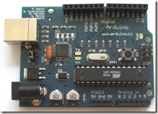
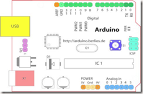
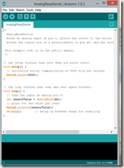

Microsoft recently announced that Visual Studio will start supporting device development and started by initially supporting Intel’s Galileo board.This is not entirely new to Visual Studio. One of the earliest add on’s to support board based development was visual micro which supported the Arduino board.

Arduino is an open-source physical computing platform based on a simple i/o board and a IDE integrated development environment that implements the Processing/Wiring language. Arduino can be used to develop stand-alone interactive objects and installation or can  be connected to software on your computer. The first Arduino board was produced on January 2005. The project is the result of the collaboration of many people primarily David Cuartielles and Massimo Banzi who taught physical computing. The others would be David Mellis, who built software engine , Tom Igoe and Gianluca Martino.

#### Board Layout

Starting clockwise from the top center:

• Analog Reference pin (orange)

• Digital Ground (light green)

• Digital Pins 2-13 (green)

• Digital Pins 0-1/Serial In/Out – TX/RX (dark green)

\- These pins cannot be used for digital i/o (digitalRead and digitalWrite) if you are also using serial communication (e.g. Serial.begin).

• Reset Button – S1 (dark blue)

• In-circuit Serial Programmer (blue-green)

• Analog In Pins 0-5 (light blue)

• Power and Ground Pins (power: orange, grounds:light orange)

• External Power Supply In (9-12VDC) – X1 (pink)

• Toggles External Power and USB Power (place jumper on two pins closest to desired supply) – SV1 (purple)

• USB (used for uploading sketches to the board and for serial communication between the board and the computer; can be used to  power the board) (yellow)

Installing Arduino software on Your Computer :

To program the Arduino board, you must first download the development environment (the IDE) from [www.arduino.cc/en/Main/Software](http://www.arduino.cc/en/Main/Software). Choose the right version for your operating system. Post this you need to install the drivers that allow your computer to talk to your board through the USB port.

#### Installing Drivers: Windows

Plug the Arduino board into the computer; when the Found New Hardware Wizard window comes up, Windows will first try to find the driver on the Windows Update site.Windows Vista will first attempt to find the driver on Windows Update; if that fails, you can instruct it to look in the _Drivers\\FTDI USB Drivers_ folder.You’ll go through this procedure twice, because the computer first installs the low-level driver, then installs a piece of code that makes the board look like a serial port to the computer. Once the drivers are installed, you can launch the Arduino IDE and start using Arduino.

#### Arduino Programming language

The basic structure of the Arduino programming language is fairly simple and runs in at least two parts. These two required parts, or functions, enclose blocks of statements.

void setup()

{

    //statements

}

void loop()

{

     //statements

}

Where setup() is the preparation, loop() is the execution. Both functions are required for the program to work.

The setup function should follow the declaration of any variables at the very beginning of the program. It is the first function to run in the program, is run only once, and is used to set pinMode or initialize serial communication.

The loop function follows next and includes the code to be executed continuously – reading inputs, triggering outputs, etc. This function is the core of all Arduino programs and does the bulk of the work.

#### Functions

A function is a block of code that has a name and a block of statements that are executed when the function is called.

Custom functions can be written to perform repetitive tasks and reduce clutter in a program. Functions are declared by first declaring the function type. This is the type of value to be returned by the function such as ‘int’ for an integer type function. If no value is to be returned the function type would be void. After type, declare the name given to the function and in parenthesis any parameters being passed to the function.

type functionName(parameters)

{

statements;

}

#### Variables

A variable is a way of naming and storing a value for later use by the program. As their namesake suggests, variables can be continually changed as opposed to constants whose value never changes.A variable can be declared in a number of locations throughout the program and where this definition takes place determines what parts of the program can use the variable.

#### Variable scope

A variable can be declared at the beginning of the program before void setup(), locally inside of functions, and sometimes within a statement block such as for loops. Where the variable is declared determines the variable scope, or the ability of certain parts of a program to make use of the variable.

A global variable is one that can be seen and used by every function and statement in a program. This variable is declared at the beginning of the program, before the setup() function.

A local variable is one that is defined inside a function or as part of a for loop. It is only visible and can only be used inside the function in which it was declared. It is therefore possible to have two or more variables of the same name in different parts of the same program that contain different values. Ensuring that only one function has access to its variables simplifies the program and reduces the potential for programming errors.
