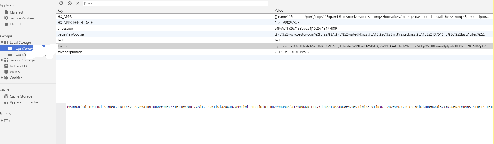
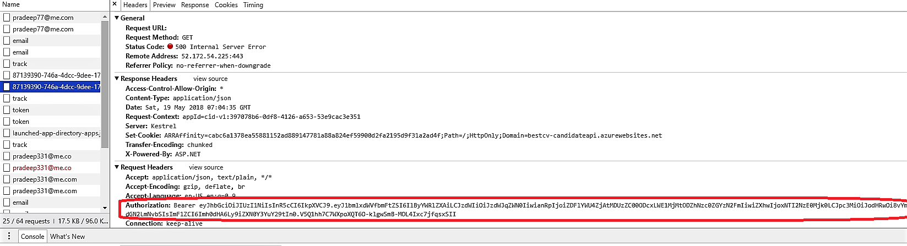

### Three part series on JWT tokens

[Part 1: What is a JWT Token.](http://pradeeploganathan.com/security/jwt/) [Part 2: Creating a JWT token server in ASP.net core 2.0.](http://pradeeploganathan.com/security/jwt-tokenserver/) Part 3: Accessing and Consuming a JWT token protected service in Angular 5+.(This post)

Consuming and providing JWT tokens using an Angular 5 HTTP Interceptor. In the [previous post](http://pradeeploganathan.com/security/jwt-tokenserver/), we created an ASP.net Core 2.0 API to serve as our token endpoint. This token endpoint serves JWT tokens after validating the requestor’s credentials. The token also contains claims and an expiration time. Now we are all set to consume the tokens generated by this endpoint and access other API’s protected by this token endpoint. Let's assume that an Angular client wants to access resources exposed by the protected API. The angular client has to first get a token from the token endpoint. It then has to use this token to access the protected API by passing the token as a bearer token in the Authorization header. Let's look at the steps to achieve this.

### Angular Token Service

First, let’s create an Angular service. This service calls the token endpoint and passes in the user’s credentials as designed in the previous post. If valid credentials are presented, then the token endpoint generates a JWT token. This token contains the necessary information to tell the protected resources what they need about the caller. It is also is an implicit trusting arrangement since the API also trusts the token server.

We call this service, let's say in a login component by passing in the login credentials. The service returns the tokens from the token endpoint. This component then saves the tokens in local storage as below.

### Angular HTTP interceptor

Now that we have a token, we are in effect authorized to call the API's by providing the token in the Authorization header as a bearer token. The best way to do this in an Angular application is to create an HTTP Interceptor. An HTTP interceptor as its name suggests intercepts all outgoing and incoming HTTP requests and responses. This allows us to centralize logic to modify HTTP requests and responses much earlier in the pipeline before it can be accessed by any other component. In the code below we are creating an HTTP interceptor by creating an injectable class called AddTokenInterceptor.This interceptor adds the Authorization header to all outgoing requests. It adds the authorization header and sets its value to bearer and the token. It accesses the token from local storage where it was saved previously by the login component. Now all outgoing HTTP requests will have an Authorization header with the corresponding JWT token.

We need to add the interceptor to the provider's array. The syntax to add an interceptor to the provider's array is provided below. We will talk in detail about HTTP Interceptors in a future post.

Now that the interceptor has been added, let's run the code and authenticate with the token endpoint. When we do this we can see that the token is generated and saved in local storage. 

When the API is called the interceptor adds the token to the outgoing call as seen in the below screenshot. It picks up the token from localstorage. 

The protected API will validate the token and provide access appropriately.
