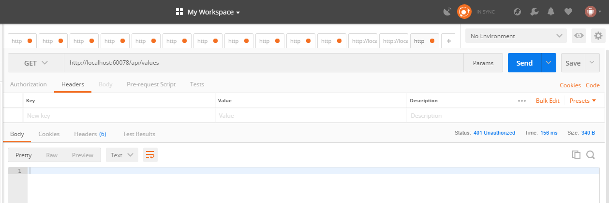
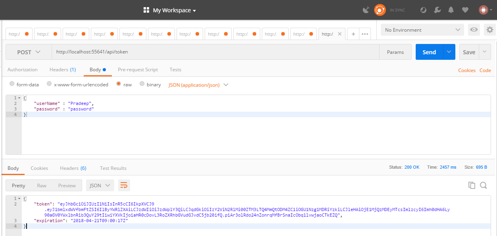
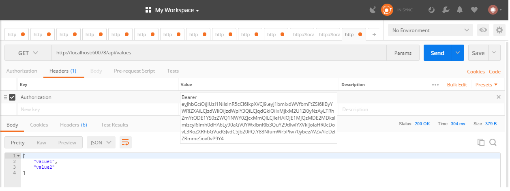

### Three part series on JWT tokens

[Part 1: What is a JWT Token.]( "JSON Web Token")

Part 2: Creating a JWT token server in ASP.net core 2.0 (This post)

[Part 3: Accessing and Consuming a JWT token protected service in Angular 5+.]( "JWT Angular interceptor")

In the previous [post]( "JSON Web Token"), we understood the structure of a JWT and the process of issuing and validating JWT's. Now let's take a look at implementing a JWT token server which will serve tokens to users with the appropriate credentials. The primary namespaces involved are System.Security.Claims, System.IdentityModel.Tokens.Jwt and Microsoft.IdentityModel.Tokens.

### Token Server

In order to create a token server, I created a new ASP.Net core Web API and added a controller which allows anonymous access. The controller code to generate the JWT is below.All the action happens in the IssueToken method. This method takes a UserModel which represents a users credentials (User ID and password). If the credentials are valid, it generates a set of claims. It then creates a symmetric key using a secret string. and a signing credential using the HMAC SHA256 algorithm. A JWTSecurityToken is then created by passing the issuer, audience, claims, expiration time and the signing credentials generated previously into the constructor. The JwtSecurityTokenHandler is then used to serialize the token and send it back to the client in the response.

```csharp
 [Route("api/[controller]")]
 public class TokenController : Controller
 {
     private IConfiguration _config;

     public TokenController(IConfiguration config)
     {
         _config = config;
     }

     [HttpPost]
     public async Task<IActionResult> IssueToken([FromBody] UserModel model)
     {
         if (!ModelState.IsValid)
         {
             return BadRequest("Cannot create token");
         }

         if (!(model.userName == "Pradeep" && model.password == "password"))
             return Unauthorized();

         var claims = new[]
         {
             new Claim(JwtRegisteredClaimNames.UniqueName, model.userName),
             new Claim(JwtRegisteredClaimNames.Sub,  "suject"),
             new Claim(JwtRegisteredClaimNames.Jti, Guid.NewGuid().ToString())
         };

        //shared key between the token server and the resource server
         var Key = new SymmetricSecurityKey(Encoding.UTF8.GetBytes("condimentumvestibulumSuspendissesitametpulvinarorcicondimentummollisjusto"));
         var credentials = new SigningCredentials(Key, SecurityAlgorithms.HmacSha256);

         var SecurityToken = new JwtSecurityToken(
             issuer: _config["AuthSection:JWtConfig:Issuer"], 
             audience: _config["AuthSection:JWtConfig:Audience"], 
             claims: claims, 
             expires: DateTime.Now.AddMinutes(15),
             signingCredentials: credentials);

         //var JWTToken = new JsonWebToken();
         return Ok(new
         {
             token = new JwtSecurityTokenHandler().WriteToken(SecurityToken),
             expiration = SecurityToken.ValidTo
         });

     }
 }
```

The appsettings for the token server are below and are an example of how the JWT parameters can be configured in the appsettings.

```json
 "AuthSection": {
    "JwtConfig": {
      "Issuer": "http://thetalentbot.com",
      "Audience": "http://thetalentbot.com"
    }
  }
```

### Resource Server

Now let's create an API which serves resources protected by an endpoint which requires a JWT token issued by the above token server. I created a regular .Net core Web API with the values controller. Let's assume that we need to protect the values controller. In the resource server, we need to add authentication services to the middleware pipeline.  To do so we need to change the ConfigureServices and the Configure method of the startup class as shown below. I am initially adding authentication to the middleware using the services.AddAuthentication in the Configure method. Additionally, I am passing in options to set the authentication scheme and the challenge scheme to JWTBearerDefaults.

```csharp
public class Startup
{
    public Startup(IConfiguration configuration)
    {
        Configuration = configuration;
    }
    public IConfiguration Configuration { get; }
    // This method gets called by the runtime. Use this method to add services to the container.
    public void ConfigureServices(IServiceCollection services)
    {
        var tokenValidationParams = new TokenValidationParameters
        {
            ValidateIssuer = true,
            ValidIssuer = "http://thetalentbot.com",
            ValidateAudience = true,
            ValidAudience = "http://thetalentbot.com",
            ValidateIssuerSigningKey = true,
            IssuerSigningKey = new SymmetricSecurityKey(Encoding.UTF8.GetBytes("condimentumvestibulumSuspendissesitametpulvinarorcicondimentummollisjusto")),
            ValidateLifetime = true,
            ClockSkew = TimeSpan.Zero,
        };
        services.AddAuthentication(authOptions =>
        {
            authOptions.DefaultAuthenticateScheme = JwtBearerDefaults.AuthenticationScheme;
            authOptions.DefaultChallengeScheme = JwtBearerDefaults.AuthenticationScheme;
        })
        .AddJwtBearer(options =>
        {
            options.RequireHttpsMetadata = false;
            options.SaveToken = true;
            options.TokenValidationParameters = tokenValidationParams;
        });
        services.AddMvc(config =>
        {
            var policy = new AuthorizationPolicyBuilder().RequireAuthenticatedUser().Build();
            config.Filters.Add(new AuthorizeFilter(policy));
        });
        services.AddSingleton<IConfiguration>(Configuration);
    }
    // This method gets called by the runtime. Use this method to configure the HTTP request pipeline.
    public void Configure(IApplicationBuilder app, IHostingEnvironment env)
    {
        if (env.IsDevelopment())
        {
            app.UseDeveloperExceptionPage();
        }
        app.UseAuthentication();
        app.UseMvc();
    }
}
```

Additionally, I have also added the \[Authorize\] attribute to the values controller to protect its route. After setting up the above configuration, calling the protected API in postman results in failure with a 401 Unauthorized. To be able to call this API we now need to provide a JWT token in the header.



To get the token we need to call the token server and pass valid user credentials. Using postman we can call the token server and get the JWT token. The token is in the body of the response.



Now we can call the protected API again but this time lets add the token using the header Authorization with a value of bearer and the token as shown below. This time the resource API returns successfully with a 201 OK and the results of the API call.



That's it. We have implemented a simple JWT token server and have successfully built a protected API which will validate for a valid token when called. Please note that the authentication method proposed above is for understanding purposes only and is Not Safe For Work(NSFW).

In the [next post]( "JWT Angular interceptor") let us look at calling the Token server from an Angular client and using an Angular 5 HTTP interceptor to add JWT tokens to the authorization header.

Photo by [Kevin Jarrett](https://unsplash.com/photos/ricbHp3PD9s?utm_source=unsplash&utm_medium=referral&utm_content=creditCopyText) on [Unsplash](https://unsplash.com/search/photos/ticket-booth?utm_source=unsplash&utm_medium=referral&utm_content=creditCopyText)
