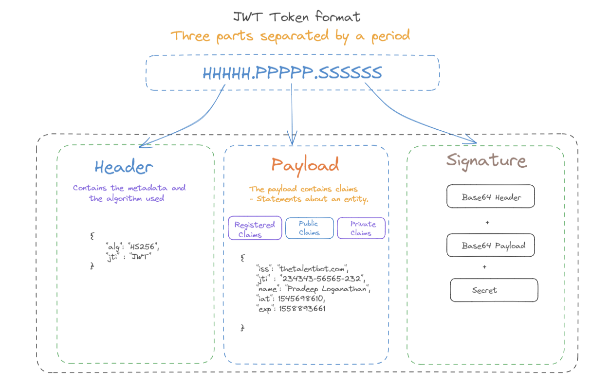

> Three part series on JWT tokens

Part 1: What is a JWT Token (This post) 

[Part 2: Creating a JWT token server in ASP.net core 2.0]( "JSON Web Token")  

[Part 3: Accessing and Consuming a JWT token protected service in Angular 5+.]( "JWT Angular interceptor")

## JSON Web Token - JWT

**JWT ( JSON Web Token** **)** is a security token format, defined by an open standard ([RFC 7519](https://tools.ietf.org/html/rfc7519)). It provides a solution to the problem of passing claims between parties. It is an industry standard for security tokens used to securely transmit information between client and server as JSON objects. As a token format., It defines a compact and self-contained mechanism for transmitting data between parties in a way that can be verified and trusted because it is digitally signed. JWT does not use cookies and can be used across multiple domains. Additionally, the encoding rules of a JWT also make these tokens quite easy to use within the context of HTTP. As it is digitally signed this information can be verified and trusted. JWTs can be signed using a secret (with the HMAC algorithm) or a public/private key pair using RSA.

The two main properties of this standard are:

Compact: A JWT token is self-contained, small, and complete. Since they are highly compact, JWTs can be sent through a URL, POST parameter, or inside an HTTP header. However, the payload size can increase based on the amount of information contained in the token.  
  
Self-contained: A JWT token is self-contained and contains all the required identification information. They are an excellent choice for implementing stateless authentication mechanisms without using sessions, as everything necessary is in the token payload. Using JWT tokens as an authentication mechanism means that the only thing a party must present to be granted access to a protected resource is the token itself, the token in question can be called a bearer token.

## Structure of a JWT

A JWT token has three parts: Header, Payload, and Signature as shown below. 



### Header

The header part decides which algorithm should be used to generate the token. The header has information that is required on the backend for recognizing what cryptographic operation to do based on that information (metadata, the algorithms, and keys being used):

```json
{
  "alg":"HS256",
  "typ":"JWT"
}
```

### Payload

The second part consists of a payload provided in the JSON format. The payload contains claims.  A claim is a piece of information that the client sends to the server and which must be authenticated. Most commonly, this would be the username but it can include any set of data. Claims can be either Registered claims, Public claims or Private claims. Registered claims are defined by the JWT Specification. These claims have a key and a purpose defined already. These claims are listed on the specification [here](https://tools.ietf.org/html/draft-ietf-oauth-json-web-token-32#section-4.1).

Some examples of registered claims are

- Issuer (_iss_): This lets us know who has issued the token.
- Audience (_aud_): This lets us know that this token must be consumed by our application.
- Subject (_sub_): This lets us know which part of the app can use the token (useful in bigger applications).
- Issued at (_iat_): This lets us know when the token has been created.
- Expiration date (_exp_): This lets us know when the token is expiring so we have to generate a new one.
- Not before (_nbf_): Defines the time before which the JWT must not be accepted for processing.
- JWT ID (_jti_): Provides a unique identifier for the JWT.

Public claims are keys defined by you and should be collision resistant. They are generally defined as an URI with a namespace to avoid collisions. Private claims are custom claims that two parties agree to use to share information. Private claims are neither registered nor public.

This is a sample payload

```json
{
    "iss": "thetalentbot.com",
    "jti": "00586f3a-3aa5-46f3-add0-ae62c11919fe",
    "name": "Pradeep Loganathan",
    "iat": 1545698610,
    "exp": 1558893661
}
```

### Signature

The last part is the cryptographic signature represented by a JSON Web Signature (JWS). These are handled in their own specs as JSON Web Signature (JWS) and JSON Web Encryption (JWE). A signature allows a JWT to be validated against modifications. This ensures that no intruder or man-in-the-middle could ever act as the requesting user, as they won't be able to sign the request. Encryption, on the other hand, makes sure the content of the JWT is only readable by certain parties. In the above example ( HS256 ) the algorithm used for the signature is HMAC SHA-256.

Now that we have all the pieces of the JWT, we can compose the JWT as below.

- The header and claims are base64 encoded for transport.
- Then the header, claims are appended together with a period character so that the payload = base64URLencode(headers) + “.” + base64URLencode(claims).
- The signature is now generated using  the algorithm mentioned in the header, so that the signature = base64URLencode(HMACSHA256(payload, secret));
- Finally the JWT is composed as encodedJWT = payload + "." + signature

We can use a tool such as [jwt.io debugger](https://jwt.io/) to visualize a jwt token. The encoded token is on the left and the decoded information is on the right.


## Token-Based Authentication Flow

Now that we know the structure of a JWT, we need to understand the process of generating a JWT, presenting it to a resource server and having it authenticated.

The Token-based authentication scheme can be split it into two distinct parts.

- _Authentication Request_ - The first part is the authentication request. The client provides credentials to identify himself to the token server. The token server validates the credentials and generates a token with the necessary claims and sends it to the client.


- _Resource Request_ - The second part is the request to a protected endpoint on the resource server. The client provides the token acquired earlier to the resource server along with the post request. This is provided in the authorization header as a bearer token. The resource server validates the token and if the validation is successful, responds back with the requested resource.


As the JWT is self-contained, the Resource Server can extract information and even data about the subject and validate the access token locally. It does not need to use a shared database or validate remotely with the token server. The claims on the JWT represented as JSON payload can be HMAC signed or encrypted guaranteeing security.

In the next [post]( "JSON Web Token"), we will look at generating a JWT token using .Net Core.