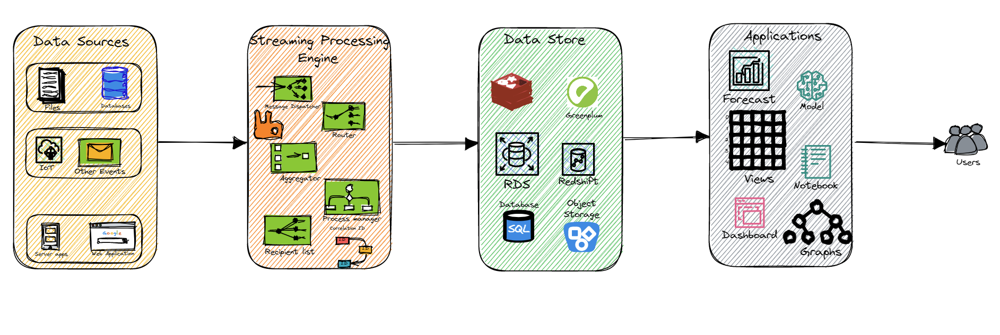

In our [previous blog post](), we learned about Lambda architecture, a data processing architecture that combines batch processing with real-time/stream processing. We also identified the pros and cons of this architecture.

## Lambda vs Kappa

One of the biggest drawbacks of Lambda architecture is that it can be complex and expensive to implement. This is because it requires the implementation and maintenance of two separate processing pipelines, one for batch processing and another for real-time/stream processing. This additional complexity and cost can be a major barrier for organizations that are looking to adopt this architecture. In addition, Lambda architecture can also be difficult to scale as the volume of data increases. This is because the batch processing layer is typically more difficult to scale than the real-time/stream processing layer. As a result, organizations that are dealing with large volumes of data may find that the Lambda architecture is not a scalable solution for their needs.

Overall, the Lambda architecture is a complex and expensive solution that may not be suitable for all organizations. Organizations that are looking for a simpler and more cost-effective solution may want to consider other data processing architectures, such as the Kappa architecture. Kappa architecture has gained popularity in recent years because it is simpler, more scalable, and easier to maintain than Lambda architecture.

## Kappa Architecture

Jay Kreps, one of the co-founders of Apache Kafka, first proposed the Kappa architecture in a [blog post](https://www.oreilly.com/radar/questioning-the-lambda-architecture/) in 2014. In his blog post, Kreps argued that the traditional Lambda architecture was too complex and difficult to maintain, and proposed the Kappa architecture as a simpler, more scalable alternative for real-time data processing.

Kappa architecture is designed to handle big data processing in real-time. The core idea behind Kappa architecture is to eliminate the need for a separate batch layer implemented in Lambda architecture. This layer introduces latency and delay in data processing. In Kappa architecture, all processing is done on a single stream of data, and the results are stored in a database that can be queried in real-time. By processing data in real-time as it arrives, Kappa architecture can enable more timely insights and faster response times. However, it also requires careful consideration of the trade-offs between real-time processing and batch processing, as well as the challenges of managing and monitoring a distributed stream processing pipeline.

The primary components of Kappa architecture are:

* ___Data sources___: The data source is the point where the data is collected.. These are the inputs to the system, which can be any data source that generates real-time data, such as IoT sensors, social media streams, or logs.

* ___Streaming processing engine___: This streaming processing engine is responsible for processing the incoming data in real-time. The stream processing layer can use a variety of tools and technologies, such as Apache Flink, Apache Kafka Streams, or Apache Storm.

* ___Data Store___: The data store is where the results of the stream processing layer are stored. This can be a database, a data warehouse, or a cloud storage service. Typical data stores could be a NoSQL database such as VMware Greenplum or Apache Cassandra, which is designed to handle large volumes of data and provide high availability.

* ___Applications___: The applications are the systems that use the processed data. These applications can be analytics tools, dashboards, or machine learning models.

The Kappa architecture works by first collecting data from the data source. The data is then processed by the streaming processing engine in real time. The processed data is then stored in the data store. Finally, the applications use the processed data to generate insights or take action. Both Lambda and Kappa architectures provide patterns for processing and analyzing data within the decentralized data ecosystem or [Data Mesh](). They offer different approaches to handling data processing within a [data mesh context](). These architectural patterns enable organizations to create valuable data products and deliver real-time insights.

Let us look at each of the layers in the above architecture diagram in detail.

### Data Sources

The data source layer is responsible for ingesting data from various sources and feeding it into the stream processing engine. This layer is typically designed to handle high-volume, high-velocity data streams in real-time. Some common components and approaches used in the data source layer of Kappa architecture:

1. Data sources: The data source layer can ingest data from a variety of sources, such as IoT sensors, databases, applications, or message queues. These sources can generate data at a high rate, and the data source layer must be designed to handle the load.

2. Data transport: The data source layer can use various transport protocols to move data from the sources to the stream processing engine. For example, Apache Kafka is a popular distributed messaging system that can handle high-volume data streams and provides durability and fault-tolerance. RabbitMQ can also be configured to act as a message broker between the data sources and the stream processing engine. RabbitMQ can then be used to distribute messages across multiple stream processing instances or nodes, enabling horizontal scaling and high availability.

3. Data serialization: The data source layer typically needs to serialize data into a format that can be ingested by the stream processing engine. Common serialization formats include Avro, JSON, and Protobuf.

4. Data validation: The data source layer may perform some basic validation on the incoming data, such as checking for schema compatibility, data type validation, and data format validation.

Once data is ingested by the data source layer, it is fed into the stream processing engine for further processing.

### Streaming Processing Engine

The stream processing engine is used to process data as it arrives in real-time, without the need for batch processing. It is typically a distributed system that can scale to handle large volumes of data. The stream processing engine must be able to handle a variety of data types, including text, JSON, and binary data. The stream processing engine can use various processing techniques to transform, aggregate, and filter the data in real-time. The data output from the stream processing engine can be fed back into the data source layer, creating a feedback loop for continuous data processing and analysis.The stream processing engine in Kappa architecture typically consists of several components that work together to ingest, process, and output data such as

1. Ingestion: The stream processing engine first ingests data from various sources, such as sensors, applications, or databases. Data is typically ingested in real-time as it arrives.

2. Processing: Once the data is ingested, it is processed in real-time using stream processing algorithms and techniques. These algorithms can perform various operations on the data, such as filtering, aggregating, and transforming it.

3. Storage: After the data is processed, it is typically stored in a distributed data store that is optimized for real-time data, such as Apache Kafka, Apache Pulsar, or Apache Flink's state backend.

4. Output: Finally, the processed data can be output to various destinations, such as dashboards, databases, or other applications. In some cases, the output data may be fed back into the ingestion pipeline, creating a closed-loop system.

Apache FLink, Apache Spark streaming, Amazon Kinesis, Google Cloud Dataflow are some of the tools that can be used to implement stream processing engines. These tools offer a variety of features and capabilities. The specific choice of tooling depends on several factors, such as the volume and velocity of data, the processing requirements, the latency requirements, and the scalability requirements. Some organizations may choose to build their own custom streaming processing engines to meet their specific needs and requirements.

### Data Store

The data store is responsible for storing and managing the real-time data stream processed by the stream processing engine. The data store must be able to handle high-volume, high-velocity data streams and provide scalability, fault-tolerance, and low-latency access to the data.

Some of the common data store options used in Kappa architecture are

1. Distributed message queues: Distributed message queues such as Apache Kafka or Apache Pulsar can be used as data stores in Kappa architecture. These systems provide a distributed and fault-tolerant way to store and manage high-volume data streams. They also provide low-latency access to data, making them ideal for real-time data processing and analysis.

2. Distributed key-value stores: Distributed key-value stores such as Apache Cassandra or Apache HBase can be used as data stores in Kappa architecture. These systems provide a scalable and fault-tolerant way to store and manage large volumes of data. They also provide fast access to data, making them ideal for real-time data processing and analysis.

3. Distributed file systems: Distributed file systems such as Apache Hadoop HDFS or Apache Spark can be used as data stores in Kappa architecture.

4. In-memory databases: In-memory databases such as VMWare Gemfire, Apache Ignite or Apache Geode can be used as data stores in Kappa architecture. These systems store data in memory, providing fast access to data and low-latency response times. However, they may have limited scalability compared to other distributed data store options.

The choice of data store in Kappa architecture depends on several factors, such as the specific use case, the volume and velocity of data, the latency requirements, and the scalability requirements. It's important to carefully evaluate the strengths and weaknesses of each data store option and choose the one that best fits your needs.

### Application layer

Data processing and analysis applications are implemented in this layer. It is responsible for consuming the real-time data processed by the stream processing engine and performing various tasks, such as analytics, machine learning, visualization, and generating insights or actions based on the processed data. Some of the common components in the application layer of the Kappa architecture are

1. Analytics and Machine Learning: This component includes algorithms, models, and libraries for performing real-time analytics and machine learning on the processed data. It can involve tasks such as anomaly detection, predictive modeling, clustering, classification, and recommendation systems.

2. Dashboards and Visualization: This component involves tools and frameworks for creating real-time dashboards and visualizations of the processed data. It enables users to monitor the data, gain insights, and make data-driven decisions.

3. Alerting and Notifications: This component involves mechanisms for setting up alerts and notifications based on specific events or conditions detected in the processed data. It allows for proactive actions or responses to important events or anomalies in real-time.

4. Integration with External Systems: The application layer may need to integrate with external systems, such as databases, APIs, or other applications, to retrieve or update data, trigger actions, or feed processed data to downstream systems.

5. Data Storage and Persistence: The application layer may include mechanisms for storing or persisting the processed data for historical analysis or for sharing with other systems.

## Benefits and Challenges

The key benefits of Kappa architecture are:

* Simplicity: The Kappa architecture is a simpler architecture than the Lambda architecture. This is because it only has one layer, which makes it easier to understand and implement.

* Efficiency: The Kappa architecture is a more efficient architecture than the Lambda architecture. This is because it only needs to process data once, which saves resources.

* Cost-effectiveness: The Kappa architecture is a more cost-effective architecture than the Lambda architecture. This is because it only needs one processing engine, which saves money.

By eliminating the batch layer, Kappa architecture makes it easier to build and maintain big data processing systems. This means that all data, including historical data, is processed in real-time and stored in the streaming layer. Historical data is simply treated as another stream of data and is processed in the same way as real-time data. When historical data is first ingested into the Kappa architecture, it is processed in real-time and stored in the streaming layer, just like any new incoming data. This allows historical data to be processed and analyzed in real-time, without the need for a separate batch layer. Any historical queries can be answered by querying the same streaming layer that is used to process real-time data.
Additionally, Kappa architecture is designed to be highly scalable, which makes it ideal for processing large volumes of data in real-time. Overall, the Kappa architecture is a simpler, more efficient, and more cost-effective architecture than the Lambda architecture. It is a good choice for organizations that need to process data in real time and do not need the flexibility of the Lambda architecture.

However, there are some challenges and cons to consider when using Kappa architecture.

* Complexity:  Kappa architecture can be complex to set up and maintain. It requires a high level of technical expertise to implement. It requires a deep understanding of distributed systems, real-time data processing, and stream processing engines.

* Cost: The Kappa architecture can require significant infrastructure investment to ensure scalability and fault tolerance. This can result in higher infrastructure costs compared to other architectures.

* Data loss risk: Since the Kappa architecture only stores raw data, it can be vulnerable to data loss in the event of hardware or software failures. It is important to have a robust backup and recovery strategy in place to mitigate this risk.

## Conclusion

In conclusion, the Kappa architecture offers a compelling approach to real-time data processing and analytics. By eliminating the need for separate batch processing, it enables organizations to leverage the power of streaming data for timely insights and faster response times.

In a world where data is generated at an unprecedented pace, Kappa architecture paves the way for innovative solutions and opens doors to real-time analytics, machine learning, and automation. By embracing the Kappa architecture, organizations can stay ahead in today's fast-paced, data-driven landscape, and seize opportunities for growth, efficiency, and enhanced customer experiences. However, it's important to carefully consider the pros and cons of the Kappa architecture. The complexity of implementation, limited data history, debugging difficulties, and the risk of data loss require careful planning and robust strategies. Additionally, choosing the right stream processing engine and balancing infrastructure costs are vital factors to ensure the success of a Kappa architecture implementation.
